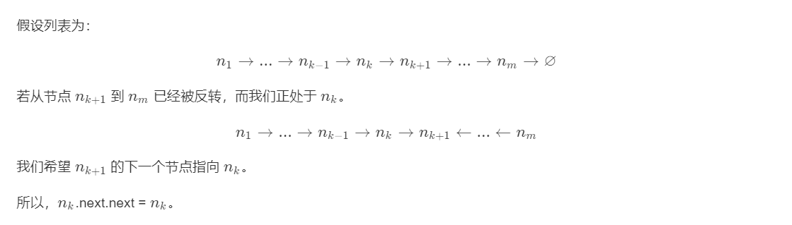

# 反转链表

## 题目描述

反转一个单链表。

**示例：**

```
输入: 1->2->3->4->5->NULL
输出: 5->4->3->2->1->NULL
```

## 解题思路

### 个人AC

#### 迭代

假设存在链表`1 → 2 → 3 → Ø`，我们想要把它改成`Ø ← 1 ← 2 ← 3`。

在遍历列表时：

- 需要断开当前结点和下一个结点的连接，需要首先保存下一个结点：`next = curr.next`；
- 然后，将当前节点的 next 指针改为指向前一个元素：`curr.next` = `prev`；
- 在反转之后，更新`prev`为当前结点：`prev = curr`；
- 最后更新`curr`原链表中的下一个结点`next`；

不要忘记在最后返回新的头引用，由`prev`指针指向新的头引用！

```Go
/**
 * Definition for singly-linked list.
 * type ListNode struct {
 *     Val int
 *     Next *ListNode
 * }
 */
func reverseList(head *ListNode) *ListNode {
    var prev, curr, next *ListNode = nil, head, nil
    for ; curr != nil; {
        next = curr.Next
        curr.Next = prev
        prev = curr
        
        curr = next
    }
    return prev
}
```

**时间复杂度：** $O(n)$；

**空间复杂度：** $O(1)$。

#### 递归



```Go
/**
 * Definition for singly-linked list.
 * type ListNode struct {
 *     Val int
 *     Next *ListNode
 * }
 */
func reverseList(head *ListNode) *ListNode {
    if head == nil || head.Next == nil {
        return head
    }
    var next *ListNode = head.Next
    var headOfRest *ListNode = reverseList(head.Next)
    next.Next = head
    head.Next = nil
    return headOfRest
}
```

**时间复杂度：** $O(n)$；

**空间复杂度：** $O(n)$。

### 最优解

同上。