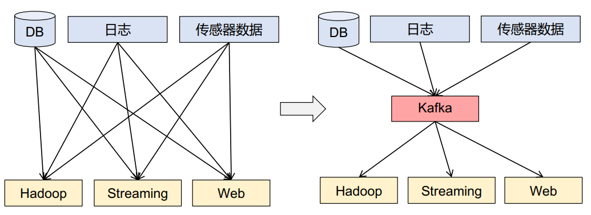
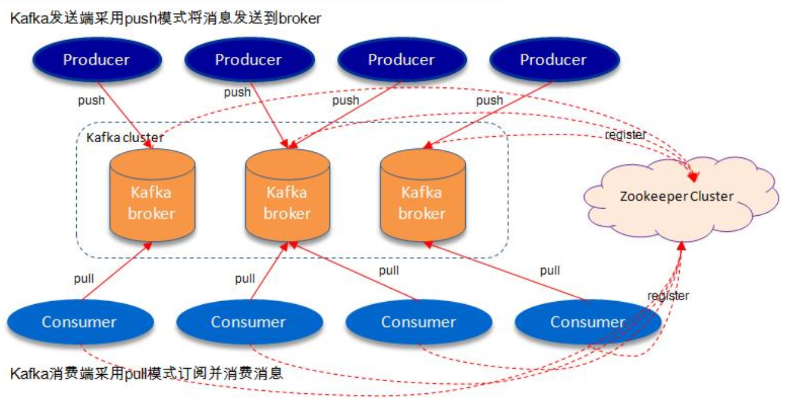
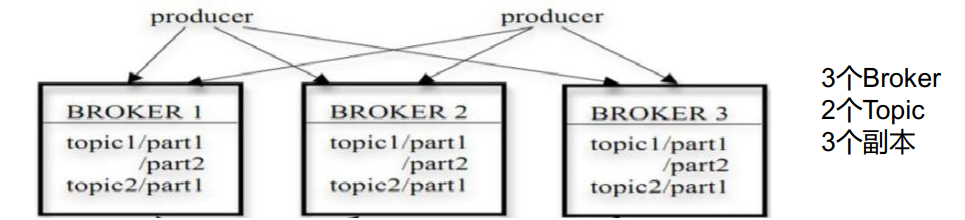
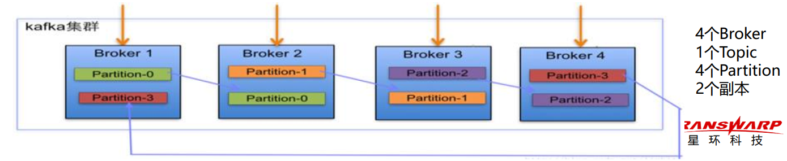
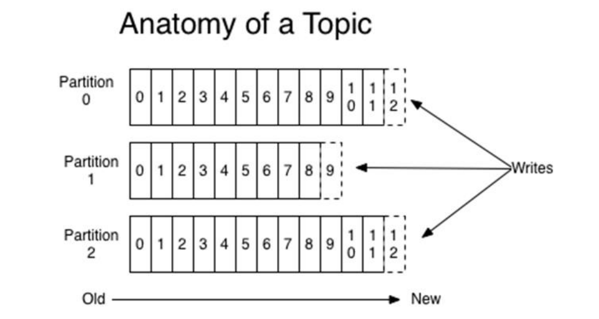
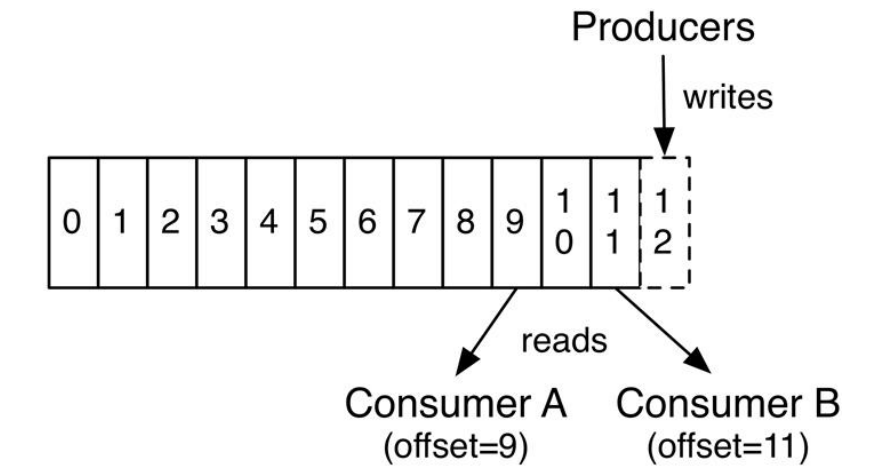
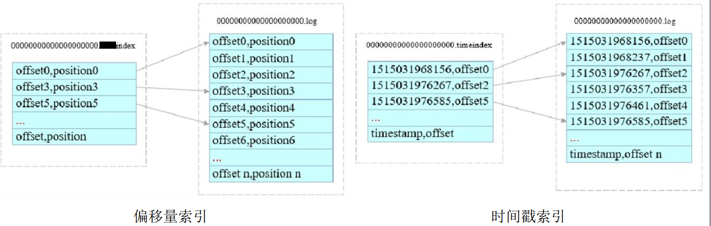

# Kafka

## Kafka介绍

Kafka是由Linked开发的基于发布/订阅的分布式消息系统，使用Scala语言编写。

## Kafka特性

* **异步通信**：将消息放入Kafka中，可以不立即处理；

* **应用解耦**：在应用处理过程中插入一个隐含的、基于数据的接口层；

  

* **峰值处理**：使关键应用能够抵挡住访问峰值，不会因超出负荷而崩溃；

* **高性能**：采用时间复杂度O(1)的磁盘存储结构，即使TB级以上数据也能保证常数时间的访问速度；

* **高可用/高容错**：多分区、多副本，允许集群中部分节点故障；

* **高吞吐**：即使在廉价商用机器上，也能达到单机传输10w条每秒的传输速度；

* **高并发**：支持数千个客户端同时读写；

* **可伸缩/热拓展**：新增机器时，集群无需停机、自动感知；

* 支持离线/实时数据处理；

* 可以实时处理大量数据以满足各种需求场景：Hadoop的批处理系统、低延迟的实时系统、Strom/Spark流式处理引擎。

## Kafka原理

### Kafka基本概念

* **Broker**（代理）是Kafka的一个实例或节点，一个或多个Broker组成一个Kafka集群；
* **Topic**（主题）是Kafka中同类数据的集合，相当于SQL中的表；Topic是逻辑概念，即只需要指定Topic就可以写入/读取数据，而不必关心数据的存储位置；
* **Producer**（生产者）将同类数据写入同一个Topic（producer自己控制将消息推送哪些partition）；
* **Consumer**（消费者）从同一个Topic中读取同类数据（consumer自己维护读取消息的offset）；
* **Consumer Group**（CG，消费者组），一个Consumer都隶属于一个特定的CG，（分组是为了加快读取速度，并行消费同一个Topic）；
* 一条消息被多个不同的CG订阅（即CG之间是平等的）；但是一个CG中只能有一个Consumer读取该消息（CG中的Consumer之间是竞争的）；
* **Partition**（分区）是一个有序的、不可修改的MQ，分区内消息有序存储；Partition是物理概念，每个分区对应一个文件夹，其中存储分区的数据和索引文件；
* 一个Topic可分为多个Partition，即把一个数据集合分为多个部分，分别存储在不同的分区中；
* **Replication**（副本）是Partition的拷贝；
* 一个Partition可以设置多个Replication，Replication存储在多个Broker中；
* **ZooKeeper**负责Kafka集群管理，包括配置管理、动态扩展、Broker负载均衡、Laeder选取以及CG变化时的Rebalance，Kafka将元数据存储在ZooKeeper中。

### Kafka工作机制

Kafka生产者客户端采用push模式将消息发送到broker，而消费者客户端采用pull模式从broker订阅并消费消息。

消息在broker中按照topic进行分类，一个topic分为多个partition，一个partition有多个replication，消息存储在broker的topic的partition中，并且同时存在多个副本。

partition是一个FIFO队列，在队列尾追加写入消息，在队列头顺序读取消息，而且仅保证消息在统一partition中有序，并不保证topic整体有序

Kafka集群会保存所有的消息，不管消息有没有被消费，只有当消息过期时，Kafka将其清除以释放磁盘空间。

## Kafka数据存储

- 每个Partition副本都是一个目录，目录中包含多个Segment文件；
- Segment（段）文件是Kafka中最小的数据存储单元，一个Partition包含多个Segment文件；
- Segment文件由以Message在Partition中的起始偏移量命名的数据文件（*.log）和索引文件（*.index和*.timeindex）组成；
- Offset（偏移量）是唯一标识消息的顺序编号，用于在Partition中定位消息，使用ZooKeeper维护offset。

- 为了提高消息写入和读取速度，为每个Partition创建索引，索引文件存储在Partition文件夹下；
- 偏移量索引：
  - 以offset为名，index为后缀；
  - 索引内容格式：offset,position；
  - 采用稀疏存储方式。
- 时间戳索引：
  - 以offset为名，timeindex为后缀；
  - 索引内容格式：timestamp,offset；
  - 采用稀疏存储方式。

## Kafka高可用性

- 多分区多副本
  - 一个Topic有多个Patition，一个Partition有多个Replication，Replication存储在不同的Broker中；
  - 从一个Partition中的多个Replication中选举一个Partition Leader，由Leader负责读写，其他副本负责作为Follower从Leader同步消息；
- Kafka Controller Leader选举
  - 每个Broker启动时，都会创建一个Kafka Controller进程；
  - ZooKeeper负责从Kafka集群中选举出一个Broker作为Controller Leader；
  - Kafka Controller Leader负责管理Kafka集群的分区和副本状态，避免分区副本直接在Zookeeper上注册Watcher和竞争创建临时Znode，导致Zookeeper集群负载过重。
- Kafka Partition Leader选举
  - Kafka Controller Leader负责Partition Leader的选举；
  - ISR列表（In Sync Replica）
    - ISR是Zookeeper中的候选副本同步列表，负责保存候选副本（Replication Follower）的状态信息；
    - Partition Leader负责跟踪和维护ISR；
    - Partition Follower定期从Leader同步数据，若Follower心跳超时或消息落后太多，将被移出ISR
  - Partition Leader挂掉后，Kafka Controller Leader从ISR中选择一个Follower作为新的Leader。

## kafka为何高效

### 类日志文件的消息持久化数据结构

不同于常规消息系统，Kafka并没有声明维护一个与消费队列有关的B树或者其它能够随机存取结构的元数据信息（B树不适用于并行化磁盘操作，磁盘寻道一次只能寻一个）。Kafka采用日志文件的方式存取消息，读和写都是常数时间并且不会相互阻塞。这样的设计具有极大的性能优势：最终系统性能和数据大小完全无关，服务器可以充分利用廉价的硬盘来提供高效的消息服务。此外，磁盘空间容量大小也不会影响到性能，因此，Kafka可以做到常规消息系统无法提供的特性：消息被消费后不用立马被删除，可以在磁盘中保留一段时间。

### 消息分批

为了解决大量小I/O操作的问题，Kafka支持Producer将消息在内存中累计到一定数量后作为一个batch发布，减少请求次数，提高处理效率；在Broker中，消息是以消息块的形式追加到log中；Consumer在查询数据时也是一次获取大量的线性数据块。Kakfa实现了MessageSet来将一个字节数组或者文件进行打包。

### 消息预处理

为了解决byte copy的问题，Kafka设计了一种“标准字节消息”，producer，broker和consumer共用这种消息格式。Kafka的log文件是以MessageSet的“标准字节消息”的格式写入到磁盘中的。

维持通用的格式对持久化log块的网络传输操作的优化尤为重要。我们可以采sendfile方法实现页面缓存和socket之间的数据传递。

一般的，我们将数据从文件传到socket的步骤如下：

1. OS将数据从磁盘读到内核空间的页缓存中；
2. 应用程序将数据从内核空间读到用户空间的缓存中；
3. 应用程序将数据写回内核空间的socket缓存中；
4. 操作系统将数据从socket缓存写到网卡缓存中。

这种操作方式明显是非常低效的，这里有四次拷贝，两次系统调用。如果使用sendfile，就可以避免两次拷贝：操作系统将数据直接从页缓存发送到网络上。

我们期望一个主题上有多个消费者是一种常见的应用场景。利用上述的zero-copy，数据只被拷贝到页缓存一次，然后就可以在每次消费时被重复利用，而不需要将数据存在内存中，然后在每次读的时候拷贝到内核空间中。这使得消息消费速度可以达到网络连接的速度。这样以来，通过页面缓存和sendfile的结合使用，整个Kafka集群几乎都已以缓存的方式提供服务，而且即使下游的consumer很多，也不会对整个集群服务造成压力。

## Kafka应用场景

* 日志收集：用Kafka收集各项服务的log，再通过Kafka以统一接口服务的方式开放给各种消费者；
* 消息系统：解耦生产者和消费者、缓存消息；
* 用户活动跟踪：使用Kafka将用户的各种活动记录发布到相关的Topic中，然后消费者通过订阅这些Topic来做实时的监控分析，或者装载到Hadoop中做离线分析；
* 流式处理：Strom、Spark Streaming。

## 参考

1、[为什么使用kafka?](https://blog.csdn.net/SJF0115/article/details/78480433)
2、[Java消息队列-JMS概述](https://www.cnblogs.com/jaycekon/p/6220200.html)
3、[Kafka核心特性](https://blog.csdn.net/suifeng3051/article/details/48053965)