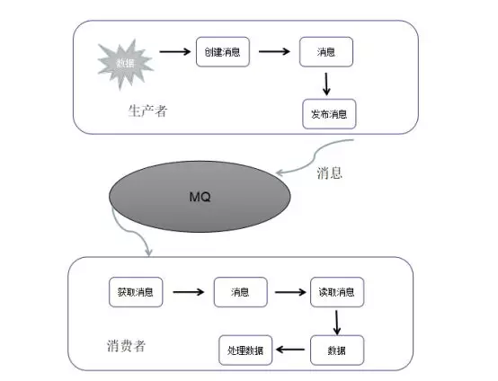

# 消息队列（MessageQueue）

## 什么是消息队列

消息队列是一种跨系统传递数据的服务，过程为异步操作。运作过程：由生产者创建消息，然后发布到代理服务器。消息包含两部分：有效载荷(payload)和标签(label)。有效载荷就是你要传输的数据，可以使任意类型，一般都是json；而标签则是决定谁将获取到这份消息，消息队列会根据标签将消息发送给相对应的接收方。这种通信方式是‘发后既忘’的单向模式，不需要知道接收者是谁。比如在线交易系统为了保证数据最终一致性，在支付系统处理完成后会把字符的结果放到消息队列中，通过订单系统修改支付状态。

消息队列有两种模式：

1、点对点模式。顾名思义每个消息只能有一个消费者，此过程需要消费者确认消息接收和处理成功。

2、发布-订阅模式。一条消息可能会有多个消费者，消费者需要和生产者之间建立一个订阅关系。消费者必须保持持续的运行状态去接受消息，除非消费者建立了持久的订阅。

应用程序和消息队列连接成功后，会创建一条TCP连接，一旦TCP连接打开，通过了认证。应用程序就可以创建一条AMQP信道。信道是建立在TCP连接中的虚拟连接。每条信道都会有一个唯一ID，不管是消费消息还是生产消息都是通过信道完成的。

为什么不直接通过TCP连接发送命令呢？对于操作系统来说建立和消费TCP的开销是非常大的。高峰时期飞秒成千上万条MQ信息，不仅造成了连接巨大的浪费，而且操作系统一定时间内创建的tcp连接又是有限的。其实我们可以把整个过程想象成一个一束光纤电缆就可以了。

## 为什么使用消息队列

- **异步通信**：在高并发业务环境下，常常会因为请求量超出负载而使系统发生阻塞。借助消息队列，发布/订阅模式允许生产者不断向队列中put/pubish数据和消费者主动/被动从队列中get/subscribe数据，这样可以异步处理请求，从而缓解系统的压力；
- **应用解耦**：作为中间件，消息队列可以作为分布式应用间的基于数据的接口层，这样我们可以在应用处理过程加入消息队列，应用程序就可以在不知道彼此位置的情况下独立处理消息；
- **应用扩展**：我们可以在遵循接口约束的前提下独立扩展或修改两边的处理过程；
- **冗余**：在有些情况下，处理数据的过程会失败，除非数据被持久化，否则将造成数据丢失，而消息队列把数据进行持久化直到它们已经被处理完；
- **数据缓冲**：数据不用存入数据库，减少数据库的压力；
- **峰值处理**：使关键应用能够抵挡住访问峰值，不会因为超负载请求而崩溃。

其中，异步通信、应用解耦和峰值处理是消息队列最突出的特性。

## 常见的消息队列系统

- **Kafka**：只有发布/订阅模式，当生产者将消息放在消息队列后，消费者在需要的时候主动去取，Kafka不会主动推送；
- **Redis**：提供基于分布式发布/订阅的消息推送，多用于实时性要求较高的环境；
- **RabbitMq**：生产者通过连接Channel和Server进行通信，消费者从队列中获取消息（长连接，队列有消息会推送给消费者，消费者循环从输入流读取消息）；
- **JMS**：Java平台提供的面向消息中间件（MOM）的API，分为P2P和发布/订阅两种模式，后者用于在分布式系统中发送消息，进行异步通信（客户不需要主动发送请求，JMS会自动将消息发送给可用的客户端）。