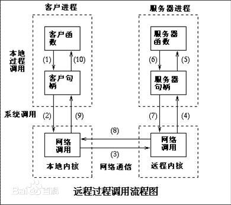

# gRPC

## RPC

### RPC是什么？

RPC（Remote Procedure Call，远程过程调用协议），是一种通过网络从远程计算机上请求服务的协议。

在分布式计算环境中广泛使用。

### RPC原理机制

RPC采用C/S模式，请求服务的终端为客户机，提供服务的终端为服务器。

远程过程调用流程：



1. 调用客户端句柄，执行传送参数；
2. 调用本地系统内核发送网络消息；
3. 消息传送到远程主机；
4. 服务器句柄得到消息并取得参数；
5. 执行远程过程；
6. 执行的过程将结果返回服务器句柄；
7. 服务器句柄返回结果，调用远程系统内核；
8. 消息传回本地主机；
9. 客户句柄由内核接收消息；
10. 客户接收句柄返回的数据。

## 安装

```shell
# pip版本应该在9.0.1以上
$ python -m pip install grpcio
```

## gRPC tools

> Python’s gRPC tools include the protocol buffer compiler `protoc` and the special plugin for generating server and client code from `.proto` service definitions. For the first part of our quickstart example, we’ve already generated the server and client stubs from [helloworld.proto](https://github.com/grpc/grpc/tree/v1.20.0/examples/protos/helloworld.proto), but you’ll need the tools for the rest of our quickstart, as well as later tutorials and your own projects.

### 安装

```shell
$ python -m pip install grpcio-tools
```

## 服务（Service）

> As in many RPC systems, gRPC is based around the idea of defining a service, specifying the methods that can be called remotely with their parameters and return types. On the server side, the server implements this interface and runs a gRPC server to handle client calls. On the client side, the client has a stub (referred to as just a client in some languages) that provides the same methods as the server.


### 定义服务（Define Service）

gRPC默认使用`Procotol Buffers`作为接口定义语言（IDL），因此，gRPC需要遵循`protobuf`的消息交换格式。

我们可以在一个`.proto`文件中定义一个服务：

> route_guide.proto

```protobuf
// Copyright 2015 gRPC authors.
//
// Licensed under the Apache License, Version 2.0 (the "License");
// you may not use this file except in compliance with the License.
// You may obtain a copy of the License at
//
//     http://www.apache.org/licenses/LICENSE-2.0
//
// Unless required by applicable law or agreed to in writing, software
// distributed under the License is distributed on an "AS IS" BASIS,
// WITHOUT WARRANTIES OR CONDITIONS OF ANY KIND, either express or implied.
// See the License for the specific language governing permissions and
// limitations under the License.

syntax = "proto3";

option java_multiple_files = true;
option java_package = "io.grpc.examples.routeguide";
option java_outer_classname = "RouteGuideProto";
option objc_class_prefix = "RTG";

package routeguide;

// Interface exported by the server.
service RouteGuide {
  // A simple RPC.
  //
  // Obtains the feature at a given position.
  //
  // A feature with an empty name is returned if there's no feature at the given
  // position.
  rpc GetFeature(Point) returns (Feature) {}

  // A server-to-client streaming RPC.
  //
  // Obtains the Features available within the given Rectangle.  Results are
  // streamed rather than returned at once (e.g. in a response message with a
  // repeated field), as the rectangle may cover a large area and contain a
  // huge number of features.
  rpc ListFeatures(Rectangle) returns (stream Feature) {}

  // A client-to-server streaming RPC.
  //
  // Accepts a stream of Points on a route being traversed, returning a
  // RouteSummary when traversal is completed.
  rpc RecordRoute(stream Point) returns (RouteSummary) {}

  // A Bidirectional streaming RPC.
  //
  // Accepts a stream of RouteNotes sent while a route is being traversed,
  // while receiving other RouteNotes (e.g. from other users).
  rpc RouteChat(stream RouteNote) returns (stream RouteNote) {}
}

// Points are represented as latitude-longitude pairs in the E7 representation
// (degrees multiplied by 10**7 and rounded to the nearest integer).
// Latitudes should be in the range +/- 90 degrees and longitude should be in
// the range +/- 180 degrees (inclusive).
message Point {
  int32 latitude = 1;
  int32 longitude = 2;
}

// A latitude-longitude rectangle, represented as two diagonally opposite
// points "lo" and "hi".
message Rectangle {
  // One corner of the rectangle.
  Point lo = 1;

  // The other corner of the rectangle.
  Point hi = 2;
}

// A feature names something at a given point.
//
// If a feature could not be named, the name is empty.
message Feature {
  // The name of the feature.
  string name = 1;

  // The point where the feature is detected.
  Point location = 2;
}

// A RouteNote is a message sent while at a given point.
message RouteNote {
  // The location from which the message is sent.
  Point location = 1;

  // The message to be sent.
  string message = 2;
}

// A RouteSummary is received in response to a RecordRoute rpc.
//
// It contains the number of individual points received, the number of
// detected features, and the total distance covered as the cumulative sum of
// the distance between each point.
message RouteSummary {
  // The number of points received.
  int32 point_count = 1;

  // The number of known features passed while traversing the route.
  int32 feature_count = 2;

  // The distance covered in metres.
  int32 distance = 3;

  // The duration of the traversal in seconds.
  int32 elapsed_time = 4;
}
```

在gRPC服务中可以声明四种方法：

1. 请求参数为单一元素，返回值为单一元素；
2. 请求参数为单一元素，返回值为迭代器（在请求参数类型前加stream关键字，在实现时借助yield关键字返回迭代器）；
3. 请求参数为迭代器，返回值为单一元素（在返回值类型前加stream关键字）；
4. 请求参数为迭代器，返回值为迭代器（结合2和3）。

### 生成代码（Generate Server & Client Interfaces Code）

使用protobuf编译器`grpc_tools.protoc`来帮助我们从`.proto`文件中生成可供我们调用的代码。

```shell
# python -m grpc_tools.protoc	运行grpc_tools.protoc来从protobuf生成gRPC代码
# -I <proto file folder>		指定 *.proto 文件所在目录
# --python_out=. 				指定 *_pb2.py 文件输出目录
# --grpc_python_out=.   		指定 *_pb2_grpc.py 文件输出目录
# <protobuf file path>  		指定 *.proto 文件路径
$ python -m grpc_tools.protoc -I ../../protos --python_out=. --grpc_python_out=. ../../protos/route_guide.proto
```

上述命令会在指定目录下生成`route_guide_pb2.py`和`route_guide_pb2_grpc.py`文件，也可用来更新服务。

### 创建服务器

1. 创建服务器类，实现`*_pb2_grpc.py`中的`*Servicer`接口：

   > route_guide_server.py

   

   ```python
   class RouteGuideServicer(route_guide_pb2_grpc.RouteGuideServicer):
   ```

2. 在RouteGuideServicer中实现在RouteGuide服务中定义的所有接口：

   ```python
   # other assistant method
   
   class RouteGuideServicer(route_guide_pb2_grpc.RouteGuideServicer):
       def __init__(self):
           # initial statements
           
       def GetFeature(self, request, context):
           # implement statements
       
       def ListFeatures(self, request, context):
           # implement statements
           
       def RecordRoute(self, request_iterator, context):
           # implement statements
           
       def RouteChat(self, request_iterator, context):
           # implement statement
   ```

3. 创建服务器启动函数，并配置服务器属性：

   ```python
   from concurrent import futures
   
   import grpc
   
   import route_guide_pb2
   import route_guide_pb2_grpc
   import route_guide_resources
   
   
   # other assistant method
   
   class RouteGuideServicer(route_guide_pb2_grpc.RouteGuideServicer):
       def __init__(self):
           # initial statements
           
       def GetFeature(self, request, context):
           # implement statements
       
       def ListFeatures(self, request, context):
           # implement statements
           
       def RecordRoute(self, request_iterator, context):
           # implement statements
           
       def RouteChat(self, request_iterator, context):
           # implement statement
           
   def serve():
       server = grpc.server(futures.ThreadPoolExecutor(max_workers=10))
       route_guide_pb2_grpc.add_RouteGuideServicer_to_server(
           RouteGuideServicer(), server)
       # 服务器会监听50051端口
       server.add_insecure_port('[::]:50051')
       server.start()
       try:
           while True:
               time.sleep(_ONE_DAY_IN_SECONDS)
   	except KeyboardInterrupt:
   		server.stop(0)  
           
   if __name__ == '__main__':
       serve()
   ```

### 运行服务器

```shell
$ python route_guide_server.py
```

### 创建客户端

1. 要远程调用服务，首先需要创建一个stub：

   ```python
   channel = grpc.insecure_channel('localhost:50051')
   stub = route_guide_pb2_grpc.RouteGuideStub(channel)
   ```

2. 然后就可以使用stub进行调用啦：

   ```python
   # 传递一个普通对象，返回一个普通对象
   # 同步调用
   feature = stub.GetFeature(point)
   # 异步调用
   feature_future = stub.GetFeature.future(point)
   feature = feature_future.result()
   
   # 传递一个普通对象，返回一个迭代器对象
   features = stub.ListFeatures(rectange)
   for feature in features:
       # statements
      
   # 传递一个迭代器对象，返回一个普通对象
   # 同步调用
   route_summary = stub.RecordRoute(point_iterator)
   # 异步调用
   route_summary_future = stub.RecordRoute.future(point_iterator)
   route_summary = route_summary_future.result()
   
   # 传递一个迭代器对象，返回一个迭代器对象
   route_notes = stub.RouteChat(sent_route_note_iterator)
   for received_route_note in route_notes:
       # statements
   ```


### 运行客户端

```shell
$ python route_guide_client.py
```

## 参考

1. [gRPC Python Qucik Start](https://grpc.io/docs/quickstart/python/)|[Guides](https://grpc.io/docs/guides/)|[Tutorials](https://grpc.io/docs/tutorials/)
2. [Protocol Buffers](https://developers.google.com/protocol-buffers/docs/overview)
3. [Python Protocol Buffers Tutorial](https://developers.google.com/protocol-buffers/docs/pythontutorial)
4. [Python Protocol Buffers Generated Code](https://developers.google.com/protocol-buffers/docs/reference/python-generated)
5. [gRPC Python API Reference](https://grpc.github.io/grpc/python/)