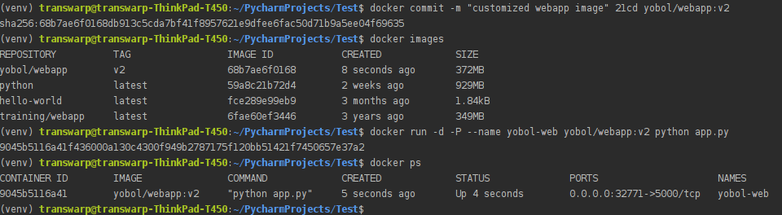

# Docker

## Registry & Reposity

A registry is a collection of repositories, and a repository is a collection of
images

## Docker的优点

- 平台无关，可移植；
- 轻量，多个容器共享主机内核；
- 灵活可扩展，一个镜像可以衍生出多个容器；

## 查看Docker支持的指令

```shell
$ docker
```

## 查看Docker指令详情

```shell
# docker <command-name> --help
# 查看stop命令的详细描述
$ docker stop --help

# 查看kill命令的详细描述
$ docker kill --help
```

## 查看Docker信息

```shell
# 只简单显示Docker的版本信息
$ docker --version
# 详细显示Docker的版本信息
$ docker version

# 详细显示Docker的信息
$ docker info
```

## 查找镜像

在[Docker Hub](https://hub.docker.com/)上查找NAME中带有指定关键字的镜像。

```shell
# docker search TERM
$ docker search nginx
```

## 抓取镜像

从registry（？）中拉取一个镜像或仓库。

```shell
# docker pull <image-name>
# 拉取nginx官方镜像
$ docker pull nginx
```

## 修改仓库源地址

如果加载速度过慢的话，可以修改Docker仓库源的地址。

```shell
$ sudo vim /etc/docker/daemon.json
# 解决加载速度过慢的一种方法
{
    "registry-mirrors": "https://registry.docker-cn.com"
}

# 重新启动Docker
$ docker service restart
```

参考：[修改docker仓库资源的地址](https://blog.csdn.net/wanderlustLee/article/details/80216588)

## Insecure Registry

在Pull镜像的过程中可能会反馈如下信息：

```
yobol@yobol:~/xxx/xxxxxx$ docker-compose up -d
Pulling xxx (IP地址/xxx/xxx:tag)...
ERROR: Get https://IP地址/v2/: x509: certificate signed by unknown authority
```

```shell
$ sudo vim /etc/docker/daemon.json
{
    "insecure-registries": "https://IP地址"
}

# 重新启动Docker
$ docker service restart
```

With insecure registries enabled, Docker goes through the following steps:

- First, try using HTTPS.         
  - If HTTPS is available but the certificate is invalid, **ignore the error about the certificate**.
  - If HTTPS is not available, fall back to HTTP.

参考：[Deploy a plain HTTP registry](https://docs.docker.com/registry/insecure/)

## 自定义镜像

使用docker build命令创建镜像：

1. 首先创建一个Dockerfile文件，告诉Docker如何构建我们的应用,语法参考[Dockerfile]()；
2. 执行`docker build [OPTIONS] <PATH | URL | ->`命令从指定目录 | URL下寻找Dockerfile文件构建一个镜像（-t/--tag参数以name:tag格式指定镜像名，如果不指定:tag，则tag默认是lastest，推荐使用--tag=name:v0.0.1格式）；
3. 使用`docker images`命令查看本地Docker registry中的镜像。

#### 上传自定义镜像

```shell
# login Docker Hub
$ docker login
# 接着输入你在Docker Hub上的用户名和密码

# 给你的repository添加新的tag
$ docker tag <repository> <username/repository:newtag>

# 你的registry上镜像的格式： username/repository:tag

# 上传本地镜像到你的registry中
$ docker push username/repository:tag

# 现在你可以将本地的相关镜像删除之后，再运行docker run命令试试Docker是否会帮你从你的registry中拉取相应的镜像
```

## 查看镜像

```shell
# 查看本地所有的镜像
$ docker images

# REPOSITORY          TAG                 IMAGE ID            CREATED             SIZE
# python              latest              59a8c21b72d4        2 weeks ago         929MB
# hello-world         latest              fce289e99eb9        3 months ago        1.84kB
# training/webapp     latest              6fae60ef3446        3 years ago         349MB
```

同一个仓库源可以有多个TAG，代表这个仓库源的不同版本，如ubuntu有15.10,14.04等多个版本，我们使用REPOSITORY:TAG来定义不同的镜像。

如果你不指定一个镜像的版本标签，则默认使用latest版本。

## 为指定镜像创建容器并启动

```shell
# 如果本地不存在指定的镜像，则从Docker Hub拉取公共镜像

# [COMMAND] [ARG...]表示可以在启动容器时执行命令来	运行一个应用程序
# docker run [OPTIONS] <image-name> [COMMAND] [ARG...]

# -d 表示在后台运行容器并回显容器ID

# -P 将容器的暴露的端口按照（）的规则映射到主机的随机端口上
# -p 主机端口:容器端口，将容器暴露的端口映射到主机的指定端口上，目的是可以直接对外提供访问
# 你可以为同一个镜像启动多个容器（就像类和对象的关系那样），通过-p来指定不同的端口

# --name 指定容器名 cnl为自己指定的容器名，若不指定，则随机生成
$ docker run -d -p 80:80 --name	cnl nginx
```

## 查看容器

### 查看当前正在运行的所有容器

```shell
# 使用 -l 参数	查询最后一次创建的容器
$ docker ps

# 也可以使用如下命令查看当前正在运行的所有容器
$ docker container ls
```

### 查看所有运行过的容器

```shell
# 查看所有运行过的容器，包含已经终止的容器
$ docker ps -a

# 也可以使用如下命令查看所有运行过的容器
$ docker container ls --all
```

### 查看容器内的标准输出

```shell
# docker logs <container-id|container-name>
# using container id
$ docker logs fba6dfab29f0

# using container name
$ docker logs cnl
```

可以指定 **-f** 让 **docker logs** 像使用 **tail -f** 一样来输出容器内部的标准输出。

### 查看容器内部运行的进程

```shell
# docker top <container-id|container-name>
$ docker top cnl
```

### 查看容器的详细的底层信息

```shell
# docker inspect [OPTIONS] <container-id|container-name> [<container-id|container-name>]
$ docker inspect cnl
```

## 结束容器

Docker提供了两个结束容器的命令，stop和kill：

- docker stop，支持“优雅退出”。先发送SIGTERM信号，在一段时间之后（默认10s）再发送SIGKILL信号。Docker内部的应用程序可以接收SIGTERM信号，然后做一些“退出前工作”，比如保存状态、处理当前请求等。
- docker kill，默认发送SIGKILL信号，应用程序直接退出，当然也可以使用-s或--signal string来指定信号类型。

```shell
# docker kill|stop <container-id|container-name>
$ docker kill cnl
```

## 重启容器

```shell
# docker start [OPTIONS] <container-id|container-name> [<container-id|container-name>]
$ docker start cnl
```

## 删除容器

```shell
# 删除容器和所有相关的信息，如启动记录
# 在删除容器时，容器必须是停止状态，否则会提示不能删除正在运行的容器	
# docker rm <container-name>
$ docker rm cnl

# 查看所有启动过的容器，包含已经终止的容器
# 结果中已无名为cnl容器的运行记录
$ docker ps -a
```

## 更新镜像

```shell
# 在更新镜像之前，需要使用镜像运行一个容器
$ docker run -i -t training/webapp /bin/bash
# 然后在这个运行的容器中使用apt-get update命令进行更新
root@21cd4e52d620:/opt/webapp# apt-get update
# 在完成之后，输入exit命令退出这个容器
root@21cd4e52d620:/opt/webapp# exit

# 此时当前容器是按照需求更改的容器，可以通过docker commit命令来提交容器副本
# 然后我们就可以使用docker images命令看到新创建的镜像 yobol/webapp:v2
# -m：提交的描述信息
# -a：指定镜像作者
# 21cd4e52d620：容器ID
# yobol/webapp:v2：指定要创建的镜像名
$ docker commit -m="webapp-v2" -a="yobol" 21cd4e52d620 yobol/webapp:v2
```



## 删除镜像

```shell
# docker rmi <image-id|image-name>
$ docker rmi nginx
```

## docker-compose

### 安装

官方文档：[Install Docker Compose](https://docs.docker.com/compose/install/)。

[Docker及相关资源的国内高速镜像](http://get.daocloud.io/)

```shell
# 下载Docker Compose 1.24.0版本，1.24.0 为版本号，可以替换成其他版本。
$ sudo curl -L "https://get.daocloud.io/docker/compose/releases/download/1.24.0/docker-compose-$(uname -s)-$(uname -m)" -o /usr/local/bin/docker-compose

# 为下载的文件添加可执行权限
$ sudo chmod +x /usr/local/bin/docker-compose

# 查看docker-compose版本，以验证安装结果
$ docker-compose --version

# 如果执行docker-compose失败，也可以创建链接
$ sudo ln -s /usr/local/bin/docker-compose /usr/bin/docker-compose
```

当下载失败时，换个版本试试！！！

### Get Started

官方文档：[Docker Compose Get started](https://docs.docker.com/compose/gettingstarted/)

### CLI

官方文档：[Compose command-line reference](https://docs.docker.com/compose/reference/)

启动

### docker-compose.yml

官方文档：[Compose file version 3 reference](https://docs.docker.com/compose/compose-file/)

### 卸载

```shell
$ sudo rm /usr/local/bin/docker-compose
```

