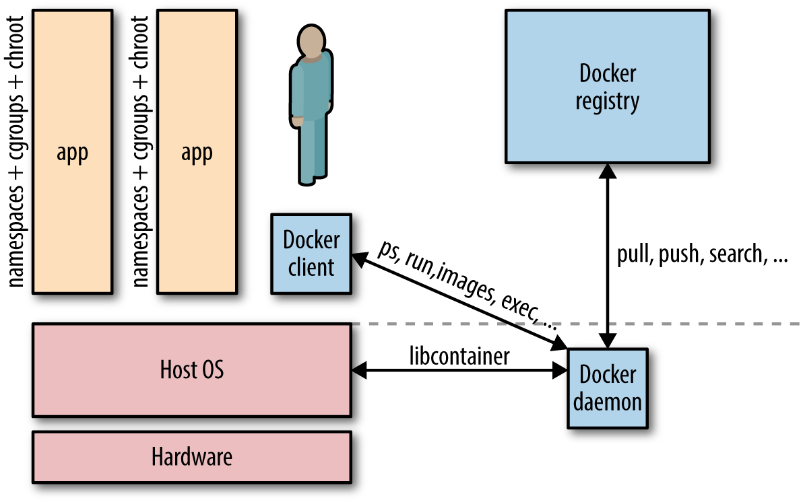

# Docker

## Registry & Reposity

A registry is a collection of repositories, and a repository is a collection of images.

## Docker的优点

- 平台无关，可移植：Docker将应用/软件打包成与平台无关的标准化单元/构件，每个容器包含会程序源码、运行时、系统工具、系统依赖库和其所需要的所有依赖，使得应用与具体平台解耦，便于快速、可靠地进行迁移；
- 灵活可扩展，一个镜像可以衍生出多个容器：Docker是一个容器引擎，Docker会在需要时使用镜像实例化一个对应的容器，并且由Docker来运行该容器；
- 轻量，多个容器共享主机内核：Docker与机器共享OS内核，能够有效降低服务器和许可开销，提高服务器效率；

## 查看Docker支持的指令

```shell
$ docker
```

## 查看Docker指令详情

```shell
# docker <command-name> --help
# 查看stop命令的详细描述
$ docker stop --help

# 查看kill命令的详细描述
$ docker kill --help
```

## 查看Docker信息

```shell
# 只简单显示Docker的版本信息
$ docker --version
# 详细显示Docker的版本信息
$ docker version

# 详细显示Docker的信息
$ docker info
```

## 查找镜像

在[Docker Hub](https://hub.docker.com/)上查找NAME中带有指定关键字的镜像。

```shell
# docker search TERM
$ docker search nginx
```

## 抓取镜像

从registry（？）中拉取一个镜像或仓库。

```shell
# docker pull <image-name>
# 拉取nginx官方镜像
$ docker pull nginx
```

## 修改仓库源地址

如果加载速度过慢的话，可以修改Docker仓库源的地址。

```shell
$ sudo vim /etc/docker/daemon.json
# 解决加载速度过慢的一种方法
{
    "registry-mirrors": "https://registry.docker-cn.com"
}

# 重新启动Docker
$ docker service restart
```

参考：[修改docker仓库资源的地址](https://blog.csdn.net/wanderlustLee/article/details/80216588)

## Insecure Registry

在Pull镜像的过程中可能会反馈如下信息：

```
yobol@yobol:~/xxx/xxxxxx$ docker-compose up -d
Pulling xxx (IP地址/xxx/xxx:tag)...
ERROR: Get https://IP地址/v2/: x509: certificate signed by unknown authority
```

```shell
$ sudo vim /etc/docker/daemon.json
{
    "insecure-registries": "https://IP地址"
}

# 重新启动Docker
$ docker service restart
```

With insecure registries enabled, Docker goes through the following steps:

- First, try using HTTPS.         
  - If HTTPS is available but the certificate is invalid, **ignore the error about the certificate**.
  - If HTTPS is not available, fall back to HTTP.

参考：[Deploy a plain HTTP registry](https://docs.docker.com/registry/insecure/)

## 自定义镜像

使用docker build命令创建镜像：

1. 首先创建一个Dockerfile文件，告诉Docker如何构建我们的应用,语法参考[Dockerfile]()；
2. 执行`docker build [OPTIONS] <PATH | URL | ->`命令从指定目录 | URL下寻找Dockerfile文件构建一个镜像（-t/--tag参数以name:tag格式指定镜像名，如果不指定:tag，则tag默认是lastest，推荐使用--tag=name:v0.0.1格式）；
3. 使用`docker images`命令查看本地Docker registry中的镜像。

#### 上传自定义镜像

```shell
# login Docker Hub
$ docker login
# 接着输入你在Docker Hub上的用户名和密码

# 给你的repository添加新的tag
$ docker tag <repository> <username/repository:newtag>

# 你的registry上镜像的格式： username/repository:tag

# 上传本地镜像到你的registry中
$ docker push username/repository:tag

# 现在你可以将本地的相关镜像删除之后，再运行docker run命令试试Docker是否会帮你从你的registry中拉取相应的镜像
```

## 查看镜像

```shell
# 查看本地所有的镜像
$ docker images

# REPOSITORY          TAG                 IMAGE ID            CREATED             SIZE
# python              latest              59a8c21b72d4        2 weeks ago         929MB
# hello-world         latest              fce289e99eb9        3 months ago        1.84kB
# training/webapp     latest              6fae60ef3446        3 years ago         349MB
```

同一个仓库源可以有多个TAG，代表这个仓库源的不同版本，如ubuntu有15.10,14.04等多个版本，我们使用REPOSITORY:TAG来定义不同的镜像。

如果你不指定一个镜像的版本标签，则默认使用latest版本。

## 查看指定镜像信息

```shell
# 查看指定镜像简略信息
$ docker images <image-id|image-name>

# 查看指定镜像详细信息
$ docker [image] inspect <image-id|image-name>
```


## 为指定镜像创建容器并启动

```shell
# 如果本地不存在指定的镜像，则从Docker Hub拉取公共镜像

# [COMMAND] [ARG...]表示可以在启动容器时执行命令来	运行一个应用程序
# docker run [OPTIONS] <image-name> [COMMAND] [ARG...]

# -d 表示在后台运行容器并回显容器ID

# -P 将容器的暴露的端口按照（）的规则映射到主机的随机端口上
# -p 主机端口:容器端口，将容器暴露的端口映射到主机的指定端口上，目的是可以直接对外提供访问
# 你可以为同一个镜像启动多个容器（就像类和对象的关系那样），通过-p来指定不同的端口

# --name 指定容器名 cnl为自己指定的容器名，若不指定，则随机生成
$ docker run -d -p 80:80 --name	cnl nginx
```

## 查看容器

### 查看当前正在运行的所有容器

```shell
# 使用 -l 参数	查询最后一次创建的容器
$ docker ps

# 也可以使用如下命令查看当前正在运行的所有容器
$ docker container ls
```

### 查看所有运行过的容器

```shell
# 查看所有运行过的容器，包含已经终止的容器
$ docker ps -a

# 也可以使用如下命令查看所有运行过的容器
$ docker container ls --all
```

### 查看容器内的标准输出

```shell
# docker logs <container-id|container-name>
# using container id
$ docker logs fba6dfab29f0

# using container name
$ docker logs cnl
```

可以指定 **-f** 让 **docker logs** 像使用 **tail -f** 一样来输出容器内部的标准输出。

### 查看容器内部运行的进程

```shell
# docker top <container-id|container-name>
$ docker top cnl
```

### 查看容器的详细的底层信息

```shell
# docker inspect [OPTIONS] <container-id|container-name> [<container-id|container-name>]
$ docker inspect cnl
```

### 查看容器内部资源（包括封装的源码/配置）

```shell
# 启动容器 container-a
$ docker exec -it <container-a-name> bash

# 退出
exit
```

## 结束容器

Docker提供了两个结束容器的命令，stop和kill：

- docker stop，支持“优雅退出”。先发送SIGTERM信号，在一段时间之后（默认10s）再发送SIGKILL信号。Docker内部的应用程序可以接收SIGTERM信号，然后做一些“退出前工作”，比如保存状态、处理当前请求等。
- docker kill，默认发送SIGKILL信号，应用程序直接退出，当然也可以使用-s或--signal string来指定信号类型。

```shell
# docker kill|stop <container-id|container-name>
$ docker kill cnl
```

## 重启容器

```shell
# docker start [OPTIONS] <container-id|container-name> [<container-id|container-name>]
$ docker start cnl
```

## 删除容器

```shell
# 删除容器和所有相关的信息，如启动记录
# 在删除容器时，容器必须是停止状态，否则会提示不能删除正在运行的容器	
# docker rm <container-name>
$ docker rm cnl

# 查看所有启动过的容器，包含已经终止的容器
# 结果中已无名为cnl容器的运行记录
$ docker ps -a
```

## 更新镜像

```shell
# 在更新镜像之前，需要使用镜像运行一个容器
$ docker run -i -t training/webapp /bin/bash
# 然后在这个运行的容器中使用apt-get update命令进行更新
root@21cd4e52d620:/opt/webapp# apt-get update
# 在完成之后，输入exit命令退出这个容器
root@21cd4e52d620:/opt/webapp# exit

# 此时当前容器是按照需求更改的容器，可以通过docker commit命令来提交容器副本
# 然后我们就可以使用docker images命令看到新创建的镜像 yobol/webapp:v2
# -m：提交的描述信息
# -a：指定镜像作者
# 21cd4e52d620：容器ID
# yobol/webapp:v2：指定要创建的镜像名
$ docker commit -m="webapp-v2" -a="yobol" 21cd4e52d620 yobol/webapp:v2
```


## 删除镜像

```shell
# docker rmi <image-id|image-name>
$ docker rmi nginx
```

## docker-compose

### [安装](https://docs.docker.com/compose/install/)

[Docker及相关资源的国内高速镜像](http://get.daocloud.io/)

```shell
# 下载Docker Compose 1.24.0版本，1.24.0 为版本号，可以替换成其他版本。
$ sudo curl -L "https://get.daocloud.io/docker/compose/releases/download/1.24.0/docker-compose-$(uname -s)-$(uname -m)" -o /usr/local/bin/docker-compose

# 为下载的文件添加可执行权限
$ sudo chmod +x /usr/local/bin/docker-compose

# 查看docker-compose版本，以验证安装结果
$ docker-compose --version

# 如果执行docker-compose失败，也可以创建链接
$ sudo ln -s /usr/local/bin/docker-compose /usr/bin/docker-compose
```

当下载失败时，换个版本试试！！！

### [Get started](https://docs.docker.com/compose/gettingstarted/)

### CLI

官方文档：[Compose command-line reference](https://docs.docker.com/compose/reference/)

#### 启动

##### 启动所有服务

```shell
# -d表示后台运行
$ docker-compose up -d
```

##### 启动指定服务

```shell
$ docker-compose start <service-id|service-name>
```

#### 查看容器运行情况

```shell
$ docker-compose ps
```

#### 关闭

##### 关闭所有服务

```shell
$ docker-compose down
```

##### 关闭指定服务

```shell
$ docker-compose stop <service-id|service-name>
```

### docker-compose.yml

`YAML（[/ˈjæməl/]，尾音类似camel）。`

在`docker-compose.yml`文件`services`下的每一个service都对应一个`docker run`命令，因此其下的每一个配置选项都对应了所创建的docker容器实例的配置项，即`docker run <OPTIONS> IMAGE [COMMAND] [ARG...]`。

在Dockerfile文件中指定的选项不用再在`docker-compose.yml`中指定。

在`docker-compose.yml`同目录下创建`.env`文件，`使用VARIABLE_NAME=variable_value`来声明环境变量，然后使用`${VARIABLE_NAME}`来使用环境变量。

[version 2](https://docs.docker.com/compose/compose-file/compose-file-v2/)

```yaml
# docker-compose version
version: "2"
services:
  # define service
  service-name:
    # IMAGE
    image: image-name
    # --name <container-name>
    container_name: container-name
    # 描述服务之间的依赖关系，有如下两个作用：
    #   1. docker-compose up 将以依赖顺序来启动服务，如启动web服务需要先启动db和redis服务
    #   2. docker-compose up service-name 将自动包含service-name所有的依赖
    #      如docker-compose up web 将会自动创建和启动db和redis
    depends_on:
      - service-name
    # 指定主机端口和容器暴露端口的映射关系
    # -p <host-port:container-port>
    # -P <container-port>
    ports:
      - "host-port:container-port"
    # --net <bridge|host|none|service: service-name|container: container-name>
    network_node: bridge|host|none|service: service-name|container: container-name
    # 添加环境变量
    # 当环境变量值为true/false时，需要使用'true|false'来防止Ymal将其解析为True|False
    environment: 
      key1: value1
      key2: value2
    # 挂载主机（host）文件夹或命名卷（named volumes），需要以顶级卷键指定命名卷
    # 可以使用相对路径来指定主机上的目录，但是需要记住：相对路径必须以.或者..开头
    # 短语法使用 [source:]target[:mode] 格式
    #   - source可以是主机路径，也可以是一个卷名；
    #   - target是source对应的容器地址；
    #   - mode 可以是ro（read-only），也可以是rw（read-write, default）
    # 长语法，balabala
    volumes: 
      ./data/xxx/xxx
      ./log/xxx
    # no策略是无论发生什么都不会重启容器，是默认的重启策略；
    # always策略是无论发生什么都会重启容器；
    # on-failure策略只有在容器的退出码为on-failure时才会重启容器。
    restart: <no|always|on-failure>
```

### 卸载

```shell
$ sudo rm /usr/local/bin/docker-compose
```

## Docker网络模式

参考：[Docker网络模式](http://dockone.io/article/1261)

Docker容器运行在一台宿主机（host）上，可以是一台物理机，也可以是一台虚拟机。

宿主机上运行了Docker的daemon进程和客户端，一方面可以和Docker registry（Docker Repositories）交互，另一方面可以启动、关闭和审查容器。（下图为简单的Docker单主机架构）



### 两种数据交换方式的比较

#### 共享卷（Shared Volumes）

- 优点：使用方式方便简单；数据传输速度快；
- 缺点：数据的发送/获取端紧耦合，很难将单主机部署转化为多部署。

因此，在大多数单主机部署中，通常使用共享卷来作为数据共享的方式。

#### 网络（Network）

在多主机部署中，需要使用网络来共享数据。使用多主机部署，可能是因为：

1. 单主机能力有限（宿主机上容器的平均数量10～40和最大数量250）；
2. 需部署分布式系统。

### bridge（桥接模式）

在该模式下，Docker守护进程创建了一个虚拟以太网桥`docker0`，附加在其上的任何网卡之间都能自动转发数据包。

默认情况下，守护进程会创建一对对等接口，将其中一个接口设置为容器的`eth0`接口，另一个接口放置在宿主机的命名空间中，从而使得宿主机上的容器能够连接到宿主机的内部网络上。

同时，守护进程还会从网桥的私有地址空间中分配（系统随机或者自己指定）一个IP地址和子网给该容器。

```shell
# 指定容器的网络模式为桥接模式
$ docker run -d -P --net=bridge <image-id|image-name>

# bridge模式是Docker默认的网络模式，因此也可以省略--net=bridge
$ docker run -d -P <image-id|image-name>

# 示例
$ docker run -d -P --net=bridge nginx:1.9.1
$ docker ps
CONTAINER ID   IMAGE                  COMMAND    CREATED
STATUS         PORTS                  NAMES
17d447b7425d   nginx:1.9.1            nginx -g   19 seconds ago
Up 18 seconds  0.0.0.0:49153->443/tcp,
                          0.0.0.0:49154->80/tcp  trusting_feynman
```


`注：如果你没有使用-P发布该容器暴露的所有端口或者使用-p发布特定的端口，IP数据包就不能从宿主机之外传送到容器中。`

### host（主机模式）

在该模式下，Docker的网络隔离机制将被禁用，也就意味着容器将共享宿主机的网络命名空间，而直接暴露在公共网络中。因此，我们可以通过端口映射（port mapping）进行协调。

```shell
# 以host网络模式以ubuntu:16.04镜像启动容器
$ docker run -d --net=host ubuntu:16.04 tail -f /dev/null

# 结果应该是容器和宿主机具有相同的IP地址
```


`注：当使用了host网络模式时，容器实际上会继承宿主机的IP地址。该模式比bridge模式更快，因为没有路由开销，但是该模式将容器直接暴露在公共网络中，是有安全隐患的。`

### container（容器模式）

在该模式下，容器会重用另一个容器的网络命名空间，适用于需要自定义网络栈的情况。

`注：k8s使用该网络模式。`

```shell
# 使用指定的容器的IP地址
$ docker run -d -P --net=container:<another-docker> IMAGE
```

`注：container网络模式使得创建的容器和指定的容器拥有相同的IP地址。`

### none（无网络模式）

在该模式下，容器的网络模式被禁用。该模式将容器放置在它自己的网络栈中，但是不进行任何配置。实际上，该模式关闭了容器的网络功能，适用于以下两种情况：

1. 容器并不需要使用网络；
2. 希望自定义网络栈。

```shell
$ docker run -d -P --net=none IMAGE

$ docker inspect CONTAINER | grep IPAddress
###########################################
"SecondaryIPAddresses": null,
            "IPAddress": "",
                    "IPAddress": "",
###########################################
```

`注：使用这种模式，将没有任何网络配置。`