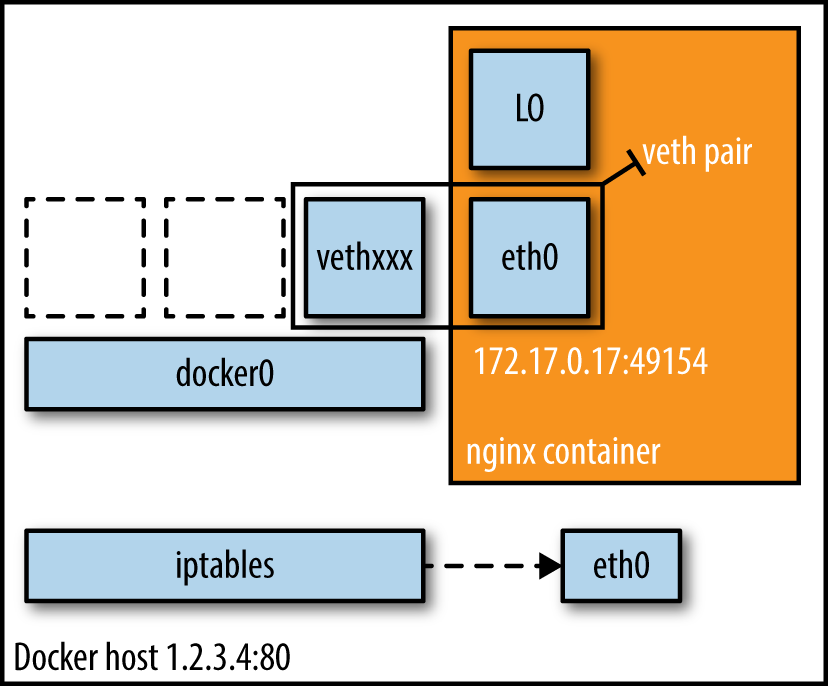
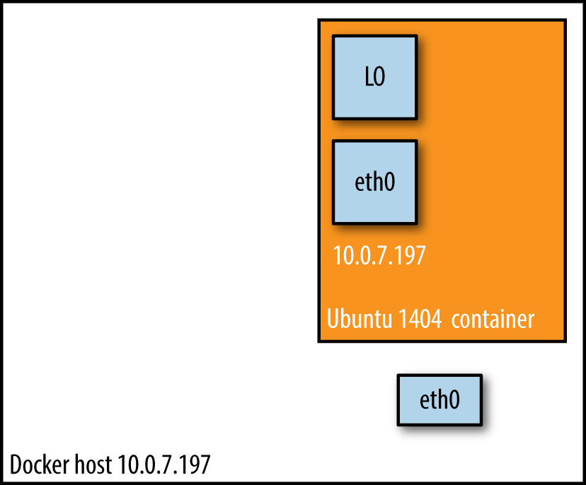

# Docker网络模式

当你开始大规模使用Docker时，你会发现需要了解很多关于网络的知识。作为Docker网络的一篇介绍，我们将从头开始，然后开始讨论如何管理容器间的连接。Docker容器需要运行在一台宿主机上，可以是一台物理机（on-premise数据中心中的裸金属服务器），也可以是on-prem或云上的一台虚拟机。就像下图中描述的那样，宿主机上运行了Docker的daemon进程和客户端，一方面可以与Docker registry交互，另一方面可以启动、关闭和审查容器。

[](http://dockone.io/uploads/article/20160503/bbd6d8b6ca1556f737b452b72d105c78.png)

图1 简单的Docker架构（单主机）

宿主机和容器的关系是

```
1：N
```

，这意味着一台宿主机上可以运行多个容器。例如，从Facebook的报告来看，取决于机器的能力，每台宿主机上平均可以运行10到40个容器。另一个数据是：在Mesosphere，我们发现，在裸金属服务器上的各种负载测试中，每台宿主机上不超过250个容器是可能的。

无论你是在单主机上进行部署，还是在集群上部署，你总得和网络打交道：

- 对于大多数单主机部署来说，问题归结于是使用共享卷进行数据交换，还是使用网络（基于HTTP或者其他的）进行数据交换。尽管Docker数据卷很容易使用，但也引入了紧耦合，这意味着很难将单主机部署转化为多主机部署。自然地，共享卷的优势是速度。
- 在多主机部署中，你需要考虑两个方面：单主机上的容器之间如何通信和多主机之间的通信路径是怎样的。性能考量和安全方面都有可能影响你的设计决定。多主机部署通常是很有必要的，原因是单主机的能力有限（请看前面关于宿主机上容器的平均数量和最大数量的讨论），也可能是因为需要部署分布式系统，例如Apache Spark、HDFS和Cassandra。

> 分布式系统和数据本地化（Distributed Systems and Data Locality）
>
> 使用分布式系统（计算或存储）的基本想法是想从并行处理中获利，通常伴随着数据本地化。数据本地化，我指的是将代码转移到数据所在地的原则，而不是传统的、其他的方式。考虑以下的场景：如果你的数据集是TB级的，而代码是MB级的，那么在集群中移动代码比传输TB级数据更高效。除了可以并行处理数据之外，分布式系统还可以提供容错性，因为系统中的一部分可以相对独立地工作。

简单地说，Docker网络是原生的容器SDN解决方案。总而言之，Docker网络有四种模式：桥模式，主机模式，容器模式和无网络模式。我们会详细地讨论单主机上的各种网络模式，在本章的最后，我们还会讨论一些常规主题，比如安全。

#### bridge模式网络

在该模式（见下图）中，Docker守护进程创建了一个虚拟以太网桥

```
docker0
```

，附加在其上的任何网卡之间都能自动转发数据包。默认情况下，守护进程会创建一对对等接口，将其中一个接口设置为容器的eth0接口，另一个接口放置在宿主机的命名空间中，从而将宿主机上的所有容器都连接到这个内部网络上。同时，守护进程还会从网桥的私有地址空间中分配一个IP地址和子网给该容器。

```
$ docker run -d -P --net=bridge nginx:1.9.1
$ docker ps
CONTAINER ID   IMAGE                  COMMAND    CREATED
STATUS         PORTS                  NAMES
17d447b7425d   nginx:1.9.1            nginx -g   19 seconds ago
Up 18 seconds  0.0.0.0:49153->443/tcp,
                          0.0.0.0:49154->80/tcp  trusting_feynman
```

> 因为bridge模式是Docker的默认设置，所以你也可以使用`docker run -d -P nginx:1.9.1`。如果你没有使用-P（发布该容器暴露的所有端口）或者-p
> host_port:container_port（发布某个特定端口），IP数据包就不能从宿主机之外路由到容器中。

[](http://dockone.io/uploads/article/20160503/b04b20bc12982a536ca9a35f6d5cca23.png)

图2 bridge模式网络设置

#### host模式网络

该模式将禁用Docker容器的网络隔离。因为容器共享了宿主机的网络命名空间，直接暴露在公共网络中。因此，你需要通过端口映射（port mapping）来进行协调。

```
$ docker run -d --net=host ubuntu:14.04 tail -f /dev/null
$ ip addr | grep -A 2 eth0:
2: eth0: <BROADCAST,MULTICAST,UP,LOWER_UP> mtu 9001 qdisc mq state UP group default qlen 1000
link/ether 06:58:2b:07:d5:f3 brd ff:ff:ff:ff:ff:ff
inet **10.0.7.197**/22 brd 10.0.7.255 scope global dynamic eth0

$ docker ps
CONTAINER ID  IMAGE         COMMAND  CREATED
STATUS        PORTS         NAMES
b44d7d5d3903  ubuntu:14.04  tail -f  2 seconds ago
Up 2 seconds                jovial_blackwell
$ docker exec -it b44d7d5d3903 ip addr
2: eth0: <BROADCAST,MULTICAST,UP,LOWER_UP> mtu 9001 qdisc mq state UP group default qlen 1000
link/ether 06:58:2b:07:d5:f3 brd ff:ff:ff:ff:ff:ff
inet **10.0.7.197**/22 brd 10.0.7.255 scope global dynamic eth0
```

我们可以从上例中看到：容器和宿主机具有相同的IP地址

```
10.0.7.197
```

。

在下图中，我们可以看到：当使用host模式网络时，容器实际上继承了宿主机的IP地址。该模式比bridge模式更快（因为没有路由开销），但是它将容器直接暴露在公共网络中，是有安全隐患的。

[](http://dockone.io/uploads/article/20160503/5d7564e6eb8554412bd74e6772a336b4.png)

图3 host模式网络设置

#### container模式网络

该模式会重用另一个容器的网络命名空间。通常来说，当你想要自定义网络栈时，该模式是很有用的。实际上，该模式也是Kubernetes使用的网络模式。

```
$ docker run -d -P --net=bridge nginx:1.9.1
$ docker ps
CONTAINER ID  IMAGE        COMMAND   CREATED         STATUS
PORTS                      NAMES
eb19088be8a0  nginx:1.9.1  nginx -g  3 minutes ago   Up 3 minutes
0.0.0.0:32769->80/tcp,
0.0.0.0:32768->443/tcp     admiring_engelbart
$ docker exec -it admiring_engelbart ip addr
8: eth0@if9: <BROADCAST,MULTICAST,UP,LOWER_UP> mtu 9001 qdisc noqueue state UP group default
link/ether 02:42:ac:11:00:03 brd ff:ff:ff:ff:ff:ff
inet **172.17.0.3**/16 scope global eth0

$ docker run -it --net=container:admiring_engelbart ubuntu:14.04 ip addr
...
8: eth0@if9: <BROADCAST,MULTICAST,UP,LOWER_UP> mtu 9001 qdisc noqueue state UP group default
link/ether 02:42:ac:11:00:03 brd ff:ff:ff:ff:ff:ff
inet **172.17.0.3**/16 scope global eth0
```

结果（上面的例子）显示：第二个容器使用了

```
--net=container
```

参数，因此和第一个容器

```
admiring_engelbart
```

具有相同的IP地址

```
172.17.0.3
```

。

#### none模式网络

该模式将容器放置在它自己的网络栈中，但是并不进行任何配置。实际上，该模式关闭了容器的网络功能，在以下两种情况下是有用的：容器并不需要网络（例如只需要写磁盘卷的批处理任务）；你希望自定义网络，在第3章中有很多选项使用了该模式。

```
$ docker run -d -P --net=none nginx:1.9.1
$ docker ps
CONTAINER ID  IMAGE          COMMAND   CREATED
STATUS        PORTS          NAMES
d8c26d68037c  nginx:1.9.1    nginx -g  2 minutes ago
Up 2 minutes                 grave_perlman
$  docker inspect d8c26d68037c | grep IPAddress
"IPAddress": "",
"SecondaryIPAddresses": null,
```

在上面的例子中可以看到，恰如我们所料，网络没有任何配置。

你可以在

Docker官方文档

中读到更多关于Docker网络的配置。

> 本书中的所有Docker命令都是在CoreOS环境中执行的，Docker客户端和服务端的版本都是1.7.1。

#### 更多话题

在本章中，我们了解了Docker单主机网络的四种基本模式。现在我们讨论下你应该了解的其他主题（这与多主机部署也是相关的）：

- 分配IP地址
  频繁大量的创建和销毁容器时，手动分配IP地址是不能接受的。bridge模式可以在一定程度上解决这个问题。为了防止本地网络上的ARP冲突，Docker Daemon会根据分配的IP地址生成一个随机地MAC地址。在下一章中，我们会再次讨论分配地址的挑战。
- 分配端口
  你会发现有两大阵营：固定端口分配（fixed-port-allocation）和动态端口分配（dynamically-port-allocation）。每个服务或者应用可以有各自的分配方法，也可以是作为全局的策略，但是你必须做出自己的判断和决定。请记住，bridge模式中，Docker会自动分配UDP或TCP端口，并使其可路由。
- 网络安全
  Docker可以开启容器间通信（意味着默认配置`--icc=true`），也就是说，宿主机上的所有容器可以不受任何限制地相互通信，这可能导致拒绝服务攻击。进一步地，Docker可以通过`--ip_forward`和`--iptables`两个选项控制容器间、容器和外部世界的通信。你应该了解这些选项的默认值，并让网络组根据公司策略设置Docker进程。可以读一下StackEngine的Boyd Hemphill写的文章Docker security analysis。
  另一个网络安全方面是线上加密（on-the-wire encryption），通常是指[RFC 5246](https://tools.ietf.org/html/rfc5246)中定义的TLS/SSL。注意，在写本书时，这一方面还很少被讨论，实际上，只有两个系统（下一章会详细讨论）提供了这个特性：Weave使用[NACI](http://nacl.cr.yp.to/)，OpenVPN是基于TLS的。根据我从Docker的安全负责人Diogo Mónica那里了解的情况，v1.9之后可能加入线上加密功能。

最后，可以读一下Adrian Mouat的Using Docker，其中详细地介绍了网络安全方面。

> 自动Docker安全检查
> 为了对部署在生产环境中的Docker容器进行安全检查，我强烈建议使用[The Docker Bench for Security](https://github.com/docker/docker-bench-security)。

