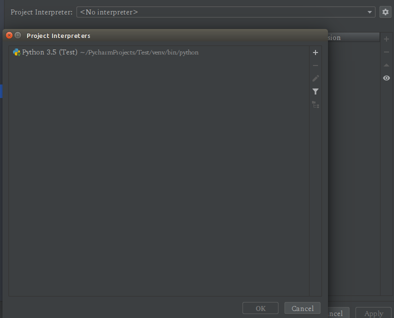
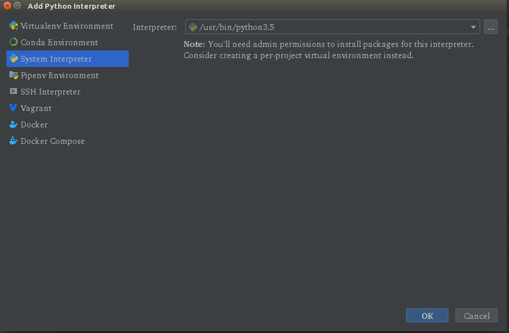
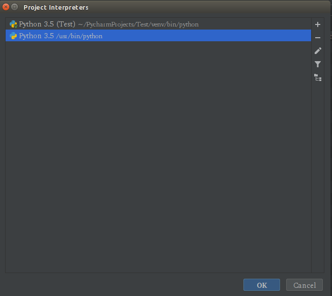
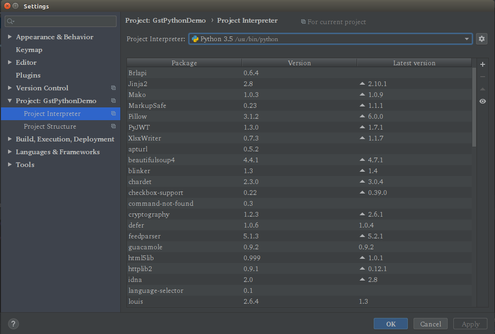

# gst-python

[GStreamer Python Bindings Supplement](https://gstreamer.freedesktop.org/modules/gst-python.html)

## 安装

```shell
$ sudo apt-get install python-gi python3-gi \
    gstreamer1.0-tools \
    gir1.2-gstreamer-1.0 \
    gir1.2-gst-plugins-base-1.0 \
    gstreamer1.0-plugins-good \
    gstreamer1.0-plugins-ugly \
    gstreamer1.0-plugins-bad \
    gstreamer1.0-libav
```

参考：[Ubuntu : Using GStreamer 1.0 from Python](https://wiki.ubuntu.com/Novacut/GStreamer1.0)

## 依赖导入

```python
import gi
gi.require_version('Gst', '1.0')
from gi.repository import Gst
```

### 找不到gi modules

（如果使用Pycharm的话，需要手动替换解释器为系统默认的，不然找不到gi modules）

> File -> Setttings -> Project: XXX -> Project Interpreter



选择添加，选择当前系统默认的Python所在目录（shell 命令： which python）：







## 元件

### 创建元件

```python
element = Gst.ElementFactory.make('element-type', 'element-name')

# make函数封装了下面的过程
factory = Gst.ElementFactory.find('element-type')
element = Gst.ElementFactory.create(factory, 'element-name')

# 创建一个souphttpsrc元件
source = Gst.ElementFactory.make('souphttpsrc', 'source')
```

### 元件状态

```python
# NULL
Gst.State.NULL

# READY
Gst.State.READY

# RUNNING
Gst.State.RUNNING

# PAUSED
Gst.State.PAUSED
```

### 设置状态

```python
element.set_state(Gst.State)

# 将元件从XXX态转换到RUNNING态
element.set_state(Gst.State.RUNNING)
```

### 设置属性

```python
element.set_property('property_name', property_value)

# 设置GstVideoTestSrc的pattern属性为10
source = Gst.ElementFactory.make('videotestsrc', 'source')
source.set_property('pattern', 10)
```

## 管道

### 创建管道

```python
# 创建一个管道
player = Gst.Pipeline.new('pipeline-name')
```

### 添加元件

```python
# 往管道中添加指定元件
pipeline.add(element)
```

### 连接元件

在创建连接之前一定要保证元件已经在管道或者箱柜中！

```python
# 以元件为连接对象
source_element.link(sink_element)

# 以衬垫为连接对象
```

### 设置管道状态

```python
pipeline.set_state(Gst.State)
```


## 总线

### 获取管道的总线

```python
bus = pipeline.get_bus()
# 在总线上设置一个消息处理器
# 主循环运行的时候，总线会轮询这个消息处理器是否有新的消息
bus.add_signal_watch()
# 绑定接收到消息后调用的回调函数
# 当消息被采集到之后，总线将调用相应的回调函数来完成任务
bus.connect('message', on_message)  # GstMessage

# 自定义回调函数
def on_message(message):
    t = message.type
    if t == Gst.MessageType.EOS:
        print("Arrive at end of stream～")
        self.player.set_state(Gst.State.Null)
    elif t == Gst.MessageType.ERROR:
        err, debug = message.parse_error()
        print("Error: %s", err, debug)
        self.player.set_state(Gst.State.Null)
```

### 消息类型

```python
# EOS
Gst.MessageType.EOS

# Error
Gst.MessageType.ERROR
```


## 参考

1. [gst-python - Gst 1.0 - API](https://lazka.github.io/pgi-docs/#Gst-1.0)
2. [GStreamer Reference Manual](https://gstreamer.freedesktop.org/data/doc/gstreamer/head/gstreamer/html/)


