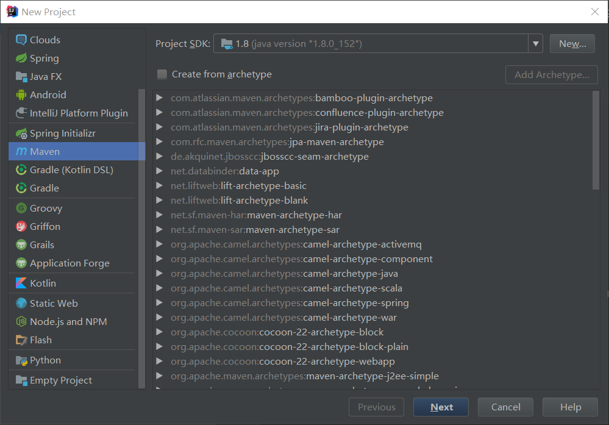

# Build an App with Spring Boot

## Using Intellij IDEA as IDE to Create Maven Project

- File - New - Project - Maven

  

  

  

- 在Maven配置文件pom.xml中添加Spring Boot依赖，可适当添加如下标签：

  ```xml
  <?xml version="1.0" encoding="UTF-8"?>
  <project xmlns="http://maven.apache.org/POM/4.0.0"
           xmlns:xsi="http://www.w3.org/2001/XMLSchema-instance"
           xsi:schemaLocation="http://maven.apache.org/POM/4.0.0 http://maven.apache.org/xsd/maven-4.0.0.xsd">
      <modelVersion>4.0.0</modelVersion>
  
      <groupId>com.yobol</groupId>
      <artifactId>weesteps</artifactId>
      <version>1.0-SNAPSHOT</version>
  
      <name>WeeSteps</name>
      <description>Wee steps get us to faraway places.</description>
  
      <!-- 添加Spring Boot的父级依赖，声明当前项目为Spring Boot项目 -->
      <parent>
          <groupId>org.springframework.boot</groupId>
          <!-- spring-boot-starter-parent提供相关的Maven默认依赖，使用它后，常用的包依赖可以省略version标签 -->
          <artifactId>spring-boot-starter-parent</artifactId>
          <version>2.0.5.RELEASE</version>
      </parent>
  
      <dependencies>
          <!-- Spring Boot Web -->
          <dependency>
              <groupId>org.springframework.boot</groupId>
              <artifactId>spring-boot-starter-web</artifactId>
          </dependency>
      </dependencies>
  
      <properties>
          <java.version>1.8</java.version>
      </properties>
  
  
      <build>
          <plugins>
              <!-- Spring Boot Build Plugin -->
              <plugin>
                  <groupId>org.springframework.boot</groupId>
                  <artifactId>spring-boot-maven-plugin</artifactId>
              </plugin>
          </plugins>
      </build>
  
  </project>
  ```

- 添加控制器类：File - New - Java Class(src/main/java/controller/XXXController)

  ```Java
  package controller;
  
  import org.springframework.web.bind.annotation.RequestMapping;
  import org.springframework.web.bind.annotation.RestController;
  
  // 使用@RestController声明自定义的Controller，意味着我们可以使用Spring MVC来处理Web请求
  @RestController
  public class DemoController {
  
      // 使用@RequestMapping注解将“/demo”映射到demo()方法
      // When invoked from a browser or using curl on the command line, the method returns pure text.
      // That’s because @RestController combines @Controller and @ResponseBody, two annotations that results in web requests returning data rather than a view.
      @RequestMapping("/demo")
      public String demo() {
          return "I'm a demo page generated from DemoController.";
      }
  }
  ```

- 添加程序入口类：File - New - Java Class(src/main/java/XXXAplication)

  Spring Boot通常以名为**项目名+Application**的类作为程序入口类，并使用@SpringBootApplication来标识，在该类的public static void main()方法中调用SpringApplication.run(入口类.class,args)方法启动SpringBoot应用项目。

  ```Java
  package demo;
  
  import org.springframework.boot.SpringApplication;
  import org.springframework.boot.autoconfigure.SpringBootApplication;
  
  import java.util.Arrays;
  
  @SpringBootApplication
  public class DemoApplication {
  
      public static void main(String[] args) {
          SpringApplication.run(DemoApplication.class, args);
      }
  }
  ```

  @SpringBootApplication代码如下：

  ```Java
  @Target({ElementType.TYPE})
  @Retention(RetentionPolicy.RUNTIME)
  @Documented
  @Inherited
  @SpringBootConfiguration
  @EnableAutoConfiguration
  @ComponentScan(
      excludeFilters = {
          @Filter(
      		type = FilterType.CUSTOM,
      		classes = {TypeExcludeFilter.class}
  	     ),
          @Filter(
      		type = FilterType.CUSTOM,
      		classes = {AutoConfigurationExcludeFilter.class}
  		)
      }
  )
  public @interface SpringBootApplication {
      @AliasFor(
          annotation = EnableAutoConfiguration.class
      )
      Class<?>[] exclude() default {};
  
      @AliasFor(
          annotation = EnableAutoConfiguration.class
      )
      String[] excludeName() default {};
  
      @AliasFor(
          annotation = ComponentScan.class,
          attribute = "basePackages"
      )
      String[] scanBasePackages() default {};
  
      @AliasFor(
          annotation = ComponentScan.class,
          attribute = "basePackageClasses"
      )
      Class<?>[] scanBasePackageClasses() default {};
  }
  ```

  @Configuration将该类标记为应用上下文的bean定义源。

  @ComponentScan使得Spring Boot在入口类所在包下寻找其他的组件、配置、服务和控制器类。

  @EnableAutoConfiguration告诉Spring Boot基于类路径设置、其他bean还有属性设置添加bean；还可以让Spring Boot根据类路径中的jar包依赖为当前项目进行自动配置。例如添加了spring-boot-starter-web依赖，会自动添加Tomcat和Spring MVC的依赖，那么Spring Boot会对Tomcat和Spring MVC进行自动配置。又如添加了spring-boot-starter-data-jpa，Spring Boot就会自动进行JPA相关的配置。@EnableAutoConfiguration代码如下：

  ```Java
  @Target({ElementType.TYPE})
  @Retention(RetentionPolicy.RUNTIME)
  @Documented
  @Inherited
  @AutoConfigurationPackage
  @Import({AutoConfigurationImportSelector.class})
  public @interface EnableAutoConfiguration {
      String ENABLED_OVERRIDE_PROPERTY = "spring.boot.enableautoconfiguration";
  
      Class<?>[] exclude() default {};
  
      String[] excludeName() default {};
  }
  ```

  AutoConfigurationImportSelector使用SpringFactoriesLoader.loadFactoryNames方法来扫描具有META-INF/spring.factories文件的jar包，而Spring Boot会自动扫描@SpringBootApplicaition所在类的同级包以及下级包里的Bean（若为JPA项目还可以扫描标注@Entity的实体类）。

  `注：建议入口类放在groupId+artifactId组合的包名下。`

  通过@SpringBootApplication的源码可以看出，关闭特定的自动配置应该使用@SpringBootApplication注解的exclude参数：

  ```Java
  @SpringBootApplication(exclude = {DataSourceAutoConfiguration.class})
  ```

- 启动Spring Boot应用

  使用maven：

  ```shell
  mvn package && java -jar target/weesteps-1.0.jar
  ```

  或者直接右键启动XXXApplication。

- 验证应用是否正常启动和运行：

  命令行：

  ```shell
  curl localhost:8080/demo
  ```

  或者在浏览器输入`localhost:8080/demo`。