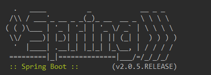

# 修改Banner

我们知道，在启动Spring Boot的时候，会有一个默认的启动图案：

但是如果我们希望根据实际项目的特色来定制相应的图案（闲着没事干），我们可以：

- 在src/main/resources下新建一个banner.txt；
- [在线生成字符](http://patorjk.com/software/taag/)，将生成的字符复制到banner.txt中；
- 重启项目，会发现图案已经发生改变。