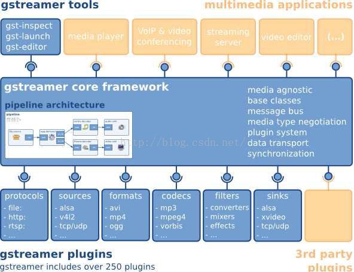
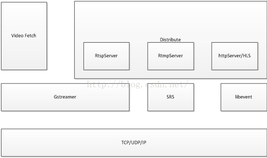
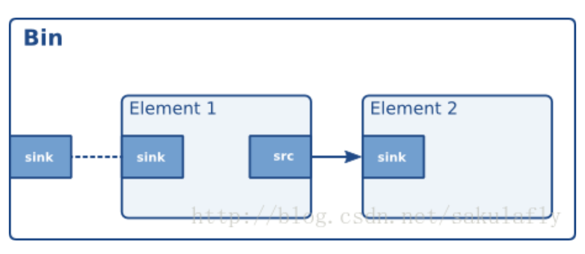
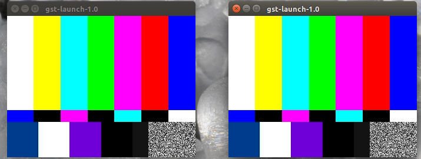
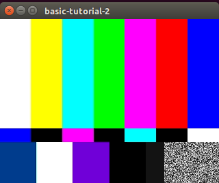
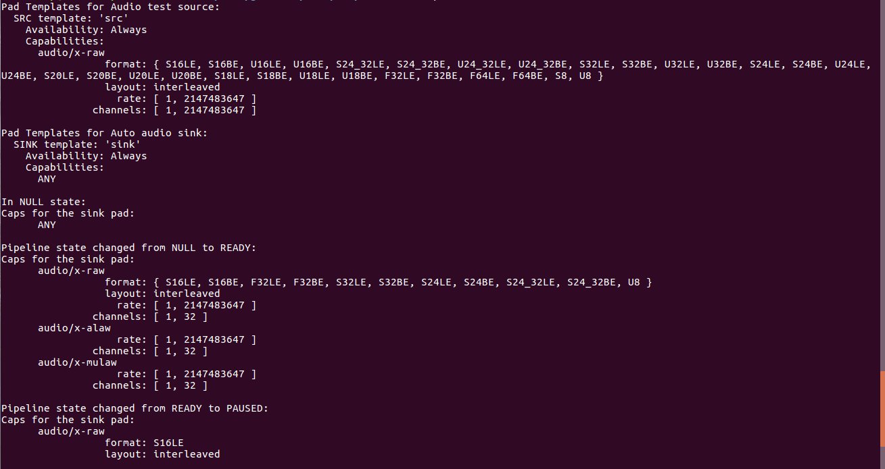

# GStreamer

GStreamer是基于插件（有些插件中提供了各种多媒体数字信号编解码器，也有些提供了其他的功能，所有的插件都能够被连接到任意的已经定义了数据的流管道中）可复用易扩展，功能强大，跨平台的处理多媒体流的框架。

GStreamer-1.0 框架架构：



框架大致包含了**应用层接口**、**主核心框架**以及**扩展插件**三个部分。

应用层接口主要是给各类应用程序提供接口如：多媒体播放器、流媒体服务器、视频编辑器等；接口的形式多样化，可以是信号、回调函数、函数调用等。

主核心框架就是流媒体的实际运行框架，其包含了媒体处理、内部消息处理、数据的网络传输、以及插件系统实现的功能等；主核心框架又包含了一系列的子模块称之为element，每个element完成一项单一的功能，通过Pipeline把其串联起来实现一条媒体流的实现。

扩展插件还是以主核心框架为基础，提供一些额外的服务，如：协议的组件、部分格式编解码的实现、以及第三方的一些Utility。核心框架会提供一些虚化的接口给各类插件，各类插件只需按照规则实现那些虚化的接口，核心框架就会具有相应的能力（类似父类和子类的关系）。

以Gstreamer为核心，构造了一套关于流媒体实时视频的获取、存储、转发综合方案，并实现了数据获取与转发相分离、支持多协议并发输出、低延迟、高可靠等特性。



## 元件（Element）

元件是一个有特殊函数接口的类，有些元件的函数接口用于读取文件的数据，有些用于解码数据，有些元件的函数接口只是输出相应的数据到具体的设备。

可以将若干元件连接到一起，创建一个管道（Pipeline）来完成一个特定的任务，如视频播放/转发/存储或视频录音（剔除视频流，而只保存音频流）等。

### 元件类型

#### source

##### filesrc

从文件的任意位置读取数据流。

- location属性指定文件所在位置；
- blocksize属性指定每个缓冲区每次读取的字节数；

##### rtspsrc

通过SDP（Session Description Protocal，会话描述协议）建立与IPC（Information Processing Center，信息处理中心，一般指RTSP Server）的RTSP Session连接，接收RTP  stream，然后不做任何处理直接将RTP packet通过PUSH模式传送给下游模块。

只能接收`application/x-rtp`和`application/x-rdt`类型的数据。

###### Element Properties

- protocols：选择低层的传输协议：

  ```shell
  Default: 0x00000007, "tcp+udp-mcast+udp"
  (0x00000000): unknown          - GST_RTSP_LOWER_TRANS_UNKNOWN
  (0x00000001): udp              - GST_RTSP_LOWER_TRANS_UDP
  (0x00000002): udp-mcast        - GST_RTSP_LOWER_TRANS_UDP_MCAST
  (0x00000004): tcp              - GST_RTSP_LOWER_TRANS_TCP
  (0x00000010): http             - GST_RTSP_LOWER_TRANS_HTTP
  (0x00000020): tls              - GST_RTSP_LOWER_TRANS_TLS
  ```

- retry：是否支持丢包重传机制：

  ```shell
  Max number of retries when allocating RTP ports.
  flags: readable, writable
  Unsigned Integer. Range: 0 - 65535 Default: 20
  ```

- 

###### Element Signals

- ‘on-sdp’：一旦接收到SDP消息，就发送该信号，调用绑定的自定义函数；

  ```c
  void user_function (GstElement* object,
                      GstSDPMessage* arg0,
                      gpointer user_data);
  ```

- ‘handle-request’：让应用层处理IPC的request和response；

  ```c
  void user_function (GstElement* object,
                      gpointer arg0,
                      gpointer arg1,
                      gpointer user_data);
  ```

- ‘select-stream’：每次GStreamer对接收到的stream设定Caps时，就发送该信号，调用绑定的自定义函数；

  ```c
  gboolean user_function (GstElement* object,
                          guint arg0,
                          GstCaps* arg1,
                          gpointer user_data);
  ```

  

##### v4l2src

从Video4Linux2 设备中读取帧（试验了一下可以从电脑自带的摄像头中读取数据）。

##### appsrc

作为管道的入口，允许将应用程序缓冲区的内容传送到管道中。

###### Pad Templates

```shell
Pad Templates:
  SRC template: 'src'
    Availability: Always
    Capabilities:
      ANY
```

###### Element Properties

```shell
3.2.1  Appsrc

模块功能：做为Pipeline的开始节点，允许应用程序往Pipeline“喂送”数据。

 

模块控制参数：

block: 每块推送buffer块的最大字节；

current-level-bytes：当前队列的大小；

is-live：当前推送的是否直播数据；

max-bytes：缓存队列的最大容量；

max-latency：流数据在该模块的最大延迟时间；

min-latency：流数据在该模块的最小延迟时间；该值设为-1表示无延时发送。

min-percent：设定队列缓存数据的比例，当缓存数据小于该值时appsrc向pipeline发出“need data”信号；

size：流媒体数据的字节数，一般用-1表示未知；

stream-type：流媒体类型，GST_APP_STREAM_TYPE_STREAM表示实时数据不支持seeking操作；

 

注册的信号：

“need data”：每当appsrc的Buffer需要数据时，该信号会被抛出，回调函数被触发；

“enough data”：每当appsrc的buffer即将溢出时，该信号会被抛出，回调函数被触发；

 

注册的接口：

“push buffer”: 应用程序需要往往appsrc喂数据，该接口可以被调用；
```

##### splitmuxsrc

用于读取由splitmuxsink创建的一系列文件。

###### Pad Templates

```shell
Pad Templates:
  SRC template: 'video'
    Availability: Sometimes
    Capabilities:
      ANY

  SRC template: 'audio_%u'
    Availability: Sometimes
    Capabilities:
      ANY

  SRC template: 'subtitle_%u'
    Availability: Sometimes
    Capabilities:
      ANY
```

###### Element Properties

| name     | desc                                                         |
| -------- | ------------------------------------------------------------ |
| location | 要读取的文件的绝对地址，如file:///tmp/record/1556512099.mkv<br/>flags: readable, writable<br/>String. Default: null |

#### encoder

给媒体流按指定格式编码。

##### x264enc

将无编码的原始二进制文件编码成H264格式的视频文件。

###### Pad Templates

```shell
Pad Templates:
  SINK template: 'sink'
    Availability: Always
    Capabilities:
      video/x-raw
                 format: { I420, YV12, Y42B, Y444, NV12, I420_10LE, I422_10LE, Y444_10LE }
              framerate: [ 0/1, 2147483647/1 ]
                  width: [ 16, 2147483647 ]
                 height: [ 16, 2147483647 ]

  SRC template: 'src'
    Availability: Always
    Capabilities:
      video/x-h264
              framerate: [ 0/1, 2147483647/1 ]
                  width: [ 1, 2147483647 ]
                 height: [ 1, 2147483647 ]
          stream-format: { avc, byte-stream }
              alignment: au
                profile: { high-4:4:4, high-4:2:2, high-10, high, main, baseline, constrained-baseline, high-4:4:4-intra, high-4:2:2-intra, high-10-intra }
```

###### Element Properties

| name | decs                                                         |
| ---- | ------------------------------------------------------------ |
| tune | Preset name for non-psychovisual tuning options<br/>flags: readable, writable<br/>
Flags "GstX264EncTune" Default: 0x00000000, "(none)"</br>
           (0x00000001): stillimage       - Still image<br/>
           (0x00000002): fastdecode       - Fast decode<br/>
           (0x00000004): zerolatency      - Zero latency |


#### filter

从输入的数据流中剥离出符合需求的几路数据并输出。


##### decodebin

自动填充和解码原始媒体文件。

可以输入任意类型的数据，也可以输出任意类型的数据。

##### mp4mux

将音频和视频并入一个MP4文件中（Multiplex audio and video into a MP4 file）。

- name属性指定对象名称，默认为“mp4mux0"；

##### textoverlay

向视频缓冲区的顶部添加文本信息（就是在视频上面加文字）。

#### sink

##### filesink

将数据流保存为一个文件。

- location属性设置保存位置和文件名；

##### autovideosink

封装`video sink`以自动探测`video`。

##### xvimagesink

基于videosink的Xv？

##### appsink

允许应用程序访问原始缓冲器（raw buffer）。

```shell
Pad Templates:
  SINK template: 'sink'
    Availability: Always
    Capabilities:
      ANY
```

##### glimagesink

###### Pad Templates

```shell
Pad Templates:
  SINK template: 'sink'
    Availability: Always
    Capabilities:
      video/x-raw(memory:GLMemory, meta:GstVideoOverlayComposition)
                 format: { RGBA, BGRA, RGBx, BGRx, ARGB, ABGR, xRGB, xBGR, RGB, BGR, RGB16, BGR16, AYUV, I420, YV12, NV12, NV21, YUY2, UYVY, Y41B, Y42B, Y444, GRAY8, GRAY16_LE, GRAY16_BE }
                  width: [ 1, 2147483647 ]
                 height: [ 1, 2147483647 ]
              framerate: [ 0/1, 2147483647/1 ]
      video/x-raw(memory:EGLImage, meta:GstVideoOverlayComposition)
                 format: RGBA
                  width: [ 1, 2147483647 ]
                 height: [ 1, 2147483647 ]
              framerate: [ 0/1, 2147483647/1 ]
      video/x-raw(memory:SystemMemory, meta:GstVideoOverlayComposition)
                 format: { RGBA, BGRA, RGBx, BGRx, ARGB, ABGR, xRGB, xBGR, RGB, BGR, RGB16, BGR16, AYUV, I420, YV12, NV12, NV21, YUY2, UYVY, Y41B, Y42B, Y444, GRAY8, GRAY16_LE, GRAY16_BE }
                  width: [ 1, 2147483647 ]
                 height: [ 1, 2147483647 ]
              framerate: [ 0/1, 2147483647/1 ]
      video/x-raw(meta:GstVideoGLTextureUploadMeta, meta:GstVideoOverlayComposition)
                 format: RGBA
                  width: [ 1, 2147483647 ]
                 height: [ 1, 2147483647 ]
              framerate: [ 0/1, 2147483647/1 ]
      video/x-raw(memory:GLMemory)
                 format: { RGBA, BGRA, RGBx, BGRx, ARGB, ABGR, xRGB, xBGR, RGB, BGR, RGB16, BGR16, AYUV, I420, YV12, NV12, NV21, YUY2, UYVY, Y41B, Y42B, Y444, GRAY8, GRAY16_LE, GRAY16_BE }
                  width: [ 1, 2147483647 ]
                 height: [ 1, 2147483647 ]
              framerate: [ 0/1, 2147483647/1 ]
      video/x-raw(memory:EGLImage)
                 format: RGBA
                  width: [ 1, 2147483647 ]
                 height: [ 1, 2147483647 ]
              framerate: [ 0/1, 2147483647/1 ]
      video/x-raw
                 format: { RGBA, BGRA, RGBx, BGRx, ARGB, ABGR, xRGB, xBGR, RGB, BGR, RGB16, BGR16, AYUV, I420, YV12, NV12, NV21, YUY2, UYVY, Y41B, Y42B, Y444, GRAY8, GRAY16_LE, GRAY16_BE }
                  width: [ 1, 2147483647 ]
                 height: [ 1, 2147483647 ]
              framerate: [ 0/1, 2147483647/1 ]
      video/x-raw(meta:GstVideoGLTextureUploadMeta)
                 format: RGBA
                  width: [ 1, 2147483647 ]
                 height: [ 1, 2147483647 ]
              framerate: [ 0/1, 2147483647/1 ]
```

##### rtmpsink

###### Pad Templates

```shell
Pad Templates:
  SINK template: 'sink'
    Availability: Always
    Capabilities:
      video/x-flv
```

###### Element Properties

| name     | desc                                                         |
| -------- | ------------------------------------------------------------ |
| location | RTMP url(`rtmp://ip_addr:port/path`)<br/>flags: readable, writable<br/>String. Default: null |

##### splitmuxsink

是一个包含（）的bin，用于将输入流按时间/大小分块输出（mux，复用）到多个文件中。

###### Pad Templates

```shell
Pad Templates:
  SINK template: 'subtitle_%u'
    Availability: On request
      Has request_new_pad() function: gst_splitmux_sink_request_new_pad
    Capabilities:
      ANY

  SINK template: 'audio_%u'
    Availability: On request
      Has request_new_pad() function: gst_splitmux_sink_request_new_pad
    Capabilities:
      ANY

  SINK template: 'video'
    Availability: On request
      Has request_new_pad() function: gst_splitmux_sink_request_new_pad
    Capabilities:
      ANY
```

###### Element Properties

| name          | desc                                                         |
| ------------- | ------------------------------------------------------------ |
| max-size-time | 非0时表示按时间分段存储到文件中，每段跨越的时间长度，单位为ns。<br/>flags: readable, writable<br/>
Unsigned Integer64. Range: 0 - 18446744073709551615 Default: 0 |
| muxer         | 指定使用的muxer，默认是mp4mux，即文件输出格式为mp4。<br/>flags: readable, writable<br/>Object of type "GstElement" |

###### Element Signals

| signal          | desc                                                         |
| --------------- | ------------------------------------------------------------ |
| format-location | 当确定好输出格式之后，返回输出文件的地址<br/>gchararray user_function (GstElement* object,<br/>                                                 guint arg0,<br/>
                                                 gpointer user_data); |


#### plugin

##### rtph264depay

接收RTP包，并遵循RFC 3984规范从RTP包中抽取`H264`视频。

###### Pad Templates

```shell
Pad Templates:
  SINK template: 'sink'
    Availability: Always
    Capabilities:
      application/x-rtp
                  media: video
             clock-rate: 90000
          encoding-name: H264

  SRC template: 'src'
    Availability: Always
    Capabilities:
      video/x-h264
          stream-format: avc
              alignment: au
      video/x-h264
          stream-format: byte-stream
              alignment: { nal, au }
```

##### mpegtsmux

将多路媒体流合并为MPEG传输流。

###### Pad Templates

```shell
Pad Templates:
  SINK template: 'sink_%d'
    Availability: On request
      Has request_new_pad() function: 0x7fa3a290d980
    Capabilities:
      video/mpeg
                 parsed: true
            mpegversion: { 1, 2, 4 }
           systemstream: false
      video/x-dirac
      video/x-h264
          stream-format: byte-stream
              alignment: { au, nal }
      video/x-h265
          stream-format: byte-stream
              alignment: { au, nal }
      audio/mpeg
                 parsed: true
            mpegversion: { 1, 2 }
      audio/mpeg
                 framed: true
            mpegversion: 4
          stream-format: adts
      audio/mpeg
            mpegversion: 4
          stream-format: raw
      audio/x-lpcm
                  width: { 16, 20, 24 }
                   rate: { 48000, 96000 }
               channels: [ 1, 8 ]
          dynamic_range: [ 0, 255 ]
               emphasis: { false, true }
                   mute: { false, true }
      audio/x-ac3
                 framed: true
      audio/x-dts
                 framed: true
      audio/x-opus
               channels: [ 1, 8 ]
        channel-mapping-family: { 0, 1 }
      subpicture/x-dvb
      application/x-teletext
      meta/x-klv
                 parsed: true

  SRC template: 'src'
    Availability: Always
    Capabilities:
      video/mpegts
           systemstream: true
             packetsize: { 188, 192 }
```

###### Element Properties


| name      | desc                                                         |
| --------- | ------------------------------------------------------------ |
| m2ts-mode | Set to TRUE to output Blu-Ray disc format with 192 byte packets. FALSE for standard TS format with 188 byte packets.<br/>flags: readable, writable<br/>Boolean. Default: false |
##### tsdemux

mpegtsmux的逆操作，把ts包恢复成mpeg2格式。

###### Pad Templates

```shell
Pad Templates:
  SINK template: 'sink'
    Availability: Always
    Capabilities:
      video/mpegts
           systemstream: true

  SRC template: 'video_%04x'
    Availability: Sometimes
    Capabilities:
      video/mpeg
            mpegversion: { 1, 2, 4 }
           systemstream: false
      video/x-h264
          stream-format: byte-stream
              alignment: nal
      video/x-h265
          stream-format: byte-stream
              alignment: nal
      video/x-dirac
      video/x-cavs
      video/x-wmv
             wmvversion: 3
                 format: WVC1

  SRC template: 'audio_%04x'
    Availability: Sometimes
    Capabilities:
      audio/mpeg
            mpegversion: 1
      audio/mpeg
            mpegversion: 2
          stream-format: adts
      audio/mpeg
            mpegversion: 4
          stream-format: loas
      audio/x-lpcm
                  width: { 16, 20, 24 }
                   rate: { 48000, 96000 }
               channels: [ 1, 8 ]
          dynamic_range: [ 0, 255 ]
               emphasis: { false, true }
                   mute: { false, true }
      audio/x-ac3
      audio/x-eac3
      audio/x-dts
      audio/x-opus
      audio/x-private-ts-lpcm

  SRC template: 'subpicture_%04x'
    Availability: Sometimes
    Capabilities:
      subpicture/x-pgs
      subpicture/x-dvd
      subpicture/x-dvb

  SRC template: 'private_%04x'
    Availability: Sometimes
    Capabilities:
      ANY
```

##### h264parse

解析H.264流。

###### Pad Templates

```shell
Pad Templates:
  SINK template: 'sink'
    Availability: Always
    Capabilities:
      video/x-h264

  SRC template: 'src'
    Availability: Always
    Capabilities:
      video/x-h264
                 parsed: true
          stream-format: { avc, avc3, byte-stream }
              alignment: { au, nal }
```

###### Element Properties

- disable_passthrough: 
  - 为True表示强制按照H.264规范解析输入数据，主要是针对一些不被信任的输入数据；
  - 为False表示根据标准行为去解析或不解析输入数据，一般选择False；
- config-interval:发送PPS,SPS的时间间隔（SPS会被复用在数据流中）；

##### rtph264pay

把H.264视频编码进RTP包中（遵循RFC3984）。

###### Pad Templates

```shell
Pad Templates:
  SINK template: 'sink'
    Availability: Always
    Capabilities:
      video/x-h264
          stream-format: avc
              alignment: au
      video/x-h264
          stream-format: byte-stream
              alignment: { nal, au }

  SRC template: 'src'
    Availability: Always
    Capabilities:
      application/x-rtp
                  media: video
                payload: [ 96, 127 ]
             clock-rate: 90000
          encoding-name: H264
```

##### rtpbin

RTP bin。模块功能：rtpsession + rtpjitterbuffer + rtprtxsend + rtprtxreceive。

rtpsession:建立rtp session 并分配SSRC，接收发送RTP包，调度发送接收RTCP包，实现了RFC3550；以上行为需要基于RTSP Session的协商结果。

rtpjitterbuffer：缓存数据流，根据配置等待需要重传的RTP包，并及时察觉未收到的RTP包触发rtpsession发送FBNACK(RFC4585),发送重传事件给 rptreceive；

rtprtxsend：按照配置保存一定量的RTP包，收到rtpsession的重传指示，查找目标RTP包按照RFC4588的规范重新发送；

rtprtxreceive：根据从rtpjitterbuffer接受到的重传指示，按照RFC4588的要求，把重传流的SSRC2映射到主数据流SSRC1(RFC 4588)，把数据包交给下游的rtpjitterbuffer。

##### avdec_h264

H.264解码器，将H264格式的流解码成各种格式的原始流。

###### PadTemplates

```shell
Pad Templates:
  SRC template: 'src'
    Availability: Always
    Capabilities:
      video/x-raw
                 format: { I420, YUY2, RGB, BGR, Y42B, Y444, YUV9, Y41B, GRAY8, RGB8P, I420, Y42B, Y444, UYVY, NV12, NV21, ARGB, RGBA, ABGR, BGRA, GRAY16_BE, GRAY16_LE, A420, RGB16, RGB15, I420_10BE, I420_10LE, I422_10BE, I422_10LE, Y444_10BE, Y444_10LE, GBR, GBR_10BE, GBR_10LE, A420_10BE, A420_10LE, A422_10BE, A422_10LE, A444_10BE, A444_10LE }

  SINK template: 'sink'
    Availability: Always
    Capabilities:
      video/x-h264
              alignment: au
          stream-format: { avc, byte-stream }

```

##### flvmux

将一些指定格式的音/视频流转化为flv格式的视频流。

###### Pad Templates

```shell
Pad Templates:
  SINK template: 'video'
    Availability: On request
      Has request_new_pad() function: gst_flv_mux_request_new_pad
    Capabilities:
      video/x-flash-video
      video/x-flash-screen
      video/x-vp6-flash
      video/x-vp6-alpha
      video/x-h264
          stream-format: avc

  SINK template: 'audio'
    Availability: On request
      Has request_new_pad() function: gst_flv_mux_request_new_pad
    Capabilities:
      audio/x-adpcm
                 layout: swf
               channels: { 1, 2 }
                   rate: { 5512, 11025, 22050, 44100 }
      audio/mpeg
            mpegversion: 1
                  layer: 3
               channels: { 1, 2 }
                   rate: { 5512, 8000, 11025, 22050, 44100 }
                 parsed: true
      audio/mpeg
            mpegversion: { 4, 2 }
          stream-format: raw
      audio/x-nellymoser
               channels: { 1, 2 }
                   rate: { 5512, 8000, 11025, 16000, 22050, 44100 }
      audio/x-raw
                 format: { U8, S16LE }
                 layout: interleaved
               channels: { 1, 2 }
                   rate: { 5512, 11025, 22050, 44100 }
      audio/x-alaw
               channels: { 1, 2 }
                   rate: { 5512, 11025, 22050, 44100 }
      audio/x-mulaw
               channels: { 1, 2 }
                   rate: { 5512, 11025, 22050, 44100 }
      audio/x-speex
               channels: 1
                   rate: 16000

  SRC template: 'src'
    Availability: Always
    Capabilities:
      video/x-flv
```


### 元件状态

- GST_STATE_NULL：空状态；在元件刚初始化时，元件不会被分配任何资源；而在元件由其他状态转为该状态时，即元件已持有资源时，则所占用的资源都将被回收；
- GST_STATE_READY：就绪状态；在该状态下，元件会得到所需的所有资源，这些全局资源将被通过该元件的数据流所使用；
- GST_STATE_PLAYING：播放态；在该状态下，元件将开始工作；
- GST_STATE_PAUSED：暂停态；在该状态下，元件已经开始对流开始了处理，但此刻将暂停处理。

可通过`get_element_set_state(state)`来改变一个元件的状态，但不能跨状态迁移，即只能在相邻的状态之间迁移。

## 衬垫（Pad）

衬垫是元件对外的接口，可以看作是一个元件的插座或者端口。

衬垫用于连接元件，让数据从源元件（的源衬垫，source pad）流向接收元件（的接收衬垫， sink pad）。

衬垫的功能（Pad Capabilities，即Pad Caps）决定了一个元件所能处理的媒体类型。



## 队列（Queue）

队列可以看作是一种使线程间数据容量线程安全的方法，同时也可以当作一种缓冲区, 可以设置元件的阀值上下限,如果数据低于阀值的下限(:断开线程 ,输出将会被禁止;如果数据高于上限,输入将会被禁止或者数据将被丢弃。

## 箱柜（Bin）

箱柜是一种特殊的元件，用来作为装载元件的容器，可以通过改变一个箱柜的状态来改变箱柜里所有元件的状态（组合模式）。

箱柜可以发送总线消息给它的子元件（这些消息包括ERROR，TAG，EOS）。

## 管道（Pipeline）

管道是一种有自己的总线和时钟的高级箱柜。管道是一个容器，你可以将任意其他的对象放入其中，并且可以操作包含在它内部的所有元件。

当你设定管道为运行状态时，数据流将开始流动，并且开始处理媒体数据流，一旦开始，**管道将在一个单独的线程中运行**，直到被暂停或被迫停止，或者数据流播放完毕。

## 总线（Bus）

总线是一个简单的系统，它采用自己的线程机制将一个管道线程的消息分发到一个应用程序中。

一个管道包含一个总线，应用程序在总线上设置一个消息处理器。主循环运行的时候，总线会轮询这个消息处理器是否有新的消息，当消息被采集到之后，总线将调用相应的回调函数来完成任务。

### 消息类型

- ERROR：有致命错误发生的时候发送该消息；
- EOF：数据流结束的时候发送该消息；
- 状态转换：当状态成功转换的时候发送该消息；
- 缓冲：当缓冲网络数据流的时候发送该消息；

## 安装GStreamer-1.0（Ubuntu 16.04LTS）

```shell
# 安装GStreamer 1.0
$ sudo apt-get install libgstreamer1.0-0 gstreamer1.0-plugins-base gstreamer1.0-plugins-good gstreamer1.0-plugins-bad gstreamer1.0-plugins-ugly gstreamer1.0-libav gstreamer1.0-doc gstreamer1.0-tools
```

使用官方Demo：

> basic-tutorial-1.c

```c
#include <gst/gst.h>
 
int main(int argc, char *argv[]) {
  GstElement *pipeline;
  GstBus *bus;
  GstMessage *msg;
 
  /* Initialize GStreamer */
  gst_init (&argc, &argv);
 
  /* Build the pipeline */
  pipeline = gst_parse_launch ("playbin uri=https://www.freedesktop.org/software/gstreamer-sdk/data/media/sintel_trailer-480p.webm", NULL);
 
  /* Start playing */
  gst_element_set_state (pipeline, GST_STATE_PLAYING);
 
  /* Wait until error or EOS */
  bus = gst_element_get_bus (pipeline);
  msg = gst_bus_timed_pop_filtered (bus, GST_CLOCK_TIME_NONE, GST_MESSAGE_ERROR | GST_MESSAGE_EOS);
 
  /* Free resources */
  if (msg != NULL)
    gst_message_unref (msg);
  gst_object_unref (bus);
  gst_element_set_state (pipeline, GST_STATE_NULL);
  gst_object_unref (pipeline);
  return 0;
}
```

编译：

```shell
gcc basic-tutorial-1.c -o basic-tutorial-1 `pkg-config --cflags --libs gstreamer-1.0`
```

结果：


### 代码讲解

1. gst_init() 是所有GStreamer应用的第一步，用来：

   - 初始化所有数据结构；
   - 检查所有可用插件；
   - 运行所有的命令行选项。

2. gst_parse_launch() 本身是用来描述一个管道的，但是也可以很方便地建立一个管道；

   - 上面的代码建立了一个只包含pipeline2元件的管道；

   - playbin2 是一个特殊的元件，既是source也是一个sink，同时也能处理整个pipeline的事务。
   - 控制粒度上不如手工搭建的方式，但也有一定的可定制性；

3. gst_element_set_state() 用来设置元件的状态：

   - 每个元件都有4种状态：
     - GST_STATE_NULL：初始状态，处于该状态的元件所占用的所有资源都将被回收；
     - GST_STATE_READY：就绪状态，处于该状态的元件将会得到所需的全局资源，这些全局资源将被通过该元件的数据流所使用；
     - GST_STATE_PAUSED：暂停状态，处于该状态的元件已经对流开始了处理，只是此刻在暂停了处理；
     - GST_STATE_PLAYING：播放状态，元件开始工作的状态；
   - 状态之前不能跨态越迁，只能在相邻的状态之前进行变换。

4. gst_element_get_bus() 获得指定管道的总线；

5. gst_bus_timed_pop_filtered() 探测总线，并阻塞当前线程，直到遇到一个错误或者流播放结束（EOS）；

6. gst_message_unref() 释放message；

7. gst_object_unref() 释放引用。

`注：在你使用了一个函数之后，一定要记得查阅文档来确定是否需要释放资源！！！`

## GStreamer工具[gstreamer1.0-tools]（无代码）

### [gst-luanch-1.0](https://gstreamer.freedesktop.org/documentation/tools/gst-launch.html)

该工具接收管道的文本描述来实例化一个管道，并且将它设置为PLAYING状态。开发者可以使用该工具在正式开发之前，快速地检查给定的管道是否能正常工作。

需要注意的是，该工具只能辅助创建简单类型的管道！只能在特定层级上模拟管道和应用的交互。

该工具仅仅作为调试工具辅助开发，并不能基于它来创建应用。然而，使用gst_parse_launch()方法却可以从管道的文本描述来实例化一个管道供开发使用。

#### elements

管道的文本描述是一系列用`!`分隔的元件类型（用来表示该类型的元件）：

```shell
$ gst-inspect-1.0 videotestsrc ! videoconvert ! autovideosink
```

创建上述的三种元件，并按照从左到右的顺序进行连接。

#### properties

在元件的后面添加`property=value`可以设置元件的属性，使用空格` `来分隔多个属性：

```shell
$ gst-launch-1.0 videotestsrc pattern=11 ! videoconvert ! autovideosink
```

pattern属性用来指定videotestsrc元件的模式，GStreamer提供了25种视频源。

#### Named elements

可以使用name属性来创建包含分支（branches）的复杂管道。有了名字，就可以使用前面创建的元件，这在使用有多个pad的元件（比如demuxer或者tee等）时是必不可少的。

带名字的元件在使用名字时需要在后面加一个`.`。

```shell
$ gst-launch-1.0 videotestsrc pattern=0 ! videoconvert ! tee name=t ! queue ! autovideosink t. ! queue ! autovideosink
```



最终你会看到两个pattern一样的重叠窗口。

上述命令把videotestsrc先连接了videoconvert，然后连接了tee（在《[GStreamer基础教程07——多线程和pad的有效性](http://blog.csdn.net/sakulafly/article/details/21318313)》里提到过），这个tee就使用`name`属性被命名成‘t’，然后一路输出到queue以及autovideosink，另一路输出到另一个queue和autovideosink。

#### Pads

我们可以自己指定pads来连接元件。通过在有名字的元件后面使用`元件名.pad_name`来为元件指定pad：

```shell
$ gst-launch-1.0 souphttpsrc location=https://www.freedesktop.org/software/gstreamer-sdk/data/media/sintel_trailer-480p.webm ! matroskademux name=d d.video_00 ! matroskamux ! filesink location=sintel_video.mkv
```

上述命令使用souphttpsrc元件从网络上拉取了一个webm类型（包含视频和音频）的媒体文件，然后使用matroskademux接收这个媒体流，并创建两个输出pad，命名为video_00和audio_00。我们将video_00连接到matroskamux元件上，来将该视频流重新包装为一个新的容器，最终将它连接到一个filesink上，filesink元件会将该视频流输出到一个名为sintel_video.mkv的文件中。

如果想剔除媒体流的视频部分而只保留音频部分，可以使用如下命令：

```shell
$ gst-launch-1.0 souphttpsrc location=https://www.freedesktop.org/software/gstreamer-sdk/data/media/sintel_trailer-480p.webm ! matroskademux name=d d.audio_00 ! vorbisparse ! matroskamux ! filesink location=sintel_audio.mka
```

vorbisparse元件用来提取输入流的一些信息，以便让matroskamux元件知道如何处理这个数据流。这个处理在抓取视频的时候是不用做的，因为matroskademux已经做了这件事情。

#### Caps filters

当一个元件有多个输出pad时，那么对于下一个元件来说，选择哪一个pad来作为输入是不确定的。在这种情况下，GStreamer会选择第一个匹配的pad进行连接。

如果希望指定连接的pad，可以命名pad（named pads）或者使用Caps Filter：

```shell
$ gst-launch-1.0 souphttpsrc location=https://www.freedesktop.org/software/gstreamer-sdk/data/media/sintel_trailer-480p.webm ! matroskademux ! video/x-vp8 ! matroskamux ! filesink location=sintel_video.mkv
```

Caps Filter就像一个不做任何动作，仅仅接受给出的Caps的元件。在这个例子中，在matroskademux和matroskamux中间我们加入了一个**video/x-vp8**的Caps Filter，这样就表明在matroskademux中我们仅仅需要能生成这种类型视频的输出Pad。

### [gst-inspect-1.0](https://gstreamer.freedesktop.org/documentation/tools/gst-inspect.html)

#### 不指定参数

列出所有的元件类型，你可以使用这些元件类型来创建新的元件：

```shell
$ gst-inspect-1.0

# 如查询所有源元件类型
$ gst-inspect-1.0 | grep src
```

#### 指定元件名作为参数

列出有关该元件的所有信息：

```shell
$ gst-inspect-1.0 souphttpsrc
```

#### 指定文件名作为参数

将这个文件看作是一个GStreamer插件，尝试打开它，并且列出里面所有的元素；

```shell
$ gst-inspect-1.0 ~/gst-plugins-base/ext/pango
```

最关键的部分：

- Pad Templates：展示元件可以持有的所有衬垫类型以及它们的功能，你可以据此确认是否和另一个元件连接；
- Element Properties：元件的所有属性，包括它们的类型和可以选择的值。

### [gst-discover-1.0]()

接受一个URI，然后打印出所有GStreamer可以从中提取的媒体信息。查看media文件是如何编码如何复用（如何合并各种数据流）的,以此来确定把什么element放到pipeline里面。

```shell
$ gst-discoverer-1.0 https://www.freedesktop.org/software/gstreamer-sdk/data/media/sintel_trailer-480p.webm -v
```

使用`gst-discoverer-1.0 --help`获得可选项。

[Basic tutorial 9: Media information gathering](https://gstreamer.freedesktop.org/documentation/tutorials/basic/media-information-gathering.html)中的GstDiscover对象封装了该工具。

## 手动构建一个管道

> basic-tutorial-2.c

```c
#include <gst/gst.h>

int main(int argc, char *argv[]) {
  GstElement *pipeline, *source, *sink;
  GstBus *bus;
  GstMessage *msg;
  GstStateChangeReturn ret;

  /* Initialize GStreamer */
  gst_init (&argc, &argv);

  /* Create the elements */
  source = gst_element_factory_make ("videotestsrc", "source");
  sink = gst_element_factory_make ("autovideosink", "sink");

  /* Create the empty pipeline */
  pipeline = gst_pipeline_new ("test-pipeline");

  if (!pipeline || !source || !sink) {
    g_printerr ("Not all elements could be created.\n");
    return -1;
  }

  /* Build the pipeline */
  gst_bin_add_many (GST_BIN (pipeline), source, sink, NULL);
  if (gst_element_link (source, sink) != TRUE) {
    g_printerr ("Elements could not be linked.\n");
    gst_object_unref (pipeline);
    return -1;
  }

  /* Modify the source's properties */
  g_object_set (source, "pattern", 0, NULL);

  /* Start playing */
  ret = gst_element_set_state (pipeline, GST_STATE_PLAYING);
  if (ret == GST_STATE_CHANGE_FAILURE) {
    g_printerr ("Unable to set the pipeline to the playing state.\n");
    gst_object_unref (pipeline);
    return -1;
  }

  /* Wait until error or EOS */
  bus = gst_element_get_bus (pipeline);
  msg = gst_bus_timed_pop_filtered (bus, GST_CLOCK_TIME_NONE, GST_MESSAGE_ERROR | GST_MESSAGE_EOS);

  /* Parse message */
  if (msg != NULL) {
    GError *err;
    gchar *debug_info;

    switch (GST_MESSAGE_TYPE (msg)) {
      case GST_MESSAGE_ERROR:
        gst_message_parse_error (msg, &err, &debug_info);
        g_printerr ("Error received from element %s: %s\n", GST_OBJECT_NAME (msg->src), err->message);
        g_printerr ("Debugging information: %s\n", debug_info ? debug_info : "none");
        g_clear_error (&err);
        g_free (debug_info);
        break;
      case GST_MESSAGE_EOS:
        g_print ("End-Of-Stream reached.\n");
        break;
      default:
        /* We should not reach here because we only asked for ERRORs and EOS */
        g_printerr ("Unexpected message received.\n");
        break;
    }
    gst_message_unref (msg);
  }

  /* Free resources */
  gst_object_unref (bus);
  gst_element_set_state (pipeline, GST_STATE_NULL);
  gst_object_unref (pipeline);
  return 0;
}
```

编译：

```shell
gcc basic-tutorial-2.c -o basic-tutorial-2 `pkg-config --cflags --libs gstreamer-1.0`
```

结果：



### 代码讲解：

1. gst_element_factory_make() 用来自定义一个元件：

   - 第一个参数为要创建的元件类型：

     - videotestsrc是一个source element（生产数据），会创建一个video模式，通常用在调试中，很少用于实际的应用；

     - autovideosink是一个sink element（消费数据），会在窗口显示收到的图像；

       `可以使用gst-inspect工具查询可以创建的元件类型和属性范围。`

   - 第二个参数为要创建的元件的名字，方便调试，如果传入的参数为NULL，则GStreamer默认生成一个名字。

2. gst_pipeline_new()用来创建按一个新的管道，可指定管道名；

3. gst_bin_add_many()用来将多个元件添加到指定的管道中：

   - 所有的元件都必须在使用之前包含到管道中；
   - 因为管道本身就是一个特定类型的包含其他元件的bin，因此，所有可以用在bin上的方法也都可以用来管道上，前提是使用GST_BIN()将管道映射为一个bin；
   - 可以使用gst_bin_add()方法来向管道中添加单个元件。

4. gst_element_link()用来将添加进管道的元件连接起来：

   - 第一个参数为源（source element），用来生产数据;

   - 第二个参数为目标（sink element），用来消费数据；

   - 参数的位置确定了数据的流向，不能搞错！

     并且只有在同一个bin里面的元件才能连接起来，所以一定要在连接之前将元件加入到管道中。

5. g_object_set()用来设置元件的属性：

   - 元件的属性分为只读属性和可写属性；
   - 只读的属性会显示元件的内部状态，可写的属性会影响元件的行为；
   - 使用g_object_get()获得属性，使用g_object_set()设置属性。

## 动态创建一个管道

衬垫（pads）在GSstreamer中被用于多个元件的链接，从而让数据流在这样的链接中流动。衬垫是元件对外的接口，可以被看作是一个元件的插座或者端口。元件之间的链接就是依靠衬垫实现的：数据流从一个元件的源衬垫（source pad）到另一个元件的接收衬垫（sink pad）。**衬垫的功能决定了一个元件所能处理的媒体类型**。

如下图所示，源元件只包含一个源衬垫，接收元件只包含一个接收衬垫，而过滤器（filter）则包含这两种衬垫。


在一个容器（文件源）中可能包含多个流（如一路视频流和一路音频流）。dumuxer元件是一种包含一个接收衬垫和多个源衬垫的特殊元件，可以将文件源中的多路数据流分离开来，然后从不同的输出口输出。


动态Hello World：	

> basic-tutorial-3.c

```c
#include <gst/gst.h>
  
/* Structure to contain all our information, so we can pass it to callbacks */
typedef struct _CustomData {
  GstElement *pipeline;
  GstElement *source;
  GstElement *convert;
  GstElement *sink;
} CustomData;
  
/* Handler for the pad-added signal */
static void pad_added_handler (GstElement *src, GstPad *pad, CustomData *data);
  
int main(int argc, char *argv[]) {
  CustomData data;
  GstBus *bus;
  GstMessage *msg;
  GstStateChangeReturn ret;
  gboolean terminate = FALSE;
  
  /* Initialize GStreamer */
  gst_init (&argc, &argv);
   
  /* Create the elements */
  data.source = gst_element_factory_make ("uridecodebin", "source");
  data.convert = gst_element_factory_make ("audioconvert", "convert");
  data.sink = gst_element_factory_make ("autoaudiosink", "sink");
  
  /* Create the empty pipeline */
  data.pipeline = gst_pipeline_new ("test-pipeline");
  
  if (!data.pipeline || !data.source || !data.convert || !data.sink) {
    g_printerr ("Not all elements could be created.\n");
    return -1;
  }
  
  /* Build the pipeline. 
   * Note that we are NOT linking the source at this point.  
   * We will do it later. */
  gst_bin_add_many (GST_BIN (data.pipeline), data.source, data.convert , data.sink, NULL);
  if (!gst_element_link (data.convert, data.sink)) {
    g_printerr ("Elements could not be linked.\n");
    gst_object_unref (data.pipeline);
    return -1;
  }
  
  /* Set the URI to play */
  g_object_set (data.source, "uri", "https://www.freedesktop.org/software/gstreamer-sdk/data/media/sintel_trailer-480p.webm", NULL);
  
  /* Connect to the pad-added signal */
  g_signal_connect 	(data.source, "pad-added", G_CALLBACK (pad_added_handler), &data);
  
  /* Start playing */
  ret = gst_element_set_state (data.pipeline, GST_STATE_PLAYING);
  if (ret == GST_STATE_CHANGE_FAILURE) {
    g_printerr ("Unable to set the pipeline to the playing state.\n");
    gst_object_unref (data.pipeline);
    return -1;
  }
  
  /* Listen to the bus */
  bus = gst_element_get_bus (data.pipeline);
  do {
    msg = gst_bus_timed_pop_filtered (bus, GST_CLOCK_TIME_NONE,
        GST_MESSAGE_STATE_CHANGED | GST_MESSAGE_ERROR | GST_MESSAGE_EOS);
  
    /* Parse message */
    if (msg != NULL) {
      GError *err;
      gchar *debug_info;
      
      switch (GST_MESSAGE_TYPE (msg)) {
        case GST_MESSAGE_ERROR:
          gst_message_parse_error (msg, &err, &debug_info);
          g_printerr ("Error received from element %s: %s\n", GST_OBJECT_NAME (msg->src), err->message);
          g_printerr ("Debugging information: %s\n", debug_info ? debug_info : "none");
          g_clear_error (&err);
          g_free (debug_info);
          terminate = TRUE;
          break;
        case GST_MESSAGE_EOS:
          g_print ("End-Of-Stream reached.\n");
          terminate = TRUE;
          break;
        case GST_MESSAGE_STATE_CHANGED:
          /* We are only interested in state-changed messages from the pipeline */
          if (GST_MESSAGE_SRC (msg) == GST_OBJECT (data.pipeline)) {
            GstState old_state, new_state, pending_state;
            gst_message_parse_state_changed (msg, &old_state, &new_state, &pending_state);
            g_print ("Pipeline state changed from %s to %s:\n",
                gst_element_state_get_name (old_state), gst_element_state_get_name (new_state));
          }
          break;
        default:
          /* We should not reach here */
          g_printerr ("Unexpected message received.\n");
          break;
      }
      gst_message_unref (msg);
    }
  } while (!terminate);
  
  /* Free resources */
  gst_object_unref (bus);
  gst_element_set_state (data.pipeline, GST_STATE_NULL);
  gst_object_unref (data.pipeline);
  return 0;
}
  
/* This function will be called by the pad-added signal */
static void pad_added_handler (GstElement *src, GstPad *new_pad, CustomData *data) {
  GstPad *sink_pad = gst_element_get_static_pad (data->convert, "sink");
  GstPadLinkReturn ret;
  GstCaps *new_pad_caps = NULL;
  GstStructure *new_pad_struct = NULL;
  const gchar *new_pad_type = NULL;
  
  g_print ("Received new pad '%s' from '%s':\n", GST_PAD_NAME (new_pad), GST_ELEMENT_NAME (src));
  
  /* If our converter is already linked, we have nothing to do here */
  if (gst_pad_is_linked (sink_pad)) {
    g_print ("  We are already linked. Ignoring.\n");
    goto exit;
  }
  
  /* Check the new pad's type */
  new_pad_caps = gst_pad_get_caps (new_pad);
  new_pad_struct = gst_caps_get_structure (new_pad_caps, 0);
  new_pad_type = gst_structure_get_name (new_pad_struct);
  if (!g_str_has_prefix (new_pad_type, "audio/x-raw")) {
    g_print ("  It has type '%s' which is not raw audio. Ignoring.\n", new_pad_type);
    goto exit;
  }
  
  /* Attempt the link */
  ret = gst_pad_link (new_pad, sink_pad);
  if (GST_PAD_LINK_FAILED (ret)) {
    g_print ("  Type is '%s' but link failed.\n", new_pad_type);
  } else {
    g_print ("  Link succeeded (type '%s').\n", new_pad_type);
  }
  
exit:
  /* Unreference the new pad's caps, if we got them */
  if (new_pad_caps != NULL)
    gst_caps_unref (new_pad_caps);
  
  /* Unreference the sink pad */
  gst_object_unref (sink_pad);
}
```

结果：


### 代码讲解：

1. “uridecodebin”类型的元件可以将一个URI转化为一个原始音视频流输出，自身携带dumuxer，因而可以不用初始化它的源衬垫（source pad）；
2. “audioconvert”类型的元件可以用来转换音频格式，*也可以确保应用的平台无关性？*
3. “autoaudiosink”类型的元件可以用来处理音频，该元件输出的音频流将直接被送往声卡；
4. gst_signal_connect()用来为元件绑定一个指定类型的信号（信号是通过名字来区分的，每个GObject都有它自己的信号，"pad-added"信号是元件成功添加衬垫后由元件产生的），并注册一个回调函数：
   - 当该信号对应的事件触发时，由元件产生信号，然后系统调用注册的回调函数；
5. gst_pad_get_caps()方法用来获取pad的capability（即pad支持的媒体类型），返回GstCaps类型的数据，一个pad可以有多个capability；
6. gst_caps_get_structure()方法用来获取capability的structure，返回GstStructure类型的数据；
7. gst_structure_get_name()方法用来获取structure的name；
8. gst_pad_link()方法用来将两个pad连接到一起：
   - 连接必须是从source到sink；
   - 连接的两个pad必须在一个bin中；

## 时间管理

GstQuery是用来向元件或衬垫查询信息的机制。

> basic-tutorial-4.c

```c
#include <gst/gst.h>

/* Structure to contain all our information, so we can pass it around */
typedef struct _CustomData {
  GstElement *playbin;  /* Our one and only element */
  gboolean playing;      /* Are we in the PLAYING state? */
  gboolean terminate;    /* Should we terminate execution? */
  gboolean seek_enabled; /* Is seeking enabled for this media? */
  gboolean seek_done;    /* Have we performed the seek already? */
  gint64 duration;       /* How long does this media last, in nanoseconds */
} CustomData;

/* Forward definition of the message processing function */
static void handle_message (CustomData *data, GstMessage *msg);

int main(int argc, char *argv[]) {
  CustomData data;
  GstBus *bus;
  GstMessage *msg;
  GstStateChangeReturn ret;

  data.playing = FALSE;
  data.terminate = FALSE;
  data.seek_enabled = FALSE;
  data.seek_done = FALSE;
  data.duration = GST_CLOCK_TIME_NONE;

  /* Initialize GStreamer */
  gst_init (&argc, &argv);

  /* Create the elements */
  data.playbin = gst_element_factory_make ("playbin", "playbin");

  if (!data.playbin) {
    g_printerr ("Not all elements could be created.\n");
    return -1;
  }

  /* Set the URI to play */
  g_object_set (data.playbin, "uri", "https://www.freedesktop.org/software/gstreamer-sdk/data/media/sintel_trailer-480p.webm", NULL);

  /* Start playing */
  ret = gst_element_set_state (data.playbin, GST_STATE_PLAYING);
  if (ret == GST_STATE_CHANGE_FAILURE) {
    g_printerr ("Unable to set the pipeline to the playing state.\n");
    gst_object_unref (data.playbin);
    return -1;
  }

  /* Listen to the bus */
  bus = gst_element_get_bus (data.playbin);
  do {
    msg = gst_bus_timed_pop_filtered (bus, 100 * GST_MSECOND,
        GST_MESSAGE_STATE_CHANGED | GST_MESSAGE_ERROR | GST_MESSAGE_EOS | GST_MESSAGE_DURATION);

    /* Parse message */
    if (msg != NULL) {
      handle_message (&data, msg);
    } else {
      /* We got no message, this means the timeout expired */
      if (data.playing) {
        gint64 current = -1;

        /* Query the current position of the stream */
        if (!gst_element_query_position (data.playbin, GST_FORMAT_TIME, &current)) {
          g_printerr ("Could not query current position.\n");
        }

        /* If we didn't know it yet, query the stream duration */
        if (!GST_CLOCK_TIME_IS_VALID (data.duration)) {
          if (!gst_element_query_duration (data.playbin, GST_FORMAT_TIME, &data.duration)) {
            g_printerr ("Could not query current duration.\n");
          }
        }

        /* Print current position and total duration */
        g_print ("Position %" GST_TIME_FORMAT " / %" GST_TIME_FORMAT "\r",
            GST_TIME_ARGS (current), GST_TIME_ARGS (data.duration));

        /* If seeking is enabled, we have not done it yet, and the time is right, seek */
        if (data.seek_enabled && !data.seek_done && current > 10 * GST_SECOND) {
          g_print ("\nReached 10s, performing seek...\n");
          gst_element_seek_simple (data.playbin, GST_FORMAT_TIME,
              GST_SEEK_FLAG_FLUSH | GST_SEEK_FLAG_KEY_UNIT, 30 * GST_SECOND);
          data.seek_done = TRUE;
        }
      }
    }
  } while (!data.terminate);

  /* Free resources */
  gst_object_unref (bus);
  gst_element_set_state (data.playbin, GST_STATE_NULL);
  gst_object_unref (data.playbin);
  return 0;
}

static void handle_message (CustomData *data, GstMessage *msg) {
  GError *err;
  gchar *debug_info;

  switch (GST_MESSAGE_TYPE (msg)) {
    case GST_MESSAGE_ERROR:
      gst_message_parse_error (msg, &err, &debug_info);
      g_printerr ("Error received from element %s: %s\n", GST_OBJECT_NAME (msg->src), err->message);
      g_printerr ("Debugging information: %s\n", debug_info ? debug_info : "none");
      g_clear_error (&err);
      g_free (debug_info);
      data->terminate = TRUE;
      break;
    case GST_MESSAGE_EOS:
      g_print ("End-Of-Stream reached.\n");
      data->terminate = TRUE;
      break;
    case GST_MESSAGE_DURATION:
      /* The duration has changed, mark the current one as invalid */
      data->duration = GST_CLOCK_TIME_NONE;
      break;
    case GST_MESSAGE_STATE_CHANGED: {
      GstState old_state, new_state, pending_state;
      gst_message_parse_state_changed (msg, &old_state, &new_state, &pending_state);
      if (GST_MESSAGE_SRC (msg) == GST_OBJECT (data->playbin)) {
        g_print ("Pipeline state changed from %s to %s:\n",
            gst_element_state_get_name (old_state), gst_element_state_get_name (new_state));

        /* Remember whether we are in the PLAYING state or not */
        data->playing = (new_state == GST_STATE_PLAYING);

        if (data->playing) {
          /* We just moved to PLAYING. Check if seeking is possible */
          GstQuery *query;
          gint64 start, end;
          query = gst_query_new_seeking (GST_FORMAT_TIME);
          if (gst_element_query (data->playbin, query)) {
            gst_query_parse_seeking (query, NULL, &data->seek_enabled, &start, &end);
            if (data->seek_enabled) {
              g_print ("Seeking is ENABLED from %" GST_TIME_FORMAT " to %" GST_TIME_FORMAT "\n",
                  GST_TIME_ARGS (start), GST_TIME_ARGS (end));
            } else {
              g_print ("Seeking is DISABLED for this stream.\n");
            }
          }
          else {
            g_printerr ("Seeking query failed.");
          }
          gst_query_unref (query);
        }
      }
    } break;
    default:
      /* We should not reach here */
      g_printerr ("Unexpected message received.\n");
      break;
  }
  gst_message_unref (msg);
}
```

编译：

```shell
gcc basic-tutorial-4.c -o basic-tutorial-4 `pkg-config --cflags --libs gstreamer-1.0`
```

### 代码讲解：

1. 向管道问询是否支持跳转功能，实时流是不支持跳转的；

2. gst_bus_timed_pop_filtered()方法可以实现定时器功能，即传入一个时间（可利用GST_SECOND或GST_MSECOND的宏），表示该函数每隔一段时间调用一次：
   - 当传入的时间为100 * GST_MSECOND时，表示每隔100ms调用一次，并且返回的结果是NULL而不是GstMessage；
   - 当bus中产生指定的消息类型时，才会返回对应的GstMessage；

3. gst_element_query_position()方法返回`当前播放时间 / 播放总时间 `的结果，也可以查询到当前的播放时间；

4. gst_element_query_duration()方法查询`播放总时间`；

5. 使用GST_TIME_FORMAT和使用GST_TIME_ARGS()宏来使用GStreamer的时间；

6. gst_element_seek_simple()方法用来实现跳转功能：

   - 第一个参数是GstElement，用来指定媒体源；
   - 第二个参数是GST_FORMAT_TIME说明我们的跳转操作是针对时间来计算的（还有一种针对数据的操作，通过哦传入GST_FORMAT_BYTES）；
   - 第三个参数是GstSeekFlags，下面是几种常见的类型：
     - GST_SEEK_FLAG_FLUSH：跳转后会丢弃当前管道中的所有数据，因为要重新解析一段数据，所以会有一个停顿，但在用户角度来看，仍然可以保证应用的快速响应；反之，就继续播放一点内容，然后再跳转；
     - GST_SEEK_FLAG_KEY_UNIT：大部分编码的视频流是无法精确定位到某个特定时刻的，只能是到某些关键帧，当这个标识被设置时，会自动定位到最近的一个key frame然后开始播放；反之，就跳转到最接近的一个key frame，但此时不输出任何东西，直到到达设定的位置才开始播放（设置这个标识的好处就是响应时间会短一些）；
     - GST_SEEK_FLAG_ACCURATE：有些时候没办法获得足够的索引信息，这个时候跳转到某个位置会非常耗时，在这种情况下，GStreamer通常就是估计一下大概的位置（一般都是非常精确），如果在实际运行中发现跳转结果不够准确，就可以设置这个标志（副作用就是大大增加了跳转时间）；
   - 跳转的时候需要使用GST_SECOND来将时间单位ms来转换为s；

7. GST_MESSAGE_DURATION消息类型，这个消息会在流的总时间变化时发送到总线（bus）上；

8. gst_query_new_seeking()方法用来创建一个查询音视频流是否支持跳转的查询对象query：

   - 这个查询对象可以使用gst_element_query()方法传给管道，查询的结果也存在这个查询对象query中（gst_element_query()方法返回TRUE / FALSE，用来表示查询成功与否）；
   - 当gst_element_query()方法返回TRUE时，表明查询成功，使用gst_query_parse_seeking()方法用来解析查询对象query的内容；

   - 需要显式地调用gst_query_unref()方法来释放query资源。

## 集成GUI工具

## 媒体格式和pad的Capabilities（Caps）

Pads用来允许数据流进入或者离开一个Element，Caps用来指定Pad可以传输哪些信息。

Pads支持多重Caps（如一个视频的sink可以接收RGB输入或者YUV输入），Caps可以指定一个范围而不一定是一个特定值（如一个音频的sink可以接收1～48000的采样率）。然而，数据从一个element的source pad流向另一个element的sink pad时，必须是一个双方都支持的格式。因此，两个能够连接的element一定有一个共同的Caps子集。

协商是判定两个Pad是否可以连接的过程。

Pad是由Pad模板创建的，**模板里会列出Pad所有可能的Cap**，因此，Pad模版检查通常是协商过程的第一步。

> basic-tutorial-6.c

```c
#include <gst/gst.h>

/* Functions below print the Capabilities in a human-friendly format */
static gboolean print_field (GQuark field, const GValue * value, gpointer pfx) {
  gchar *str = gst_value_serialize (value);

  g_print ("%s  %15s: %s\n", (gchar *) pfx, g_quark_to_string (field), str);
  g_free (str);
  return TRUE;
}

static void print_caps (const GstCaps * caps, const gchar * pfx) {
  guint i;

  g_return_if_fail (caps != NULL);

  if (gst_caps_is_any (caps)) {
    g_print ("%sANY\n", pfx);
    return;
  }
  if (gst_caps_is_empty (caps)) {
    g_print ("%sEMPTY\n", pfx);
    return;
  }

  for (i = 0; i < gst_caps_get_size (caps); i++) {
    GstStructure *structure = gst_caps_get_structure (caps, i);

    g_print ("%s%s\n", pfx, gst_structure_get_name (structure));
    gst_structure_foreach (structure, print_field, (gpointer) pfx);
  }
}

/* Prints information about a Pad Template, including its Capabilities */
static void print_pad_templates_information (GstElementFactory * factory) {
  const GList *pads;
  GstStaticPadTemplate *padtemplate;

  g_print ("Pad Templates for %s:\n", gst_element_factory_get_longname (factory));
  if (!gst_element_factory_get_num_pad_templates (factory)) {
    g_print ("  none\n");
    return;
  }

  pads = gst_element_factory_get_static_pad_templates (factory);
  while (pads) {
    padtemplate = pads->data;
    pads = g_list_next (pads);

    if (padtemplate->direction == GST_PAD_SRC)
      g_print ("  SRC template: '%s'\n", padtemplate->name_template);
    else if (padtemplate->direction == GST_PAD_SINK)
      g_print ("  SINK template: '%s'\n", padtemplate->name_template);
    else
      g_print ("  UNKNOWN!!! template: '%s'\n", padtemplate->name_template);

    if (padtemplate->presence == GST_PAD_ALWAYS)
      g_print ("    Availability: Always\n");
    else if (padtemplate->presence == GST_PAD_SOMETIMES)
      g_print ("    Availability: Sometimes\n");
    else if (padtemplate->presence == GST_PAD_REQUEST)
      g_print ("    Availability: On request\n");
    else
      g_print ("    Availability: UNKNOWN!!!\n");

    if (padtemplate->static_caps.string) {
      GstCaps *caps;
      g_print ("    Capabilities:\n");
      caps = gst_static_caps_get (&padtemplate->static_caps);
      print_caps (caps, "      ");
      gst_caps_unref (caps);

    }

    g_print ("\n");
  }
}

/* Shows the CURRENT capabilities of the requested pad in the given element */
static void print_pad_capabilities (GstElement *element, gchar *pad_name) {
  GstPad *pad = NULL;
  GstCaps *caps = NULL;

  /* Retrieve pad */
  pad = gst_element_get_static_pad (element, pad_name);
  if (!pad) {
    g_printerr ("Could not retrieve pad '%s'\n", pad_name);
    return;
  }

  /* Retrieve negotiated caps (or acceptable caps if negotiation is not finished yet) */
  caps = gst_pad_get_current_caps (pad);
  if (!caps)
    caps = gst_pad_query_caps (pad, NULL);

  /* Print and free */
  g_print ("Caps for the %s pad:\n", pad_name);
  print_caps (caps, "      ");
  gst_caps_unref (caps);
  gst_object_unref (pad);
}

int main(int argc, char *argv[]) {
  GstElement *pipeline, *source, *sink;
  GstElementFactory *source_factory, *sink_factory;
  GstBus *bus;
  GstMessage *msg;
  GstStateChangeReturn ret;
  gboolean terminate = FALSE;

  /* Initialize GStreamer */
  gst_init (&argc, &argv);

  /* Create the element factories */
  source_factory = gst_element_factory_find ("audiotestsrc");
  sink_factory = gst_element_factory_find ("autoaudiosink");
  if (!source_factory || !sink_factory) {
    g_printerr ("Not all element factories could be created.\n");
    return -1;
  }

  /* Print information about the pad templates of these factories */
  print_pad_templates_information (source_factory);
  print_pad_templates_information (sink_factory);

  /* Ask the factories to instantiate actual elements */
  source = gst_element_factory_create (source_factory, "source");
  sink = gst_element_factory_create (sink_factory, "sink");

  /* Create the empty pipeline */
  pipeline = gst_pipeline_new ("test-pipeline");

  if (!pipeline || !source || !sink) {
    g_printerr ("Not all elements could be created.\n");
    return -1;
  }

  /* Build the pipeline */
  gst_bin_add_many (GST_BIN (pipeline), source, sink, NULL);
  if (gst_element_link (source, sink) != TRUE) {
    g_printerr ("Elements could not be linked.\n");
    gst_object_unref (pipeline);
    return -1;
  }

  /* Print initial negotiated caps (in NULL state) */
  g_print ("In NULL state:\n");
  print_pad_capabilities (sink, "sink");

  /* Start playing */
  ret = gst_element_set_state (pipeline, GST_STATE_PLAYING);
  if (ret == GST_STATE_CHANGE_FAILURE) {
    g_printerr ("Unable to set the pipeline to the playing state (check the bus for error messages).\n");
  }

  /* Wait until error, EOS or State Change */
  bus = gst_element_get_bus (pipeline);
  do {
    msg = gst_bus_timed_pop_filtered (bus, GST_CLOCK_TIME_NONE, GST_MESSAGE_ERROR | GST_MESSAGE_EOS |
        GST_MESSAGE_STATE_CHANGED);

    /* Parse message */
    if (msg != NULL) {
      GError *err;
      gchar *debug_info;

      switch (GST_MESSAGE_TYPE (msg)) {
        case GST_MESSAGE_ERROR:
          gst_message_parse_error (msg, &err, &debug_info);
          g_printerr ("Error received from element %s: %s\n", GST_OBJECT_NAME (msg->src), err->message);
          g_printerr ("Debugging information: %s\n", debug_info ? debug_info : "none");
          g_clear_error (&err);
          g_free (debug_info);
          terminate = TRUE;
          break;
        case GST_MESSAGE_EOS:
          g_print ("End-Of-Stream reached.\n");
          terminate = TRUE;
          break;
        case GST_MESSAGE_STATE_CHANGED:
          /* We are only interested in state-changed messages from the pipeline */
          if (GST_MESSAGE_SRC (msg) == GST_OBJECT (pipeline)) {
            GstState old_state, new_state, pending_state;
            gst_message_parse_state_changed (msg, &old_state, &new_state, &pending_state);
            g_print ("\nPipeline state changed from %s to %s:\n",
                gst_element_state_get_name (old_state), gst_element_state_get_name (new_state));
            /* Print the current capabilities of the sink element */
            print_pad_capabilities (sink, "sink");
          }
          break;
        default:
          /* We should not reach here because we only asked for ERRORs, EOS and STATE_CHANGED */
          g_printerr ("Unexpected message received.\n");
          break;
      }
      gst_message_unref (msg);
    }
  } while (!terminate);

  /* Free resources */
  gst_object_unref (bus);
  gst_element_set_state (pipeline, GST_STATE_NULL);
  gst_object_unref (pipeline);
  gst_object_unref (source_factory);
  gst_object_unref (sink_factory);
  return 0;
}
```

编译：

```shell
$ gcc basic-tutorial-6.c -o basic-tutorial-6 `pkg-config --cflags --libs gstreamer-1.0`
```

结果：

创建两个element，显示它们各自的Pad模版，然后连接起来并将管道设置为PLAYING状态：



### 代码解释：

1. gst_element_get_static_pad()方法从指定的element中以指定的pad名称获取相应的pad（pad是静态的，因为它会一直存在）；
2. gst_pad_get_negotiated_caps()方法从指定的pad中获取所有的caps，无论是否已经固定下来，都会依赖协商过程的状态，如果caps不存在，就调用gst_pad_get_caps_reffed()方法来建立一个当前可以接受的pad caps（是Pad Template在NULL状态下的Caps，后面可能会查询实际的硬件而改变）；
3. gst_element_factory_find()方法用来创建指定的factory，使用`“<element-type>”`来指定factory的类型，返回一个GstElementFactory类型的变量；
4. gst_element_factory_create()方法用来使用指定的element factory来创建对应的element；
5. gst_element_factory_make()方法是对上述两个过程的封装；

## 多线程和Pad的有效性

GStreamer支持多线程！

## GStreamer对RTP和RTSP的支持

参考：

1. [RTP and RTSP support](https://gstreamer.freedesktop.org/documentation/rtp.html)
2. [GStreamer/gst-rtsp-server releases](https://github.com/GStreamer/gst-rtsp-server/releases)
3. [GStreamer RTSP Server Reference Manual](https://gstreamer.freedesktop.org/data/doc/gstreamer/head/gst-rtsp-server/html/)

### GStreamer RTSP Server

#### 创建RTSP Server

gst-rtsp-server-1.8.1下载地址：[密码：6jnj](https://pan.baidu.com/s/1TMQyaBieSbAY2XM1cCEpkw)

##### 编译gst-rtsp-server

参考：[Jetson-tx1 编译gst-rtsp-server-1.8.1](https://blog.csdn.net/Chen_yingpeng/article/details/77884587?locationNum=11&fps=1)

如果在编译gtk-doc的时候报`ImportError: No module named 'libxml2'`的错误，可以尝试使用`sudo update-alternatives --config python`命令将Python版本调至`2.7`再尝试`make -j4`。

如果在安装gst-rtsp-server执行`./autogen.sh`的时候报`configure: No package 'gstreamer-plugins-base-1.0' found`的错误，可以尝试`sudo apt-get install libgstreamer-plugins-base1.0-dev libgstreamer-plugins-bad1.0-dev`

```
Ah, since Ubuntu separates binary and header packages, you need libgstreamer-plugins-base1.0-dev and libgstreamer-plugins-bad1.0-dev
```

##### 启动gst-rtsp-server

参照`gst-rtsp-server根目录/examples/`下的例子（可以另起一个终端，输入`vlc rtsp://localhost:8554/test`）。

```c
#include <gst/gst.h>

#include <gst/rtsp-server/rtsp-server.h>

int
main (int argc, char *argv[])
{
    GMainLoop *loop;
    GstRTSPServer *server;
    GstRTSPMountPoints *mounts;
    GstRTSPMediaFactory *factory;

    gst_init (&argc, &argv);

    loop = g_main_loop_new (NULL, FALSE);

    /* create a server instance */
    server = gst_rtsp_server_new ();

    /* get the mount points for this server, every server has a default object
           * that be used to map uri mount points to media factories */
    mounts = gst_rtsp_server_get_mount_points (server);

    /* make a media factory for a test stream. The default media factory can use
           * gst-launch syntax to create pipelines. 
           * any launch line works as long as it contains elements named pay%d. Each
           * element with pay%d names will be a stream */
    factory = gst_rtsp_media_factory_new ();
    gst_rtsp_media_factory_set_launch (factory,
		"( videotestsrc is-live=1 ! x264enc ! rtph264pay name=pay0 pt=96 )");

    gst_rtsp_media_factory_set_shared (factory, TRUE);

    /* attach the test factory to the /test url */
    gst_rtsp_mount_points_add_factory (mounts, "/test", factory);

    /* don't need the ref to the mapper anymore */
    g_object_unref (mounts);

    /* attach the server to the default maincontext */
    gst_rtsp_server_attach (server, NULL);

    /* start serving */
    g_print ("stream ready at rtsp://127.0.0.1:8554/test\n");
    g_main_loop_run (loop);

    return 0;
}
```

### GStreamer RTSP Client

核心组件为rtspsrc，是对RTSP Client的抽象。

rtspsrc可以直接作为单例使用，也可以通过将playbin的uri属性设置为`rtsp://`来间接使用rtspsrc。

## 参考

1. [官方安装教程：Installing on Linux](https://gstreamer.freedesktop.org/documentation/installing/on-linux.html) 如果失败请移步 [在Ubuntu上运行GStreamer](https://blog.csdn.net/sinat_41559158/article/details/80524915)
2. [官方基础教程](https://gstreamer.freedesktop.org/documentation/tutorials/basic/hello-world.html) 如果看不懂请移步 [中文版教程集合](https://uzzz.org/2018/03/24/04faa85307086290e8a59b3b21927b70.html)
3. [GStreamer Core Reference Manual](https://gstreamer.freedesktop.org/data/doc/gstreamer/head/gstreamer/html/)
4. [GStreamer学习资源](http://blog.iotwrt.com/media/2017/11/17/gstreamer-study/)
5. [基于Gstreamer的实时视频流的分发](https://blog.csdn.net/sdjhs/article/details/51444934)
