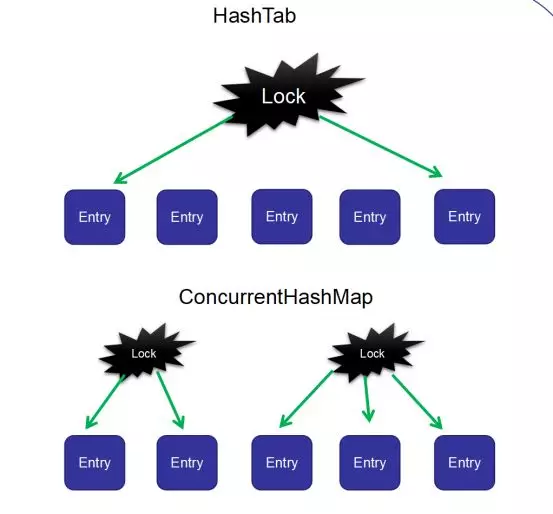

# Map

## Map集合

### 面试问题

## Map类集合

### 面试问题

#### HashMap的数据结构

顺序存储寻址容易，但插入删除比较困难，同时，顺序存储会占用连续的内存地址，容易产生外部碎片和内部碎片；

链式存储寻址困难，但插入删除比较容易；二者按值查找时间复杂度相同。

而HashMap结合了二者的优点，使用**数组（table）+链表结构（table[i]存储了链表的头结点）**实现。

`《码出高效》 P202 图6-15`

#### HashMap和ConcurrentHashMap的区别

1. Hashtable（JDK1.0）的put和get操作都是synchronize的，这意味着当多个线程访问HashTable时，只能有一个线程可以操作其中的元素，而其他线程只能阻塞，因此HashTable性能很差，现在已经被淘汰了；

2. HashMap（JDK1.2）不是线程安全的，在并发环境下put和get操作会导致CPU利用率接近100%，**死链问题和扩容数据丢失是慎用HashMap的两个主要原因**；

3. ConcurrentHashMap（JDK1.5）是Hashtable和HashMap的折中版，是效率与一致性权衡后的结果，在JDK1.8之前使用**分段锁：对集合中数据进行分段加锁（每段数据一个锁）**来保证多线程访问对象中的不同段数据就不会发生竞争锁导致的阻塞现象了，提高程序并发性能。

   

