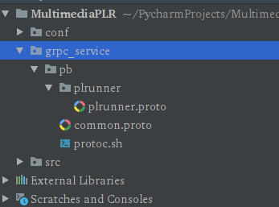
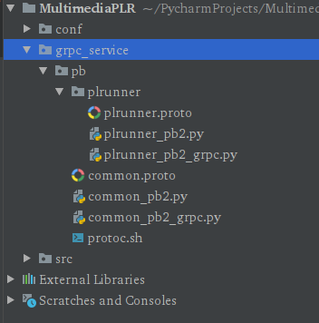

# Proto3

## 自定义信息类型

## 使用其它的信息类型

### 使用其它`.proto`文件中定义的信息类型

借助`import`关键字，我们引入其它的`.proto`定义。

**目录结构**



> pb/common.proto

```protobuf
syntax = "proto3";

package pb;

// message definitions
message Device {
    
}
```

> pb/plrunner/plrunner.proto

```protobuf
syntax = "proto3";

import "common.proto";

package plrunner;

// service and message definitions
message Bind {
    pb.Device device = 1
}
```

> pb/protoc.sh

```bash
#!/usr/bin/env bash
# grpc_tools.protoc --proto_path=IMPORT_PATH --python_out=DST_DIR --objc_out=DST_DIR <proto_file_path>
# --proto_path=IMPORT_PATH 等价于 -I <Import_Path>
# --python_out和--grpc_python_out是在proto_file_path的基础上输出
# 如proto_file_path为./a/b/myfile.proto，--python_out=./c/，则输出的消息文件为./a/b/c/myfile_pb2.py
python -m grpc_tools.protoc -I./ --python_out=./ --grpc_python_out=./ ./common.proto
python -m grpc_tools.protoc -I./ --python_out=./ --grpc_python_out=./ ./plrunner/plrunner.proto
```

**自动生成后的目录结构**



> plrunner_pb2.py

```python
# 需要手动加上grpc_service.pb
import grpc_service.pb.common_pb2 as common__pb2
```

> plrunner_pb2_grpc.py

```python
# 需要手动加上grpc_service.pb
from grpc_service.pb.plrunner import plrunner_pb2 as plrunner_dot_plrunner__pb2
```


