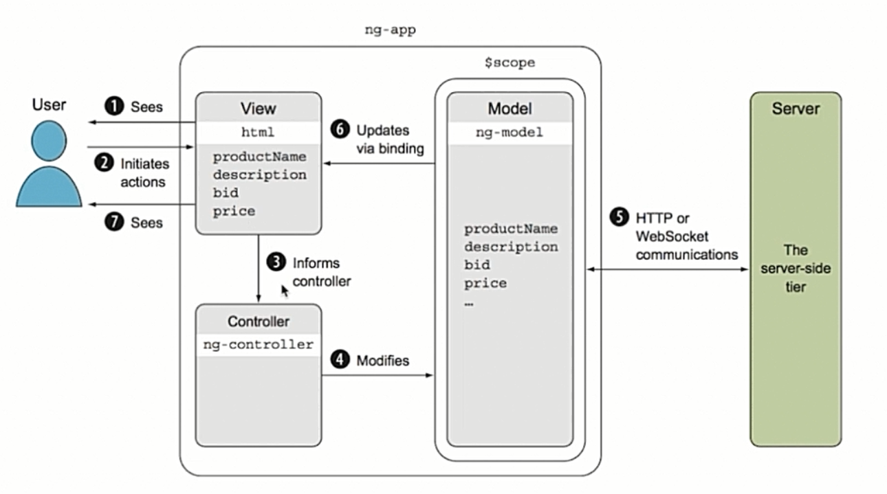
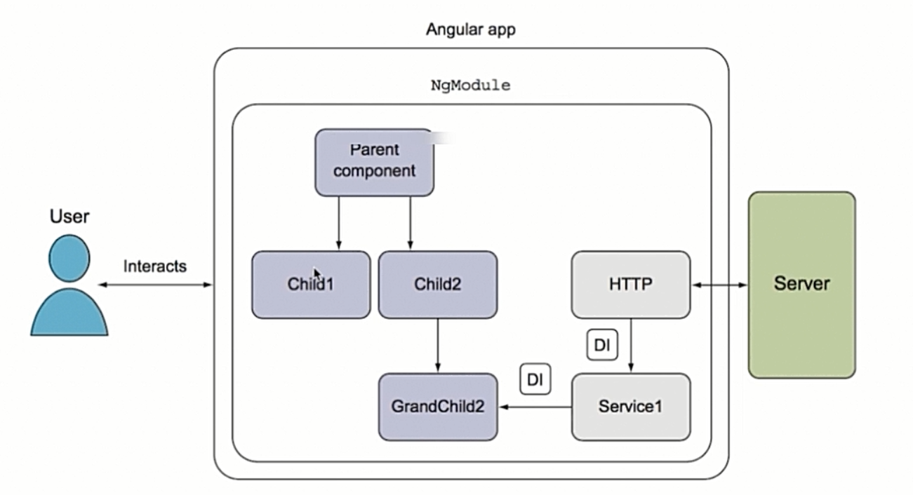
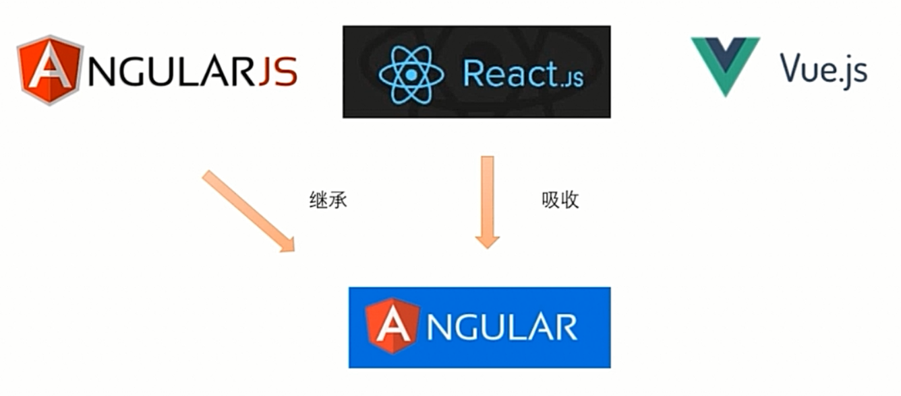

# Angular与AngularJS,React和Vue的比较

## AngularJS

AngularJS是Google于2012年发布的一个前端框架。

### AngularJS的优点

1. 模板功能强大丰富

   声明式。自带了丰富的AngularJS指令，这些指令使得AngularJS拥有了强大双向绑定能力。双向绑定能够大大减少前端代码量，提高开发效率。

2. 比较完善的前端MVC框架

   - 模板
   - 双向绑定
   - 路由
   - 模块化
   - 服务
   - 过滤器
   - 依赖注入
   - 包含了几乎所有在Web开发中会使用到的功能

3. 引入了Java的一些概念

   - 依赖注入
   - 单元测试
   - 能够很容易地写出容易复用的代码

Angular很好地继承了AngularJS的以上优点，并发扬光大。

### AngularJS的不足

1. 性能
   - AngularJS引入dirty checking机制，通过根据数据的改变再动态地更新用户界面，实现双向绑定功能。在AngularJS的作用域中，任何的操作都会引发dirty checking。Angular废弃了这种做法，默认使用单向绑定，然后重写了检查机制。
2. 路由
   - 不够灵活
3. 作用域
4. 表单验证
   - 需要做大量工作来完成显示错误信息的功能。
5. JavaScript语言本身的问题
   - AngularJS使用JavaScript语言编写。Angular使用TypeScript编写，引入了类型检查（在编译时检查Bugs，减少运行时错误，能够更好地获得IDE语法提示）、面向对象等诸多特性。
6. 学习成本高
   - 需要学习大量的概念。

## Angular

### Angular新特性

1. 全新的命令行工具 Angular CLI
2. 服务器端渲染 
3. 移动和桌面兼容

## AngularJS与Angular架构比较

### AngularJS架构

AngularJS应用是典型的MVC架构。

### Angular架构

Angular应用就是一棵组件树。用户所看到的内容就是这棵组件树上被激活的组件所组成的，用户通过点击组件，触发路由事件，激活相应的组件，在不同的“页面”之间进行切换。

用户可以与某个组件进行交互，并且交互动作由该组件负责处理。组件通过依赖注入（DI）的方式引入一些服务，并用这些服务来处理用户的操作，或者与服务器进行通信。

## React

1. 虚拟DOM

   React采用“虚拟DOM”的方式操作DOM，只有在setData的时候才会更新DOM（先更新虚拟DOM再更新实际的DOM），能够极大地减少DOM更新的次数和内容，而Angular使用了新的变更检测算法，在速度和性能上几乎与React不相上下。

2. FLUX架构

   React更关注UI的组件化和数据的单向更新，提出了FLUX架构的新概念。而且，在React中可以直接使用JS的ES6语法，再使用webpack等工具编译成浏览器兼容的ES5。Angular也都逐渐支持了这些功能。

3. 服务器端渲染

   React可以先在服务器上预渲染应用再发送到客户端，有助于搜索引擎优化。

React的目标是一个UI组件，通常需要搭配其他框架组合使用，不如Angular这样一个完整的框架使用起来那么顺手。

## Vue

1. 简单

   API简单，并且国人开发维护，中文支持好，学习和使用成本低。

2. 灵活

   提高工具来辅助构建项目，但是并不像Angular那样限制如何构建。

3. 性能

   借鉴了React的“虚拟DOM”的理念。

Vue是一个由个人主导的开源项目（Angular是Google主导的，使用的是MicroSoft开发TypeScript语言），社区和生态不够完善。只关注Web。 需要借助第三方库来完成服务器渲染的功能。

## 后记 

Angular就是为大型项目而生的，继承了AngularJS、接纳了React，包含了Web开发中使用到的一系列特性。

