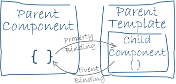

# 组件（Component）

## 组件简介

**组件**控制屏幕上被称为**视图**的一小片区域。

你在类（组件的.ts控制器文件）中定义组件的应用逻辑，为视图提供支持。类（组件）通过一些由属性和方法组成的 API 与视图交互。比如，[教程](https://www.angular.cn/tutorial)中的下列视图都是由一个个组件所定义和控制的：

- 带有导航链接的应用根组件。
- 英雄列表。
- 英雄编辑器。

你在类中定义组件的应用逻辑，为视图提供支持。 组件通过一些由属性和方法组成的 API 与视图交互。

比如，`HeroListComponent` 中有一个 名为`heroes`的属性，它储存着一个数组的英雄数据。 `HeroListComponent` 还有一个 `selectHero()` 方法，当用户从列表中选择一个英雄时，它会设置 `selectedHero` 属性的值。 该组件会从服务获取英雄列表，它是一个 TypeScript 的构造器[参数型属性](http://www.typescriptlang.org/docs/handbook/classes.html#parameter-properties)。本服务通过依赖注入系统提供给该组件。

> src/app/hero-list.component.ts (class)

```typescript
export class HeroListComponent implements OnInit {
  heroes: Hero[];
  selectedHero: Hero;

  constructor(private service: HeroService) { }

  ngOnInit() {
    this.heroes = this.service.getHeroes();
  }

  selectHero(hero: Hero) { this.selectedHero = hero; }
}
```

当用户在应用中穿行时，Angular 就会创建、更新、销毁一些组件。 你的应用可以通过一些可选的[生命周期钩子](https://www.angular.cn/guide/lifecycle-hooks)（比如`ngOnInit()`）来在每个特定的时机采取行动。

## 组件的元数据

[`@Component`](https://www.angular.cn/api/core/Component)装饰器会指出紧随其后的那个类是个组件类，并为其指定元数据。 在下面的范例代码中，你可以看到 `HeroListComponent` 只是一个普通类，完全没有 Angular 特有的标记或语法。 直到给它加上了 `@Component` 装饰器，它才变成了组件。

组件的元数据告诉 Angular 到哪里获取它需要的主要构造块，以创建和展示这个组件及其视图。 具体来说，它把一个*模板*（无论是直接内联在代码中还是引用的外部文件）和该组件关联起来。 该组件及其模板，共同描述了一个*视图*。

除了包含或指向模板之外，`@Component` 的元数据还会配置要如何在 HTML 中引用该组件，以及该组件需要哪些服务等等。

下面的例子中就是 `HeroListComponent` 的基础元数据：

> src/app/hero-list.component.ts (metadata)

```typescript
@Component({
  selector:    'app-hero-list',
  templateUrl: './hero-list.component.html',
  providers:  [ HeroService ]
})
export class HeroListComponent implements OnInit {
  /* . . . */
}
```

这个例子展示了一些最常用的 `@Component` 配置选项：

- `selector`：是一个 CSS 选择器，它会告诉 Angular，一旦在模板 HTML 中找到了这个选择器对应的标签，就创建并插入该组件的一个实例。 比如，如果应用的 HTML 中包含 `<app-hero-list></app-hero-list>`，Angular 就会**在这些标签中插入（不是替换该标签）**一个 `HeroListComponent` 实例的视图。
- `templateUrl`：该组件的 HTML 模板文件相对于这个组件文件的地址。 另外，你还可以用 `template` 属性的值来提供内联的 HTML 模板。 这个模板定义了该组件的*宿主视图*。
- `providers`：当前组件所需的服务[提供商](https://www.angular.cn/guide/glossary#provider)的一个数组。在这个例子中，它告诉 Angular 该如何提供一个 `HeroService` 实例，以获取要显示的英雄列表。

## 模板与视图

你要通过组件的配套模板来定义其视图。模板就是一种 HTML，它会告诉 Angular 如何渲染该组件。

视图通常会分层次进行组织，让你能以 UI 分区或页面为单位进行修改、显示或隐藏。 与组件直接关联的模板会定义该组件的**宿主视图**。该组件还可以定义一个*带层次结构的视图*，它包含一些**内嵌的视图**作为其它组件的宿主。


带层次结构的视图可以包含同一模块（NgModule）中组件的视图，也可以（而且经常会）包含其它模块中定义的组件的视图。

## 模板语法

模板很像标准的 HTML，但是它还包含 Angular 的[模板语法](https://www.angular.cn/guide/template-syntax)，这些**模板语法可以根据你的应用逻辑、应用状态和 DOM 数据来修改这些 HTML**。 

你的模板可以使用**数据绑定**来协调应用和 DOM 中的数据，使用**管道**在显示出来之前对其进行转换，使用**指令**来把程序逻辑应用到要显示的内容上。

比如，下面是本教程中 `HeroListComponent` 的模板：

>src/app/hero-list.component.html

```html
<h2>Hero List</h2>

<p><i>Pick a hero from the list</i></p>
<ul>
  <li *ngFor="let hero of heroes" (click)="selectHero(hero)">
    {{hero.name}}
  </li>
</ul>

<app-hero-detail *ngIf="selectedHero" [hero]="selectedHero"></app-hero-detail>
```

这个模板使用了典型的 HTML 元素，比如 `<h2>` 和 `<p>`，还包括一些 Angular 的模板语法元素，如 `*ngFor`，`{{hero.name}}`，`click`、`[hero]` 和 `<app-hero-detail>`。这些模板语法元素告诉 Angular 该如何根据程序逻辑和数据在屏幕上渲染 HTML。

- `*ngFor` 指令告诉 Angular 在一个列表上进行迭代。
- `{{hero.name}}`、`(click)` 和 `[hero]` 把程序数据绑定到及绑定回 DOM，以响应用户的输入。更多内容参见稍后的[数据绑定](https://www.angular.cn/guide/architecture-components#data-binding)部分。
- 模板中的 `<app-hero-detail>` 标签是一个代表新组件 `HeroDetailComponent` 的元素。 `HeroDetailComponent`（代码略）定义了 `HeroListComponent` 的英雄详情子视图。 注意观察像这样的自定义组件是如何与原生 HTML 元素无缝的混合在一起的。

### 数据绑定

如果没有框架，你就要自己负责把数据值推送到 HTML 控件中，并把来自用户的响应转换成动作和对值的更新。 手动写这种数据推拉逻辑会很枯燥、容易出错，难以阅读 —— 用过 jQuery 的程序员一定深有体会。

Angular 支持**双向数据绑定**，这是一种对模板中的各个部件与组件中的各个部件进行协调的机制。 往模板 HTML 中添加绑定标记可以告诉 Angular 该如何连接它们。

下图显示了数据绑定标记的四种形式。每种形式都有一个方向 —— 从组件到 DOM、从 DOM 到组件或双向。


这个来自 `HeroListComponent` 模板中的例子使用了其中的三种形式：

>src/app/hero-list.component.html (binding)

```html
<li>{{hero.name}}</li>
<app-hero-detail [hero]="selectedHero"></app-hero-detail>
<li (click)="selectHero(hero)"></li>
```

- `{{hero.name}}`[*插值表达式*](https://www.angular.cn/guide/displaying-data#interpolation)在 `<li>` 标签中显示组件的 `hero.name` 属性的值。
- `[hero]`[*属性绑定*](https://www.angular.cn/guide/template-syntax#property-binding)把父组件 `HeroListComponent` 的 `selectedHero` 的值传到子组件 `HeroDetailComponent` 的 `hero` 属性中。
- 当用户点击某个英雄的名字时，`(click)` [*事件绑定*](https://www.angular.cn/guide/user-input#binding-to-user-input-events)会调用组件的 `selectHero` 方法。

**双向数据绑定**（主要用于[模板驱动表单](https://www.angular.cn/guide/forms)中），它会把属性绑定和事件绑定组合成一种单独的写法。下面这个来自 `HeroDetailComponent` 模板中的例子通过 `ngModel` 指令使用了双向数据绑定：

> src/app/hero-detail.component.html (ngModel)

```html
<input [(ngModel)]="hero.name">
```

在双向绑定中，数据属性值通过属性绑定从组件流到输入框。用户的修改通过事件绑定流回组件，把属性值设置为最新的值。

Angular 在每个 JavaScript 事件循环中处理*所有的*数据绑定，它会从组件树的根部开始，递归处理全部子组件。


数据绑定在模板及其组件之间的通讯中扮演了非常重要的角色，它对于父组件和子组件之间的通讯也同样重要。



## 管道

Angular 的管道可以让你在模板中声明显示值的转换逻辑。 带有 `@Pipe` 装饰器的类中会定义一个转换函数，用来把输入值转换成供视图显示用的输出值。

Angular 自带了很多管道，比如 [date](https://angular.cn/api/common/DatePipe) 管道和 [currency](https://angular.cn/api/common/CurrencyPipe) 管道，完整的列表参见 [Pipes API 列表](https://angular.cn/api?type=pipe)。你也可以自己定义一些新管道。

要在 HTML 模板中指定值的转换方式，请使用 [管道操作符 (|)](https://angular.cn/guide/template-syntax#pipe)。

```
{{interpolated_value | pipe_name}}
```

你可以把管道串联起来，把一个管道函数的输出送给另一个管道函数进行转换。 管道还能接收一些参数，来控制它该如何进行转换。比如，你可以把要使用的日期格式传给 `date` 管道：

```html
<!-- Default format: output 'Jun 15, 2015'-->

 <p>Today is {{today | date}}</p>

<!-- fullDate format: output 'Monday, June 15, 2015'-->

<p>The date is {{today | date:'fullDate'}}</p>

 <!-- shortTime format: output '9:43 AM'-->

 <p>The time is {{today | date:'shortTime'}}</p>
```

## 指令

Angular 的模板是**动态的 **。当 Angular 渲染它们的时候，会根据*指令*给出的指示对 DOM 进行转换。 指令就是一个带有 `@Directive()` 装饰器的类。

组件从技术角度上说就是一个指令，但是由于组件对 Angular 应用来说非常独特、非常重要，因此 Angular 专门定义了 `@Component()` 装饰器，它使用一些面向模板的特性扩展了 `@Directive()` 装饰器。

除组件外，还有两种指令：*结构型指令*和*属性型指令*。 Angular 本身定义了一系列这两种类型的指令，你也可以使用 `@Directive()` 装饰器来定义自己的指令。

像组件一样，指令的元数据把它所装饰的指令类和一个 `selector` 关联起来，`selector` 用来把该指令插入到 HTML 中。 在模板中，指令通常作为属性出现在元素标签上，可能仅仅作为名字出现，也可能作为赋值目标或绑定目标出现。

### 结构型指令

**结构型指令**通过添加、移除或替换 DOM 元素来修改布局。 这个范例模板使用了两个内置的结构型指令来为要渲染的视图添加程序逻辑：

> src/app/hero-list.component.html (structural)

```html
<li *ngFor="let hero of heroes"></li>
<app-hero-detail *ngIf="selectedHero"></app-hero-detail>
```

- [`*ngFor`](https://www.angular.cn/guide/displaying-data#ngFor) 是一个迭代器，它要求 Angular 为 `heroes` 列表中的每个英雄渲染出一个 `<li>`。
- [`*ngIf`](https://www.angular.cn/guide/displaying-data#ngIf) 是个条件语句，只有当选中的英雄存在时，它才会包含 `HeroDetail` 组件。

### 属性型指令

**属性型指令**会修改现有元素的外观或行为。 在模板中，它们看起来就像普通的 HTML 属性一样，因此得名“属性型指令”。

`ngModel` 指令就是属性型指令的一个例子，它实现了双向数据绑定。 `ngModel` 修改现有元素（一般是 `<input>`）的行为：设置其显示属性值，并响应 change 事件。

> src/app/hero-detail.component.html (ngModel)

```html
<input [(ngModel)]="hero.name">
```

Angular 还有很多预定义指令既不修改布局结构（比如 [ngSwitch](https://www.angular.cn/guide/template-syntax#ngSwitch)），也不修改 DOM 元素和组件的样子（比如 [ngStyle](https://www.angular.cn/guide/template-syntax#ngStyle) 和 [ngClass](https://www.angular.cn/guide/template-syntax#ngClass)）。

> 欲知详情，参见[属性型指令](https://www.angular.cn/guide/attribute-directives)和[结构型指令](https://www.angular.cn/guide/structural-directives)这两章。