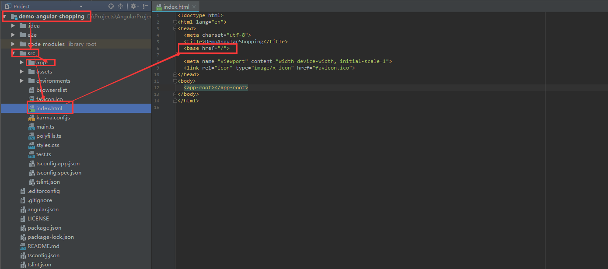

# 核心概念

在用户使用应用程序时，Angular 的**路由器**能让用户从一个[视图](https://www.angular.cn/guide/glossary#view)导航到另一个视图。

本章涵盖了该路由器的主要特性，通过一个小型应用的成长演进来讲解它们。参见[在线例子](https://www.angular.cn/generated/live-examples/router/stackblitz.html) / [下载范例](https://www.angular.cn/generated/zips/router/router.zip)。

---

浏览器具有熟悉的导航模式：

- 在地址栏输入 URL，浏览器就会导航到相应的页面。
- 点击页面中的链接，浏览器就会导航到一个新页面。
- 点击浏览器的前进和后退按钮，浏览器就会在你的浏览历史中向前或向后导航。

Angular 的 `Router`（即“路由器”）借鉴了这个模型。它把浏览器中的 URL 解释为一个导航到由客户端生成的视图的指令。并可以把参数传给支撑视图的相应组件，帮它决定具体该展现哪些内容。 你可以为页面中的链接绑定一个路由，这样，当用户点击链接时，就会导航到应用中相应的视图。 当用户点击按钮、从下拉框中选取，或响应来自任何地方的事件时，你也可以在代码控制下进行导航。 路由器还在浏览器的历史日志中记录下这些活动，这样浏览器的前进和后退按钮也能照常工作。

## `<base href="URL">`元素

大多数带路由的应用都要在**index.html**的 `<head>` 标签下**先**添加一个 `<base>` 元素，来告诉路由器该如何合成导航用的 URL。

如果 `app` 文件夹是该应用的根目录（就像范例应用中一样），那就把 `href` 的值设置为下面这样：



> src/index.html(base-href)

```html
<base href="/">
```

## 导入路由依赖

Angular 的路由器是一个可选的服务，它用来呈现指定的 URL 所对应的视图。 它并不是 Angular 核心库的一部分，而是在它自己的 `@angular/router` 包中。 像其它 Angular 包一样，你可以从它导入所需的一切。

> src/app/app.module.ts (import)

```typescript
import { RouterModule, Routes } from '@angular/router';
```

## 路由配置

每个带路由的 Angular 应用都有一个**Router（路由器）**服务的单例对象。 当浏览器的 URL 变化时，路由器会查找对应的 `Route`（路由），并据此决定该显示哪个组件。

路由器需要先配置才会有路由信息。 下面的例子创建了五个路由定义，并用 `RouterModule.forRoot(routes: Routes)` 方法来配置路由器， 并把它的返回值添加到 `AppModule` 的 `imports` 数组中。

>src/app/app.module.ts (excerpt)

```typescript
const appRoutes: Routes = [
  { path: 'crisis-center', component: CrisisListComponent },
  { path: 'hero/:id',      component: HeroDetailComponent },
  {
    path: 'heroes',
    component: HeroListComponent,
    data: { title: 'Heroes List' }
  },
  { path: '',
    redirectTo: '/heroes',
    pathMatch: 'full'
  },
  { path: '**', component: PageNotFoundComponent }
];

@NgModule({
  imports: [
    RouterModule.forRoot(
      appRoutes,
      { enableTracing: true } // <-- debugging purposes only
    )
    // other imports here
  ],
  ...
})
export class AppModule { }
```

这里的路由数组 `appRoutes` 描述如何进行导航。 把它传给 `RouterModule.forRoot()` 方法并传给本模块的 `imports` 数组就可以配置路由器。

每个 [`Route`](https://www.angular.cn/api/router/Route)  都会把一个 URL 的 `path` 映射到一个组件。 注意，`path` 不能以**斜杠（/）**开头。 路由器会为解析和构建最终的 URL，这样当你在应用的视图之间导航时，可以任意使用相对路径和绝对路径。

第二个路由中的 `:id` 是一个路由参数的标记(Token)。比如 `/hero/42` 这个 URL 中，“42”就是 `id` 参数的值。 此 URL 对应的 `HeroDetailComponent` 组件将据此查找和展现 `id` 为 42 的英雄。

第三个路由中的 `data` 属性用来存放于与该指定路由有关的任意信息。这些数据可以在任何一个激活路由中访问，并能用来保存诸如 页标题、面包屑以及其它只读静态数据。本章稍后的部分，你将使用[resolve 守卫](https://www.angular.cn/guide/router#resolve-guard)来获取动态数据。

第四个路由中的空路径（`''`）表示应用的默认路径，当 URL 为空时就会访问那里，因此它通常会作为起点。 这个默认路由会重定向到 URL `/heroes`，并显示 `HeroesListComponent`。

最后一个路由中的 `**` 路径是一个**通配符（wildcard）**。当所请求的 URL 不匹配前面定义的路由表中的任何路径时，路由器就会选择此路由。 这个特性可用于显示“404 - Page Not Found”页，或自动重定向到其它路由。

**这些路由的定义顺序**是刻意如此设计的。路由器使用**先匹配者优先**的策略来匹配路由，所以，具体路由应该放在通用路由的前面。在上面的配置中，带静态路径的路由被放在了前面，后面是空路径路由，因此它会作为默认路由。而通配符路由被放在最后面，这是因为它能匹配上**每一个 URL**，因此应该只有在前面找不到其它能匹配的路由时才匹配它。

**如果你想要看到在导航的生命周期中发生过哪些事件，可以使用路由器默认配置中的 `enableTracing` 选项**。它会把每个导航生命周期中的事件输出到浏览器的控制台。 这应该只用于**调试**。你只需要把 `enableTracing: true` 选项作为第二个参数传给 `RouterModule.forRoot()` 方法就可以了。

## 路由出口

[`RouterOutlet`](https://www.angular.cn/api/router/RouterOutlet) 是一个来自路由模块中的指令，它的用法类似于组件。 它扮演一个占位符的角色，用于在模板中标出一个位置，路由器将会把要显示在这个出口处的组件显示在这里。

```html
<router-outlet></router-outlet>
<!-- Routed components go here -->
```

有了这份配置，当本应用在浏览器中的 URL 变为 `/heroes` 时，路由器就会匹配到 `path` 为 `heroes` 的 `Route`，并在宿主视图中的**RouterOutlet**之后显示 `HeroListComponent` 组件。

## 路由链接

现在，你已经有了配置好的一些路由，还找到了渲染它们的地方，但又该如何导航到它呢？固然，从浏览器的地址栏直接输入 URL 也能做到，但是大多数情况下，导航是某些用户操作的结果，比如点击一个 A 标签。

考虑下列模板：

> src/app/app.component.html

```html
<h1>Angular Router</h1>
<nav>
  <a routerLink="/crisis-center" routerLinkActive="active">Crisis Center</a>
  <a routerLink="/heroes" routerLinkActive="active">Heroes</a>
</nav>
<router-outlet></router-outlet>
```

`a` 标签上的 [`RouterLink`](https://www.angular.cn/api/router/RouterLink) 指令让路由器得以控制这个 `a` 元素。 这里的导航路径是固定的，因此可以把一个字符串赋给 `routerLink`（“一次性”绑定）。

如果需要更加动态的导航路径，那就把它绑定到一个返回**链接参数数组**的模板表达式。 路由器会把这个数组解析成完整的 URL。

## 路由链接的激活状态

[`RouterLinkActive`](https://www.angular.cn/api/router/RouterLinkActive) 指令会基于当前的 `RouterState` 为活动的 [`RouterLink`](https://www.angular.cn/api/router/RouterState) 切换所绑定的 css 类。

在 A 标签上，你可能会看到一个到 `RouterLinkActive` 的[属性绑定](https://www.angular.cn/guide/template-syntax#property-binding)，形如 `routerLinkActive="..."`。

等号右边的模板表达式包含一些用空格分隔的 CSS 类名，当这个链接为激活状态时，路由器将会把它们加上去（并在处于非活动状态时移除）。你还可以把 `RouterLinkActive` 设置为一个类组成的字符串，如 `[routerLinkActive]="'active fluffy'"`，或把它绑定到一个返回字符串的组件属性上。

路由链接的激活状态会向下级联到路由树中的每个层级，所以，父子路由链接可能会同时激活。要覆盖这种行为，可以把 `[routerLinkActiveOptions]` 绑定为 `{ exact: true }` 表达式，这样 `RouterLink` 只有当 URL 与当前 URL 精确匹配时才会激活。

## 路由状态

在导航时的每个生命周期成功完成时，路由器会构建出一个 `ActivatedRoute` 组成的树，它表示路由器的当前状态。 你可以在应用中的任何地方用 `Router` 服务及其 `routerState` 属性来访问当前的 `RouterState` 值。

`RouterState` 中的每个 `ActivatedRoute` 都提供了从任意激活路由开始向上或向下遍历路由树的一种方式，以获得关于父、子、兄弟路由的信息。

## 激活的路由

该路由的路径和参数可以通过注入进来的一个名叫[ActivatedRoute](https://www.angular.cn/api/router/ActivatedRoute)的路由服务来获取。 它有一大堆有用的信息，包括：

| 属性            | 说明                                                         |
| --------------- | ------------------------------------------------------------ |
| `url`           | 路由路径的 `Observable` 对象，是一个由路由路径中的各个部分组成的字符串数组。 |
| `data`          | 一个 `Observable`，其中包含提供给路由的 `data` 对象。也包含由[解析守卫（resolve guard）](https://www.angular.cn/guide/router#resolve-guard)解析而来的值。 |
| `paramMap`      | 一个 `Observable`，其中包含一个由**当前路由**的必要参数和[可选参数](https://www.angular.cn/guide/router#optional-route-parameters)组成的[map](https://www.angular.cn/api/router/ParamMap)对象。用这个 map 可以获取来自同名参数的单一值或多重值。 |
| `queryParamMap` | 一个 `Observable`，其中包含一个对**所有路由**都有效的[查询参数](https://www.angular.cn/guide/router#query-parameters)组成的[map](https://www.angular.cn/api/router/ParamMap)对象。 用这个 map 可以获取来自查询参数的单一值或多重值。 |
| `fragment`      | 一个适用于所有路由的 URL 的 [fragment（片段）](https://www.angular.cn/guide/router#fragment)的 `Observable`。 |
| `outlet`        | 要把该路由渲染到的 `RouterOutlet` 的名字。对于无名路由，它的RouteOutlet的`name`是 `primary`，而不是空串。 |
| `routeConfig`   | 用于该路由的路由配置信息，其中包含原始路径。                 |
| `parent`        | 当该路由是一个[子路由](https://www.angular.cn/guide/router#child-routing-component)时，表示该路由的父级 `ActivatedRoute`。 |
| `firstChild`    | 包含该路由的子路由列表中的第一个 `ActivatedRoute`。          |
| `children`      | 包含当前路由下所有已激活的[子路由](https://www.angular.cn/guide/router#child-routing-component)。 |

>有两个旧式属性仍然是有效的，但它们不如其替代品那样强力，建议不再用它们，它们还将在未来的 Angular 版本中废弃。
>
>**params** —— 一个 `Observable` 对象，其中包含当前路由的必要参数和[可选参数](https://www.angular.cn/guide/router#optional-route-parameters)。请改用 `paramMap`。
>
>**queryParams** —— 一个 `Observable` 对象，其中包含对所有路由都有效的[查询参数](https://www.angular.cn/guide/router#query-parameters)。请改用 `queryParamMap`。

## 路由事件

在每次导航中，`Router` 都会通过 [`Router.events`](https://www.angular.cn/api/router/Router#events) 属性发布一些导航事件。这些事件的范围涵盖了从开始导航到结束导航之间的很多时间点。下表中列出了全部导航事件：

| 路由器事件             | 说明                                                         |
| ---------------------- | ------------------------------------------------------------ |
| `NavigationStart`      | 本[事件](https://www.angular.cn/api/router/NavigationStart)会在导航开始时触发。 |
| `RouteConfigLoadStart` | 本[事件](https://www.angular.cn/api/router/RouteConfigLoadStart)会在 `Router` [惰性加载](https://www.angular.cn/guide/router#asynchronous-routing) 某个路由配置之前触发。 |
| `RouteConfigLoadEnd`   | 本[事件](https://www.angular.cn/api/router/RouteConfigLoadEnd)会在惰性加载了某个路由后触发。 |
| `RoutesRecognized`     | 本[事件](https://www.angular.cn/api/router/RoutesRecognized)会在路由器解析完 URL，并识别出了相应的路由时触发 |
| `GuardsCheckStart`     | 本[事件](https://www.angular.cn/api/router/GuardsCheckStart)会在路由器开始 Guard 阶段之前触发。 |
| `ChildActivationStart` | 本[事件](https://www.angular.cn/api/router/ChildActivationStart)会在路由器开始激活路由的子路由时触发。 |
| `ActivationStart`      | 本[事件](https://www.angular.cn/api/router/ActivationStart)会在路由器开始激活某个路由时触发。 |
| `GuardsCheckEnd`       | 本[事件](https://www.angular.cn/api/router/GuardsCheckEnd)会在路由器成功完成了 Guard 阶段时触发。 |
| `ResolveStart`         | 本[事件](https://www.angular.cn/api/router/ResolveStart)会在 `Router` 开始解析（Resolve）阶段时触发。 |
| `ResolveEnd`           | 本[事件](https://www.angular.cn/api/router/ResolveEnd)会在路由器成功完成了路由的解析（Resolve）阶段时触发。 |
| `ChildActivationEnd`   | 本[事件](https://www.angular.cn/api/router/ChildActivationEnd)会在路由器激活了路由的子路由时触发。 |
| `ActivationEnd`        | 本[事件](https://www.angular.cn/api/router/ActivationStart)会在路由器激活了某个路由时触发。 |
| `NavigationEnd`        | 本[事件](https://www.angular.cn/api/router/NavigationEnd)会在导航成功结束之后触发。 |
| `NavigationCancel`     | 本[事件](https://www.angular.cn/api/router/NavigationCancel)会在导航被取消之后触发。 这可能是因为在导航期间某个[路由守卫](https://www.angular.cn/guide/router#guards)返回了 `false`。 |
| `NavigationError`      | 这个[事件](https://www.angular.cn/api/router/NavigationError)会在导航由于意料之外的错误而失败时触发。 |
| `Scroll`               | 本[事件](https://www.angular.cn/api/router/Scroll)代表一个滚动事件。 |

当启用了 `enableTracing` 选项时，这些事件也同时会记录到控制台中。要想查看对路由导航事件进行过滤的例子，请访问 [Angular 中的可观察对象](https://www.angular.cn/guide/observables-in-angular)一章的[路由器部分](https://www.angular.cn/guide/observables-in-angular#router)。

## 总结

该应用有一个配置过的路由器。 外壳组件中有一个 `RouterOutlet`，它能显示路由器所生成的视图。 它还有一些 `RouterLink`，用户可以点击它们，来通过路由器进行导航。

下面是一些**路由器**中的关键词汇及其含义：

| 路由器部件                         | 含义                                                         |
| ---------------------------------- | ------------------------------------------------------------ |
| `Router`（路由器）                 | 为激活的 URL 显示应用组件。管理从一个组件到另一个组件的导航  |
| `RouterModule`                     | 一个独立的 NgModule，用于提供所需的服务提供商，以及用来在应用视图之间进行导航的指令。 |
| `Routes`（路由数组）               | 定义了一个路由数组，每一个都会把一个 URL 路径映射到一个组件。 |
| `Route`（路由）                    | 定义路由器该如何根据 URL 模式（pattern）来导航到组件。大多数路由都由路径和组件类构成。 |
| `RouterOutlet`（路由出口）         | 该指令（`<router-outlet>`）用来标记出路由器该在哪里显示视图。 |
| `RouterLink`（路由链接）           | 这个指令把可点击的 HTML 元素绑定到某个路由。点击带有 `routerLink` 指令（绑定到*字符串*或*链接参数数组*）的元素时就会触发一次导航。 |
| `RouterLinkActive`（活动路由链接） | 当 HTML 元素上或元素内的`routerLink`变为激活或非激活状态时，该指令为这个 HTML 元素添加或移除 CSS 类。 |
| `ActivatedRoute`（激活的路由）     | 为每个路由组件提供提供的一个服务，它包含特定于路由的信息，比如路由参数、静态数据、解析数据、全局查询参数和全局碎片（fragment）。 |
| `RouterState`（路由器状态）        | 路由器的当前状态包含了一棵由程序中激活的路由构成的树。它包含一些用于遍历路由树的快捷方法。 |
| **链接参数数组**                   | 这个数组会被路由器解释成一个路由操作指南。你可以把一个`RouterLink`绑定到该数组，或者把它作为参数传给`Router.navigate`方法。 |
| **路由组件**                       | 一个带有`RouterOutlet`的 Angular 组件，它根据路由器的导航来显示相应的视图。 |

