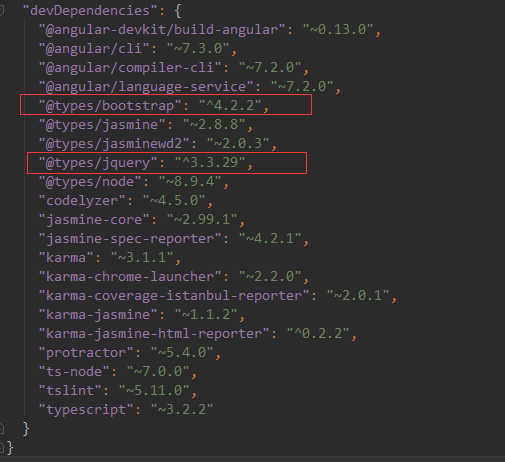

# Angular项目引入第三方依赖

以引入jquery和bootstrap为例。

1. 使用npm工具将第三方依赖导入到项目中（node_modules包），在项目根目录下执行：

   ```powershell
   $ npm install jquery --save
   
   $ npm install bootstrap --save
   ```

   `--save`是将依赖记录到项目的package.json文件中：

   导入前：

   

   导入后：

   

2. 将导入的第三方库引入到项目中：

   > new-app/angular.json

   

   引入jquery和bootstrap后：

   

3. jquery本身是JavaScript编写的，TypeScript是不能直接使用的（如不能识别jquery中的$选择器）。

   为了能够在TypeScript中使用jquery和bootstrap，我们应该将jquery和bootstrap的类型描述文件也导入到项目中：

   ```powershell
   $ npm install @types/jquery --save-dev
   
   $ npm install @types/bootstrap --save-dev
   ```

   