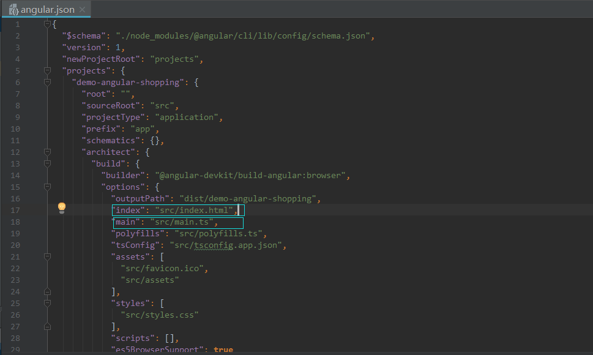
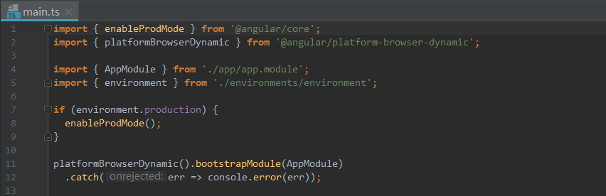
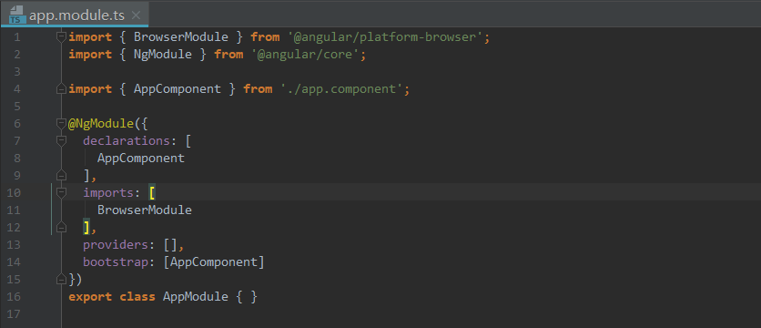
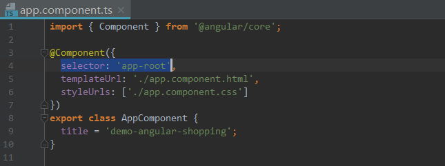
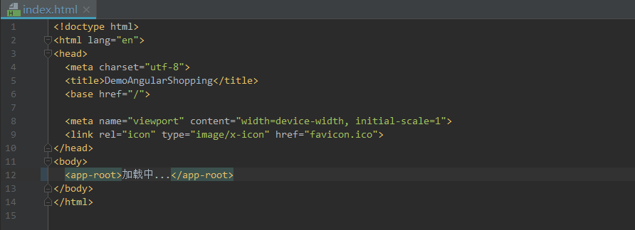

# Angular项目的启动过程

1. Angular项目根目录下的angular.json文件定义了与该Angular项目相关的主要信息。

   > new-app/angular.json

   

   index属性指向了Angular应用启动时加载的页面；main属性指向了Angular应用启动时加载的脚本。

2. main.ts文件负责引导Angular应用启动。

   > new-app/src/main.ts

   

   enableProdMode()负责关闭开发者模式，将当前开发环境设置为生产环境。

   platformBrowserDynamic().bootstrapModule()方法告诉Angular使用哪个NgModule来启动整个应用。

3. AppModule是整个应用的根模块，在创建Angular初始项目的时候默认生成。

   > new-app/src/app/app.module.ts

   

   在Angular确认使用AppModule（或者其他NgModule）作为启动模块后，Angular会分析AppModule依赖了哪些模块，并依次加载那些模块，直到项目中依赖的所有模块都加载完毕。

4. 当所有模块都加载完毕后，Angular会使用启动模块（AppModule）指定的主组件（AppComponent）

   > new-app/src/app/app.component.ts

   

   对应的模板内容

   > new-app/src/app/app.component.html

   插入到启动页面（angular.json的index属性所指)中的主组件（AppComponent）对应选择器标签（`<app-root>`)中。

   > new-app/src/index.html

   

   在所有模块加载完成之前，主页面将一直呈现app-root中的内容。

5. 在Angular项目主目录下输入`ng serve --open`命令启动项目，并且在该项目启动之后，Angular会监测项目中的任何改动行为，一旦改动行为落实（保存文件触发），会使服务器自动编译修改后的文件，然后刷新页面。

