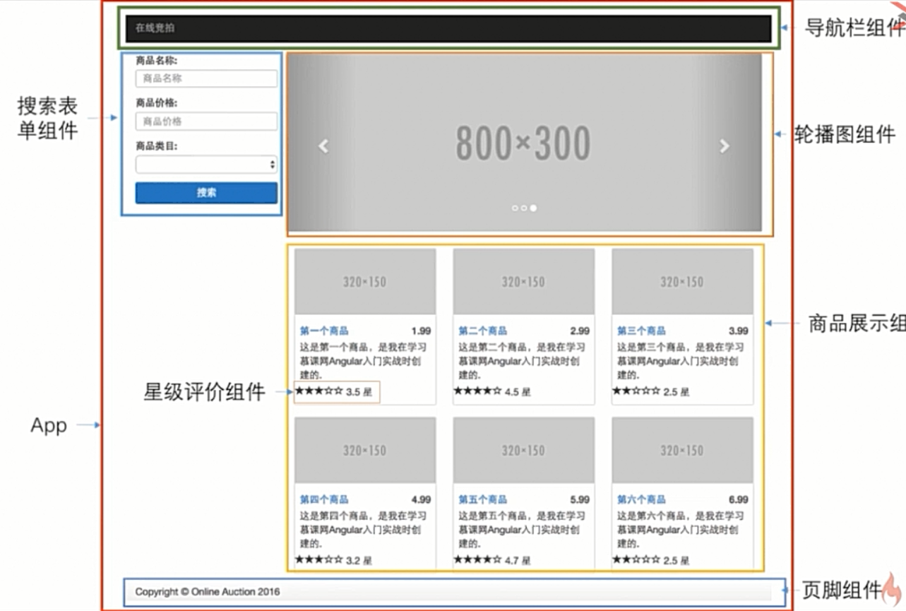

# demo-angular-shopping开发流程

## 准备工作

1. `ng new demo-angular-shopping`生成新的Angular初始项目
2. 导入第三方依赖bootstrap和jquery

## 项目分析



实例应用主界面包含7个基本组件：

- 主组件
- 导航栏组件
- 搜索表单组件
- 轮播图组件
- 商品展示组件
- 星级评价组件
- 页脚组件

主组件是创建项目时默认生成的，因此我们只要声明其余6个组件即可。

使用`ng generate component new-component`或`ng g component new-component`生成名为new-component的组件：

```powershell
$ ng g component navbar

$ ng g component search

$ ng g component carousel

$ ng g component products

$ ng g component stars

$ ng g component footer
```


`ng generate component new-component`命令会创建以new-component.component.为前缀的html模板文件、spec.ts测试文件、ts控制器文件、css样式文件，并在AppModule中注册该组件：


## 开发app组件

### 开发app组件模板

页面整体分为上中下三部分：上部为`<app-navbar>`导航栏组件，下部为`<app-footer>`页脚组件。

```html
<app-navbar></app-navbar>
<div class="container">
  <div class="row">
    <div class="col-md-3">
      <app-search></app-search>
    </div>
    <div class="col-md-9">
      <div class="row">
        <app-carousel></app-carousel>
      </div>
      <div class="row">
        <app-products></app-products>
      </div>
    </div>
  </div>
</div>
<app-footer></app-footer>
```

中间部分是一个包裹着主要内容的容器，使用bootstrap的`container`类修饰渲染：

```css
.container {
  width: 100%;
  padding-right: 15px;
  padding-left: 15px;
  margin-right: auto;
  margin-left: auto;
}
```

该容器内部又分为左右两部分：左部占1/3，右边占3/4，并且这两部分包含在使用bootstrap的`row`类修饰渲染的div中：

```css
.row {
  display: -ms-flexbox;
  display: flex;
  -ms-flex-wrap: wrap;
  flex-wrap: wrap;
  margin-right: -15px;
  margin-left: -15px;
}
```

如上所示，`row`内部使用flex布局。flex是一种可以简单、快速弹性布局的属性，主要思想是赋予容器控制内部元素高度和宽度的能力。


`row`的左孩子使用`col-md-3`修饰，占了该容器的25%；`row`的右孩子使用`col-md-9`修饰，占了该容器的75%。

`注：一般地，flex弹性布局会将容器分为12部分（默认是宽度，也就是指定item排列方向为row），col-md-3的含义为占了12份中的3份，即1/4。`

```css
.col-md-3 {
  -ms-flex: 0 0 25%;
  flex: 0 0 25%;
  max-width: 25%;
}

.col-md-9 {
  -ms-flex: 0 0 75%;
  flex: 0 0 75%;
  max-width: 75%;
}
```

而且右半部分又分为上下两部分。最终布局效果如下：


## 开发导航栏组件

### 开发导航栏组件模板

[Bootstrap v4.3 - Navbar](https://getbootstrap.com/docs/4.3/components/navbar/)

Navbar和Nav的区别：当屏幕缩小时，navbar可以折叠（nav不可以折叠）

## 开发搜索表单组件

### 开发搜索表单组件模板

```html
<form name="search" role="form">
  <div class="form-group">
      <label for="productName">商品名称：</label>
      <input type="text" id="productName" placeholder="商品名称" class="form-control"/>
  </div>
  <div class="form-group">
    <label for="productPrice">商品价格：</label>
    <input type="text" id="productPrice" placeholder="商品价格" class="form-control"/>
  </div>
  <div class="form-group">
    <label for="productCategory">商品类别：</label>
    <select id="productCategory" class="form-control">
      <option>这是个什么玩意儿</option>
    </select>
  </div>
  <div class="form-group">
    <button type="submit" class="btn btn-primary btn-block">搜索</button>
  </div>
</form>

```

## 开发轮播图组件

### 开发轮播图组件模板

[Bootstrap v4.3 - Carousel](https://getbootstrap.com/docs/4.3/components/carousel/)

```html

```

## 开发页脚组件

### 开发页面组件模板

```html
<div class="container">
  <hr/>
  <footer>
    <div class="row">
      <div class="col-md-12">
        <p>Demo about online auction for learning Angular.Powered by Yobol &copy;2018-2019.</p>
      </div>
    </div>
  </footer>
</div>
```


