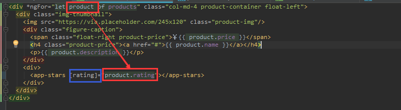

# demo-angular-shopping开发流程

## 准备工作

1. `ng new demo-angular-shopping`生成新的Angular初始项目
2. 导入第三方依赖bootstrap和jquery

## 项目分析


实例应用主界面包含7个基本组件：

- 主组件
- 导航栏组件
- 搜索表单组件
- 轮播图组件
- 商品列表组件
- 星级评价组件
- 页脚组件

主组件是创建项目时默认生成的，因此我们只要声明其余6个组件即可。

使用`ng generate component new-component`或`ng g component new-component`生成名为new-component的组件：

```powershell
$ ng g component navbar

$ ng g component search

$ ng g component carousel

$ ng g component products

$ ng g component stars

$ ng g component footer
```


`ng generate component new-component`命令会创建以new-component.component.为前缀的html模板文件、spec.ts测试文件、ts控制器文件、css样式文件，并在AppModule中注册该组件：


## 组件

### 开发app组件

##### 开发app组件模板

页面整体分为上中下三部分：上部为`<app-navbar>`导航栏组件，下部为`<app-footer>`页脚组件。

```html
<app-navbar></app-navbar>
<div class="container">
  <div class="row">
    <div class="col-md-3">
      <app-search></app-search>
    </div>
    <div class="col-md-9">
      <div class="row">
        <app-carousel></app-carousel>
      </div>
      <div class="row">
        <app-products></app-products>
      </div>
    </div>
  </div>
</div>
<app-footer></app-footer>
```

中间部分是一个包裹着主要内容的容器，使用bootstrap的`container`类修饰渲染：

```css
.container {
  width: 100%;
  padding-right: 15px;
  padding-left: 15px;
  margin-right: auto;
  margin-left: auto;
}
```

该容器内部又分为左右两部分：左部占1/3，右边占3/4，并且这两部分包含在使用bootstrap的`row`类修饰渲染的div中：

```css
.row {
  display: -ms-flexbox;
  display: flex;
  -ms-flex-wrap: wrap;
  flex-wrap: wrap;
  margin-right: -15px;
  margin-left: -15px;
}
```

如上所示，`row`内部使用flex布局。flex是一种可以简单、快速弹性布局的属性，主要思想是赋予容器控制内部元素高度和宽度的能力。


`row`的左孩子使用`col-md-3`修饰，占了该容器的25%；`row`的右孩子使用`col-md-9`修饰，占了该容器的75%。

`注：一般地，flex弹性布局会将容器分为12部分（默认是宽度，也就是指定item排列方向为row），col-md-3的含义为占了12份中的3份，即1/4。`

```css
.col-md-3 {
  -ms-flex: 0 0 25%;
  flex: 0 0 25%;
  max-width: 25%;
}

.col-md-9 {
  -ms-flex: 0 0 75%;
  flex: 0 0 75%;
  max-width: 75%;
}
```

而且右半部分又分为上下两部分。最终布局效果如下：


### 开发导航栏组件

#### 开发导航栏组件模板

[Bootstrap v4.3 - Navbar](https://getbootstrap.com/docs/4.3/components/navbar/)

Navbar和Nav的区别：当屏幕缩小时，navbar可以折叠（nav不可以折叠）

### 开发搜索表单组件

#### 开发搜索表单组件模板

```html
<form name="search" role="form">
  <div class="form-group">
      <label for="productName">商品名称：</label>
      <input type="text" id="productName" placeholder="商品名称" class="form-control"/>
  </div>
  <div class="form-group">
    <label for="productPrice">商品价格：</label>
    <input type="text" id="productPrice" placeholder="商品价格" class="form-control"/>
  </div>
  <div class="form-group">
    <label for="productCategory">商品类别：</label>
    <select id="productCategory" class="form-control">
      <option>这是个什么玩意儿</option>
    </select>
  </div>
  <div class="form-group">
    <button type="submit" class="btn btn-primary btn-block">搜索</button>
  </div>
</form>

```

### 开发轮播图组件

#### 开发轮播图组件模板

[Bootstrap v4.3 - Carousel](https://getbootstrap.com/docs/4.3/components/carousel/)

[图片占位符工具](https://placeholder.com/)

```html
<div id="productCarousel" class="carousel slide" data-ride="carousel">
  <ol class="carousel-indicators">
    <li data-target="#productCarousel" data-slide-to="0" class="active"></li>
    <li data-target="#productCarousel" data-slide-to="1"></li>
    <li data-target="#productCarousel" data-slide-to="2"></li>
  </ol>
  <div class="carousel-inner">
    <div class="carousel-item active">
      
    </div>
    <div class="carousel-item">
      
    </div>
    <div class="carousel-item">
      
    </div>
  </div>
  <a class="carousel-control-prev" href="#productCarousel" role="button" data-slide="prev">
    <span class="carousel-control-prev-icon" aria-hidden="true"></span>
    <span class="sr-only">Previous</span>
  </a>
  <a class="carousel-control-next" href="#productCarousel" role="button" data-slide="next">
    <span class="carousel-control-next-icon" aria-hidden="true"></span>
    <span class="sr-only">Next</span>
  </a>
</div>
```

### 开发商品列表组件

#### 开发商品列表组件模板

`*ngFor`命令用来遍历数组/集合中的元素。用法如下：

```html
<div *ngFor="let product of products" class="col-md-4 product-container float-left">
  <div class="img-thumbnail">
    
    <div class="figure-caption">
      <span class="float-right">￥{{ product.price }}</span>
      <h4><a href="#">{{ product.name }}</a></h4>
      <p>{{ product.description }}</p>
    </div>
    <div>
      <app-stars></app-stars>
    </div>
  </div>
</div>
```

#### 开发商品列表组件控制器

##### 传入数据

`ngOnInit()`函数是Component生命周期函数（钩子），在Component被初始化时调用一次，一般用来初始化组件中需要使用到的数据。

```typescript
import { Component, OnInit } from '@angular/core';
import { Product } from '../entity/product'

@Component({
  selector: 'app-products',
  templateUrl: './products.component.html',
  styleUrls: ['./products.component.css']
})
export class ProductsComponent implements OnInit {

  private products: Array<Product>
  constructor() { }

  // Component生命周期函数（钩子），在Component被初始化时调用一次，一般用来初始化组件中需要使用到的数据
  ngOnInit() {
    this.products = [
      new Product(1, '商品1', 1.00, 4.5, '这是商品1', ['电子', '屏显']),
      new Product(2, '商品2', 2.00, 1.5, '这是商品2', ['运动']),
      new Product(3, '商品3', 3.00, 5.0, '这是商品3', ['电子']),
      new Product(4, '商品4', 4.00, 4.5, '这是商品4', ['电子', '性能']),
      new Product(5, '商品5', 5.00, 3.0, '这是商品5', ['洗护']),
      new Product(6, '商品6', 6.00, 2.5, '这是商品6', ['电子'])
    ];
  }

}
```

> app/entity/product.ts

```typescript
export class Product {

  constructor(
    public id: number,
    public name: string,
    public price: number,
    public rating: number,
    public description: string,
    public categories: Array<string>
  ) { }
}
```

### 开发星级评价组件

要开发星级评价组件，要解决如下几个问题：

1. 如何显示一颗星星？

   使用Icon库，推荐[Font Awesome](http://fontawesome.dashgame.com/)

   - 使用npm安装Font Awesome依赖

     ```powershell
     $ npm install font-awesome --save
     ```

   - 将安装的第三方库引入到项目中：

     > demo-angular-shopping/angular.json

     

   - 在style.css中导入font-awesome.css

     >demo-angular-shopping/src/style.css

     ```css
     /* You can add global styles to this file, and also import other style files */
     @import '~font-awesome/css/font-awesome.css';
     ```

   - 使用font-awesome显示一颗实心星星

     ```html
     <p>
       <i class="fa fa-star"></i>
     </p>
     ```

   - 使用font-awesome显示一颗空心星星

     ```html
     <p>
       <!-- 其实这里是用fa-star-o覆盖了fa-star中的重新属性 -->
       <i class="fa fa-star fa-star-o"></i>
     </p>
     ```

2. 如何显示五颗星星？

   - 可以使用`*ngFor`属性来使用一套逻辑显示处理若干星星。

     ```html
     <p>
       <i *ngFor="let star of stars" class="fa fa-star fa-star-o"></i>
     </p>
     ```

     Angular中使用`{{ }}`将属性括起来，以此来表示插值绑定：直接把该后台属性的值显示在页面上。

     ```html
     <tag>{{ backend-attr }}</tag>
     ```

     属性绑定使用`[]`将html的标签属性括起来，并将该属性的值与后台某属性的值对应起来。

     ```html
     <tag [tag-attr]="backend-attr"></tag>
     ```

     属性绑定有一个特例，样式绑定，可以让我们使用后台属性决定是否选用某css样式。

     ```html
     <tag [class.class-attr]="backend-attr"></tag>
     ```

     因此，我们的模板代码如下，当star为true时，我们给`<i>`标签加上`fa-star-o`样式，即星星样式为空心，否则，还是为实心样式：

     ```html
     <p>
       <i *ngFor="let star of stars" class="fa fa-star" [class.fa-star-o]="star"></i>
     </p>
     ```

     相应地，在后台我们应该提供一个一维5元数组来对应这五颗星星。

     ```typescript
     import { Component, OnInit } from '@angular/core';
     
     @Component({
       selector: 'app-stars',
       templateUrl: './stars.component.html',
       styleUrls: ['./stars.component.css']
     })
     export class StarsComponent implements OnInit {
     
       private stars: boolean[]
     
       constructor() { }
     
       ngOnInit() {
         // 2颗实心，3颗空心
         this.stars = [false, false, true, true, true];
       }
     
     }
     ```

3. 如何将商品的星级评价数值rating传递给星级评价组件？

   该问题涉及到父组件向子组件传值的知识点：

   - 首先，我们在子组件控制器中声明一个变量（用来保存父组件向子组件传递的值），并使用装饰器`@Input()`装饰

     

   - 然后，在父组件调用子组件的文件（模板文件）中，找到子组件对应的标签，**使用属性绑定将父组件中的值传递给子组件**。

     

4. 如何根据商品星级评价数值rating决定星星是空心的还是实心的？

   根据rating来决定boolean数组stars中元素的取值。

   ```typescript
   ngOnInit() {
     this.stars = [];
     for (let i = 1; i <= 5; i++) {
       this.stars.push(i > this.rating);
     }
   }
   ```

### 开发页脚组件

#### 开发页脚组件模板

```html
<div class="container">
  <hr/>
  <footer>
    <div class="row">
      <div class="col-md-12">
        <p>Demo about online auction for learning Angular.Powered by Yobol &copy;2018-2019.</p>
      </div>
    </div>
  </footer>
</div>
```

## 路由


### SPA

SPA（Single Page Application，单页应用）是一个主页面只加载一次，局部更新页面内容而不再刷新页面的应用。Angular应用就是SPA，在Angular应用中，使用路由器来实现根据用户的操作来改变页面的内容而不重新加载页面的特性。路由器的另外一个作用是为每一个视图分配一个URL，这样就可以根据这个URL跳转到指定的视图状态中。

我们可以把SPA想象为一组视图状态的集合，目前该示例项目中只有一个视图状态，即商品列表。


我们希望，不管应用处于什么样的视图状态，navbar/footer/search组件都将一直显示，而将根据用户操作在中间右侧区域显示不同的内容。因此，我们需要将该区域定义为一个插座，然后通过配置路由器，让该应用在不同的视图状态下，显示不同的组件。按照Angular的规定，在一个插座上只能显示一个组件，因此我们需要将carousel和products组件封装到一个HomeComponent中。

### 为项目添加路由


1. 创建商品详情组件，显示商品的图片和标题：

   - 使用`ng g component product`创建商品详情组件；

   - 修改product组件的控制器，试图从导航URL中获取所需的参数：

     

   - 修改product组件的模板，显示商品信息：

     

2. 重构代码，将carousel组件和products组件封装进新的Home组件中：

   - 使用`ng g component home`创建Home组件

   - 将AppComponent模板中的将carousel组件和products组件的占位符放到新创建的HomeComponent模板中

     

     

3. 手动配置路由（也可使用`ng new --routing new-app`在新建项目的时候自动配置路由），在导航到商品详情组件时传递商品的信息：

   - 手动配置AppModule的路由信息：

     

4. 修改AppComponent模板，根据路由显示HomeComponent或者ProductComponent

   

5. 修改商品列表组件，给商品名称添加带routerLink指令的链接，导航到ProductComponent

   