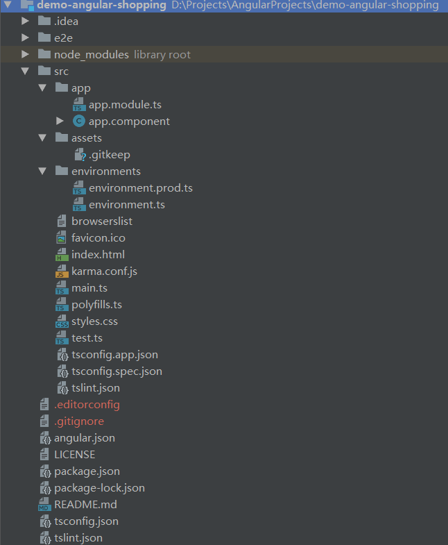

# 搭建Angular开发环境

[Angular快速上手](https://www.angular.cn/guide/quickstart)

## 下载安装开发环境

### 安装Node.js

[Node.js官网](https://nodejs.org/en/)

查看安装结果：

```powershell
$ npm -v
```

### 安装Angular CLI

使用Node.js的NPM（node.js包管理器）下载安装Angular CLI：

```powershell
$ npm install -g @angular/cli
```

查看安装结果：

```powershell
$ ng -v
```

### 安装IntelliJ WebStorm

[IntelliJ WebStorm官网](https://www.jetbrains.com/webstorm/)

如果原来使用IntelliJ IDEA，但是不想再安装WebStorm的话，只需要安装相应的插件即可。

## Angular CLI的使用

### 创建新项目

使用`ng new new-app`在当前目录下创建一个包含大量模板文件的新项目`new-app`。

### 初始化项目目录结构



- .idea目录：IntelliJ IDE项目的配置文件目录；

- **e2e目录：端到端的测试目录，包含基本的测试桩**；

- node_modules：项目依赖库；

- **src目录：应用源代码目录**：

  - **app目录包含了应用的组件和模块**：

    Angular项目必须至少包含一个模块和一个组件：

    - app.module
    - app.component

  - **assets目录用来存放静态资源**；

  - environments用来支持Angular项目的多环境开发；

  - **index.html是整个项目的根Html文件，包含一个`<app-root></app-root>`标签**；

  - karma.conf.js是自动化测试配置文件；

  - main.ts是整个项目脚本执行的入口点；

  - polyfill.ts用来导入一些必要的库，使得Angular能够正常地运行在一些老版本的浏览器中；

  - **styles.css定义整个项目的全局样式**；

  - test.ts也是自动化测试配置文件

  - tsconfig.app.json

  - tsconfig.spec.json

  - tslint.json

- .editorconfig是IntelliJ IDE项目的配置文件；

- .gitignore是Git的配置文件；

- **angular.json：Angular CLI的配置文件**；

- LICENSE是Git的配置文件；

- package.json是npm的配置文件，可以使用`npm install`命令将该配置文件中的依赖导入到node_modules依赖库中；

- **README.md包含了Angular CLI的基本使用说明**；

- tsconfig.json是TypeScript编译器的配置文件；

- tslint.json是tslint的配置文件，用来定义TypeScript代码质量检查规则；