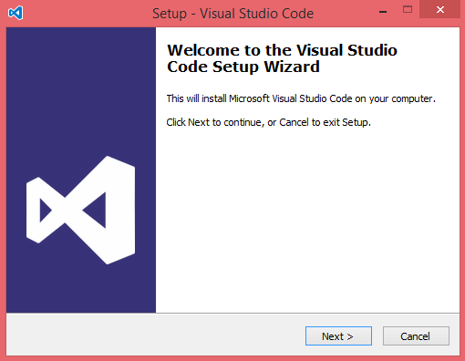

# TypeScript 安装

## 在线编写 TypeScript

[在线练习](https://www.tslang.cn/play/index.html)在线编写TypeScript并实时编译为JavaScript。

## NPM 安装 TypeScript

如果你的本地环境已经安装了 npm 工具（node.js的包管理工具），可以使用以下命令来安装：

```
npm install -g typescript
```

安装完成后我们可以使用 tsc 命令来执行 TypeScript 的相关代码，以下是查看版本号：

```
$ tsc -v
Version 3.2.2
```

然后我们新建一个 test.ts 的文件，代码如下：

```Typescript
var message: string = "Hello World"
console.log(message)
```

通常我们使用 .ts 作为 TypeScript 代码文件的扩展名。

然后执行以下命令将 TypeScript 转换为 JavaScript 代码：

```
tsc test.ts
```

这时候在当前目录下（与 test.ts 同一目录）就会生成一个 test.js 文件，代码如下：

```Javascript
var message = "Hello World";
console.log(message);
```

使用 node 命令来执行 test.js 文件：

```
$ node test.js 
Hello World
```

TypeScript 转换为 JavaScript 过程如下图：


我们还可以同时编译多个 ts 文件：

```
tsc file1.ts, file2.ts, file3.ts
```

tsc 常用编译参数如下表所示：

| 编译参数               | 说明                                                         |
| ---------------------- | ------------------------------------------------------------ |
| --help                 | 显示帮助信息                                                 |
| --module               | 载入扩展模块                                                 |
| --target               | 设置 ECMA 版本                                               |
| --declaration          | 额外生成一个 .d.ts 扩展名的文件。`tsc ts-hw.ts --declaration`以上命令会生成 ts-hw.d.ts、ts-hw.js 两个文件。 |
| --removeComments       | 删除文件的注释                                               |
| --out                  | 编译多个文件并合并到一个输出的文件                           |
| --sourcemap            | 生成一个 sourcemap (.map) 文件。sourcemap 是一个存储源代码与编译代码对应位置映射的信息文件。 |
| --module noImplicitAny | 在表达式和声明上有隐含的 any 类型时报错                      |
| --watch                | 在监视模式下运行编译器。会监视输出文件，在它们改变时重新编译。 |

------

## Visual Studio Code 介绍

很多 IDE 都有支持 TypeScript 插件，如：Visual Studio，Sublime Text 2，WebStorm / PHPStorm，Eclipse 等。

本章节主要介绍 Visual Studio Code，Visual Studio Code 是一个可以运行于 Mac OS X、Windows 和 Linux 之上的，针对于编写现代 Web 和云应用的跨平台源代码编辑器，由 Microsoft 公司开发。

下载地址：<https://code.visualstudio.com/>。

### Windows 上安装 Visual Studio Code

1、下载 [Visual Studio Code](https://code.visualstudio.com/)。


2、双击 VSCodeSetup.exe 图标  安装。



3、安装完成后，打开 Visual Studio Code 界面类似如下：


4、 我们可以在左侧窗口中点击当期编辑的代码文件，选择 **open in command prompt**（在终端中打开），这时候我们就可以在屏幕的右侧下半部分使用 **tsc** 命令来执行 TypeScript 文件代码了。

### Mac OS X 安装 Visual Studio Code

Mac OS X 安装配置 Visual Studio Code 可以查看： [https://code.visualstudio.com/Docs/editor/setup](https://code.visualstudio.com/docs/setup/setup-overview)

### Linux 安装 Visual Studio Code

Linux 安装配置 Visual Studio Code 可以查看： [https://code.visualstudio.com/Docs/editor/setup](https://code.visualstudio.com/docs/setup/setup-overview)

## 参考

[RUNOOB TypeScript安装](http://www.runoob.com/typescript/ts-tutorial.html)