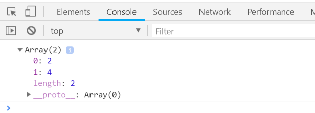

# TypeScript 基础语法

TypeScript 程序由以下几个部分组成：

- 模块
- 函数
- 变量
- 语句和表达式
- 注释

## TypeScript 保留关键字

TypeScript 保留关键字如下表所示：

| break        | as             | any            | switch       |
| ------------ | -------------- | -------------- | ------------ |
| **case**     | **if**         | **throw**      | **else**     |
| **var**      | **number**     | **string**     | **get**      |
| **module**   | **type**       | **instanceof** | **typeof**   |
| **public**   | **private**    | **enum**       | **export**   |
| **finally**  | **for**        | **while**      | **void**     |
| **null**     | **super**      | **this**       | **new**      |
| **in**       | **return**     | **true**       | **false**    |
| **any**      | **extends**    | **static**     | **let**      |
| **package**  | **implements** | **interface**  | **function** |
| **new**      | **try**        | **yield**      | **const**    |
| **continue** | **do**         | **catch**      |              |

## 空白和换行

TypeScript 会忽略程序中出现的空格、制表符和换行符。

空格、制表符通常用来缩进代码，使代码易于阅读和理解。

## TypeScript 区分大小写

TypeScript 区分大小写。

## 分号是可选的

每行指令都是一段语句，你可以使用分号或不使用， 分号在 TypeScript 中是可选的，建议使用。

以下代码都是合法的：

```TypeScript
console.log("建议为每条指令加上一个使用分号");
console.log("分号是可选的，即不用分号也是可以的")
```

如果语句写在同一行则一定需要使用分号来分隔，否则会报错，如：

```TypeScript
console.log("Hello");console.log("World");
```

## TypeScript 注释

注释可以提高程序的可读性。

注释可以包含有关程序一些信息，如代码的作者，有关函数的说明等。

编译器会忽略注释。

**TypeScript 支持两种类型的注释**

- **单行注释 ( // )** − 在 `//` 后面的文字都是注释内容。
- **多行注释 (/\* */)** − 这种注释可以跨越多行。

注释实例：

```TypeScript
// 这是一个单行注释
 
/* 
 这是一个多行注释 
 这是一个多行注释 
 这是一个多行注释 
*/
```

------

## TypeScript 箭头表达式(见函数-Lambda函数)

箭头表达式用来声明匿名函数，消除传统匿名函数的this指针问题。

**语法**

```typescript
(arg1, arg2, ...) => {
    return XXX;
}
```

`注：如果匿名函数方法体内代码只有一行的话，可以省略 { }和 return 。`

`注：如果匿名函数只有一个参数的话，可以省略 ( )。`

```typescript
var multiply = (a, b) => {
    return a * b;
}

var sum = (a, b) => a + b;

var greet = words => console.log(words);

var nums: number[] = [1, 2, 3, 4, 5];
var evens: number[] = nums.filter(value => {
    if (value % 2 == 0) {
        return value;
    }
});
console.log(evens);
```

编译后生成的 JavaScript 代码如下：

```javascript
var multiply = function (a, b) {
    return a * b;
};
var sum = function (a, b) { return a + b; };
var greet = function (words) { return console.log(words); };
var nums = [1, 2, 3, 4, 5];
var evens = nums.filter(function (value) {
    if (value % 2 == 0) {
        return value;
    }
});
console.log(evens);
```

输出结果为：



## TypeScript 与面向对象

面向对象是一种对现实世界理解和抽象的方法。

TypeScript 是一种面向对象的编程语言。

面向对象主要有两个概念：对象和类。

- **对象**：对象是类的一个实例，有状态和行为。例如，一条狗是一个对象，它的状态有：颜色、名字、品种；行为有：摇尾巴、叫、吃等。
- **类**：类是一个模板，它描述一类对象的行为和状态。
- **方法**：方法是类的操作的实现步骤。

下图中男孩女孩为类，而具体的每个人为该类的对象：


TypeScript 面向对象编程实例：

```TypeScript
class Boy {
    name: string = "Yobol";
    age: number = 21;
    greet(): void {
        console.log(`Hello,I'm ${ this.name }`)
    }
}

var boy = new Boy();
boy.greet();

```

以上实例定义了一个类 Boy，该类有两个状态name、age，还有一个方法 greet()。

使用new 关键字创建类的对象，并用该对象调用方法 greet()。

编译后生成的 JavaScript 代码如下：

```JavaScript
var Boy = /** @class */ (function () {
    function Boy() {
        this.name = "Yobol";
        this.age = 21;
    }
    Boy.prototype.greet = function () {
        console.log("Hello!I'm " + this.name);
    };
    return Boy;
}());
var boy = new Boy();
boy.greet();
```

输出结果如下:

```
Hello,I'm Yobol。
```

## 参考

[RUNOOB TypeScript基础语法](http://www.runoob.com/typescript/ts-basic-syntax.html)