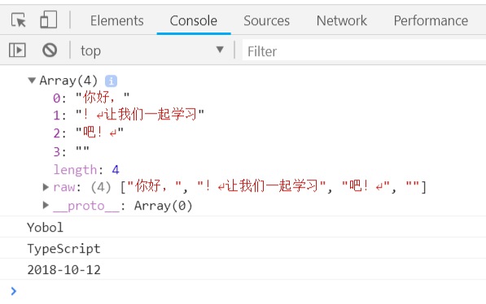

# TypeScript 数据类型

## any 

声明为任意类型 any 的变量可以赋予任意类型的值。

---

任意类型Any是 TypeScript 针对类型不明确的变量使用的一种数据类型，它常用于以下三种情况：

1. 变量的值会动态改变时，比如来自用户的输入，任意值类型可以让这些变量跳过编译阶段的类型检查：

```TypeScript
let x: any = '2的10次方';    // 字符串类型
x = 1024;    // 数字类型
```

2. 改写现有代码时，任意值允许在编译时可选择地包含或移除类型检查：

```TypeScript
let x: any = 4;
x.ifItExists();    // 正确，ifItExists方法在运行时可能存在，但这里并不会检查
x.toFixed();    // 正确
```

3. 定义存储各种类型数据的数组时：

```TypeScript
let arrayList: any[] = [1, false, 'fine'];
arrayList[1] = 100;
```

## number

声明为数字类型 number 的值用来表示整数和分数。双精度 64 位浮点值。

---

```TypeScript
let binaryLiteral: number = 0b1010; // 二进制
let octalLiteral: number = 0o744;    // 八进制
let decimalLiteral: number = 6;    // 十进制
let hexLiteral: number = 0xf00d;    // 十六进制
```

## string

声明为字符串类型 string 的值用来表示一个字符序列，使用单引号（'）或双引号（"）来表示字符串类型。

此外，TypeScript还引入了三个字符串新特性：多行字符串（换行），字符串模板（在一个字符串中使用一个表达式来插入变量或者调用方法），自动拆分字符串（你可以声明一个方法，该方法的参数将分别对应 剔除各表达式后的字符串，各表达式）。借助反引号（`），我们可以使用这三个特性。

```TypeScript
let student: string = 'Yobol'; // 单引号
let course: string = "TypeScript"; // 双引号
let date = function () {
    return "2018-10-12";
}

function say(words, student, course, date) {
    console.log(words);
    console.log(student);
    console.log(course);
    console.log(date)
}

say `你好，${ student }！
让我们一起学习${ course}吧！
${ date()}`; // 反引号
```

输出结果：



## boolean

声明为布尔类型 boolean 的值用来表示逻辑值：true 和 false。

---

```TypeScript
let flag: boolean = true;
```

## Array

声明变量为数组。

---

```TypeScript
// 在元素类型后面加上[]
let nums: number[] = [1, 2];

// 或者使用数组泛型
let nums: Array<number> = [1, 2];
```

## Tuple

元组类型用来表示已知元素数量和类型的数组，各元素的类型不必相同，但对应位置的类型需要相同。

---

```TypeScript
let student: [string, number];
student = ['Yobol', 21];    // 运行正常
student = [21, 'Yobol'];    // 报错
console.log(student[0]);    // 输出 Yobol
```

## enum

枚举类型用于定义数值集合。

---

```TypeScript
enum Poker {Heart, Spade, Diamond, Club};
let poker: Poker = Poker.Spade;
console.log(poker);    // 输出 1
```

## void

用于标识方法返回值的类型，表示该方法没有返回值。

---

```TypeScript
function say(): void {
    console.log("Hello World!");
}
```

## null 和 undefined

### null

表示对象值缺失。

---

在 JavaScript 中 null 表示 "什么都没有"。

null是一个只有一个值的特殊类型。表示一个空对象引用。

用 typeof 检测 null 返回是 object。

### undefined

用于初始化变量为一个未定义的值。

---

在 JavaScript 中, undefined 是一个没有设置值的变量。

typeof 一个没有值的变量会返回 undefined。

null 和 undefined 是其他任何类型（包括 void）的子类型，可以赋值给其它类型，如数字类型，此时，赋值后的类型会变成 null 或 undefined。而在TypeScript中启用严格的空校验（--strictNullChecks）特性，就可以使得null 和 undefined 只能被赋值给 void 或本身对应的类型：

```TypeScript
// 启用 --strictNullChecks
let x: number;
x = 1; // 运行正确
x = undefined;    // 运行错误
x = null;    // 运行错误
```

上面的例子中变量 x 只能是数字类型。如果一个类型可能出现 null 或 undefined， 可以用 | 来支持多种类型：

```TypeScript
// 启用 --strictNullChecks
let x: number | null | undefined;
x = 1; // 运行正确
x = undefined;    // 运行正确
x = null;    // 运行正确
```

更多内容可以查看：[JavaScript typeof, null, 和 undefined](http://www.runoob.com/js/js-typeof.html)

------

## never 类型

never 是其它类型（包括 null 和 undefined）的子类型，代表从不会出现的值。这意味着声明为 never 类型的变量只能被 never 类型所赋值，在函数中它通常表现为抛出异常或无法执行到终止点（例如无限循环）。

```TypeScript
let x: never;
let y: number;

// 运行错误，数字类型不能转为 never 类型
x = 123;

// 运行正确，never 类型可以赋值给 never类型
x = (()=>{ throw new Error('exception')})();

// 运行正确，never 类型可以赋值给 数字类型
y = (()=>{ throw new Error('exception')})();

// 返回值为 never 的函数可以是抛出异常的情况
function error(message: string): never {
    throw new Error(message);
}

// 返回值为 never 的函数可以是无法被执行到的终止点的情况
function loop(): never {
    while (true) {}
}
```

## 参考

[RUNOOB TypeScript基础类型](http://www.runoob.com/typescript/ts-type.html)