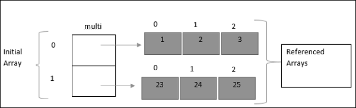
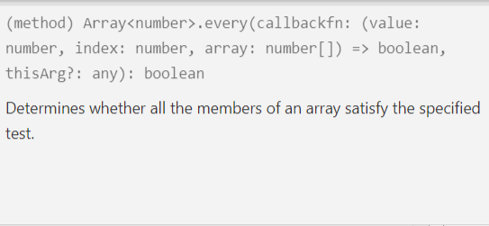
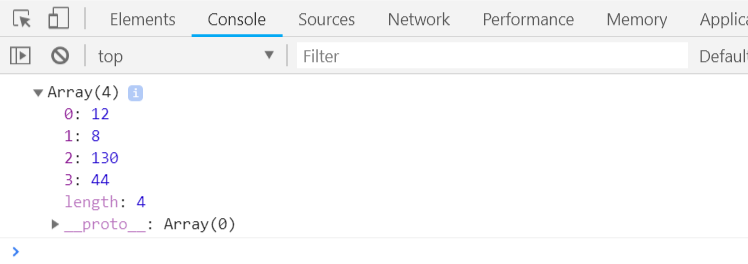

# TypeScript Array(数组)

数组对象是使用唯一的变量名来存储一系列类型相同的值。

## 数组类型

### 语法

TypeScript 数组声明的语法格式如下所示：

```typescript
var array_name[: datatype[]];        //声明 
array_name = [val1, val2, …, valn]   //初始化
```

或者直接在声明时初始化：

```typescript
var array_name[: datatype[]] = [val1, val2, …, valn]
```

如果数组声明时未设置类型，则默认为是 any 类型，并在初始化时根据第一个元素的类型来推断数组的类型。

### 实例

创建一个 number 类型的数组：

```typescript
var numlist: number[] = [2, 4, 6, 8]
```

整个数组结构如下所示：


索引值从 0 开始，我们可以根据索引值来访问数组元素：

```typescript
var words: string[] = ["Hello", "World"]
console.log(words[0]);
console.log(words[1]);
```

编译以上代码，得到以下 JavaScript 代码：

```javascript
var words;
sites = ["Hello", "World"];
console.log(words[0]);
console.log(words[1]);
```

输出结果为：

```
Hello
World
```

------

## Array 对象

我们也可以使用 Array 对象创建数组。Array 对象的构造函数接受以下两种值：

- 表示数组大小的数值。
- 初始化的数组列表，元素值使用逗号分隔。

### 直接指定数组大小

```typescript
var evens = new Array(4) // 指定数组长度为4
for (var i = 0; i < evens.length; i++) {
    evens[i] = 2 * i
    console.log(evens[i])
}
```

编译以上代码，得到以下 JavaScript 代码：

```javascript
var evens = new Array(4); // 指定数组长度为4
for (var i = 0; i < evens.length; i++) {
    evens[i] = 2 * i;
    console.log(evens[i]);
}
```

输出结果为：

```
0
2
4
6
```

### 直接初始化数组元素

```typescript
var evens = new Array(0, 2, 4, 6)
for (var i = 0; i < evens.length; i++) {
    console.log(evens[i])
}
```

编译以上代码，得到以下 JavaScript 代码：

```javascript
var evens = new Array(0, 2, 4, 6);
for (var i = 0; i < evens.length; i++) {
    console.log(evens[i]);
}
```

输出结果为：

```
0
2
4
6
```

## 数组解构

我们也可以把数组元素赋值给变量，如下所示：

```typescript
var nums: number[] = [1, 2] 
var[x, y] = nums // 将数组的两个元素赋值给变量 x 和 y
console.log(x) 
console.log(y)
```

编译以上代码，得到以下 JavaScript 代码：

```javascript
var nums = [1, 2];
var x = nums[0], y = nums[1]; // 将数组的两个元素赋值给变量 x 和 y
console.log(x);
console.log(y);
```

输出结果为：

```
1
2
```

## 数组迭代

我们可以使用 for 循环来遍历数组的各个元素：

```typescript
var nums: number[] = [1, 2, 3, 4]
// 使用for...in循环
for (var i in nums) {
    console.log(nums[i])
}

// 或者使用for...of循环
for (var j in nums) {
    console.log(j)
}
```

编译以上代码，得到以下 JavaScript 代码：

```javascript
var nums = [1, 2, 3, 4];
// 使用for...in循环
for (var i in nums) {
    console.log(nums[i]);
}
// 或者使用for...of循环
for (var _i = 0, nums_1 = nums; _i < nums_1.length; _i++) {
    var j = nums_1[_i];
    console.log(j);
}
```

输出结果为：

```
1
2
3
4
1
2
3
4
```

## 多维数组

数组的元素是数组。

最简单的多维数组是二维数组，定义方式如下：

```typescript
var arr_name: datatype[][]=[[val1, val2, val3], [v1, v2, v3]]
```

定义一个二维数组，每一维都是一个包含3个元素的数组。



```typescript
var multi: number[][] = [[1, 2, 3], [23, 24, 25]]
console.log(`${ multi[0][0] } ${ multi[0][1] } ${ multi[0][2] }`)
console.log(`${ multi[1][0] } ${ multi[1][1] } ${ multi[1][2] }`)
```

编译以上代码，得到以下 JavaScript 代码：

```javascript
var multi = [[1, 2, 3], [23, 24, 25]];
console.log(multi[0][0] + " " + multi[0][1] + " " + multi[0][2]);
console.log(multi[1][0] + " " + multi[1][1] + " " + multi[1][2]);
```

输出结果为：

```
1 2 3
23 24 25
```

## 数组在函数中的使用

### 作为参数传递给函数

```typescript
var words: string[] = new Array("Hello", "World")
function traverse(words_: string[]) {
    for(var i = 0; i < words_.length; i++) {
        console.log(words_[i])
    }
}
traverse(words);
```

编译以上代码，得到以下 JavaScript 代码：

```javascript
var words = new Array("Hello", "World");
function traverse(words_) {
    for (var i = 0; i < words_.length; i++) {
        console.log(words_[i]);
    }
}
traverse(words);
```

输出结果为：

```
Hello
World
```

### 作为函数的返回值

```typescript
function traverse(): string[] {
    return new Array("Hello", "World")
}
var words: string[] = traverse()
for(var i in words) {
    console.log(words[i])
}
```

编译以上代码，得到以下 JavaScript 代码：

```javascript
function traverse() {
    return new Array("Hello", "World");
}
var words = traverse();
for (var i in words) {
    console.log(words[i]);
}
```

输出结果为：

```
Hello
World
```

## 数组方法

### concat()

连接两个或更多的数组，并返回新的数组。

```typescript
var alpha = ["a", "b", "c"]; 
var numeric = [1, 2, 3];

var alphaNumeric = alpha.concat(numeric.toString()); 
console.log("alphaNumeric : " + alphaNumeric );    // alphaNumeric : a,b,c,1,2,3
```

### every()

判断数值数组的每个元素是否都符合条件。



```typescript
function isEven(num: number, index, nums) {
    return num % 2 == 0
}
        
var nums = [12, 5, 8, 130, 44].every(isEven)
console.log("Are all nums are even? Answer is " + nums) // false
```

### filter()

遍历数值元素，并返回包含所有符合条件的元素的数组。

```typescript
function isEven(num: number, index, nums) {
    return num % 2 == 0
}

var evens = [12, 5, 8, 130, 44].filter(isEven)
console.log(evens) 
```

输出结果为：



### forEach()

数组每个元素都执行一次回调函数。

```typescript
var nums: number[] = [1, 2, 3]
nums.forEach(function (num) {
    console.log(num)
})
```

输出结果为：

```
1
2
3
```

### indexOf()

搜索数组中的元素，并返回它所在的位置。

```typescript
var index = [1, 2, 3, 4].indexOf(3); 
console.log(index);  // 2
```

### join()

把数组的所有元素放入一个字符串。默认使用逗号`,`分隔。

```typescript
var arr = new Array("1", "2", "3")
          
var str = arr.join()
console.log("str : " + str)  // 1,2,3 
          
var str = arr.join(", ")
console.log("str : " + str)  // 1, 2, 3
          
var str = arr.join(" + ")
console.log("str : " + str)  // 1 + 2 + 3
```

### lastIndexOf()

返回一个指定的字符串值最后出现的位置。

```typescript
var index = [12, 5, 8, 130, 8].lastIndexOf(8);
console.log("index is : " + index )  // 4
```

### map()

通过指定函数处理数组的每个元素，并返回处理后的数组。

```typescript
var nums = [1, 4, 9]
var roots = nums.map(Math.sqrt)
console.log(roots)
```

输出结果为：


### pop()

删除数组的最后一个元素并返回删除的元素。

```typescript
var nums = [1, 4, 9]
          
var element = nums.pop()
console.log("element is : " + element) // 9
          
var element = nums.pop(); 
console.log("element is : " + element) // 4
```

### push()

向数组的末尾添加一个或更多元素，并返回新的长度。

```typescript
var nums = new Array(1, 4, 9) 
var length = numbers.push(10) // 4
console.log("nums is : " + nums)  // nums is : 1,4,9,10 
length = numbers.push(20)  // 5
console.log("nums is : " + nums)  // nums is : 1,4,9,10,20
```

### reduce()

将数组元素计算为一个值（从左到右）。

```typescript
var result = [0, 1, 2, 3].reduce(function(a, b) {
    return a - b
})
console.log("result is : " + result ) // -6
```

### reduceRight()

将数组元素计算为一个值（从右到左）。

```typescript
var total = [0, 1, 2, 3].reduceRight(function(a, b) {
    return a - b
})
console.log("total is : " + total ) // 0
```

### reverse()

反转数组的元素顺序。

```typescript
var arr = [0, 1, 2, 3].reverse()
console.log("Reversed array is : " + arr) // 3,2,1,0
```

### shift()

删除并返回数组的第一个元素。

```typescript
var arr = [10, 1, 2, 3].shift()
console.log("Shifted value is : " + arr) // 10
```

### slice()

选取数组的的一部分，并返回一个新数组。

```typescript
var arr = ["orange", "mango", "banana", "sugar", "tea"]
console.log("arr.slice(1, 2) : " + arr.slice(1, 2) ) // mango
console.log("arr.slice(1, 3) : " + arr.slice(1, 3) ) // mango,banana
```

### some()

检测数组元素中是否有元素符合指定条件。

```typescript
function isEven(num, index, nums) {
    return num % 2 == 0
}

console.log([1, 3, 5].some(isEven)) // false
console.log([2, 4, 7].some(isEven)) // true
```

### sort()

对数组的元素进行排序。

```typescript
var arr = new Array("orange", "mango", "banana", "sugar")
var sorted = arr.sort()
console.log("Returned string is : " + sorted) // banana,mango,orange,sugar
```

### splice()

向数组中添加或从数组中删除元素。


```typescript
var arr = ["orange", "mango", "banana", "sugar", "tea"]
var removed = arr.splice(2, 0, "water")
console.log("After adding 1: " + arr ) // orange,mango,water,banana,sugar,tea 
console.log("removed is: " + removed)
          
removed = arr.splice(3, 1)
console.log("After removing 1: " + arr) // orange,mango,water,sugar,tea 
console.log("removed is: " + removed) // banana
```

### toString()

把数组转换为字符串，并返回结果。

```typescript
var arr = new Array("orange", "mango", "banana", "sugar")
var str = arr.toString()
console.log("Returned string is : " + str ) // orange,mango,banana,sugar
```

### unshift()

向数组的开头添加一个或更多元素，并返回新的长度。

```typescript
var arr = new Array("orange", "mango", "banana", "sugar")
var length = arr.unshift("water")
console.log("Returned array is : " + arr ) // water,orange,mango,banana,sugar 
console.log("Length of the array is : " + length ) // 5
```


## 参考

[RUNOOB TypeScript Array(数组)](http://www.runoob.com/typescript/ts-array.html)