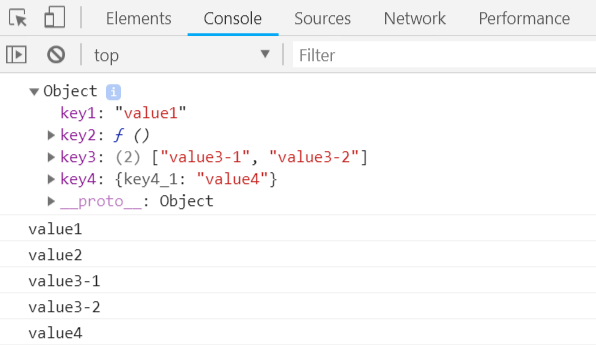

# TypeScript 对象

TypeScript 对象是包含一组键值对的实例，值可以是标量、函数、集合（数组或元组）、对象等。

## 声明|访问对象

```typescript
var objectName = {
    key1: "value1", // 标量
    key2: function() { // 函数
        return "value2"
    },
    key3: ["value3-1", "value3-2"], // 集合
    key4: { // 对象
    	key4_1: "value4"
	}
}

console.log(objectName)
console.log(objectName.key1)
console.log(objectName.key2())
var key3 = objectName.key3
console.log(key3[0])
console.log(key3[1])
var key4 = objectName.key4
console.log(key4.key4_1)
```

编译以上代码，得到以下 JavaScript 代码：

```javascript
var objectName = {
    key1: "value1",
    key2: function () {
        return "value2";
    },
    key3: ["value3-1", "value3-2"],
    key4: {
        key4_1: "value4"
    }
};
console.log(objectName);
console.log(objectName.key1);
console.log(objectName.key2());
var key3 = objectName.key3;
console.log(key3[0]);
console.log(key3[1]);
var key4 = objectName.key4;
console.log(key4.key4_1);
```

输出结果为：



## 类型模板

假如我们在 JavaScript 定义了一个对象：

```javascript
var objectName = {
    key1: "value1"
};
```

这时如果我们想在对象中添加方法，可以做以下修改：

```javascript
objectName.key2 = function() {
    return "value2";
}
```

但是如果我们在 TypeScript 中使用以上方式则会出现编译错误，因为Typescript 中的对象必须是特定类型的实例。

```typescript
var objectName = {
    key1: "value1", // 标量
    key2: function() { // 类型模板
    }
}

objectName.key2 = function() {
    return "value2"
}

console.log(objectName.key2())
```

编译以上代码，得到以下 JavaScript 代码：

```javascript
var objectName = {
    key1: "value1",
    key2: function () {
    }
};
objectName.key2 = function () {
    return "value2";
};
console.log(objectName.key2());
```

输出结果为：

```
value2
```

此外对象也可以作为一个参数传递给函数，如下实例：

```typescript
var objectName = {
    key1: "value1",
    key2: "value2"
}

var functionName = function (obj: {
    key1: string,
    key2: string
}) {
    console.log(obj.key1)
    console.log(obj.key2)
}

functionName(objectName)
```

编译以上代码，得到以下 JavaScript 代码：

```javascript
var objectName = {
    key1: "value1",
    key2: "value2"
};
var functionName = function (obj) {
    console.log(obj.key1);
    console.log(obj.key2);
};
functionName(objectName);
```

输出结果为：

```
value1
value2
```

## 鸭子类型(Duck Typing)

鸭子类型（英语：duck typing）是动态类型的一种风格，是多态(polymorphism)的一种形式。

在这种风格中，一个对象有效的语义，不是由继承自特定的类或实现特定的接口，而是由"当前方法和属性的集合"决定。

> 可以这样表述：
>
> "当看到一只鸟走起来像鸭子、游泳起来像鸭子、叫起来也像鸭子，那么这只鸟就可以被称为鸭子。"

在鸭子类型中，关注点在于对象的行为，能做什么，而不是关注对象所属的类型。例如，在不使用鸭子类型的语言中，我们可以编写一个函数，它接受一个类型为"鸭子"的对象，并调用它的"走"和"叫"方法。在使用鸭子类型的语言中，这样的一个函数可以接受一个任意类型的对象，并调用它的"走"和"叫"方法。如果这些需要被调用的方法不存在，那么将引发一个运行时错误。任何拥有这样的正确的"走"和"叫"方法的对象都可被函数接受的这种行为引出了以上表述，这种决定类型的方式因此得名。

```typescript
interface IPoint {
    x: number
    y: number
}
function add(p1: IPoint, p2: IPoint): IPoint {
    var x = p1.x + p2.x
    var y = p1.y + p2.y
    return {
        x: x,
        y: y
    }
} 
 
// 正确
var newPoint1 = add({x: 3, y: 4}, {x: 5, y: 1})  
 
// 错误 
var newPoint2 = add({x: 1}, {x: 4, y: 3})
```

## 参考

[RUNOOB TypeScript对象](http://www.runoob.com/typescript/ts-object.html)