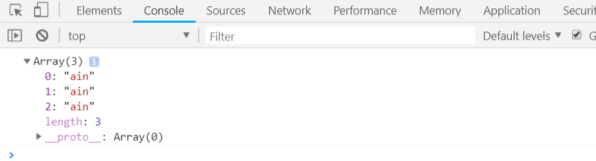
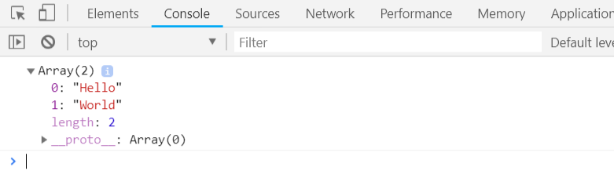

# TypeScript String

String 对象用于处理文本（字符串）。

## 语法

```typescript
var txt = new String("string");
// 或者更简单方式：
var txt = "string";
```

## String 基本属性

| 属性            | 描述                                                    |
| --------------- | ------------------------------------------------------- |
| **length**      | 返回字符串的长度。                                      |
| **constructor** | 对创建该对象的函数的引用。                              |
| **prototype**   | String 对象的静态属性。使您有能力向对象添加属性和方法。 |

### constructor实例

```typescript
var str = new String("Hello World!")
console.log("str.constructor is: " + str.constructor)
```

编译以上代码，得到以下 JavaScript 代码：

```javascript
var str = new String("Hello World!");
console.log("str.constructor is: " + str.constructor);
```

输出结果为：

```
str.constructor is: function String() { [native code] }
```

### prototype实例

```typescript
function user(id: number, name: string) {
    this.id = id
    this.name = name
}
var yobol = new user(123456, "yobol")
user.prototype.email = "yobol@yobol.com"
console.log("用户ID: " + yobol.id)
console.log("用户名: " + yobol.name)
console.log("用户邮箱: " + yobol.email)
```

编译以上代码，得到以下 JavaScript 代码：

```javascript
function user(id, name) {
    this.id = id;
    this.name = name;
}
var yobol = new user(123456, "yobol");
user.prototype.email = "yobol@yobol.com";
console.log("用户ID: " + yobol.id);
console.log("用户名: " + yobol.name);
console.log("用户邮箱: " + yobol.email);
```

输出结果为：

```
用户ID: 123456
用户名: yobol
用户邮箱: yobol@yobol.com
```

## String 对象方法

###   charAt()

  返回在指定位置的字符。

```typescript
var str = new String("Hello World!")
console.log("str.charAt(0) 为： " + str.charAt(0))
console.log("str.charAt(11) 为： " + str.charAt(11))
```

编译以上代码，得到以下 JavaScript 代码：

```javascript
var str = new String("Hello World!");
console.log("str.charAt(0) 为： " + str.charAt(0));
console.log("str.charAt(11) 为： " + str.charAt(11));
```

输出结果为：

```
str.charAt(0) 为： H
str.charAt(11) 为： !
```

###   charCodeAt()

  返回指定位置的字符对应的 Unicode 编码。

```typescript
var str = new String("AaZz")
console.log("str.charCodeAt(0) 为： " + str.charCodeAt(0))
console.log("str.charCodeAt(1) 为： " + str.charCodeAt(1))
console.log("str.charCodeAt(2) 为： " + str.charCodeAt(2))
console.log("str.charCodeAt(3) 为： " + str.charCodeAt(3))
```

编译以上代码，得到以下 JavaScript 代码：

```javascript
var str = new String("AaZz");
console.log("str.charCodeAt(0) 为： " + str.charCodeAt(0));
console.log("str.charCodeAt(1) 为： " + str.charCodeAt(1));
console.log("str.charCodeAt(2) 为： " + str.charCodeAt(2));
console.log("str.charCodeAt(3) 为： " + str.charCodeAt(3));
```

输出结果为：

```
str.charCodeAt(0) 为： 65
str.charCodeAt(1) 为： 97
str.charCodeAt(2) 为： 90
str.charCodeAt(3) 为： 122
```

### concat()

  连接两个或更多字符串，并返回新的字符串。

```typescript
var hello = new String("Hello")
var space = new String(" ")
var world = new String("World")
console.log(hello.concat(space.valueOf()).concat(world.valueOf()))
```

编译以上代码，得到以下 JavaScript 代码：

```javascript
var hello = new String("Hello");
var space = new String(" ");
var world = new String("World");
console.log(hello.concat(space.valueOf()).concat(world.valueOf()));
```

输出结果为：

```
Hello World
```

### indexOf()

返回某个指定的字符串值在字符串中首次出现的位置。

```typescript
var str = new String("Hello World!")
console.log(str.indexOf("ll"))
```

编译以上代码，得到以下 JavaScript 代码：

```javascript
var str = new String("Hello World!");
console.log(str.indexOf("ll"));
```

输出结果为：

```
2
```

###   lastIndexOf()

从起始位置（0）开始向后遍历，返回指定字符串在源字符串中最后出现的位置。

```typescript
var str = new String("Hello World!")
console.log(str.lastIndexOf("o"))
```

编译以上代码，得到以下 JavaScript 代码：

```javascript
var str = new String("Hello World!");
console.log(str.lastIndexOf("o"));
```

输出结果为：

```
7
```

### localeCompare()

判断两个字符串是否是相等的。相等返回0，否则返回-1。

```typescript
var str1 = new String("Hello World!")
var str2 = new String("World")
console.log(str1.localeCompare(str2.valueOf()))
```

编译以上代码，得到以下 JavaScript 代码：

```javascript
var str1 = new String("Hello World!");
var str2 = new String("World");
console.log(str1.localeCompare(str2.valueOf()));
```

输出结果为：

```
-1
```

### match()

返回与正则表达式相匹配的结果数组。

```typescript
var str="The rain in SPAIN stays mainly in the plain"
console.log(str.match(/ain/g))
```

编译以上代码，得到以下 JavaScript 代码：

```javascript
var str = "The rain in SPAIN stays mainly in the plain";
console.log(str.match(/ain/g));
```

输出结果为：



### replace()

替换与正则表达式匹配的子串。

```typescript
var re = /(\w+)\s(\w+)/
var str = "zara ali"
console.log(str.replace(re, "$2, $1"))
```

编译以上代码，得到以下 JavaScript 代码：

```javascript
var re = /(\w+)\s(\w+)/;
var str = "zara ali";
console.log(str.replace(re, "$2, $1"));
```

输出结果为：

```
ali, zara
```

### search()

检索与正则表达式相匹配的值。

```typescript
var re = /apples/gi
var str = "Apples are round, and apples are juicy."
if (str.search(re) == -1 ) { 
   console.log("Does not contain Apples" )
} else { 
   console.log("Contains Apples" )
} 
```

编译以上代码，得到以下 JavaScript 代码：

```javascript
var re = /apples/gi;
var str = "Apples are round, and apples are juicy.";
if (str.search(re) == -1) {
    console.log("Does not contain Apples");
}
else {
    console.log("Contains Apples");
}
```

输出结果为：

```
Contains Apples
```

### split()

把字符串分割为子字符串数组。

```typescript
var str = new String("Hello World")
console.log(str.split(" ", 2))
```

编译以上代码，得到以下 JavaScript 代码：

```javascript
var str = new String("Hello World");
console.log(str.split(" ", 2));
```

输出结果为：



### slice()

提取字符串的片断，并在新的字符串中返回被提取的部分。

```typescript
var str = new String("Hello World")
console.log(str.slice(0, 5))
```

编译以上代码，得到以下 JavaScript 代码：

```javascript
var str = new String("Hello World");
console.log(str.slice(0, 5));
```

输出结果为：

```
Hello
```

### substring()

提取字符串中两个指定的索引号之间的字符。同slice()

```typescript
var str = new String("Hello World")
console.log(str.substr(0, 5))
```

编译以上代码，得到以下 JavaScript 代码：

```javascript
var str = new String("Hello World");
console.log(str.substr(0, 5));
```

输出结果为：

```
Hello
```

### substr()

从起始索引号提取字符串中指定数目的字符。

```typescript
var str = new String("Hello World")
console.log(str.substr(6, 5))
```

编译以上代码，得到以下 JavaScript 代码：

```javascript
var str = new String("Hello World");
console.log(str.substr(6, 5));
```

输出结果为：

```
World
```

### toLocaleLowerCase()

根据主机的语言环境把字符串转换为小写，只有几种语言（如土耳其语）具有地方特有的大小写映射。

### toLocaleUpperCase()

据主机的语言环境把字符串转换为大写，只有几种语言（如土耳其语）具有地方特有的大小写映射。

### toLowerCase()

把字符串转换为小写。

### toUpperCase()

把字符串转换为大写。

### toString()

返回字符串string。

### valueOf()

返回指定字符串对象的原始值string。

## 参考

[RUNOOB TypeScript String](http://www.runoob.com/typescript/ts-string.html)