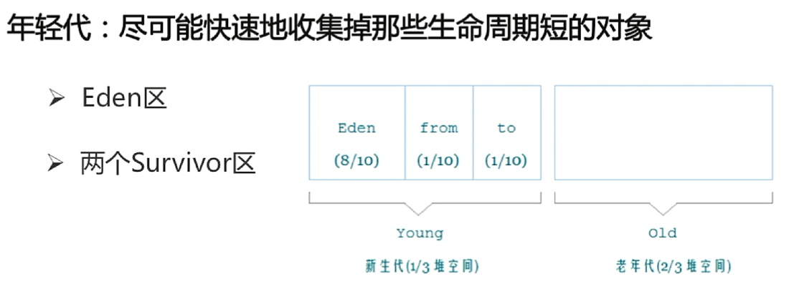
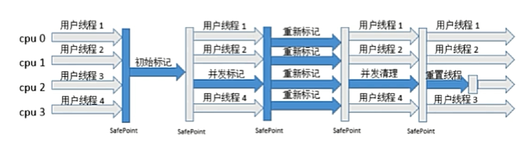

# Java GC机制

## 什么是GC？为什么要有GC/GC的优点？

GC（Garbage Collection），即垃圾回收，是指JVM用于**回收那些没有价值或者需要为更有价值的对象让位的对象，释放其占用的内存空间**。

忘记或错误回收内存会导致程序或系统的不稳定甚至崩溃，GC的出现可以自动检测对象是否超过其作用域从而达到自动回收的目的，使得程序员不必在内存的分配/释放上耗费大量精力，而更加专注于具体的业务。**垃圾回收可以有效防止内存泄露，有效的使用空闲内存**。

参考：[GC是什么? ](https://blog.csdn.net/leisure_life/article/details/74529253) | [为什么要有GC/GC的优点](https://blog.csdn.net/hustwht/article/details/52109343)

## 垃圾回收器的原理？

1. 垃圾回收有什么意义？
2. 如何判断对象可以被回收？
3. 如何进行垃圾回收？

参考：[深入理解JVM的垃圾回收机制](http://www.cnblogs.com/sunniest/p/4575144.html)

## 垃圾回收器可以马上回收内存吗？有什么办法主动通知虚拟机进行垃圾回收？

不可以。因为垃圾回收器通常是作为一个单独的低优先级线程运行，在不可预知的情况下会进行垃圾回收，程序员不能实时的调用垃圾回收器对某个对象或所有对象进行垃圾回收。显示调用System.gc()或者Runtime.getRuntime().gc()可以通知虚拟机进行垃圾回收。

参考：[GC是什么？为什么要有GC？](https://blog.csdn.net/hustwht/article/details/52109343)

## 如何判断对象可以被回收？

判断对象是否可以被回收，即判断对象是否仍被引用。

### 引用计数算法

为对象中添加一个引用计数器，每当有一个地方引用它的时候，计数器值就加1；当引用失效时，计数器值就减1；任何时刻，计数器值为0的对象都是不可以再被使用的。

优点：简单、高效；

缺点：无法解决对象之间相互循环引用的问题。

### 可达性分析算法

通过一系列的称为“GC Roots”的对象作为起始点，从这些节点开始向下搜索，搜索所走过的路径称为引用链，当一个对象到GC Roots没有任何引用链相连时，证明此对象是不可被使用的。


#### JVM中，哪些可作为GC Roots对象：

- 虚拟机栈（栈帧中的本地变量表）中引用的对象；
- 方法区中类静态变量引用的对象；
- 方法区中常量引用的对象；
- 本地方法栈中JNI引用的对象；
- 活跃线程的引用对象。

## JVM垃圾收集算法

### 标记-清除（mark-sweep）算法

首先标记所有需要被回收的对象，在标记完成后统一回收所有被标记的对象；

- 缺：标记和清除的效率都不高；
- 缺：清除后会产生大量不连续内存碎片（可能出现虽然还有很多的可用内存，但是无法分配大对象的情况）。


### 复制（copying）算法——新生代回收

将可用内存按照容量分为大小相等的两块，每次只使用其中的一块，当这一块的内存使用完了，就将还存活着的内存复制到另外一块上面，然后再把已使用过的内存空间一次性清理掉。

- 优：每次只需要对半个分区进行回收，内存分配时也就不用考虑内存碎片等复杂情况，只要移动堆顶指针，按顺序分配即可，实现简单，效率高，适用于存活率较低的场景（新生代）；
- 商用JVM实现：将内存分为一块较大的Eden区和两块较小的Survivor区，每次使用Eden和其中一块Survivor。当回收时，将Eden和Survivor上还存活着的对象一次性地复制到另外一块Survivor区上，然后清理掉Eden和刚才使用过的Survivor区。HotSpot默认Eden和Survivor的比例是8:1，也就是每次新生代中可用内存空间为整个新生代容量的90%。当Survivor区空间不足以存放在上次收集后还存活着的对象时，需要使用其他内存（老年代）进行分配担保。
- 缺：在对象存活率较高时需要进行较多的复制操作，效率较低。


### 标记-整理（mark-compact）算法——老年代回收

标记过程同标记-清除算法，但后续不是直接对可回收对象进行清理，而是让所有存活的对象都向一端移动，然后清理掉端边界以外的内存。

优：解决内存碎片问题，适用于存活率较高的场景（老年代）；


### 分代算法

根据对象存活周期的不同将内存分为新生代和老年代，对每个区域使用不同的收集策略：

- 新生代对象存活率低，使用**复制**算法，只需要付出很少的复制成本就可完成收集；
- 老年代对象存活率高、还没有分配担保的区域，使用**标记-清除**或**标记-整理**算法进行回收。


## GC的分类

### Minor GC

回收新生代。

#### 触发Minor GC的条件

当Eden空间不足时，会触发Minor GC回收新生代的内存空间。

### Major GC

回收老年代。

### Full GC

回收新生代和老年代。




Full GC比Minor GC慢，但执行效率低。

#### 触发Full GC的条件

- 老年代内存空间不足；
- 永久代空间不足（仅针对JDK7及之前的版本）；
- CMS GC时出现promotion failed，concurrent mode failure；
- Minor GC晋升到老年代的平均大小大于老年代的剩余空间；
- 调用`System.gc()`提示JVM进行Full GC。

## 对象如何晋升到老年代

- 经历一定Minor GC次数（默认15次）依然存活的对象；
- Minor GC时Survivor区放不下的对象；
- 新生成的大对象（-XX:+PretenuerSizeThreshold）；

## Stop-the-World

- JVM由于要执行GC而停止了应用程序的执行；
- 任何一种GC算法都会发生；
- 多数GC优化都是通过减少Stop-the-World发生的时间来提高程序性能。

## Safepoint

- 分析过程中对象引用关系不会发生变化的点；
- 产生Safepoint的地方：方法调用、循环跳转和异常跳转等；

## 垃圾收集器


`注：有连线表示可以搭配使用。`

### 新生代常见的垃圾收集器

#### Serial收集器

采用复制算法，`-XX:+UseSerialGC`。

- **单**线程回收，进行垃圾收集时，必须暂停所有工作线程；
- 简单高效，Client模式下默认的年轻代收集器；


#### ParNew收集器

采用复制算法，`-XX:UseParNewGC`。

- 以缩短stop-the-world时间为出发点；
- **多**线程回收，进行垃圾收集时，必须暂停所有工作线程；
- 单核环境下效率不如Serial，在多核下执行才有优势；


#### Parallel Scavenge收集器

`注：scavenge，扫荡。`

采用复制算法，`-XX:UseParallelGC`。

- 以提高程序吞吐量为出发点；
- 吞吐量 = 运行用户代码时间 / （运行用户代码时间 + 垃圾收集时间）；
- 比起关注用户线程停顿时间，更关注系统的吞吐量，比较适合于无太多交互的后台任务；
- 在多核下执行才有优势，Server模式下默认的新生代收集器。


### 老年代常见的垃圾收集器

#### Serial Old收集器

采用标记-整理算法，`-XX:+UseSerialOldGC`。

- **单**线程回收，进行垃圾收集时，必须停止所有工作线程；
- 简单高效，Client模型下默认的老年代收集器；


#### Parallel Old收集器

采用标记-整理算法，`-XX:UseParallelOldGC`。

- **多**线程回收，吞吐量优先；


#### CMS 收集器（Concurrent Mark Sweep）

采用标记-清除，`-XX:UseConcMarkSweepGC`。

- 几乎能够做到垃圾回收线程和工作线程同时运行，尽可能地缩短了Stop-the-World时间；
- 当JVM中存在较多存活时间较长的对象，可以考虑使用CMS收集器；
- CMS收集器执行垃圾回收过程：
  1. **初始化标记**：停止所有工作线程，即**stop-the-world**，时间极其短暂，该阶段仅仅标记一下GC Roots能直接关联到的对象；
  2. 并发标记：并发进行GC Roots追溯，程序不会停顿；
  3. **重新标记**：暂停虚拟机，即**stop-the-world**，为了修正并发期间因用户程序继续运作而导致标记产生变动的那一部分对象的标记记录；
  4. 并发清理：清理垃圾对象，程序不会停顿；
  5. 并发重置：重置CMS收集器的数据结构。



CMS 收集器使用标记-清除算法，因此不可避免地会产生大量的内部碎片。为了解决这个问题，CMS 收集器会在要进行Full GC时开启内存碎片的合并整理过程（不像标记-整理算法那样每次回收都对内存进行整理）。

### 混合垃圾收集器

#### G1（Garbage First）收集器

采用复制+标记-整理算法，`-XX:UseG1GC`。

- 并行和并发以缩短stop-the-world时间；
- 分代收集；
- 空间整合；
- 可预测的停顿，能让消耗在垃圾收集上的时间不超过N毫秒；

将整个Java堆内存分为多个大小相等的Region，新生代和老年代不再物理隔离。


## 描述一下对象回收过程（finalize()方法）

若对象在进行可达性分析后发现没有与 GC roots 相连接的引用链，那么他将会被第一次标记并进行一次筛选，筛选的条件是该对象是否有必要执行 finalize()方法，当对象没有重写finalize()方法或者 finalize()方法已经被虚拟机调用过（任何一个对象的 finalize()方法都只会被系统调用一次。），虚拟机将这两种情况都视为没必要执行。

若该对象被判定为有必要执行 finalize 方法，则这个对象会被放在一个 F-Queue 队列，finalize 方法是对象逃脱死亡命运的最后一次机会，稍后 GC 将对 F-queue 中的对象进行第二次小规模的标记，若对象要在 finalize 中成功拯救自己—只要重新与引用链上的任何一个对象建立关联即可，那么在第二次标记时他们将会被移出“即将回收”集合。

## Java引用类型

根据引用类型语义的强弱来决定垃圾回收的阶段。后三类引用本质上是可以让开发者通过代码的方式来决定对象的垃圾回收时机。

### 强引用（Strong Reference）

类似`Object obj = new Object()`这类的引用，**只要强引用还存在，垃圾收集器就永远不会回收掉被引用的对象**，可以将引用设置为null，使其被回收。

### 软引用（Soft Reference）

软引用用来描述一些**还有用但并非必需**的对象。对于软引用关联着的对象，**在系统将要发生内存溢出异常之前，将会把这些对象列进回收范围之中进行二次回收，如果这次回收还没有足够的内存，才会抛出OOM**。JDK 1.2之后，提供了SoftReference类来实现软引用。

可以用来实现高速缓存。

```java
String str = new String("ABC"); // 强引用
SoftReference<String> soft = new SoftReference<>(str); // 软引用
```

### 弱引用（Weak Reference）

弱引用也是用来描述非必需对象的，被弱引用关联的对象只能生存到下一次GC之前。当垃圾收集器工作时，**无论当前内存是否足够，都会回收掉被弱引用关联的对象**。JDK 1.2之后，提供了WeakReference类来实现软引用。

### 虚引用（Phantom Reference）

一个对象是否有虚引用的存在，完全不会对其生存时间构成影响，也**无法通过虚引用来取得一个对象实例**。为一个对象设置虚引用关联的唯一目的就是能**在这个对象被收集器回收时收到一个系统通知**。JDK 1.2之后，提供了PhantomReference类来实现软引用。