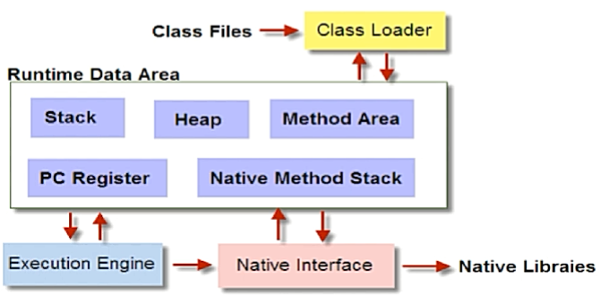
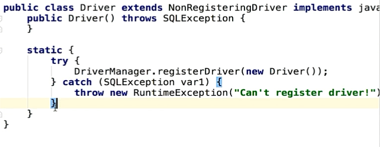
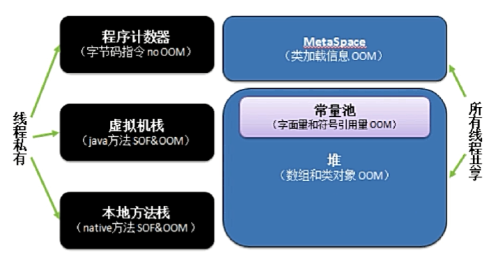
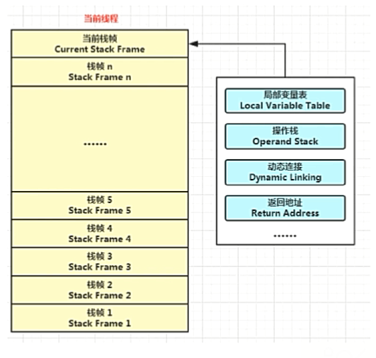
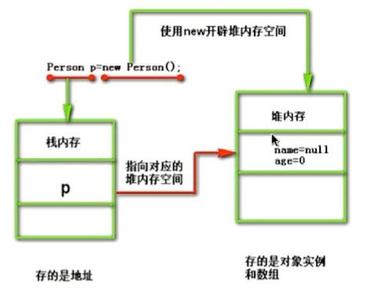
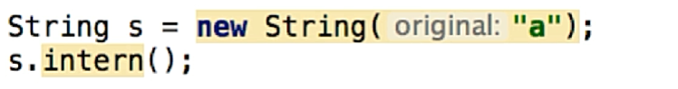
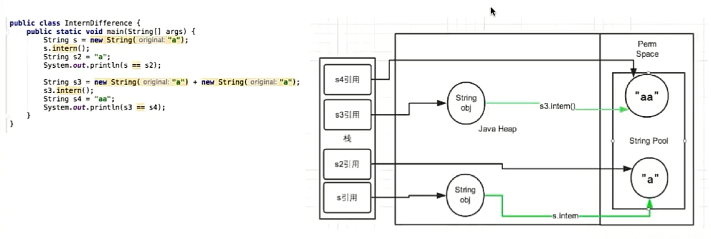
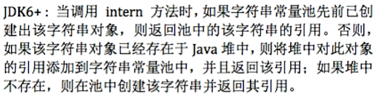

# Java底层知识

## Java如何实现跨平台

Java源码首先编译成**字节码文件**（与平台无关），可以由不同平台的JVM翻译成与机器相关的**机器指令**。 

```shell
javap -c me.yobol.basic.HelloWorld  # 反编译字节码文件
```

先编译成字节码文件，再由字节码翻译为机器指令，可以：

1. 不用每次执行前再进行语法等校验工作；
2. 别的语言也可以解析成字节码，然后复用Java的虚拟机实现平台无关性。

## JVM如何加载字节码文件

**JVM包含四个部分（JVM架构）：**



1. Class Loader（类加载器）：负责将字节码文件加载到内存中；
2. Runtime Data Area（运行时，即Java内存模型）；
3. Execution Engine（执行引擎）：对命令进行解析；
4. Native Interface（本地接口）：融合不同开发语言的原生库为Java所用（JVM会在内存中开辟一块名为“本地方法区”的空间，用来由Execution Engine加载Native Libraies）。

**JVM加载字节码文件简述：**

JVM通过Class Loader将符合格式要求的字节码文件加载到内存中，然后Execution Engine解析字节码文件并提交给操作系统执行。

## 反射机制

Java反射机制是在**运行状态**中，对于任何一个类，都知道这个类的所有属性和方法（包括访问受限）；对于任意一个对象，都能够调用它的任意属性和方法。这种动态获取信息以及动态调用对象方法的功能称为Java语言的反射机制。

**反射实例：**

> Robot.java

```java
package me.yobol.basic.reflect;

public class Robot {
    private String name;
    
    private String greet(String guy) {
        return "Hello " + guy + ", I'm" + name;
    }
}
```

> ReflectDemo.java

```java
package me.yobol.basic.reflect;

public class ReflectDemo {
    public static void main(String[] args) throws ClassNotFoundException, IllegalAccessException {
        Class c = Class.forName("me.yobol.basic.reflect.Robot");
        System.out.println("Class name is " + c.getName());
        // 获取me.yobol.basic.reflect.Robot类的实例对象
        Robot r = (Robot)c.newInstance();
        // 指定私有方法名和接收的参数
        Method greet = c.getDeclaredMethod("greet", String.class);
        greet.setAccessible(true);
        // 为私有属性赋值
        Field name = c.getDeclaredField("name");
        name.setAccessible(true);
        name.set(r, "Bob");
        
        String hello = (String)greet.invoke(r, "Yobol");
        System.out.println("Greet result is " + hello);
    }
}
```

`getMethod()`方法只能获取该类声明的`public`方法，并且能获取可继承的方法、实现自某接口的方法。

`getDeclaredMethod()`方法能获取该类声明的所有方法，不能获取继承的、实现自某接口的方法。

**反射的特点：**

优点：动态加载，更加灵活；

缺点：性能较差。

**反射应用场景：**

1. `Class.forName()加载数据库的驱动程序`；
2. Spring通过XML配置加载Bean；

## ClassLoader（类加载器）

### 类从编译到执行的过程

1. 编译器将源文件编译为字节码文件；
2. ClassLoader将字节码转换为JVM中的Class对象；
3. JVM利用Class对象实例化对应的实例对象。

### 什么是ClassLoader

Class Loader主要用于将字节码文件加载到JVM内存中。

### ClassLoader类

这是一个抽象类。

loadClass方法：体现了双亲委派机制。

### ClassLoader的种类

1. BootstrapClassLoader：C++编写，加载Java核心库，如`java.*`；
2. ExtClassLoader：Java编写，加载扩展库，如`javax.*`，用户也可以将自己的jar包放在该加载器的加载路径下；
3. AppClassLoader：Java编写，加载CLASSPATH路径下的CLASS文件；
4. 自定义ClassLoader：Java编写，定制化加载。

**自定义ClassLoader：**

可以加载任意路径下的Class文件。

```
1. 继承ClassLoader类，实现findClass方法；
2. InputStream读取Class文件，ByteArrayOutputStream.toByteArray()返回byte[]数组；
3. 传递给defineClass()方法；
4. 调用自定义类的loadClass()方法，返回Class对象；
5. ...
```

### 类的唯一性如何确定？

对于任意一个类，只有加载它的类加载器和其本身才能确定其在JVM中的唯一性（对于每个类加载器来说，都有一个独立的类名称空间）。因此比较两个类是否相同，只有这两个类是由同一个类加载器加载的前提下才有意义，否则即使这两个类来源于同一个 class 文件，被同一个虚拟机加载，只要加载他们的加载器不同，他们就是不同的类。

## 类的加载方式

- 隐式加载：new关键字会隐式调用类加载器；
- 显示加载：loadClass，forName等。

**类的装载过程**

1. 加载：ClassLoader将字节码文件加载到JVM内存中，生成Class对象；
2. 链接：
   1. 校验：检查加载的Class的正确性和安全性；
   2. 准备：为类变量（static修饰，存放在方法区）分配存储空间并设置类变量初始值；
   3. 解析：JVM将常量池内的符号引用转换为直接引用；
3. 初始化：执行类变量赋值和静态代码块；

**loadClass和forName区别**

根据源码可知，Class.forName()得到的class是已经初始化完成的，而ClassLoader.loadClass得到的class是还没有链接的。

[JDBC中注册驱动为什么使用Class.forName()](https://blog.csdn.net/wj1173990221/article/details/80869067)

```java
Class.forName("com.mysql.driver.Driver");

// Driver中有个静态代码段，完成注册驱动的功能
```



## 双亲委派机制

#### 双亲委派模型（为什么使用双亲委派模型）

双亲委派模型：若一个类加载器收到了类加载请求，它首先不会自己去加载这个类，而是把这个请求**委派给父类加载器**去完成，每一层的加载器都是如此，因此所有的加载请求最终都会传送到顶级的**启动类加载器**。只有当父类加载器反馈自己无法加载时（他的搜索范围中没有找到所需的类）时，子加载器才会尝试自己去加载。

好处：双亲委派模型能够**很好地解决各个类加载器的基础类的统一问题**（越基础的类由越上层的类加载器进行加载）。

#### Java是如何实现双亲委派模型的？

双亲委派模型通过 loadClass 方法实现：先检查类是否被加载过，若没有，则调用父类加载器的 loadClass 方法，若父类加载器为空，则使用启动类加载器为父类加载器。若父类加载器加载失败，先抛出 ClassNotFoundException，然后调用自己的 findclass 方法进行加载。

**要实现自定义类加载器，只需要继承抽象类java.lang.classLoader，将自己的类加载逻辑写到findClass方法中。** 

#### 有哪些场景破坏了双亲委派模型？

1. JDK 1.2之前，用户覆盖loadClass方法，通常直接调用当前类加载器加载类，违背了双亲委派模型（解决方案：添加protected方法findClass，把自己的类加载逻辑写到这里面，当父类加载器无法加载时，才会调用自己的findClass方法）；
2. 基础类调用回用户的代码（解决方案：打通双亲委派的层次结构来**逆向**使用类加载器，引入线程上下文类加载器，如果创建线程时还未设置，它将会从父线程中继承一个，如果在应用程序的全局范围都没有设置过的话，那么这个类加载器就是应用程序类加载器）；
3. 代码热替换、模块热部署：OSGi实现模块化热部署的关键是它自定义的类加载器机制的实现。每一个程序模块都有一个自己的类加载器，当需要更换一个模块时，就把模块连同类加载器一起换掉以实现代码的热替换。

## Java内存模型

### JVM有哪些分区？



`注：JDK7后常量池被移动到堆中，之前常量池存在于方法区（永久代）中，该区域内存极为有限，如果频繁调用intern()在池中创建字符串对象，很容易造成OOM。`

线程私有的程序计数器，Java虚拟机栈，本地方法栈；还有线程之间共享的堆，方法区。

- 程序计数器存储了当前线程下一条要执行的字节码行号，字节码解释器工作时就是通过这个计数器的值来选取下一条需要执行的字节码（只会对Java方法计数，如果是Native方法则计数器为Undefined）；

- Java虚拟机栈描述了Java方法执行的内存模型：每个方法在执行时都会创建一个栈帧（Java栈中存放的是一个一个的栈帧，每一个栈帧对应一个被调用的方法），用于存储方法的局部变量表、操作数、动态链接、返回地址等信息。

  

- 和Java虚拟机栈为JVM执行Java方法服务不同，本地方法栈为JVM执行Native方法服务（HotSpot VM没有区分这两个方法栈，而是将二者合二为一）；

- 堆的最大作用就是存放对象实例，几乎所有的对象实例都会在堆上分配内存；Java堆可以处于物理上不连续的内存空间中，只要逻辑上是连续的即可；

- 方法区（也叫静态区）存储已被JVM虚拟机加载的类信息、常量、**静态变量**、即时编译器编译后的代码等数据。 

### VM分区内存分配参数

```shell
java -Xms128m -Xmx128m -Xss256k -jar xxx.jar
```

#### 堆

- -Xms20M：指定堆的最小值为20MB，堆的初始大小，当空间不足时，会扩充到-Xmx；
- -Xmx20M：指定堆的最大值为20MB；
- -Xmn10M：显式指定新生代的大小为10MB（老年代为堆空间大小减去新生代大小）；
- -XX:NewRatio=2：指定新生代和老年代的比例为1:2；
- -XX:SurvivorRatio=8：指定Eden区和Survivor区的比例为8:1:1；
- -XX:MaxTenuringThreshold：对象从新生代晋升到老年代经过的GC次数的最大阈值；

`注：一般都会将-Xms和-Xmx设置成相同大小，防止扩容时发生内存抖动，影响程序稳定性。`

#### 栈

- -Xss256k：指定Java虚拟机栈的大小为256k，该参数会影响到进程中并发线程数的大小；

#### Java内存模型中堆和栈的区别

##### 内存分配策略

- 静态存储：在编译时就可以确定每个数据目标在运行时的存储空间需求；
- 栈式存储：编译时不能确定数据目标的存储空间，在运行时进入模块前必须确定；
- 堆式存储：编译时或运行时进入模块前都无法确定，在运行时动态分配。

##### 堆和栈的联系

对象、数组的引用首地址存储在栈中，而实际内容存储在堆中。

栈中的引用将在程序运行到其作用域之外而被回收，但是堆中的数据只会由GC机制回收，回收时间不受控制。



##### 堆和栈的区别

- 管理方式：栈自动回收，堆需要GC；
- 空间大小：栈比堆小；
- 碎片：栈产生的碎片远小于堆；
- 分配方式：栈支持静态和动态分配，而堆仅支持动态分配；
- 效率：栈的效率比堆高。

##### 数组在内存中如何分配？

参考：[Java数组在内存中是如何存放的](https://www.cnblogs.com/chenpi/p/5489732.html)

#### SOF（Stack Overflow Error）& OOM（Out of Memory Exception）

- 程序计数器是唯一一个在Java虚拟机规范中没有规定任何OOM的区域；
- 在Java虚拟机规范中，对于Java虚拟机栈规定了两种异常情况：
  1. 当线程请求的深度 > 虚拟机栈深度，会抛出SOF异常；
  2. 若虚拟机可以动态扩展，扩展时无法申请到足够的内存空间，会抛出OOM异常；
- 本地方法栈也会抛出SOF异常和OOM异常；
- Java堆可以处于物理上不连续的区域、只要逻辑上连续即可，可固定也可拓展，当堆中无法为实例分配空间，且堆也无法扩展时，会抛出OOM异常；
- 方法区无法满足内存分配需求时，会抛出OOM异常；
- 直接内存不是运行时数据区的一部分。

### 不同JDK版本之间的intern()方法的区别



#### JDK6




```
false
false
```


#### JDK6+

