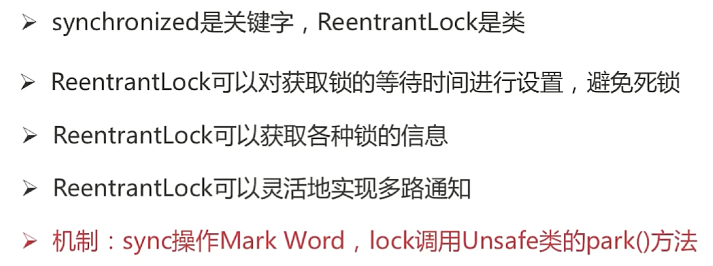

# Java同步机制

## 互斥（同步）锁——Synchronized

### 互斥锁的分类——获取对象锁和类锁

Synchronized锁的不是代码，而是类和对象。

#### 对象锁之间的关系

- 当方法或者代码块未被Synchronized修饰时，不受同步锁的影响，即还是异步的；
- 被Synchronized修饰的属于同一对象的不同方法或者代码块之间是同步的，因为它们锁住的是同一对象；
- 被Synchronized修饰的属于不同对象的任意方法或者代码块之间是异步的，因为它们没有对同一对象加锁；

#### 类锁之间的关系

- 被Synchronized修饰的属于同一类的不同方法或者代码块之间是同步的。

#### 类锁和对象锁的关系

- 类锁和对象锁之间互不干扰；

### Synchronized底层实现原理

- Java对象头；
- Monitor。

字节码指令：monitorenter和monitorexit

#### 对象在内存中的布局（Hotpot）

- **对象头**；
- 实例数据；
- 对齐填充；

Synchronized是可重入的，表现为Synchronized可以嵌套使用。

#### Synchronized为什么是重量级锁

早期版本中，Synchronized依赖于底层操作系统的Mutex Lock实现，因为使用到系统调用，需要进行用户态转换与核心态的转换，开销较大，因此是重量级锁。

JDK6，Synchronized性能得到了很大的提升。

## 锁优化

### 自旋锁与自适应自旋锁

#### 自旋锁

- 许多情况下，共享数据的锁定状态持续时间较短，切换线程不值得；

- 通过让线程执行忙循环等待锁的释放，不让出CPU；

- 缺点：当锁被其他线程长时间占用时，会带来许多性能上的开销；

- 可以设置`-XX:PreBlockSpin`参数指定经过多少次尝试后，由自旋方式转换为传统的挂起线程让出CPU的方式：

  

旋转可以理解为**循环等待**。

#### 自适应自旋锁

- 自旋次数不固定的自旋锁；
- 自旋次数由同一个锁上的自旋时间及锁的持有者的状态来决定（获取资源的可能性较大就尽可能的增加自旋次数）；

### 锁消除

- JIT编译时，对运行上下文进行扫描，去除不可能存在竞争的锁。

如`StringBuffer`类是线程安全的，其`append()`方法是`Synchronized`关键字修饰的同步方法，当不存在竞争关系时，JVM会自动去除该方法上的锁。

### 锁粗化

- JIT编译时，对运行上下文进行扫描，扩大加锁的范围，避免频繁加锁和解锁。

## Synchronized同步锁的四种状态

将会随着竞争情况，自动升级，即**锁膨胀**：无锁 -> 偏向锁 -> 轻量级锁 -> 重量级锁。

### 无锁

没有资源竞争的情况。

### 偏向锁

- 大多数情况下，锁不存在多线程竞争，总是由同一线程多次获得；

不适用于锁竞争比较激烈的多线程场合。

### 轻量级锁

- 由偏向锁升级而来；
- 偏向锁运行在一个线程进入同步块的情况下，当第二个线程加入锁争用的时候，偏向锁就会升级为轻量级锁；

适用于线程交替执行同步块。

若存在同一时间访问同一锁的情况，就会导致轻量级锁膨胀为重量级锁。

### 重量级锁

同一时间访问同一锁的情况。

## 锁的内存语义

## Synchronized和ReentrantLock的区别

### ReentrantLock重入锁

- juc包下：`java.util.concurrent.locks`；
- 能够实现比Synchronized更细粒度的控制，如控制fairness；
- 调用`lock()`之后，必须显示调用`unlock()`释放锁；
- 性能未必比Synchronized高，并且也是可以重入的；
- Synchronized一定是非公平锁，Reentrant可以选择是否为公平锁；

- 当参数设置为true，即为公平锁时，倾向于将锁赋予等待时间最长的线程，防止线程饥饿；

### 总结

## Java内存模型（JMM）

### JMM中的主内存和工作内存

 

### 重排序

### happens-before

### volatile

volatile只能保证可见性，并不能保证原子性，所以不一定保证线程安全性。

## Synchronized与volatile的区别

## CAS（Compare and Swap）

