# Java多线程

## 用户态和内核态，如何切换，为什么要切换？


## 什么是系统中断？


## 进程与线程的区别？

> 串行 -> 批处理 -> 进程（进程独占内存空间，保存各自运行状态，相互间互不干扰且可以互相切换，使得操作系统可以并发处理任务） -> 线程（共享进程的内存资源，相互间切换更快速，比进程粒度更小，使进程内的子任务可以并发执行）

- 进程是资源分配的最小单位，线程是CPU调度的最小单位；

  - 所有与进程相关的资源，都被记录在PCB（进程控制块）中：

    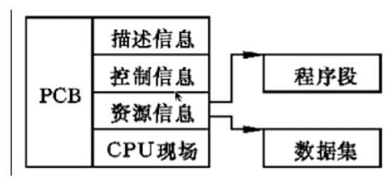

  - 进程是抢占处理机的调度单位，不同的进程有不同的虚拟地址空间，同一进程内的不同线程共享该地址空间；线程属于某个进程，同一进程下线程将共享该进程资源；

  - 线程只由堆栈寄存器、程序计数器和TCP（线程控制块）组成：

    

    寄存器可以存储线程内的局部变量，但不能存储其它线程的相关变量。

**区别**

1. 进程是资源分配的基本单位；线程是CPU调度的基本单位；
2. 进程有独立的地址空间，相互之间并不影响，某个进程崩溃之后并不会影响其它进程的运行；线程没有独立的地址空间，只是进程的不同执行路径，当某个线程崩溃后，其所在进程也会挂掉，因此同一进程下的所有线程也都将停止运行；因此多进程程序比多线程程序更健壮；
3. 进程的切换比线程的切换开销大。

## Java中进程和线程的关系

- Java对操作系统提供的功能进行封装，包括进程和线程；
- 每运行一个Java程序会产生一个进程，每个进程包含至少一个线程（主线程）；
- **每个进程对应一个JVM实例，多个线程共享JVM里的堆**；
- Java采用单线程编程模型，程序会自动创建主线程；
- 主线程可以创建子线程，原则上要后于子线程完成执行。

## 线程的`start()`和`run()`方法的区别

1. `run()`方法并不会创建一个线程，将在调用线程中执行，仅仅只是一个普通方法；
2. `start()`方法真正创建一个线程，并会在新建线程中调用`run()`方法。

从源码层面来看：

1. 在`Thread`类中找到`start()`方法，发现该方法中调用了一个`native`方法`start0()`；

2. 到[Open JDK](http://hg.openjdk.java.net/)上找到该方法，以`jdk8u`版本为例：

   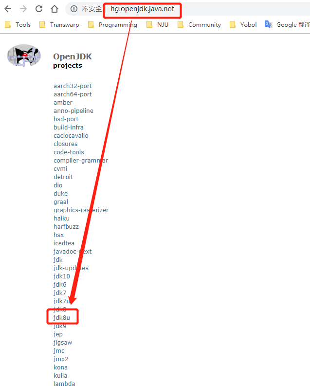

   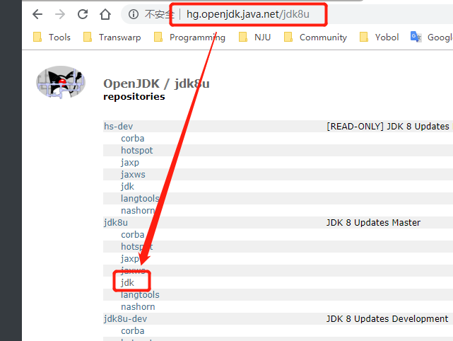

   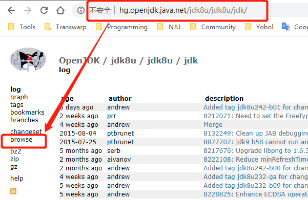

   然后进入`src/share/native/java/lang/`目录，点击`Thread.c`文件：

   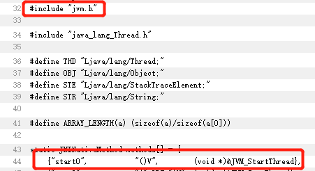

   可以看到`start0()`方法调用了`jvm.h`中的`JVM_StartThread`方法，然后我们定位到JVM的`jvm.cpp`文件：

   返回到`http://hg.openjdk.java.net/jdk8u/`，点击`hotspot`：

   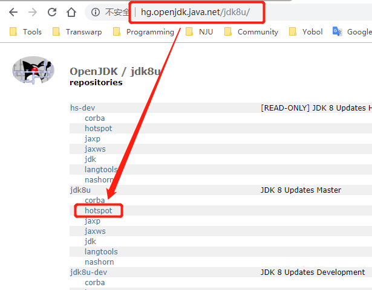

   然后点击`browse`，进入到`src/share/vm/prims`目录，打开`jvm.cpp`文件，定位到`JVM_StartThread`方法：

   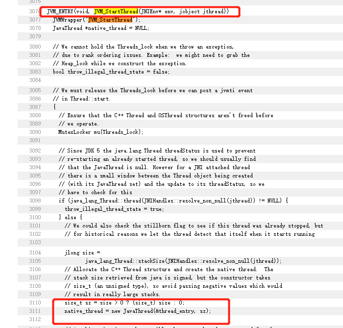

   发现该方法中会通过传入`thread_entry`来新建一个新的Java线程，然后定位到`thread_entry`：

   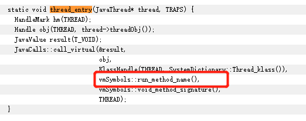

   可以看到，该方法会调用`run()`方法。

## `Thread`和`Runnable`是什么关系

1. `Runnable`是一个接口，只声明了一个`run()`方法，而`Thread`是一个实现了`Runnable`接口的类；
2. 由于Java是单继承的，推荐多使用`Runnable`接口。
3. 如何给`run()`方法传参：
   1. 构造函数传参；
   2. 成员变量传参（setter）；
   3. 回调函数传参：在`run()`方法中调用。

## 创建线程的三种方法

1. 实现`Runnable`接口，并实现`run()`方法，然后作为参数传递给`Thread`实例：

   > MyRunnable.java

   ```java
   public class MyRunnable implements Runnable {
       
       @Override
       public void run() {
           // do something
       }
   }
   ```

   > Main.java

   ```java
   public class Main {
       public static void main(String[] args) {
           Thread thread = new Thread(new MyRunnable());
           thread.start();
       }
   }
   ```

2. 继承`Thread`类：

   ```java
   public MyThread extends Thread {
       
       @Override
       public void run() {
           // do something
       }
   }
   ```

   > Main.java

   ```java
   public class Main {
       public static void main(String[] args) {
           Thread thread = new MyThread();
           thread.start();
       }
   }
   ```

3. 实现`Callable`接口：

   > MyCallable.java

   ```java
   public class MyCallable implements Callable<String> {
       
       @Override
       public String call() throws Exception {
           Thread.currentThread().sleep(5000);
           return "Hello World";
       }
   }
   ```

   > Main.java

   ```java
   public class Main {
       public static void main(String[] args) throws ExecutionException, InterruptedException {
           FutureTask<String> task = new FutureTask<String>(new MyCallable());
           new Thread(task).start();
           // 当call()未执行完毕时，get()会阻塞直到其执行完毕
           System.out.println(task.get());
       }
   }
   ```

## 如何实现主线程等待子线程返回处理结果

1. 主线程等待法：当待处理变量太多时，会导致代码变得臃肿，**降低程序可读性**，且无法做到精准控制主线程等待的时间；

2. 使用`Thread`类中的`join()`方法阻塞当前线程以等待子线程处理完毕：比主线程等待法实现简单，控制粒度不够细；

3. 实现`Callable`接口，通过`FutureTask`或线程池获取：

   `FutureTask`见上面创建线程方式三；

   线程池：

   ```java
   public class Main {
       public static void main(String[] args) throws ExecutionException, InterruptedException {
           ExecutorService cachedThreadPool = new Executors.newCachedThreadPool();
           Future<String> future = cachedThreadPool.submit(new MyCallable());
           
           try {
           	System.out.println(future.get());
        } catch (InterruptedException e) {
               e.printStackTrace();
        } catch (ExecutionException e) {
               e.printStackTrace();
           } finally {
               cachedThreadPool.shutdown();
           }
       }
   }
   ```

## 线程的状态

1. NEW：新建态，创建后未启动的线程的状态，即`new Thread()`创建线程对象后调用`start()`方法启动线程前；
2. RUNNABLE：运行态，调用`start()`后正在JVM中执行的线程，包含操作系统中线程的`Running`和`Ready`态，即正在占用CPU或者等待CPU为其分配时间片；
3. WAITING：无限期等待，不会被分配CPU执行时间，需要显式被唤醒；
   - 没有设置`timeout`参数的`Object.wait()`方法；
   - 没有设置`timeout`参数的`Thread.join()`方法；
   - `LockSupport.park()`方法。
4. TIMED_WAITING：有限期等待，在一定时间后由系统自动唤醒；
   - Thread.sleep(timeout)，通过`sleep()`方法进入休眠的线程不会释放持有的锁；
   - 设置了`timeout`参数的`Object.wait(timeout)`方法，通过`wait()`方法，**在调用`wait()`方法之前必须获得对象上的锁**，否则程序会在运行时抛出`IllegalMonitorStateException`异常，通过`wait()`方法进入休眠的线程，会释放该对象的锁；
   - 设置了`timeout`参数的`Thread.join(timeout)`方法；
   - `LockSupport.parkNanos()`方法；
   - `LockSupport.parkUntil()`方法。
5. BLOCKED：阻塞态，等待获取排它锁的线程的状态；
6. TERMINATED：已终止线程的状态，线程已经结束执行，在一个已经终止的线程上调用`start()`方法会抛出`java.lang.IllegalThreadStateException`。

## `sleep()`和`wait()`的区别

1. `sleep()`方法属于`Thread`类，且必须传入参数，表示休眠时长，线程会进入`TIMED_WAITING`有限期等待状态；
2. `wait()`方法属于`Object`类，当调用无参`wait()`方法时，线程会进入`WAITING`无限期等待状态，当调用有参`wait(long timeout)`时，线程将进入`TIMED_WAITING`有限期等待状态。


二者都会让出CPU的使用权：

1. 调用`Thread.sleep(milli)`方法进入休眠的线程不会释放其持有的锁；
2. 调用`thread.wait()`方法进入休眠的线程会释放其持有的锁。


1. `sleep()`方法可以在任何地方使用；
2. `wait()`方法必须在`synchronized`方法或`synchronized`块中使用，即**在调用`wait()`方法之前必须获得对象上的锁**，否则程序会在运行时抛出`IllegalMonitorStateException`异常。

## `notify()`和`notifyAll()`的区别

JVM中的每个对象都会有两个数据结构：

- 锁池：EntryList；
- 等待池：WaitSet。

对象的锁池会存储等待该对象锁的线程，如线程A已经拥有了某个对象（不是类）的锁，而其它线程B、C想要调用这个对象的某个`synchronized`方法（或者块），由于B、C线程在进入对象的`synchronized`方法（或者块）之前必须先获得该对象锁的拥有权，而恰巧该对象的锁目前正被线程A所占用，此时B、C线程就会被阻塞，进入该对象的锁池。

对象的等待池会存储不会竞争该对象锁的线程，如线程A调用了某个对象的`wait()`方法，线程A就会释放该对象的锁，同时线程A就会进入该对象的等待池中，进入到等待池中的线程不会去竞争该对象的锁。

**`notify()`和`notifyAll()`的区别：**

1. `obj.notifyAll()`会让等待池的所有线程全部进入锁池去竞争获取锁的机会；
2. `obj.notify()`只会从等待池中随机选取一个线程进入锁池去竞争获取锁的机会。

## `Thread.yield()`方法

让当前调用`Thread.yield()`方法的线程让出CPU的执行权，与其它线程一起争夺CPU使用权。

## `interrupt()`方法

已经被抛弃的方法：`stop()`方法，因为由外部`stop()`来停止线程，可能会导致正在工作的线程突然被中断，导致不可预估的后果。

调用`t1.interrupt()`，通知线程`t1`应该中断了：

- 如果线程已处于被阻塞状态，那么线程将立即退出被阻塞状态，并抛出一个`InterruptedException`异常；
- 如果线程处于正常活动状态，那么会**将线程的中断标志设置为`true`，被设置中断标志的线程将继续正常运行，不受影响**。

由目标线程自主检查本线程的中断标志位，如果被设置为中断就自行停止线程。

## 线程状态转换

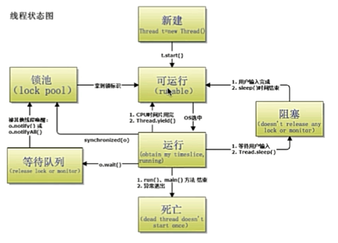

## 线程池

参考：[Executor框架之ThreadPoolExcutor&ScheduledThreadPoolExecutor浅析](https://blog.csdn.net/javazejian/article/details/50890554)

### 什么是线程池（Thread Pool）？ 

可以看作是管理线程的容器，可以通过线程池来协调多个任务，并实现类似主次线程隔离、定时执行、周期执行等任务。

### 线程池的好处？线程创建有很大开销，怎么优化？ 

1. 降低资源消耗；
2. 提高响应速度；
3. 提高线程的可管理性。

### Java中有几种线程池？

Java通过Executors提供五种线程池，分别为：

1. Executors.newCachedThreadPool()创建一个可缓存线程池，如果线程池长度超过处理需要，可灵活回收空闲线程，若无可回收，则新建线程，**适用于执行短期异步小任务或者并发量不高的场景**；
2. Executors.newFixedThreadPool()创建一个定长线程池，可控制线程最大并发数，不存在空闲线程，超出的最大并发数线程会在队列中等待，**适用于执行长期任务**；
3. Executors.newScheduledThreadPool()创建一个定长线程池，支持定时和周期性执行任务，**适用于需要周期性执行的特定任务**；
4. Executors.newSingleThreadExecutor()创建一个单线程的线程池，它只会用唯一的工作线程来执行任务，保证所有任务按照指定顺序（FIFO，LIFO，优先级）执行，若线程异常结束，则会有另一个线程取代它；
5. Executors.newWorkStealingPool()：JDK8引入，创建持有足够线程的线程池支持给定的并行度，并通过使用多个队列减少竞争，此构造方法中使用CPU数量设置为默认的并行度。

#### Fork/Join框架

把大任务分隔成若干个小任务并行执行，最终汇总每个小任务结果后得到大任务结果的框架。

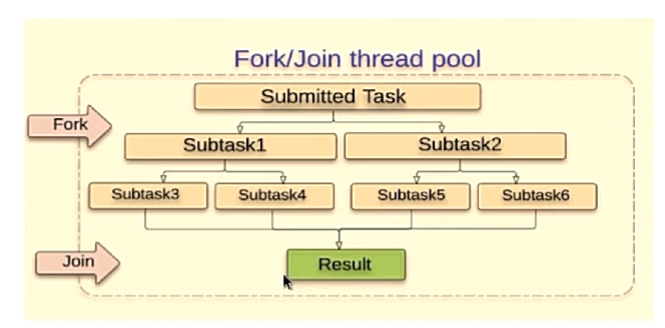

`Work-Stealing算法：某个线程从其他队列里窃取任务来执行。`

#### Executor框架

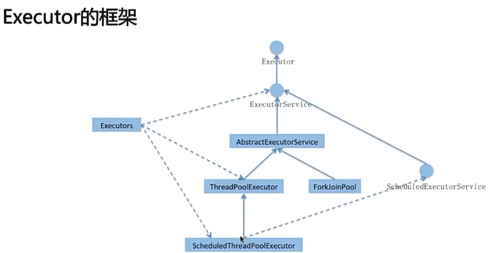

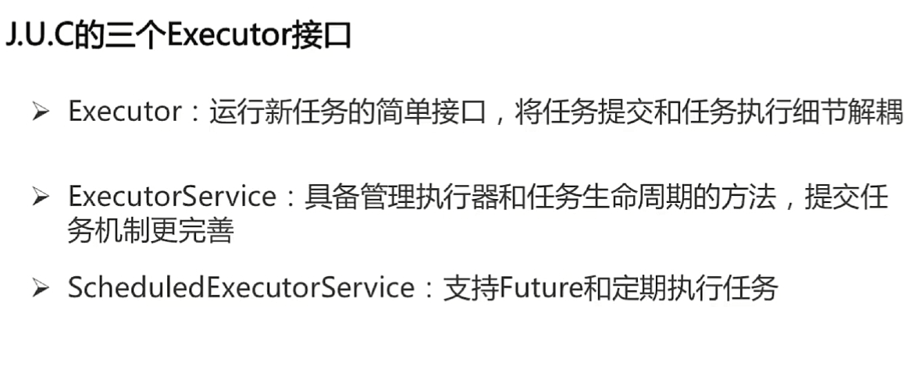

### 线程池运行流程？

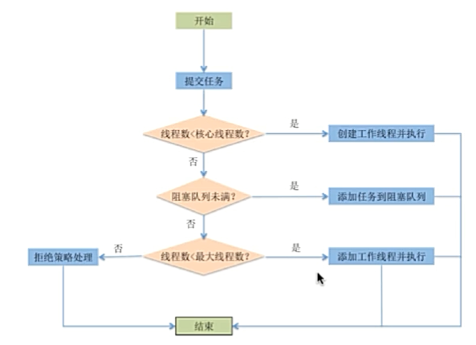

当提交一个新任务到线程池时，线程池的处理流程如下：

1. 线程池判断核心线程池是否都在执行任务。如果不是，则创建一个新的工作线程来执行任务。如果是，则进入下个流程。
2. 线程池判断工作队列是否已满。如果不是，则将新的任务存储在这个工作队列里。如果是，则进入下个流程。
3. 线程池判断线程池是否都处于工作状态。如果不是，则创建一个新的工作线程来执行任务。如果是，则交给饱和策略来处理这个任务。

### 自定义线程池

我们可以通过ThreadPoolExecutor来创建一个线程池：

```java
public ThreadPoolExecutor(
    int corePoolSize,
    int maximumPoolSize,
    long keepAliveTime,
    TimeUnit unit,
    BlockingQueue<Runnable> workQueue,
    ThreadFactory threadFactory,
    RejectedExecutionHandler handler
)
```

- corePoolSzie：线程池的基本大小。　
- maximumPooSize：线程池的最大线程数。
- keepAliveTime：非核心线程能存活的最大时间。当线程数超过corePoolSize的时候，当有空闲的线程时间超过keepAliveTime将会被回收。
- unit：时间的单位，用TimeUnits这个类的类属性。属性包含NANOSECONDS，MICROSECONDS，MILLISECONDS，SECONDS，MINUTES，HOUR，DAYS
- workQueue：线程池将要消费的任务，这个任务的类型必须是线程，要继承Runnable 的接口，就这是为什么要叫线程池，对于阻塞队列，一般会有ArrayBlockQque,LinkedBlockQueue,synchronousQueue 三种。
- threadFactory：用于设置创建线程的工厂，可以通过线程工厂给每个创建出来的线程设置更有意义的名字，默认使用`Executors.defaultThreadFactory()`。
- handler：饱和策略，当队列和线程池都满了，说明线程池处于饱和状态，那么必须采用一种策略处理提交的新任务，默认情况下时`AbortPolicy`。

### 阻塞队列

#### Java中的8种阻塞队列以及特性

- ArrayBlockingQueue：
  - 用数组实现的有界阻塞队列；
  - 必须传递一个int类型的参数capacity来指明队列大小；
  - 按照先入先出的顺序对元素进行排序；
  - 默认情况下不会保证线程公平（先阻塞线程先访问队列）的访问队列；
  - 如果要保证线程公平，需要在创建ArrayBlockingQueue时显式指明fair参数为true；
- LinkedBlockingQueue：
  - 用链表实现的有界阻塞队列；
  - 可以传入一个int类型的参数capacity来指明队列大小，否则默认和最大长度为Integer.MAX_VALUE；
  - 按照先入先出的顺序对元素进行排序；
- PriorityBlockingQueue：
  - 支持优先级的无界阻塞队列；
  - 默认情况下元素采用自然顺序排序，也可让元素实现Comparable接口来指定元素排序规则，或者初始化PriorityBlockingQueue时指定参数Comparator来对元素进行排序；
  - 不能保证同优先级元素的排序；
- DelayQueue：
  - 支持延迟获取元素的无界阻塞队列；
  - 队列中的元素必须实现Delayed接口，在创建元素时可以指定多久才能从队列中获取当前元素，只有在延迟期满时才能从队列中提取元素；
  - 可用于缓存系统和定时任务调度；
- SynchronousQueue：
  - 是一个不存储元素的阻塞队列，每一个put操作必须等待一个take操作，否则不能继续添加元素；
  - 默认情况下线程采用非公平性策略访问队列，但也支持公平访问队列，可以在声明SynchronousQueue的时候指定fair参数为true；
  - 适合传递性场景，吞吐量高于ArrayBlockingQueue和LinkedBlockingQueue；
- LinkedTransferQueue：
  - 由链表结构组成的无界阻塞队列；
  - 相比于其他阻塞队列，多了transfer和tryTransfer方法；
    - transfer：如果当前有消费者正在等待接收元素（消费者使用take方法或带时间限制的poll方法），transfer方法可以把生产者传入的元素直接transfer给消费者，如果没有消费者等待接收元素，transfer方法会将元素存放再队列的tail节点，并等到该元素被消费者消费了才返回；
    - tryTransfer：用来试探生产者传入的元素是否能直接传给消费者，如果没有消费者接收元素，则返回false，和transfer的区别是tryTransfer方法无论消费者是否接收，方法立即返回，而transfer方法是必须等待消费者消费了才返回；
- LinkedBlockingDeque：
  - 由双向链表结构组成的双向阻塞队列。

#### 使用阻塞队列实现生产者-消费者

**生产者线程**

```java
package me.yobol.review.producer_consumer;

import java.util.concurrent.BlockingQueue;

public class Producer implements Runnable {

    private BlockingQueue<String> queue;

    public Producer(BlockingQueue<String> queue) {
        this.queue = queue;
    }

    @Override
    public void run() {
        try {
            String tmp = "a product produced by " + Thread.currentThread().getName();
            System.out.println(Thread.currentThread().getName() + " have made a new product.");

            // 如果队列为满，会阻塞当前线程
            queue.put(tmp);
        } catch (InterruptedException e) {
            e.printStackTrace();
        }
    }
}
```

**消费者线程**

```java
package me.yobol.review.producer_consumer;

import java.util.concurrent.BlockingQueue;

public class Consumer implements Runnable {

    private BlockingQueue<String> queue;

    public Consumer(BlockingQueue<String> queue) {
        this.queue = queue;
    }

    @Override
    public void run() {
        try {
            String tmp = queue.take();

            System.out.println(Thread.currentThread().getName() + " have consume " + tmp + ".");
        } catch (InterruptedException e) {
            e.printStackTrace();
        }
    }
}
```

**Test**

```java
package me.yobol.review.producer_consumer;

import java.util.concurrent.BlockingQueue;
import java.util.concurrent.LinkedBlockingQueue;

public class Test {

    public static void main(String[] args) {
        // 显示设置队列容量为2，否则为Integer.MAX_VALUE
        BlockingQueue<String> queue = new LinkedBlockingQueue<>(2);

        Consumer consumer = new Consumer(queue);
        Producer producer = new Producer(queue);

        // 生产者和消费者各创建5个
        for (int i = 0; i < 5; i++) {
            new Thread(consumer, "Consumer " + (i + 1)).start();

            new Thread(producer, "Producer " + (i + 1)).start();
        }
    }
}
```

**运行结果实例**

```java
Producer 1 have made a new product.
Producer 2 have made a new product.
Consumer 1 have consume a product produced by Producer 1
Consumer 2 have consume a product produced by Producer 2
Producer 4 have made a new product.
Consumer 3 have consume a product produced by Producer 4
Producer 5 have made a new product.
Consumer 4 have consume a product produced by Producer 5
Producer 3 have made a new product.
Consumer 5 have consume a product produced by Producer 3
```

### 饱和策略

JDK 1.5中Java线程池框架提供了4种饱和策略：

1. AbortPolicy：丢弃任务，并抛出RejectedExecutionException异常。 
2. DiscardPolicy：直接丢弃任务，不抛出异常，不支持使用。
3. CallerRunsPolicy：将任务交给调用者所在线程来运行任务。
4. DiscardOldestPolicy：丢弃阻塞队列里等待最久的一个任务，然后把当前任务加入到队列中。

可以实现`RejectedExecutionHandler`接口自定义饱和策略。

### 线程池状态

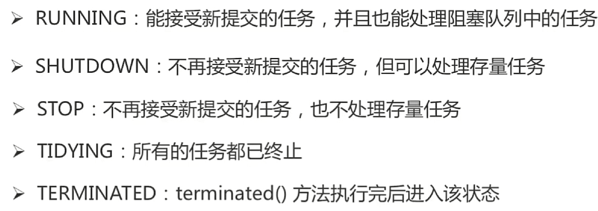

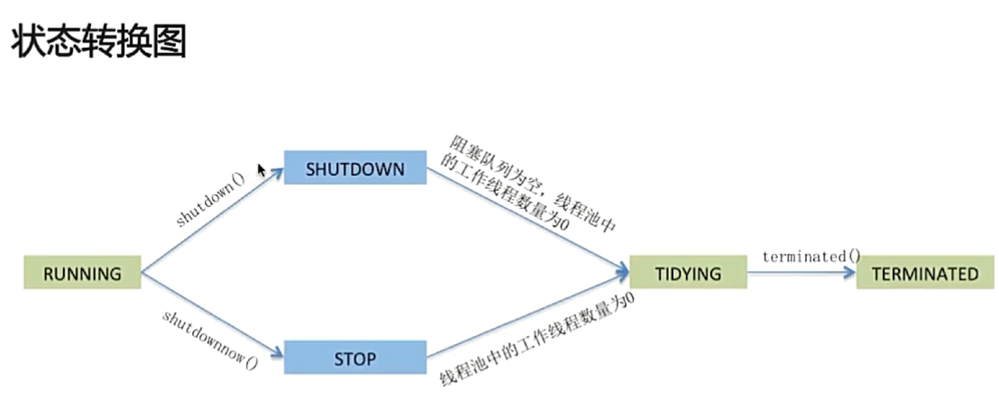

### 各线程池使用场景