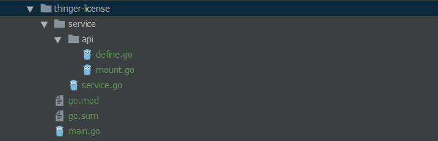
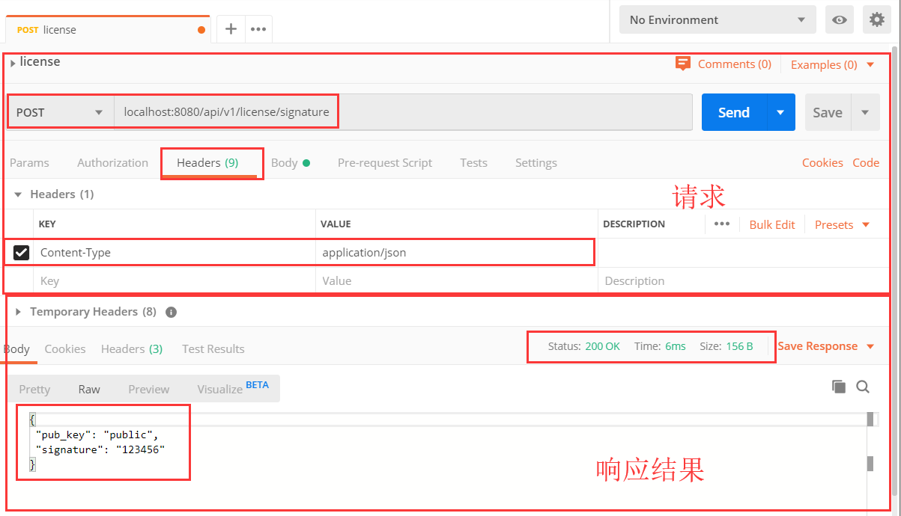
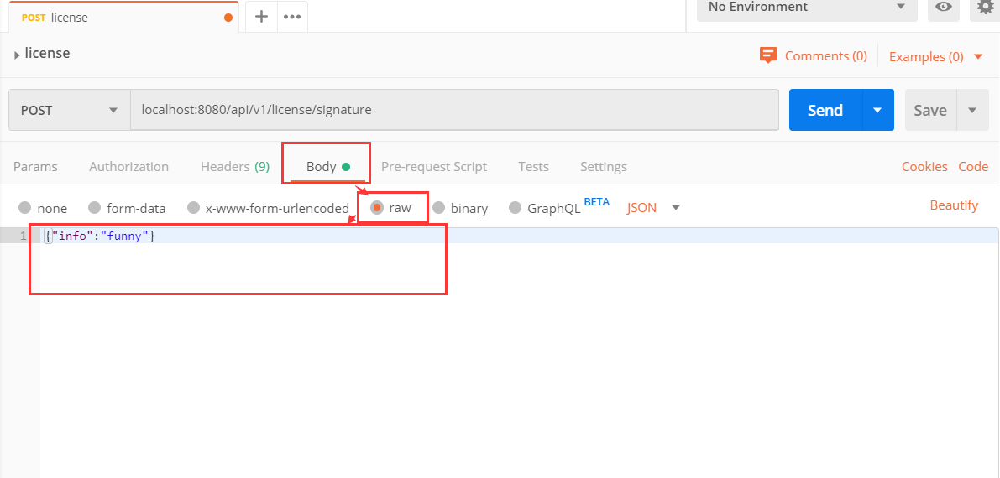
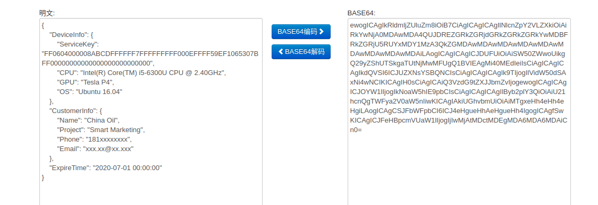

# `Sophon Edge` License认证系统

## 设计背景

基于客户是否购买及购买的使用时长，限制使用者的使用或者使用时长，保护公司利益。

## 实现方式

### V 0.1

#### License Server

在公司维护一个License Server：

1. 能够接收以某种编码算法（如BASE64）编码后的注册信息（用户机器的固件信息：MAC地址、CPU序列号、硬盘序列号等；客户信息：公司名称、项目名称、联系方式等），解码出注册信息，为每一个注册的机器生成公私密钥对（[私钥用于签名，公钥用于验签](https://www.cnblogs.com/007sx/p/10987906.html)）：[对BASE64编码的注册信息计算hash，然后使用私钥对hash结果制作签名](https://www.jianshu.com/p/e34c825f9753)，将签名和公钥返回给客户端，并且可以基于客户和项目信息进行分类管理。

```json
{
	"DeviceInfo": {
		"ServiceKey": "FF0604000008ABCDFFFFFF7FFFFFFFFF000EFFFF59EF1065307BFF00000000000000000000000000",
		"CPU": "Intel(R) Core(TM) i5-6300U CPU @ 2.40GHz",
		"GPU": "Tesla P4",
		"OS": "Ubuntu 16.04"
	},
	"CustomerInfo": {
		"Name": "China Oil",
		"Project": "Smart Marketing"
	},
	"ExpireTime": "2020-07-01T00:00:00"
}
```

#### Client

每次启动服务`thinger-gateway`时：

- [采集固件信息，覆盖原有注册信息中的数据，结合License Server反馈的公钥、签名进行验证](https://www.jianshu.com/p/e34c825f9753)，验证通过则说明签名信息没有被篡改，否则返回401，并自动跳转到联系页面；

- 验证授权是否过期，如果验证通过则暴露所有合法API，否则返回403，并自动跳转到联系页面。

#### Plan List

1. 使用Golang构建License Server：
   - 对BASE64格式编码的信息进行解码，解码出JSON格式的数据，即注册信息；
   - 提取出注册信息中的数据，按照公司名和项目名进行分类维护；
   - 生成公私秘钥对，且与机器指纹一一对应；
   - 对BASE64格式编码的注册信息计算hash，使用私钥对hash结果进行签名；
   - 能够返回签名和公钥；
   
2. 使用go-restful对外提供API，接收注册信息，返回公钥和签名；

3. 使用Docker打包镜像，进行部署；

4. Client `thinger-gateway`模块能够导入公钥和签名到本地；

   

5. 基于公钥、签名和固件信息（获取固件信息暂时先搁置，MOCK即可）进行验证；

6. 对过期时间进行验证。

#### Done

##### 基于go-restful库构建REST风格的Web服务

1. Github上搜索`in:name restful language:go`，找到Golang编写的restful库，按照starts排序，选择stars最多的[go-restful](https://github.com/emicklei/go-restful)；

2. 使用`go.sum`管理依赖：

   在项目根目录下创建`go.sum`：

   ```go
   module transwarp.io/aiot/thinger-license
   
   go 1.12
   
   require (
   	github.com/emicklei/go-restful v2.11.1+incompatible
   	github.com/emicklei/go-restful-openapi v1.0.0
   	github.com/go-openapi/spec v0.19.5 // indirect
   )
   ```

3. 仿照[示例](https://github.com/emicklei/go-restful/blob/master/examples/restful-swagger.go)构建实例：

   项目结构：

   > gopath/src/transwarp.io/aiot/thinger-license

   

   > main.go

   ```go
   package main
   
   import (
   	"fmt"
   	"github.com/emicklei/go-restful"
   	"log"
   	"net/http"
   	"transwarp.io/aiot/thinger-license/service"
   )
   
   const PORT = 8978
   
   func main() {
   	service.MountAPIModule()
   
   	log.Print(fmt.Sprintf("start listening on localhost:%d", PORT))
   	server := &http.Server{
   		Addr: fmt.Sprintf(":%d", PORT),
   		Handler: restful.DefaultContainer,
   	}
   	log.Fatal(server.ListenAndServe())
   }
   ```

   > service/api/mount.go

   ```go
   package api
   
   import (
   	"github.com/emicklei/go-restful"
   	restfulspec "github.com/emicklei/go-restful-openapi"
   	"net/http"
   )
   
   func NewLicenseServerWS(root string) *restful.WebService {
   	return (&LicenseServerResource{}).WebService(root, "license")
   }
   
   type LicenseServerResource struct {}
   
   type LicenseRequest struct {
   	Info string `json:"info" description:"information for registering"`
   }
   
   type LicenseResponse struct {
   	PubKey string `json:"pub_key" description:"verify the validity of the signature"`
   	Signature string `json:"signature" description:"info signed by the private key"`
   }
   
   func (r *LicenseServerResource) WebService(root string, apiTag string) *restful.WebService {
   	ws := new(restful.WebService)
   	ws.Path(root).Consumes(restful.MIME_JSON).Produces(restful.MIME_JSON)
   
   	apiTags := []string{apiTag}
   
   	ws.Route(ws.POST("/signature").To(r.Signature).
   		Doc("submit a certificate for customer").Metadata(restfulspec.KeyOpenAPITags, apiTags).
   		Reads(LicenseRequest{}).
   		Writes(LicenseResponse{}).
   		Do(returns200, returns500))
   
   	return ws
   }
   
   func returns200(b *restful.RouteBuilder) {
   	b.Returns(http.StatusOK, "OK", LicenseResponse{})
   }
   
   func returns500(b *restful.RouteBuilder) {
   	b.Returns(http.StatusInternalServerError, "Internal Server Error", nil)
   }
   
   ```

   > /service/api/defince.go

   ```go
   package api
   
   import (
   	"fmt"
   	"github.com/emicklei/go-restful"
   	"net/http"
   )
   
   func (r LicenseServerResource) Signature(request *restful.Request, response *restful.Response) {
   	licenseReq := new(LicenseRequest)
   	err := request.ReadEntity(&licenseReq)
   	info := licenseReq.Info
   	fmt.Printf("info: " + info)
   	if err == nil {
   		// 生成公私密钥对
   		// 使用公钥对注册信息进行加密
   		response.WriteEntity(&LicenseResponse{
   			PubKey:    "public",
   			Signature: "123456",
   		})
   	} else {
   		_ = response.WriteError(http.StatusInternalServerError, err)
   	}
   }
   ```

   > /service/service.go

   ```go
   package service
   
   import (
   	"github.com/emicklei/go-restful"
   	"transwarp.io/aiot/thinger-license/service/api"
   )
   
   var APIRoot = "/api/v1"
   
   func MountAPIModule() {
   	restful.Add(api.NewLicenseServerWS(APIRoot + "/license"))
   }
   ```

4. 使用Postman进行测试：

   

   

5. 将注册信息转换为BASE64格式进行测试，[网站](https://tool.oschina.net/encrypt?type=3)：

   

6. License Server对接收到的Base64格式数据进行解码：

   ```go
   package api
   
   import (
   	"encoding/base64"
   	"encoding/json"
   	"fmt"
   	"github.com/emicklei/go-restful"
   	"net/http"
   )
   
   type Info struct {
   	DeviceInfo DeviceInfo
   	CustomerInfo CustomerInfo
   	ExpireTime string `json:"ExpireTime" descprition:"过期时间"`
   }
   
   type DeviceInfo struct {
   	ServiceKey string `json:"ServiceKey" description:"MAC地址&CPU序列号&硬盘序列号加密数据"`
   	CPUType string `json:"CPU" description:"CPU型号"`
   	GPUType string `json:"GPU" description:"GPU型号"`
   	OSVersion string `json:"OS" description:"OS版本"`
   }
   
   type CustomerInfo struct {
   	Name string `json:"Name"`
   	Project string `json:"Project"`
   	Phone string `json:"Phone"`
   	Email string `json:"Email"`
   }
   
   func (r *LicenseServerResource) Signature(request *restful.Request, response *restful.Response) {
   	licenseReq := new(LicenseRequest)
   	err := request.ReadEntity(&licenseReq)
   	if err == nil {
   		info, err := r.parse(licenseReq.Info)
   		if err != nil {
   			fmt.Println(err.Error())
   			_ = response.WriteError(http.StatusInternalServerError, err)
   		}
   		fmt.Println(info)
   		response.WriteEntity(&LicenseResponse{
   			PubKey:    "public",
   			Signature: "123456",
   		})
   	} else {
   		_ = response.WriteError(http.StatusInternalServerError, err)
   	}
   }
   
   func (r *LicenseServerResource) parse(info string) (*Info, error) {
   	// 对注册信息进行base64解码
   	decodeBytes, err := base64.StdEncoding.DecodeString(info)
   	if err != nil {
   		return nil, err
   	}
   
   	i := &Info{}
   	err = json.Unmarshal(decodeBytes, i)
   	if err != nil {
   		return nil, err
   	}
   	return i, nil
   }
   ```

7. 


## 参考

[RSA加密解密及制作软件license](https://www.jianshu.com/p/e34c825f9753)

https://github.com/emicklei/go-restful/blob/master/examples/restful-openapi.go

https://blog.csdn.net/fengguoqing1/article/details/5353647

https://www.bennythink.com/jbls.html

https://blog.csdn.net/qq_27489007/article/details/100599143

https://blog.csdn.net/weixin_43145361/article/details/88595583

https://blog.csdn.net/ylforever/article/details/79604367