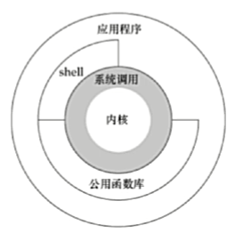
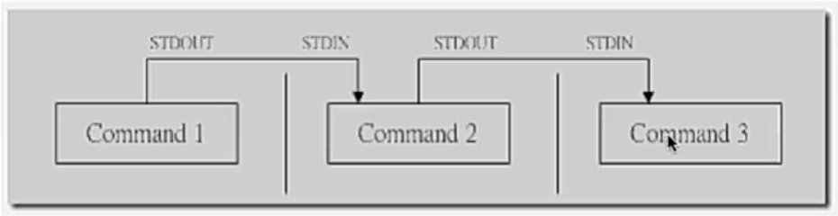
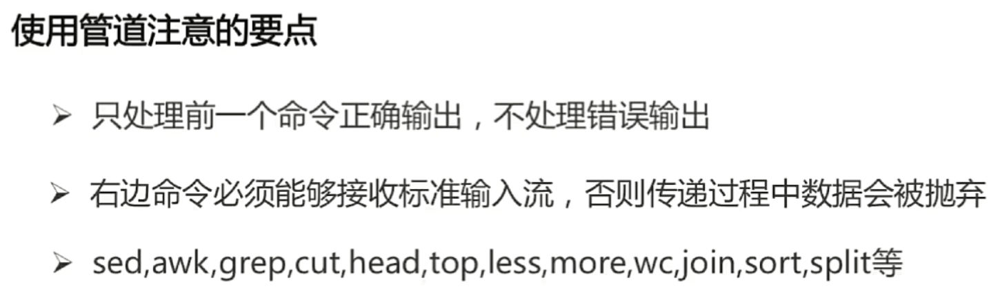

# OS

## Linux Architecture

Linux的体系结构主要分为用户态和内核态。



## CPU

```shell
# 查看CPU信息
$ cat /proc/cpuinfo
# 查看CPU型号
$ cat /proc/cpuinfo | grep name | cut -f2 -d: | uniq -c

```


## Network

### MAC

```shell
# 查看指定名称的网卡序列号
# /sys/class/net下存放了所有网卡的信息
$ cat /sys/class/net/<name>/address
```


### Port

```bash
# 查看端口被哪个进程占用
# lsof -i:<port>
$ lsof -i:8080
```


## Process Scheduling

### Process Status

```shell
# 动态地查看系统整体的运行情况
$ top

# 直接查看系统当前的进程状态
# a - 显示所有用户的进程，否则只显示当前用户的进程
# u - 显示进程的拥有者
# x - 显示后台运行的程序，否则只显示所有依赖于终端的进程
$ ps -aux
# 查看与Python相关的进程
$ ps -aux | grep python
```

### Kill Process

```shell
# 首先使用top或者ps命令查看进程ID
# 然后通过进程ID或者名字结束进程
# Signal Name	Single Value	Effect
# SIGHUP		1				挂起
# SIGINT		2				键盘的中断信号
# SIGKILL		9				发出杀死信号
# SIGTERM		15				发出终止信号
# SIGSTOP		17, 19, 23		停止进程

# kill SIGNAL PID
# 通过进程ID来结束进程
$ kill -9 8080

# killall SIGNAL PNAME
# 通过进程名来结束所有相关进程
$ killall -9 python
```

## 开机自启动

### `/etc/init.d`

1. 在`/etc/init.d`下新建`xxx`文件：

   ```bash
   #!/bin/bash
    
   SERVICENAME="XXX"
    
   start()
   {
       echo ">>> STARTING $SERVICENAME"
   	cd /thinger-deploy/thinger-edge-stack && docker-compose down && docker-compose up -d
       echo ">>> STARTING $SERVICENAME OK!"
   }
    
   stop()
   {
       echo ">>> STOPING $SERVICENAME"
   	cd /thinger-deploy/thinger-edge-stack && docker-compose down
       echo ">>> STOPING $SERVICENAME OK!"
   }
   
   restart()
   {
   	echo ">>> RESTARTING $SERVICENAME"
   	cd /thinger-deploy/thinger-edge-stack && docker-compose down && docker-compose up -d
   	echo ">>> RESTARTING $SERVICENAME OK!"
   }
    
   case "$1" in
   start) # 服务启动要做的步骤
       start
       ;;
   stop) # 服务终止要做打的步骤
       stop
       ;;
   restart) # 服务重启要做的步骤
       restart
       ;;
   *)
       echo "usage: $0 start|stop|restart"
       exit 0;
   esac
   exit
   ```

2. 赋予权限：`chmod +x /etc/init.d/xxx`；

3. 验证脚本是否能成功执行：

   ```bash
   # 启动服务
   service xxx start
   
   # 如果出错可以查看系统日志
   tail /var/log/syslog
   ```

## File System

### File Search

#### `find`查找特定的文件

```shell
# find指令用来在指定目录下查找文件
$ find path [options] params

# 在当前目录下（会递归查找子目录）查找名为Hello.java的文件
$ find -name "Hello.java"

# 进行全局搜索，即指定path为根目录/
# 在全局范围内查找名为Hello.java的文件
$ find / -name "Hello.java"

# 查找当前用户目录下以“os”开头的文件
# find ~ -iname "os*" 可以忽略大小写
$ find ~ -name "os*"
```

#### `grep`检索文件内容

```shell
# grep指令用来在指定文件中检索符合RE的内容
# Global Regular Expression Print
$ grep [options] pattern file

# 输出Hello.java中包含“hello”的行
$ grep "hello" Hello.java

# 输出jre.log中包含“TYPE[ERROR]”的行，[]为正则表达式中的特殊字符，需要用\转义
$ grep "TYPE\[ERROR\]" jre.log

# 输出jre.log中满足"ENGINE\[[0-9a-z]*\]"正则表达式的内容，去除冗余内容
$ grep -o "ENGINE\[[0-9a-z]*\]" jre.log
# 对上面输出的信息做统计
# 创建一个map，key为engine字符串，value为其出现的次数
# END之前表示遍历一遍输入的信息，END之后表示遍历结束后要执行的操作
$ grep -o "ENGINE\[[0-9a-z]*\]" jre.log | awk '{enginearr[$1]++}END{for (i in enginearr) print i "\t" enginearr[i]}'

# 过滤掉jre.log中包含“TYPE[ERROR]”的行
$ grep -v "TYPE\[WARNING\]" jre.log

# 如果不跟file_path，则会将标准输入作为检索来源
```

##### | 管道操作符

可将指令连接起来，将前一个指令的输出作为后一个指令的输入。



```shell
$ find ~ -name "Hello*"
# 等价于
$ find ~ | grep "Hello"
```



#### `awk`对文件内容做统计

```shell
# awk指令用来处理格式化数据
# 一次读取一行文本，按输入分隔符进行切片，默认分隔符为空格
# 将切片保存在内建的变量中，$1,$2,...($0表示行的全部)
# 支持对单个切片的判断，支持循环判断
$ awk [options] 'cmd' file

# cat netstat.txt
# Proto Recv-Q Send-Q Local Address		Foreign Address			State
# tcp		 0	   48 115.28.159.6:ssh	113.46.178.155:63873	ESTABLISHED
# tcp		 0		0 localhost:mysql	localhost:40334			ESTABLISHED

# 打印netstat.txt文件中第一列和第四列的内容
$ awk '{print $1,$2}' netstat.txt
# Proto Local
# tcp 115.28.159.6:ssh
# tcp localhost:mysql

# 过滤出第一列为“tcp”且第四列大于0的行
# 即满足''中{}之前的条件时，会执行{}中的命令
$ awk '$1 == "tcp" && $3 > 0{print $0}' netstat.txt
# tcp		 0	   48 115.28.159.6:ssh	113.46.178.155:63873	ESTABLISHED

# 输出上面的内容及其头信息
# NR表示行数，NR==1为第一行
$ awk '($1 == "tcp" && $3 > 0) || NR == 1{print $0}' netstat.txt
# Proto Recv-Q Send-Q Local Address		Foreign Address			State
# tcp		 0	   48 115.28.159.6:ssh	113.46.178.155:63873	ESTABLISHED

# 用-F指定分隔符
# 指定“,”为分隔符
$ awk -F "," '{print $2}' score.csv
```


### Device Mount

#### 挂载设备

```shell
# 将设备（包括磁盘）里的文件树连接到Linux系统的文件树上
# type表示要挂载设备文件系统的类型
# device表示要挂载的设备
# dir表示设备在系统上的挂载点
$ mount -t type device dir
```

##### 挂载U盘

```shell
# 查看系统的磁盘列表
$ fdisk -l

# 新建一个目录作为U盘的挂载点
$ mkdir /mnt/usb

# 挂载
$ mount /dev/sda1 /mnt/usb
```

##### 解除挂载设备

```shell
$ umount dir
```

##### 解除挂载U盘

```shell
$ mount umount /mnt/usb
```


## Safety

### Firewall

#### CentOS

##### 查看当前防火墙状态

```shell
$ systemctl status firewalld.service
```

##### 开启防火墙

```shell
$ systemctl start firewalld.service
```

##### 允许开机自启动防火墙

```shell
$ systemctl enable firewalld.service
```

##### 关闭防火墙

```shell
$ systemctl stop firewalld.service
```

##### 禁止开机自启动防火墙

```shell
$ systemctl disable firewalld.service
```

##### 开放端口

```shell
$ firewall-cmd --zone=public --add-port=[port]/tcp --permanent
$ firewall-cmd --reload
```

##### 关闭端口

```shell
$ firewall-cmd --remove-port=[port]/udp --permanent
$ firewall-cmd --reload
```

##### 查看端口使用情况

```shell
$ ss

# 查看指定端口
$ ss -lpn src :[port]
```


##### 查看开放了哪些端口

```shell
$ firewall-cmd --list-all

public (active)
  target: default
  icmp-block-inversion: no
  interfaces: eno1 ens7f1
  sources: 
  services: ssh dhcpv6-client
  ports: 10081/tcp 8080/tcp
  protocols: 
  masquerade: no
  forward-ports: 
  source-ports: 
  icmp-blocks: 
  rich rules:
```


#### Ubuntu

##### 查看当前防火墙状态

```shell
$ sudo ufw status
Status: active
# 使用了如下命令，会显示下面非注释部分，表示对外开放本机的40001端口
# firewall-cmd --zone=public --add-port=40001/tcp --permanent
# firewall-cmd --reload
To                         Action      From
--                         ------      ----
40001                      ALLOW       Anywhere                  
40001 (v6)                 ALLOW       Anywhere (v6) 
```

##### 开启并允许开机自启动防火墙

```shell
$ sudo ufw enable
```

##### 关闭并禁止开机自启动防火墙

```shell
$ sudo ufw disable
```

##### 允许/拒绝外部访问所有端口

```shell
$ sudo ufw allow/deny
```

##### 允许/拒绝外部访问某个端口

```shell
$ sudo ufw allow/deny <port>
```

##### 删除定义的允许/拒绝访问端口的规则

```shell
$ sudo ufw delete allow/deny <port>
```

##### 其他

```shell
# ufw从/etc/services中找到对应service的端口，进行过滤。
$ sudo ufw allow/deny servicename

# 允许自10.0.1.0/10的tcp封包访问本机的25端口
$ sudo ufw allow proto tcp from 10.0.1.0/10 to 本机ip port 25
```

##### 参考

=======
# OS

## Linux Architecture

Linux的体系结构主要分为用户态和内核态。


## Process Scheduling

### Process Status

```shell
# 动态地查看系统整体的运行情况
$ top

# 直接查看系统当前的进程状态
# a - 显示所有用户的进程，否则只显示当前用户的进程
# u - 显示进程的拥有者
# x - 显示后台运行的程序，否则只显示所有依赖于终端的进程
$ ps -aux
# 查看与Python相关的进程
$ ps -aux | grep python
```

### Kill Process

```shell
# 首先使用top或者ps命令查看进程ID
# 然后通过进程ID或者名字结束进程
# Signal Name	Single Value	Effect
# SIGHUP		1				挂起
# SIGINT		2				键盘的中断信号
# SIGKILL		9				发出杀死信号
# SIGTERM		15				发出终止信号
# SIGSTOP		17, 19, 23		停止进程

# kill SIGNAL PID
# 通过进程ID来结束进程
$ kill -9 8080

# killall SIGNAL PNAME
# 通过进程名来结束所有相关进程
$ killall -9 python
```

## File System

### File Search

#### `find`查找特定的文件

```shell
# find指令用来在指定目录下查找文件
$ find path [options] params

# 在当前目录下（会递归查找子目录）查找名为Hello.java的文件
$ find -name "Hello.java"

# 进行全局搜索，即指定path为根目录/
# 在全局范围内查找名为Hello.java的文件
$ find / -name "Hello.java"

# 查找当前用户目录下以“os”开头的文件
# find ~ -iname "os*" 可以忽略大小写
$ find ~ -name "os*"
```

#### `grep`检索文件内容

```shell
# grep指令用来在指定文件中检索符合RE的内容
# Global Regular Expression Print
$ grep [options] pattern file

# 输出Hello.java中包含“hello”的行
$ grep "hello" Hello.java

# 输出jre.log中包含“TYPE[ERROR]”的行，[]为正则表达式中的特殊字符，需要用\转义
$ grep "TYPE\[ERROR\]" jre.log

# 输出jre.log中满足"ENGINE\[[0-9a-z]*\]"正则表达式的内容，去除冗余内容
$ grep -o "ENGINE\[[0-9a-z]*\]" jre.log
# 对上面输出的信息做统计
# 创建一个map，key为engine字符串，value为其出现的次数
# END之前表示遍历一遍输入的信息，END之后表示遍历结束后要执行的操作
$ grep -o "ENGINE\[[0-9a-z]*\]" jre.log | awk '{enginearr[$1]++}END{for (i in enginearr) print i "\t" enginearr[i]}'

# 过滤掉jre.log中包含“TYPE[ERROR]”的行
$ grep -v "TYPE\[WARNING\]" jre.log

# 如果不跟file_path，则会将标准输入作为检索来源
```

##### | 管道操作符

可将指令连接起来，将前一个指令的输出作为后一个指令的输入。


```shell
$ find ~ -name "Hello*"
# 等价于
$ find ~ | grep "Hello"
```


#### `awk`对文件内容做统计

```shell
# awk指令用来处理格式化数据
# 一次读取一行文本，按输入分隔符进行切片，默认分隔符为空格
# 将切片保存在内建的变量中，$1,$2,...($0表示行的全部)
# 支持对单个切片的判断，支持循环判断
$ awk [options] 'cmd' file

# cat netstat.txt
# Proto Recv-Q Send-Q Local Address		Foreign Address			State
# tcp		 0	   48 115.28.159.6:ssh	113.46.178.155:63873	ESTABLISHED
# tcp		 0		0 localhost:mysql	localhost:40334			ESTABLISHED

# 打印netstat.txt文件中第一列和第四列的内容
$ awk '{print $1,$2}' netstat.txt
# Proto Local
# tcp 115.28.159.6:ssh
# tcp localhost:mysql

# 过滤出第一列为“tcp”且第四列大于0的行
# 即满足''中{}之前的条件时，会执行{}中的命令
$ awk '$1 == "tcp" && $3 > 0{print $0}' netstat.txt
# tcp		 0	   48 115.28.159.6:ssh	113.46.178.155:63873	ESTABLISHED

# 输出上面的内容及其头信息
# NR表示行数，NR==1为第一行
$ awk '($1 == "tcp" && $3 > 0) || NR == 1{print $0}' netstat.txt
# Proto Recv-Q Send-Q Local Address		Foreign Address			State
# tcp		 0	   48 115.28.159.6:ssh	113.46.178.155:63873	ESTABLISHED

# 用-F指定分隔符
# 指定“,”为分隔符
$ awk -F "," '{print $2}' score.csv
```


### Device Mount

#### 挂载设备

```shell
# 将设备（包括磁盘）里的文件树连接到Linux系统的文件树上
# type表示要挂载设备文件系统的类型
# device表示要挂载的设备
# dir表示设备在系统上的挂载点
$ mount -t type device dir
```

##### 挂载U盘

```shell
# 查看系统的磁盘列表
$ fdisk -l

# 新建一个目录作为U盘的挂载点
$ mkdir /mnt/usb

# 挂载
$ mount /dev/sda1 /mnt/usb
```

##### 解除挂载设备

```shell
$ umount dir
```

##### 解除挂载U盘

```shell
$ mount umount /mnt/usb
```


## Safety

### Firewall

#### CentOS

##### 查看当前防火墙状态

```shell
$ systemctl status firewalld.service
```

##### 开启防火墙

```shell
$ systemctl start firewalld.service
```

##### 允许开机自启动防火墙

```shell
$ systemctl enable firewalld.service
```

##### 关闭防火墙

```shell
$ systemctl stop firewalld.service
```

##### 禁止开机自启动防火墙

```shell
$ systemctl disable firewalld.service
```

##### 开放端口

```shell
$ firewall-cmd --zone=public --add-port=[port]/tcp --permanent
$ firewall-cmd --reload
```

##### 关闭端口

```shell
$ firewall-cmd --remove-port=[port]/udp --permanent
$ firewall-cmd --reload
```

##### 查看端口使用情况

```shell
$ ss

# 查看指定端口
$ ss -lpn src :[port]
```


##### 查看开放了哪些端口

```shell
$ firewall-cmd --list-all

public (active)
  target: default
  icmp-block-inversion: no
  interfaces: eno1 ens7f1
  sources: 
  services: ssh dhcpv6-client
  ports: 10081/tcp 8080/tcp
  protocols: 
  masquerade: no
  forward-ports: 
  source-ports: 
  icmp-blocks: 
  rich rules:
```


#### Ubuntu

##### 查看当前防火墙状态

```shell
$ sudo ufw status
Status: active
# 使用了如下命令，会显示下面非注释部分，表示对外开放本机的40001端口
# firewall-cmd --zone=public --add-port=40001/tcp --permanent
# firewall-cmd --reload
To                         Action      From
--                         ------      ----
40001                      ALLOW       Anywhere                  
40001 (v6)                 ALLOW       Anywhere (v6) 
```

##### 开启并允许开机自启动防火墙

```shell
$ sudo ufw enable
```

##### 关闭并禁止开机自启动防火墙

```shell
$ sudo ufw disable
```

##### 允许/拒绝外部访问所有端口

```shell
$ sudo ufw allow/deny
```

##### 允许/拒绝外部访问某个端口

```shell
$ sudo ufw allow/deny <port>
```

##### 删除定义的允许/拒绝访问端口的规则

```shell
$ sudo ufw delete allow/deny <port>
```

##### 其他

```shell
# ufw从/etc/services中找到对应service的端口，进行过滤。
$ sudo ufw allow/deny servicename

# 允许自10.0.1.0/10的tcp封包访问本机的25端口
$ sudo ufw allow proto tcp from 10.0.1.0/10 to 本机ip port 25
```

##### 参考
[Ubuntu怎么开启/关闭防火墙](https://jingyan.baidu.com/article/73c3ce283ee2c1e50343d9f6.html)
