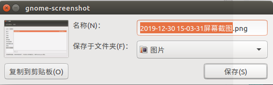

# OS Tools

## Shortcut

### 系统自带截图工具

#### 自由截图

1. 系统设置 -> 键盘 -> 快捷键；
2. 自定义快捷键： 
   - 名称：screenshot partial；
   - 命令： gnome-screenshot -a（-a表示自由截图）；
3. 给该命令设置快捷键：
   - `CTRL + ALT + 0`。



可以选择复制到剪贴板或者保存到本地，但是不便于对截取的图片进行编辑。

### Shutter（推荐）

#### 安装

```shell
# 安装
sudo apt-get install shutter
```

#### 设置快捷键

1. 系统设置 -> 键盘 -> 快捷键；
2. 自定义快捷键： 
   - 名称：`shutter`；
   - 命令： `shutter -s`；
3. 给该命令设置快捷键：
   - `ALT + S`。

截取指定区域后，双击图片后会默认将图片保存到剪贴板，并且会进入图片编辑页面。

## Network

### slurm——网卡带宽监控

#### 安装

```shell
# 安装
sudo apt-get install slurm
```

#### 使用

```shell
# 指定网卡
slurm -i <网卡名称>
```

#### 常用命令

在slurm界面中可以执行如下命令：

| 按键 | 功能           |
| ---- | -------------- |
| l    | 显示lx/tx状态  |
| c    | 切换到经典界面 |
| r    | 手动刷新界面   |
| q    | 退出工具       |
|      |                |


## Terminal

### zsh——终端

#### 安装

```shell
# 安装
sudo apt-get install -y zsh

# 启动
zsh

# 将zsh设置为系统默认终端，设置完成后重新登录系统即可
chsh -s `which zsh`
```

#### 美化

```shell
# 美化
# 安装oh-my-zsh
sh -c "$(curl -fsSL https://raw.github.com/robbyrussell/oh-my-zsh/master/tools/install.sh)"

# 选择主题
# 在https://github.com/ohmyzsh/ohmyzsh/wiki/Themes中选择喜欢的主题
# 在 ~/.zshrc 中新增变量 ZSH_THEME="theme_name"
# ZSH_THEME="sunrise"
```

### 插件

#### 自动补全

前置条件： 已经安装了 on-my-zsh

参        考： [官方文档](https://gist.github.com/dogrocker/1efb8fd9427779c827058f873b94df95)

```shell
# 自动补全插件
$ git clone https://github.com/zsh-users/zsh-autosuggestions.git $ZSH_CUSTOM/plugins/zsh-autosuggestions

# 高亮插件
$ git clone https://github.com/zsh-users/zsh-syntax-highlighting.git $ZSH_CUSTOM/plugins/zsh-syntax-highlighting

# 插件配置
vim ~/.zshrc
# 1.    :/plugins=(git) 定位到plugins=(git...
# 2.    append zsh-autosuggestions & zsh-syntax-highlighting plugins
#       plugins=(git zsh-autosuggestions zsh-syntax-highlighting plugins)
# 3.    :wq save configuration
# 4.    Reopen Terminal
```


### Tmux——终端分栏

参考：[Tmux 终端复用详解](https://www.cnblogs.com/wangqiguo/p/8905081.html)

#### 安装

```shell
# 安装
sudo apt-get install tmux

# 启动
tmux
```

#### 常用命令

每次使用`Tmux`命令前，需要先按下组合键`ctrl + b`，再按下命令。

| 命令          | 作用                                           |
| ------------- | ---------------------------------------------- |
| %             | 水平分屏，用一条垂直线将当前pane分成左右两块； |
| ”             | 垂直分屏，用一条水平线将当前pane分成上下两块   |
| :arrow_up:    | 切换到当前pane的上邻窗口                       |
| :arrow_down:  | 切换到当前pane的下邻窗口                       |
| :arrow_left:  | 切换到当前pane的左邻窗口                       |
| :arrow_right: | 切换到当前pane的右邻窗口                       |
| z             | 最大化当前pane，再按一次后恢复                 |
| x             | 关闭当前pane，输入y/n决定是否真正执行          |

