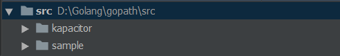

# Go

## [安装](https://golang.google.cn/dl/)

### Linux

```shell
# 查看当前Go的版本
$ go version
go version go1.8 linux/amd64
# 如果存在老的版本，可以从当前版本升级或回退
$ go get golang.org/dl/go1.12.5
$ go1.12.5 download
# 也可以先删除当前老的版本
# 从 /etc/profile or $HOME/.profile 中查看Go的环境变量配置信息

# 下载Linux 1.12.5到本地
# 解压到 /usr/local 下
$ sudo tar -C /usr/local -xzvf go1.12.5.linux-amd64.tar.gz
$ go version
```

> /etc/profile 

```
export GOROOT=/usr/local/go
export GOBIN=$GOROOT/bin
export GOPATH=$HOME/gopath
export PATH=$PATH:$GOBIN:$GOPATH/bin
```

在`/etc/profile`文件中添加如上信息：其中GOROOT指定`/usr/local/go`根目录，GOBIN为Go的`bin`目录，GOPATH为，并且在PATH中加入`$GOBIN`和`$GOPATH/bin`

### Windows

1. 下载并安装`.msi`文件；
2. 新建环境变量`GOROOT`，值为`GoLang`的安装根目录；
3. 在环境变量`PATH`属性后追加：`C:\Go\bin`；
4. 在本地新建`gopath`目录（其下包含`src`，`bin`，`pkg`目录），在环境变量中新建`GOPATH`属性，值为`gopath`目录的地址（`GOPATH`允许多个目录，当有多个目录时，使用`;`隔开，并且`go get`获取的包默认放在第一个目录下）：
   
   1. `$GOPATH\src`目录下存放项目源代码，不同的项目放在不同的包下面，是`Go`默认的执行`go run`、`go install`等命令的工作路径；
   
      
   
   2. `$GOPATH\pkg`目录下存放编译时生成的中间文件；
   
   3. `$GOPATH\bin`目录下存放编译后生成的可执行文件。


## 简介

Go是一门全新的静态类型开发语言，具有`自动垃圾回收`，`丰富的内置类型`，`函数多返回值`，`错误处理`，`匿名函数`，`并发编程`，`反射`等特性。