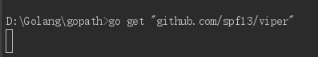
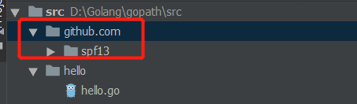

# Go

## 运算符

### 赋值运算符

`=`是仅仅是赋值，使用`=`运算符赋值的标识符在使用前必须先用`var`关键字声明，后面可以选择是否添加变量类型。

`:=`是简化变量声明运算符，可以自动声明变量并赋值，并且由系统自动推断类型，不需要`var`关键字。简化变量声明运算符只是一种简化记法，让代码可读性更高，该运算符声明的变量和其他使用`var`关键字声明的变量没有任何区别。

```go
// 使用 = 运算符赋值的标识符在使用前必须先用 var 关键字声明，后面可以选择是否添加变量类型
var a
a = 100

var b = 100

var c int = 100
 
// := 是简化赋值运算符，可以自动声明并赋值，并且系统自动推断类型，不需要var关键字
d := 100
```

一般地，如果需要声明初始值为零值的变量，应该使用`var`关键字声明变量；如果提供确切的非零值初始化变量或者使用函数返回值创建变量，应该使用简化变量声明运算符。

## 访问权限

在 Go 语言中，标识符要么从包里公开，要么不从包里公开。以大写字母开头的标识符是公开的，可以被其他包中的代码直接引用；以小写字母开头的标识符不是公开的，不可以被其他包中的代码直接引用。

但是，其他包可以间接访问不公开的标识符。例如，一个函数可以返回一个未公开的值，那么这个函数的任何调用者，都可以访问这个值。

## 数组、切片和映射

### 数组的内部实现和基础功能

数组是切片和映射的基础数据结构。

#### 内部实现

Go 语言中的数组也是一个**长度固定**的数据类型，用于存储一段包含相同类型元素的连续快。数组存储的类型可以是内置类型，如整型或者字符串，也可以是某种结构类型。

#### 声明和初始化

```go
// 声明一个包含10个元素的整型数组，并且数组中的每个元素都初始化为0
var array [5]int

fmt.Println(array) // [0 0 0 0 0]

---------------------------Another File---------------------------

// 使用数组字面量初始化数组
array := [5]int{10, 20, 30, 40}

fmt.Println(array) // [10 20 30 40 0]

---------------------------Another File---------------------------

// 可以设置指定位置上的元素值，而其余未设置的元素值皆为0
array := [5]int{1: 20, 2: 30}

fmt.Println(array) // [0 20 30 0 0]

---------------------------Another File---------------------------

// 让Go自动计算数组的长度
array := [...]int{10, 20, 30, 40}

fmt.Println(array) // [10 20 30 40]


```

#### 使用

```go
array := [5]int{10, 20, 30, 40, 50}
// 要访问数组里的某个单独元素，使用[]运算符
array[2] = 35
fmt.Println(array[2]) // 35

---------------------------Another File---------------------------

// 访问指针数组的元素，并初始化索引为0和1的元素
array := [5]*int{0: new(int), 1: new(int)}
// 为索引为0和1的元素赋值
*array[0] = 10
*array[1] = 20
fmt.Println(array) // [0xc000062080 0xc000062088 <nil> <nil> <nil>]

-------------------------Array Assignment-------------------------
---------------------------Another File---------------------------

// 相同类型的数组才可以相互赋值（数组变量的类型包括数组长度和每个元素的类型）
var array1 [3]string
array2 := [3]string{"Red", "Green", "Blue"}
array1 = array2 // 值数组赋值之后，两个数组的值完全相同；指针数组赋值之后，两个数组指向同一块内存区域
fmt.Println(array1) // [Red Green Blue] 

---------------------------Another File---------------------------

// 赋值号两边数组的长度一定要相等！！
var array1 [2]string // var array1 [4]string 也不会编译通过
array2 := [3]string{"Red", "Green", "Blue"}
array1 = array2
fmt.Println(array1) // cannot use array2 (type [3]string) as type [2]string in assignment
```

#### 多维数组

数组本身只有一个维度，但是可以组合多个数组创建多维数组。

```go
// 声明一个二维数组，两个维度分别存储4个元素和2个元素
var array [4][2]int

// 使用数组字面量来声明并初始化一个二维整型数组
array := [4][2]int{{10, 11}, {20, 21}, {30, 31}, {40, 41}}

// 声明并初始化外层数组中索引为1和3的元素
array := [4][2]int{1: {20, 21}, 3: {40, 41}}

// 声明并初始化外层数组和内存数组的单个元素
array := [4][2]int{1: {0: 20}, 3: {1: 41}}

fmt.Println(array[3][1]) // 41
```

#### 在函数间传递数组

在函数间传递大数组时，可以只传入数组的指针。

```go
// 分配一个8MB的数组
var array [1e8]int

// 将数组的地址传递给函数foo
foo(&array)

// 函数foo接收一个指向100万个整数型的数组的指针
func foo(array *[1e6]int) {
    ...
}
```

但是因为传递的是指针，如果改变指针指向的值，就会改变共享的内存。我们可以使用切片处理这个问题。

### 切片的内部实现和基础功能

切片实质上是一个动态数组，可以按需自动增长和缩小。

#### 内部实现

切片是一个很小的对象，对底层数组进行了抽象，并提供相关的操作方法。切片有一个三个字段的数据结构：指向底层数组的指针、切片长度和切片允许增长的最大长度（即容量）。

切片之所以称之为切片，是因为创建一个新的切片其实就是将底层数组切出一部分，多个切片可以共享同一段底层数组。

#### 创建和初始化

##### make和切片字面量

一种创建字面量的方法是使用内置函数`make()`。当使用`make()`时，需要传入一个参数，指定切片的长度。如果只指定长度，那么切片的容量和长度相等，也可以分别指定长度和容量。

```Go
// 构建长度和容量皆为5的切片
slice := make([]int, 5)

// 构建长度为3，容量为5的切片
slice := make([]int, 3, 5)
```

分别指定长度和容量时，创建的切片，底层数组的长度是指定的容量，但是初始化后并不能访问所有的数据元素。

`注：容量一定大于等于长度，否则会在编译时报错。`

和创建数组字面量的方式类似，但是唯一不同（或者区别二者）的标识就是：如果在`[]`中指定了一个值或者使用了`...`，那么创建的就是数组而不是切片。

```Go
// 创建字符串切片，且长度和容量皆为3
strSlice := []string{"Red", "Green", "Blue"}

// 创建整型切片，且长度和容量皆为3
intSlice := []int{1, 2, 3}
// [...]int{1, 2, 3} or [3]int{1, 2, 3}创建长度为3的整型数组
```

##### nil和空切片

只要在声明时不做任何初始化，就会创建一个`nil`切片。

```go
// 创建nil整型切片
var slice []int
```

或者利用初始化，通过声明一个切片可以创建一个空切片：

```go
// 使用make创建空的整型切片
slice := make([]int, 0)

// 使用切片字面量创建空的整型切片
slice := []int{}
```

创建空切片时，只会创建表示切片的数据结构，并不会为底层数组分配空间，且数据结构中的数组指针为nil，切片长度0，切片容量0。

#### 使用切片

##### 赋值和切片

切片的赋值完全等价于数组的赋值，用`[]`就可以完成指定索引的赋值操作。

```go
slice := []int{1, 2, 3}
slice[1] = 0
```

因为切片之间可以共享同一段数组，因此我们可以在切片的基础上再进行切分：

```go
// 创建一个长度和容量皆为5的整型切片，且其底层数组长度为5
slice := []int{1, 2, 3, 4, 5}
// 在slice的对应的底层数组上进行切分，创建一个长度为2容量为4的切片
newSlice := slice[1:3]
```

切片只能访问到其长度内的元素，试图访问超出其长度的元素将会导致语言运行时异常。

##### 切片增长

内置函数`append()`实现增加切片长度的功能。

要使用`append()`，需要一个被操作的切片和一个要追加的值。当`append()`返回时，会返回一个包含修改结果的切片。

```go
slice := []int{1, 2, 3, 4, 5}
newSlice := slice[1:3]
newSlice := append(newSlice, 6)
// 底层数组变为： [1, 2, 3, 6, 5]
```

如果切片的底层数组没有足够的可用容量，`append()`函数会创建一个的新的底层数组，将被引用的现有的值复制到新数组里，再追加新的值。因此，**`append()`有返回值，且会返回新数组的地址**。

当切片容量小于1000时，总是会成倍地增加容量；一旦容量超过1000时，容量的增长因子会变为1.25。

```Go
slice := make([]int, 0)
fmt.Printf("%d %d", len(slice), cap(slice)) // 0 0

append(slice, 1)
fmt.Printf("%d %d", len(slice), cap(slice)) // 1 1

append(slice, 1)
fmt.Printf("%d %d", len(slice), cap(slice)) // 2 2

append(slice, 1)
fmt.Printf("%d %d", len(slice), cap(slice)) // 3 4

append(slice, 1)
fmt.Printf("%d %d", len(slice), cap(slice)) // 4 4

append(slice, 1)
fmt.Printf("%d %d", len(slice), cap(slice)) // 5 8


slice1 := make([]int, 10)
append(slice1, 1)
fmt.Printf("%d %d", len(slice1), cap(slice1)) // 11 20


slice1 := make([]int, 10)
append(slice1, 1)
fmt.Printf("%d %d", len(slice1), cap(slice1)) // 11 20
```

##### 迭代切片

```go
// 关键字 range 会返回两个值
// 第一个值是当前迭代到的索引位置
// 第二个值是该位置对应元素值的副本
slice := []int{10, 20, 30}
for index, value := range slice {
    
}
```

迭代返回的变量是一个迭代过程中根据切片依次赋值的新变量，所以value的地址总是相同的（&value）。

要想获得每个元素的地址，可以使用切片变量和索引值（&slice[index]）。

关键字 range 总是会从切片头部开始迭代，如果想对迭代做更多的控制，可以使用传统 for 循环：

```go
slice := []int{10, 20, 30}
// 从第2个元素开始遍历
for i := 1; i < len(slice); i++ {
    
}

// 从头部开始遍历，但是每次都跳过一个元素
for i := 0; i < len(slice); i += 2 {
    
}
```

对于切片，内置函数`len()`返回切片的长度，`cap()`返回切片的容量。

#### 多维切片

切片是一维的，但是可以像数组那样组合多个切片形成多维切片。

```go
// 声明多维切片
slice := [][]int{{1, 2}, {1, 3, 5}}

// 在外部切片的第一个元素中追加元素4
slice[0] = append(slice[0], 4) // 先增长切片，再将增长后的切片地址赋值给外层切片的第一个元素
```

#### 在函数间传递切片

在函数间传递切片就是要在函数间以**值**的方式传递切片。在64为架构的机器上，一个切片需要24字节的内存：指针字段需要8字节，长度和容量也都需要8字节。复制时只需要复制切片本身，**不会涉及到底层数组**。

```go
slice := make(int[], 1e6)  // 分配包含100万个整型值的切片
slice = foo(slice)  // 将slice传递到函数foo

// 函数foo接收一个整型切片，并返回这个切片
func foo(slice []int) []int {
    ...
    return slice
}
```


### 映射的内部实现和基础功能

## 数据类型

Go 语言是动态数据类型，即不会在定义时指明数据类型。Go 语言中的数据类型使用 var 关键字声明，在运行时才动态绑定其真正的数据类型。

### 引用类型

Go 语言中的引用类型，需要使用内置函数`make()`构建，只有在构建成功之后才能使用赋值运算符`=`来赋值给变量。

```go
// 构建一个 map，该 map 以 string 类型值为键， Type 类型值为映射后的值
var myMap = make(map [string]Type)

// 构建一个无缓冲的通道
channel := make(chan *Type)
```

### 基本类型

#### string

#### 各类型之间的相互转换

```Go
// string转int64
str := "1024"
var val_int64 int64
var err error
val_int64, err = strconv.ParseInt(str, 10, 64)
// string转int32
val_int64, err = strconv.ParseInt(str, 10, 32)
val_int32 := int32(val_int64)
```


### 常量

常量使用`const`关键字声明。

```go
// Go 编译器可以根据赋值运算符右边的值来推导类型，声明常量时不需要指定类型
const dataPath = "data/data.json"
```

## 结构体

### 声明

```go
type StructName struct {
    FieldName1 FieldType1
    FieldName2 FieldType2
}
```

### 使用


### 空结构体

空结构体在创建实例时，不会分配任何内存。这种结构很适合创建没有任何状态的类型。

```go
type EmptyStruct struct {}
```


## 接口

### 命名惯例

1. 如果接口中只有一个方法，那么这个类型的名字需要以`er`结尾；
2. 如果接口类型内部声明了多个方法，其名字需要与其行为关联；

### 声明

```go
type InterfaceName interface {
    FunctionName(paramName paramType[, ...]) (retName retType[, ...])
}
```

### 使用

如果让用户定义的类型实现一个接口，这个用户定义的类型要实现接口类型中声明的所有方法。

```go
package matcher

type Matcher interface {
    Search(feed *Feed, searchTerm string) ([] *Result, err)
}

type defaultMatcher struct {}

// defaultMatcher 类型实现 Matcher 接口
// 如果声明函数的时候带有接受者，则意味着声明了一个方法，这个方法会和指定的接收者类型绑定在一起
// 然后我们就可以使用接收者类型 defaultMatcher 类型的值或者指向这个类型值的指针来调用 Search 方法
// 声明为使用 defaultMatcher 类型的值作为接收者：
// 使用值作为接收者声明的方法，在接口类型为值或者指针时，都可以被调用。
func (m defaultMatcher) Search(feed *Feed, searchTerm string) ([] *Result, err) {
	return nil, nil
}
// 声明一个指向 defaultMatcher 类型值的指针
dm := new(defaultMatcher)
// 编译器会解开 dm 指针的引用，使用对应的值调用方法
dm.Search(feed, "test")


// 声明为使用指向 defaultMatcher 类型值的指针作为接收者：
// 使用指针作为接收者声明的方法，只能在接口类型的值是一个指针的时候被调用。
func (m *defaultMatcher) Search(feed *Feed, searchTerm string) ([] *Result, err) {
	return nil, nil
}
// 声明一个 defaultMatcher 类型的值
vm dm defaultMatcher
// 编译器会自动生成指针引用 dm 值，使用指针调用方法
dm.Search(feed, "test")

```

## Go 语言的类型系统

### 内置类型

- 布尔类型：bool（1字节）
- 整型：int8（1字节）、int32（4字节）、int64（8字节）
- 浮点类型：float32（4字节）、float64（8字节）
- 复数类型：complex64（8字节）、complex128（16字节）。实际上，complex64 类型的值会由两个 float32 类型的值分别表示复数的实数和虚数部分；而 complex128 类型的值会由两个 float64 的值分别表示复数的实数和虚数部分。复数类型的值一般由浮点数表示的实数部分、`+`、浮点数表示的虚数部分，以及`i`组成，如`12.1E+1 + 4.3E-2i`。
- 字符串：string
- 字符类型：rune
- 错误类型：error

## 函数

### 函数的定义

Go 语言使用`func`关键字声明函数，关键字后面紧跟着函数名、参数以及返回值。

```go
// 公开、有一个参数、无返回值
func FunctionName(paramName paramType) {
    
}
packageName.FunctionName(param) // 调用方式


// 公开、有两个参数、有两个返回值
func FunctionName(paramName1 paramType1, paramName2 paramType2) (returnType1, returnType2) {
    return returnValue1, returnValue2
}
ret1, ret2 := packageName.FucntionName(param1, param2) // 调用方式
```

### 匿名函数

顾名思义，匿名函数就是没有名字的函数。匿名函数也可以接受声明时指定的参数。

```go
func(paramName paramType) {
    fmt.Println(paramName) 
} ("Hello, Go~")
```


##  包 与 import

### 包

在各种程序设计语言中，包通常用来封装一组逻辑相关的代码，同时提供给外部使用。这样可以更好地复用代码，同时对每个包内数据使用有更好的控制（解决同名问题）。

#### 包的命名与使用

所有 Go 语言的程序都会组织成若干组文件，每组文件称为一个包，这样每个包的代码都可以作为很小的复用单元，被其他项目引用：

- 所有的`.go`文件，除了空行和注释，都应该在第一行声明自己所属的包。
- 同一个文件夹下的代码文件，必须使用同一个包名（按照惯例，包名一般和文件夹同名）；给包及其目录命名时，应该使用简洁、清晰且全小写的名字，这有利于开发时频繁输入包名。

#### main 包

所有用 Go 语言编译的可执行程序都必须有一个名叫 main 的包。 Go 语言的编译程序会将这种名字的包编译为二进制可执行文件。

main 包下也必须要有一个 main() 函数，作为整个程序的入口，如果没有这个函数，程序就没有办法执行。

程序编译时，会使用声明 main 包的代码所在目录的目录名作为二进制可执行文件的文件名。在 Windows 系统下，该文件后缀为`.exe`。

`注：在 Go 语言中，命令 command 是指任何可执行程序，包更常用来指语义上可导入的功能单元。`

### import

`import` 关键字用于导入外部包。 `Go 语言提供了更加智能的编译器，并简化了解决依赖的算法。编译 Go 时，编译器只会用到那些直接被引用的库，因而可以提供更快的编译速度。`

```go
// 只导入一个包
import "fmt"

// 当需要导入多个包时，习惯上是将这些包包装在一个导入块中
import (
	"fmt"
    "http"
)
```

编译器查找包时，总是会按照`GOROOT`和`GOPATH`的顺序查找，一旦编译器找到一个满足 import 语句的包，就停止进一步查找。标准库中的包会在 Go 安装目录`GOROOT`下找到，在导入时只需要给出导入的包名。开发者自定义的包。

#### 远程导入（第三方依赖包）

使用`go get <URL>`命令可以获取任意指定的`URL`的包，或者一个已经导入的包的其他包（递归获取整个依赖树）。

导入的包会放在`GOPATH/src`下：





如上图所示，即使在`GOPATH`目录下执行`go get <URL>`，也会将依赖包下载到`GOPATH/src`下。

我们就可以在代码中直接使用如下语句导入包：

```go
import "github.com/spf13/viper"
```

`注：一些 IDE 可以帮助你自动从 DVCS（Distributed Version Control Systems，DVCS）上下载所依赖包。`

#### 命名导入（解决重名问题）

一般情况下，导入的包默认使用`import`时的包名作为标识，但也可以使用`命名导入`机制在 import 语句给出的包路径左侧定义一个名字，将导入的包命名为新名字：

```go
package test

import (
	"parent1/child"
)

child.Cry()

-------------------------------------------------------------------------------
package test

import (
	child1 "parent1/child"
	child2 "parent2/child"
)

child1.Cry()
child2.Cry()

```

当你导入了一个不在代码中使用的包时，Go 编译器会编译失败，并输出一个错误。防止导入了未被使用的包，避免代码变得臃肿。

### init() 函数

每个包可以包含任意多个 init 函数，这些函数都会在程序执行开始的时候被调用，所有被编译器发现的 init 函数都会在 main 函数之前执行。init 函数用在设置包、初始化变量或者其他要在程序运行前优先完成的引导工作。

## 协程的使用与同步

goroutine 是协程在 Go 语言中的实现。

### 协程 - `goroutine`

一个 goroutine 是一个独立于其他函数运行的函数，使用关键字`go`启动一个 goroutine ，并对这个 goroutine 做并发调度。

```go
// 使用关键字 go 启动了一个匿名函数作为 goroutine
go func(paramName paramType) {
    
} (param)
```


### 通道 - `channel`

#### 声明

```go
// 用内置函数 make 构建一个无缓冲的通道
channelName := make(chan DataType)
```

#### 关闭

```go
// 用内置函数 close 关闭一个通道
close(channelName)
```

#### 使用

```go
// 将数据写入通道
func Write(searchResults []*Result, results chan<- *Result) {
    for _, result := range searchResult {
        results <- result
    }
}

func Display(results chan *Result) {
    // 通道会一直被阻塞，直到有结果写入
	// 一旦通道被关闭，for 循环就会终止
	for result := range results {
    	fmt.Printf("%s:\n%s\n\n", result.Field, result.Content)
	}
}

type Result struct {
    Field 	string
    Content string
}


results := make(chan *Result)

go func() {
    waitGroup.Wait() // var waitGroup sync.WaitGroup
    
    close(results)
}

Display(results)
```

## Go 异常处理机制

> Go语言追求简洁优雅，所以，Go语言不支持传统的 try…catch…finally 这种异常，因为Go语言的设计者们认为，将异常与控制结构混在一起会很容易使得代码变得混乱。因为开发者很容易滥用异常，甚至一个小小的错误都抛出一个异常。在Go语言中，使用多值返回来返回错误。不要用异常代替错误，更不要用来控制流程。在极个别的情况下，才使用Go中引入的Exception处理：defer, panic, recover。

### panic()

`panic()`是一个内置函数。如果函数`F()`中调用了`panic()`，会终止其后要执行的代码，如果`F()`中存在要执行的`defer`语句列表，则逆序执行`defer`语句。直到函数`F()`整个退出，报告错误。

**参考：**[Go语言 异常panic和恢复recover用法](https://www.jianshu.com/p/0cbc97bd33fb)

## Go 关键字

### defer

defer 后面必须是函数调用语句，defer 后面的函数会在 defer 语句所在的函数执行结束时被调用。

即使函数意外停止，也能保证 defer 后面的函数被执行。defer 关键字可以缩短相关操作（如打开文件和关闭文件）之间间隔的代码行数，有助于提高代码可读性，减少错误。

```go
defer fmt.Println("defer")
```


## 常用标准库

查看 Go API：

- 在终端使用`go doc <pkg-name>`查看标准库文档；
- 

### fmt

fmt 包提供常用的格式化方法。

```go
package test

import "fmt"

// 根据指定格式返回一个用户自定义的 error
fmt.Errorf("HTTP Response Error %d\n", resp.StatusCode) 
```


### log

log 包提供打印日志信息到标准输出（os.stdout）、标准错误（os.stderr）或者自定义设备的功能。

### sync

sync 包提供同步 goroutine 的功能。

```go
package test

import (
	"sync"
)

var waitGroup sync.WaitGroup
// len(tasks) == n
waitGroup.Add(len(tasks)) // 类似于 Semaphore

for _, task := range tasks {
    go func(task *Task) {
        
        // do task
        doTask(task)
        
        waitGroup.Done() // waitGroup 变量值减一
        // 当 WaitGroup 变量值不为0时，调用 WaitGroup.Wait() 方法的协程会被阻塞住
    }(task)
}

// 监控所有的 task 是否都完成了
go func() {
    // 等待所有任务完成
    waitGroup.Wait()
    
    // 完成一些释放资源的工作
}


```


### encoding

#### json

encoding/json 包提供了编解码 JSON 的功能。

> gopath/src/sample/data/data.json

```json
[
    {
    "site" : "npr",
    "link" : "http://www.npr.org/rss/rss.php?id=1001",
    "type" : "rss"
	}
]
```

> gopath/src/sample/test/test.go

```go
package test

import (
	"encoding/json"
    "os"
)

const dataPath = "data/data.json"

// Feed 包含我们需要处理的数据源的信息
// 解析 JSON DICT 到 GO struct 中
//	[
//		{
//			"site": "XXX",
//			"link": "XXX",
//			"type": "XXX"
//		}
//	]
type Feed struct {
	Name	string	`json:"site"`
	URI  	string 	`json:"link"`
	TYPE	string	`json:"type"`
}

// 读取并反序列化源数据文件
func RetrieveFeeds() ([] *Feed, error) {
	// 打开文件
	file, err := os.Open(dataPath)
	if err != nil { // 文件打开出错
		return nil, err
	}

	// 当函数返回时关闭文件
	defer file.Close()

	// 将文件解码到一个切片里，这个切片的每一项是一个指向一个 Feed 类型值的指针
	var feeds [] *Feed
	err = json.NewDecoder(file).Decode(&feeds)

    // 由调用者来检查错误
	return feeds, err
}
```

#### xml

encoding/xml 包提供了编解码 XML 的功能。

### os

os 包提供了访问操作系统的功能，如读文件。

```go
// os.Args[] 获取 go build wordcount.go ./gowords.txt 程序执行信息
fmt.Println(os.Args[0]) // C:\Users\m1515\AppData\Local\Temp\___go_build_wordcount_go.exe
fmt.Println(os.Args[1]) // ./gowords.txt


```

#### osutil

```go
// filename can be absolute or relative path
ioutil.ReadFile(filename)
```


### net

#### http

net/http 包可以很容易地进行网络请求。

```go
package test

import (
    "errors"
	"net/http"
    "encoding/json"
)

func retrieve(URI string) (*ReturnType, error) {
    if URI == "" {
        return nil, errors.New("No URI provided")
    }
    
    // perform a HTTP get Request
    resp, err := http.Get(URI)
    if err != nil {
        return nil, err
    }
    
    // make sure response will be closed when we return from the function
    defer resp.Body.Close()
    
    // check the status code for a 200 so we know we have received a proper response
    if resp.StatusCode != 200 {
        return nil, fmt.Errorf("HTTP Response Error %d\n", resp.StatusCode)
    }
    
    // 将resp中的数据解析出来
    var results []*Result
    err = json.NewDecoder(resp).Decode(&results)
    return results, err
}
```

### regexp

regexp 包中集成了与正则表达式相关的方法。

```go
package test

import (
	"regexp"
)

regexp.MatchString(targetString, SourceString)
```

## 常用工具

### go build

1. 当不包含文件名或包路径时，`go build`默认使用当前目录来编译；
2. 可以指定包路径来构建包，`go build sample`，在指定包的时候也可以使用`...`通配符来匹配所有包，`go build ./...`会编译指定目录，如`gopath/src`下的所有包；
3. 也可以指定 Go 文件来进行编译，`go build sample/hello.go`。

### go run

等价于先执行`go build`生成二进制可执行文件再运行。

### go vet

帮助检测代码的常见错误：

1. Printf类函数调用时，类型匹配错误的参数；
2. 定义常用的方法时，方法签名的错误；
3. 错误的结构标签；
4. 没有指定字段名的结构字面量。

### go fmt

将代码重构成和 Go 源代码类似的风格。后面可以跟包路径/Go文件，或者直接什么也不写。

### go doc

[Go 中文文档](https://github.com/golang/go/wiki/NonEnglish)

#### 在命令行查看文档

```bash
# 在命令行查看查看指定包暴露的文档
go doc <pkg-name>
```


#### 在浏览器查看文档

```bash
# 在本地启动一个 Go Doc 的 Web 服务器进程
godoc -http=:6060

# http://localhost:6060 该网站会包含所有 Go 标准库和你 GOPATH 下的 Go 源代码的文档
```


#### 如何生成文档

在 Go 语言中，文档通常以注释的形式直接添加在需要暴露的标识符之前，如包、函数、类型和全局变量名。注释可以以`//`开头，也可以使用`/**/`风格。

```go
// this is a package
package packageName

// this is a struct
type structName struct {
    
}
```

如果想给包写一段文字量较大的文档，可以在包下创建一个`doc.go`的文件，使用同样的包名，并把包的介绍写在包声明之前。这段关于包的介绍会显示在所有类型和函数之前。

