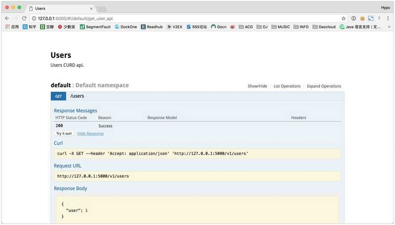
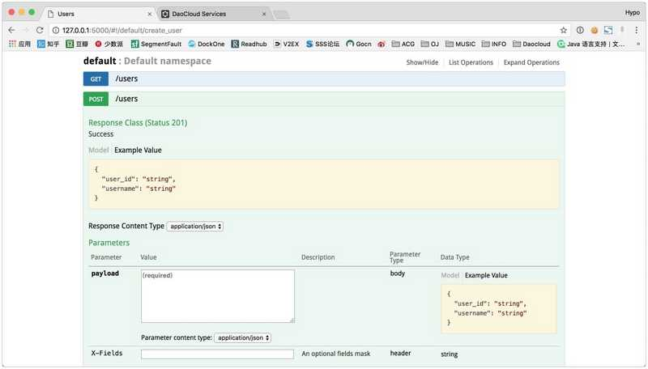
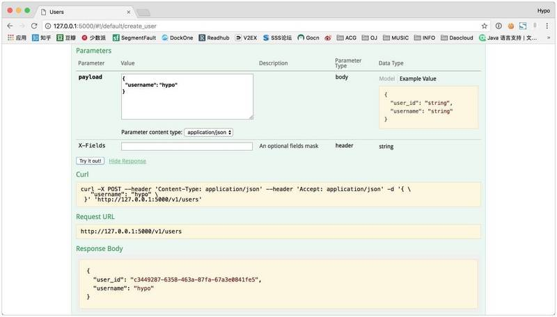
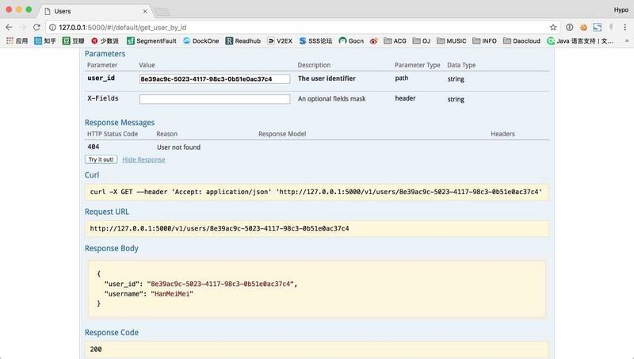
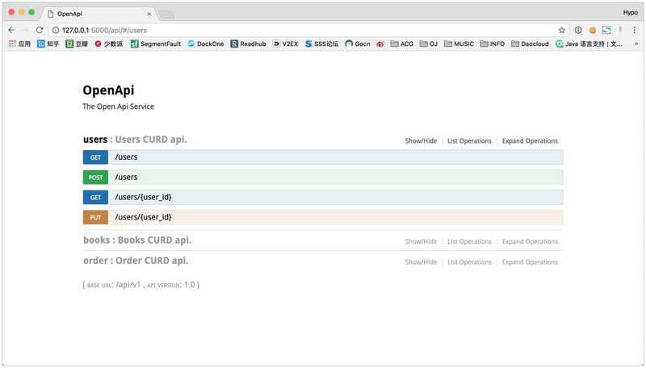
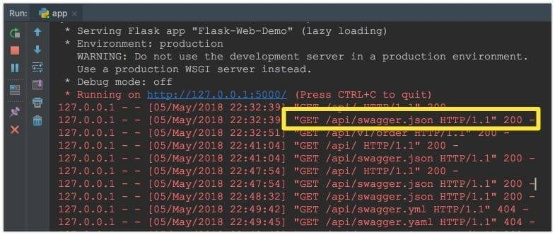
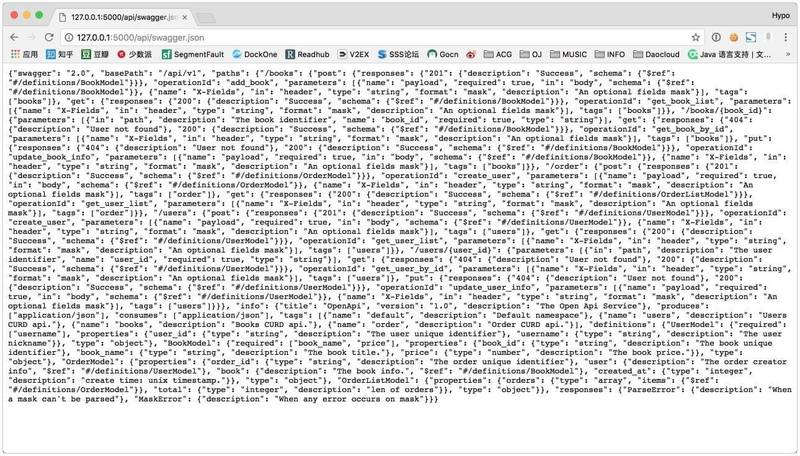

# [Flask Api 文档管理与 Swagger 上手](https://segmentfault.com/a/1190000014775124)

Flask 是一个以自由度高、灵活性强著称的 Python Web 框架。但高灵活性也意味着无尽的代码维护成本、高自由度意味着代码质量更依赖程序员自身而没有一致的标准和规范。因此团队内开发时 Flask 项目更需要建立代码和文档规范以保证不会出现太大的偏差。

本文从 Api 的角度探究 Flask 项目的 Api 规范以及获得 Api 文档的最佳姿势。众数周知，文档的编写和整理工作将花费巨大精力甚至不亚于代码的编写，因此在时间紧任务重的情况下，文档是首先被忽略的工作。不过，就算项目在初期存在文档，但在后面的迭代中，文档落后严重，其产生的误导比没有文档更加可怕。

因此，个人认为 **文档随代码走**，代码改动时文档也应该跟进变动，但本着 *人是不可靠的* 原则，文档理想上是应该由代码生成，而不是靠人工维护。如果代码有任何改动，文档也能自动更新，这将是一件非常优雅的事情。虽然对很多文档来说这并不现实，但对于 Api 文档来说，实现成本并不高。

## Flask-RESTPlus

对于 REST Api 来说，`Flask-RESTPlus` 是一个优秀的 Api 文档生成工具，这个包将会替换 Flask 路由层的编写方式，通过自己的语法来规定 Api 细节，并生成 Api 文档。

### 安装

安装 `Flask-RESTPlus`：

```
pip install flask-restplus
```

或者：

```
easy_install flask-restplus
```

### 最小 Demo

使用 `Flask-RESTPlus` 时需要按照这个库规定的方式编写 Api 层，包括 request 的参数解析，以及 response 的返回格式。一个 hello world 级的示范：

```
from flask import Flask
from flask_restplus import Resource, Api

app = Flask(__name__)
api = Api(app, prefix="/v1", title="Users", description="Users CURD api.")

@api.route('/users')
class UserApi(Resource):
    def get(self):
        return {'user': '1'}

if __name__ == '__main__':
    app.run()
```

运行之后效果如下：


## 实践

这里我会实现一个完整的小项目来实践和介绍 `Flask-RESTPlus` 这个库。我们实现一个简单的 *图书订单系统* ，实现用户、图书和订单的 CURD。

### Model

用户 model，包含 id 和 username：

```
class User(object):
    user_id = None
    username = None

    def __init__(self, username: str):
        self.user_id = str(uuid.uuid4())
        self.username = username
```

图书 model，包含 id，名称和价格：

```
class Book(object):
    book_id = None
    book_name = None
    price = None

    def __init__(self, book_name: str, book_price: float):
        self.book_id = str(uuid.uuid4())
        self.book_name = book_name
        self.price = book_price
```

订单 model，包含 id，购买者 id，图书 id 和创建时间：

```
class Order(object):
    order_id = None
    user_id = None
    book_id = None
    created_at = None

    def __init__(self, user_id, book_id):
        self.order_id = str(uuid.uuid4())
        self.user_id = user_id
        self.book_id = book_id
        self.created_at = int(time.time())
```

### 蓝图

在 Flask 中构建大型 Web 项目，可以通过蓝图为路由分组，并在蓝图中添加通用的规则（url 前缀、静态文件路径、模板路径等）。这个项目我们只用一个 api 蓝图，在实际中可能会使用 openapi 蓝图，internal api 蓝图来区分大的分类。

而 `Flask-RESTPlus` 的 `class::Api` 将直接挂在在蓝图下面，这么我们即利用了 Flask 的蓝图进行对功能模块分类，也可以利用 `Api` 的版本对 Api 版本进行管理，对于小的模块分类，我们可以利用 `Api` 的 namespace，着这里我们可以分为 `user namespace`，`book namespace` 和 `order namespace`:

Api 蓝图：

```
from flask import Blueprint
from flask_restplus import Api

api_blueprint = Blueprint("open_api", __name__, url_prefix="/api")
api = Api(api_blueprint, version="1.0",
          prefix="/v1", title="OpenApi", description="The Open Api Service")
```

然后，就可以创建出不同的 namespace，来编写自己的 api 代码了。而只需要在 app 工厂中注册该 blueprint，便可将自己的编写的 api 挂载到 flask app 中。

```
def create_app():
    app = Flask("Flask-Web-Demo")

    # register api namespace
    register_api()

    # register blueprint
    from apis import api_blueprint
    app.register_blueprint(api_blueprint)

    return app
```

要注意的是，因为 Api 中很多工具方法依赖 api 对象，因此在注册 namespace 的时候要避免循环引用，而且，这注册蓝图的时候，需要先将 namespace 注册，否则会 404。这个库的很多方法太依赖 api 对象，感觉设计并不合理，很容易就循环引用，并不是非常优雅。

注册 namespace：

```
def register_api():
    from apis.user_api import ns as user_api
    from apis.book_api import ns as book_api
    from apis.order_api import ns as order_api
    from apis import api
    api.add_namespace(user_api)
    api.add_namespace(book_api)
    api.add_namespace(order_api)
```

下面就是 Api 的编写了。

### 编写 Api

#### 列表和创建

我们先完成用户的列表和创建 Api，代码如下：

```
from flask_restplus import Resource, fields, Namespace

from model import User
from apis import api

ns = Namespace("users", description="Users CURD api.")

user_model = ns.model('UserModel', {
    'user_id': fields.String(readOnly=True, description='The user unique identifier'),
    'username': fields.String(required=True, description='The user nickname'),
})
user_list_model = ns.model('UserListModel', {
    'users': fields.List(fields.Nested(user_model)),
    'total': fields.Integer,
})


@ns.route("")
class UserListApi(Resource):
    # 初始化数据
    users = [User("HanMeiMei"), User("LiLei")]

    @ns.doc('get_user_list')
    @ns.marshal_with(user_list_model)
    def get(self):
        return {
            "users": self.users,
            "total": len(self.users),
        }

    @ns.doc('create_user')
    @ns.expect(user_model)
    @ns.marshal_with(user_model, code=201)
    def post(self):
        user = User(api.payload['username'])
        return user
```

解释下上面的代码，首先需要创建一个 user model 来让 `Flask-RESTPlus` 知道我们如何渲染和解析 json：

```
user_model = ns.model('UserModel', {
    'user_id': fields.String(readOnly=True, description='The user unique identifier'),
    'username': fields.String(required=True, description='The user nickname'),
})
```

这里面定义了字段以及字段的描述，这些字段并不参与参数检查，而只是渲染到 api 文档上，来标记 api 将返回什么结果，以及应该怎么调用 api。

然后介绍下目前用到的装饰器：

1. `@ns.doc` 来标记这个 api 的作用
2. `@ns.marshal_with` 来标记如何渲染返回的 json
3. `@ns.expect` 来标记我们预期什么样子的 request

运行程序我们可以看到以下结果：



我们也可以通过 try it 来调用 api：



#### 查询和更新

因为路由是绑定到一个类上的，因此限定了这个类能处理的 url，对于 '/users/user_id' 类似的路径，需要单独的类来处理：

```
@ns.route("/<string:user_id>")
@ns.response(404, 'User not found')
@ns.param('user_id', 'The user identifier')
class UserInfoApi(Resource):
    users = [User("HanMeiMei"), User("LiLei")]
    print([u.user_id for u in users])

    @ns.doc("get_user_by_id")
    @ns.marshal_with(user_model)
    def get(self, user_id):
        for u in self.users:
            if u.user_id == user_id:
                return u
        ns.abort(404, "User {} doesn't exist".format(user_id))

    @ns.doc("update_user_info")
    @ns.expect(user_model)
    @ns.marshal_with(user_model)
    def put(self, user_id):
        user = None
        for u in self.users:
            if u.user_id == user_id:
                user = u
        if not user:
            ns.abort(404, "User {} doesn't exist".format(user_id))
        user.username = api.payload['username']
        return user
```

在这里面可以看到更改了 url 和新引入了两个装饰器：

1. `@ns.response` 用来标记可能出现的 Response Status Code 并渲染在文档中
2. `@ns.param` 用来标记 URL 参数

运行程序之后我们可以尝试根据 id 获得一个用户：



**注意**： *namespace 的 name 会被拼接到 url 中，比如上面 url 中的 “users” 即是 namespace name。*

#### 带嵌套的 Api

用户 Api 和图书 Api 基本一样而且简单，但是对于订单 Api 中，需要包含用户信息和图书信息，在实现上略微不同。

```
from flask_restplus import Resource, fields, Namespace

from model import Order, Book, User
from apis.user_api import user_model
from apis.book_api import book_model

ns = Namespace("order", description="Order CURD api.")

order_model = ns.model('OrderModel', {
    "order_id": fields.String(readOnly=True, description='The order unique identifier'),
    "user": fields.Nested(user_model, description='The order creator info'),
    "book": fields.Nested(book_model, description='The book info.'),
    "created_at": fields.Integer(readOnly=True, description='create time: unix timestamp.'),
})
order_list = ns.model('OrderListModel', {
    "orders": fields.List(fields.Nested(order_model)),
    "total": fields.Integer(description='len of orders')
})

book = Book("Book1", 10.5)
user = User("LiLei")
order = Order(user.user_id, book.book_id)


@ns.route("")
class UserListApi(Resource):

    @ns.doc('get_order_list')
    @ns.marshal_with(order_list)
    def get(self):
        return {
            "orders": [{
                "order_id": order.order_id,
                "created_at": order.created_at,
                "user": {
                    "user_id": user.user_id,
                    "username": user.username,
                },
                "book": {
                    "book_id": book.book_id,
                    "book_name": book.book_name,
                    "price": book.price,
                }
            }],
            "total": 1}

    @ns.doc('create_order')
    @ns.expect(order_model)
    @ns.marshal_with(order_model, code=201)
    def post(self):
        return {
            "order_id": order.order_id,
            "created_at": order.created_at,
            "user": {
                "user_id": user.user_id,
                "username": user.username,
            },
            "book": {
                "book_id": book.book_id,
                "book_name": book.book_name,
                "price": book.price,
            }
        }
```

这里使用了更灵活的格式组合，包括 `fields.Nested` 可以引入其他 model，因为 model 可以相互引用，因此还是有必要把这些 model 放在一起，来避免循环引用。不过由此也可以看出，Response 解析还是比较自由的。

*备注：这里 return 的是一个字典，但是理想状态下应该是一个类（user 字段和 book 字段），只是因为没有数据库操作，简化处理。*

到这里，这个小项目就是写完了，最后运行效果图如下：



## 改造

可以通过这个简单的 Demo 了解 `Flask-RESTPlus` 的使用，但是目前只是从零到一的写一个完成的项目，因此看起来非常容易上手，但是如果是旧项目改造，我们需要做什么？

通过上述代码，我们可以看到要做的主要是两件事：

1. Api 层的改造
2. 设计 Api Model

Api 层改造涉及到两点，因为 url 是由 blueprint、api obj、namespace 三个东西共同组成的，因此需要设计怎么分配，可能还有重写部分 api 的实现。但是理想的 api-service-model 架构的程序， api 应该是比较薄的一层，要接入并不困难，只是琐碎。

Api Model 一般是原有项目没有的，需要引入，其中包括的参数检查的 model（`Flask-RESTPlus` 提供了 Request Parsing，本文并没讨论，可以参考文档： [Request Parsing](http://flask-restplus.readthedocs.io/en/stable/parsing.html) ）和解析 Response 的 model，这些需要梳理所有 api 和字段，工作量不小，如果数据库模型设计合理的话也许能减轻部分工作量。

## Swagger

Swagger 是一款非常流行的 Api 文档管理、交互工具，适用于在团队中的 Api 管理，以及服务组件对接。其好用与重要程度不必赘言，下面基于上文的 demo，完成一个 Swagger 文档以及基于文档生成用于对接的 client。

### 获得 Swagger 文档

`Flask-RESTPlus` 是已经集成了 Swagger UI 的，在运行时所获得界面即是通过 Swagger UI 渲染的。而我们目前需要的是获取 Swagger 文档 json 或 yaml 文件。

在控制台可以看到，在访问程序时：



是的，这就是 Swagger 文档：



### 代码生成

使用 Swagger 生成文档需要

在 macOS 下载：

```
brew install swagger-codegen
```

然后可以通过 help 名称查看帮助：

```
Hypo-MBP:~ hypo$ swagger-codegen help
usage: swagger-codegen-cli <command> [<args>]

The most commonly used swagger-codegen-cli commands are:
    config-help   Config help for chosen lang
    generate      Generate code with chosen lang
    help          Display help information
    langs         Shows available langs
    meta          MetaGenerator. Generator for creating a new template set and configuration for Codegen.  The output will be based on the language you specify, and includes default templates to include.
    validate      Validate specification
    version       Show version information

See 'swagger-codegen-cli help <command>' for more information on a specific
command.
```

生成 Python client：

```
swagger-codegen generate -i http://127.0.0.1:5000/api/swagger.json -l python
```

执行完成后，便可以在当前路径的 `swagger_client` 下找到 api client 了。

## 总结

本文介绍了 `Flask-RESTPlus` 的使用，因为其本身就支持 Swagger 语法并内置了 Swagger UI，所以 Swagger 对接简单异常。因此，主要工作量放在了编写 api 层上，包括 model，以及 api 中起到解释说明作用的装饰器。虽然在代码上需要编写不少不必要的代码（介绍说明用的描述等），但是这些额外代码辅助生成了与代码一致的文档，在组件对接和维护上，实则降低了成本。