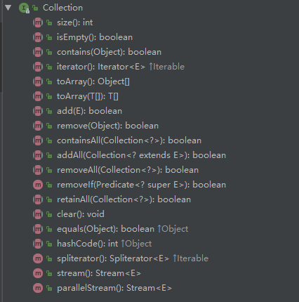
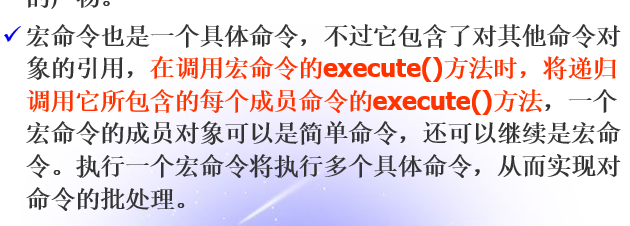
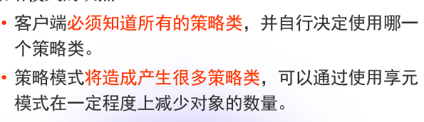

# 面试

## 面向对象

### 面向对象三大特性

#### 封装

#### 继承

#### 多态

##### 重载和重写的区别是什么？

重写（动态绑定，在运行时才知道具体实现）是覆盖父类的方法实现；而重载（静态绑定，在编译时知道调用哪种目标方法）是同一个类中可以有多个方法名相同，参数列表不同的方法。


想成功的重写父类方法，必须满足：

1. 访问权限不能变小；
2. 返回类型能够向上转型成为父类的返回类型；
3. 异常也要能向上转型成为父类的异常；
4. 方法名、参数列表必须严格一致。

覆写只能针对非静态、非final、非私有和非构造方法。

在使用重载机制时，不能有方法签名完全相同的方法。方法返回值不属于方法签名（方法名称+参数列表）。

### 接口、类和对象

#### 接口和抽象类的区别？

接口与抽象类都是对实体类更高层次的抽象，仅定义公共行为和特征。接口和抽象类的共同点都是不能实例化，但可以定义引用变量指向实例对象。

语法区别：

- 定义关键字：接口使用关键字interface来定义；而抽象类使用abstract class来定义；
- 类型扩展：一个类可以实现多个接口，并且要实现除了 default 和 static 之外的所有方法；但最多只能继承一个抽象类，并且如果该类非 abstract 类的话要实现所有 abstract 方法；
- 方法访问控制符：接口有限制，默认是 public abstract 类型；而抽象类无限制（抽象类可以没有抽象方法，但是有抽象方法的类一定是抽象类）；
- 属性访问控制符：接口有限制，默认是 public static final 类型；而抽象类无限制；
- 方法实现：接口只有在JDK 8 之后才可以有使用关键字 default 声明的方法实现；而抽象类一直都可以有；
- 静态方法：接口只有在JDK 8 之后才可以有使用关键字 static 声明的静态方法；而抽象类一直都可以有；
- 静态代码块：接口不能声明静态代码块；而抽象类一直都可以有；

语义区别：

- 接口被继承时体现的是 can-do 关系，而抽象类被继承时体现的是 is-a 关系；
- 抽象类是模板式设计，而接口是契约式设计。

#### 内部类可以引用他的包含类的成员吗？有没有什么限制？

如果不是静态内部类的话，没有什么限制，一个内部类对象可以访问创建它的外部类对象的成员（包括私有成员）。

而静态内部类不能访问外部类的普通成员变量，只能访问外部类中的静态成员。


参考：[内部类可以引用它的包含类的成员吗？有没有什么限制？](https://www.cnblogs.com/wanglingling/p/7675918.html)

## Java

### 是否可以在static环境中访问非static变量？ 

不可以。因为以static修饰的变量，方法，代码块是在类加载的时候执行初始化的，而非static变量是属于某个对象的，在对象实例化的时候才会被创建。

### final, finally, finalize的区别

final关键字可以用于类，变量，方法前，用来表示该关键字修饰的类，方法，变量具有不可变的特性。

（1）final关键字用于类名前：表示该类不能被其他类继承。

（2）final关键字用于变量前：表明该关键字修饰的变量是一个常量，只能被赋值一次，赋值后该变量的值就不能被修改。`当final修饰一个基本数据类型时，表示该基本数据类型的值一旦在初始化后便不能发生变化；如果final修饰一个引用类型时，则在对其初始化之后便不能再让其指向其他对象了，但该引用所指向的对象的内容是可以发生变化的。`

（3）final关键字用于方法声明前：表明该方法不能被重写，但是可以被重载。


finally作为异常处理的一部分，它只能用在try/catch语句中，并且附带一个语句块，表示这段语句最终一定会被执行（不管有没有抛出异常），经常被用在需要释放资源的情况下。

以下几种情况不会执行finally块：

（1）程序未进入try块就退出；

（2）在 try 块中强制退出整个程序，如调用System.exit(0)；

（3）当一个线程在执行 try 语句块或者 catch 语句块时被打断（interrupted）或者被终止（killed），与其相对应的 finally 语句块可能不会执行。


finalize方法是在java.lang.Object中定义的，可以覆写任何一个类的finalize方法，该方法将**在垃圾回收器清除对象之前调用**，用于回收资源。`一个对象的finalize()方法只会被调用一次，而且finalize()被调用不意味着gc会立即回收该对象，所以有可能调用finalize()后，该对象又不需要被回收了，然后到了真正要被回收的时候，因为前面调用过一次，所以不会调用finalize()，产生问题。 所以，推荐不要使用finalize()方法，它跟析构函数不一样。`

参考：[Java中final,finalize和finally的区别](https://www.cnblogs.com/ktao/p/8586966.html)

### `==`、equals和hashCode

#### equals和==的区别？

`==`是运算符，如果操作符两端是两个对象引用，则判断两个引用指向的地址是否相同，是真正意义上的指针操作，如果是基本数据类型，判断具体数值，如果值相等则返回true，java.lang.Object中equals方法返回的就是两个对象的`==`结果；

而equals是方法，所有继承自java.lang.Object的类都可以覆盖这个方法，通常用来比较两个对象的内容是否相同。

#### 若不重写hashCode()的话，hashCode()如何计算出来的？

java.lang.Obejct中的hashCode默认为本地方法，不被重写（原生）的hashCode值是根据**内存地址换算**出来的一个值。

#### 为什么重写equals还要重写hashCode方法？

equals()和hashCode()用来标识对象，两个方法协同工作用来判断两个对象是否相等。并且覆盖equals时总要覆盖hashCode，如果只重写equals而不重写hashCode会违反Object.hashCode约定的第二条：相等的对象必须有相等的散列码，通常会导致基于散列的集合类无法正常运作，如HashMap、HashSet和Hashtable。

`HashMap的底层处理机制是以数组+链表的方法保存放入的数据的，其中的关键是数组(Node<K,V>[] table)下标的处理。数组的下标是根据传入的元素hashCode方法的返回值再和特定的值异或决定的。如果该数组位置上已经有放入的值了，且传入的键值相等则不处理，若不相等则覆盖原来的值，如果数组位置没有条目，则插入，并加入到相应的链表中。检查键是否存在也是根据hashCode值来确定的。所以如果不重写hashCode的话，可能导致HashSet、HashMap不能正常的运作、如果我们将某个自定义对象存到HashMap或者HashSet及其类似实现类中的时候，如果该对象的属性参与了hashCode的计算，那么就不能修改该对象参数hashCode计算的属性了。有可能会移除不了元素，导致内存泄漏。`

Object.hashCode的通用约定：

1. 在一个应用程序执行期间，如果一个对象的equals方法做比较所用到的信息没有被修改的话，那么，对该对象调用hashCode方法多次，它必须始终如一地返回 同一个整数。在同一个应用程序的多次执行过程中，这个整数可以不同，即这个应用程序这次执行返回的整数与下一次执行返回的整数可以不一致。
2. 如果两个对象根据equals(Object)方法是相等的，那么调用这两个对象中任一个对象的hashCode方法必须产生同样的整数结果。
3. 如果两个对象根据equals(Object)方法是不相等的，那么调用这两个对象中任一个对象的hashCode方法，不要求必须产生不同的整数结果。然而，程序员应该意识到这样的事实，对于不相等的对象产生截然不同的整数结果，有可能提高散列表（hash table）的性能。

参考：[重写equals就必须重写hashCode的原理分析](http://www.cnblogs.com/wang-meng/p/7501378.html)

### 数据类型

#### int

##### int的范围

-2^31 ~ 2 ^ 31 - 1，即-2147483648 ~ 2147483647。

##### int 和 Integer 有什么区别

- int是java的一种基本数据类型，直接存储数据（默认值为0）；
- Integer是int的包装类，是引用类型，当new一个Integer时，实际上是生成一个指针指向此对象（默认值为null）。

#### double

##### double为什么不能直接使用==判断相等？

存储精度问题。一般使用阈值， a - b 小于这个阈值，一般就认为相等。 、

##### 为啥有时会出现4.0-3.6=0.40000001这种现象？

参考：[float,double等精度丢失问题](https://www.cnblogs.com/yewsky/articles/1864934.html)

#### String

##### String是最基本的数据类型吗？

不是。String是引用类型，Java中基本数据类型只有8种：boolean，byte，char，short，int，float，long，double。

##### String能继承吗？ 

不能。String类由final关键字修饰，因此不能被继承。

##### String为啥不可变？ 

String类实际是由一个char[]数组存储数据的，这个数组被关键字final修饰。调用String类中某些“改变”其内容的方法实际上是返回了新的String对象。

##### String 和 StringBuffer有什么区别？

String创建不可变对象，一旦被创建，就不能修改它的值。对已经存在的String对象的修改都是重新创建一个新的对象，然后把新的值保存进去。String 是final类，即不能被继承。

StringBuffer创建可变对象，当对它进行修改的时候不会像String那样重新建立对象。它只能通过构造函数来建立对象，不能直接用字面量进行赋值。

```java
String str = new String("Hello ");
str += "World!"; // str = new StringBuilder("Hello ").append("Wolrd!").toString();
```

参考：[JAVA中String与StringBuffer的区别](https://blog.csdn.net/yirentianran/article/details/2871417)

##### StringBuffer和StringBuilder有什么区别

StringBuffer和StringBuilder中的方法和功能是完全等价的。只是StringBuffer中的方法大都采用了synchronized关键字进行修饰，因此是线程安全的，同时因为加入了同步锁，效率相对较低；而StringBuilder没有这些修饰，因此可以认为是非线程安全的。


JVM内部采用StringBuilder来连接字符串，每次执行字符串“+”操作时，JVM都要new一个StringBuilder对象来处理，这在涉及很多的字符串连接操作时开销会很大，因此推荐直接使用StringBuilder的append()方法来连接字符串。

参考：[StringBuffer和StringBuilder有什么区别，底层实现上呢](https://blog.csdn.net/longfulong/article/details/78700239)

#### 包装类

1. 包装类在遇到算术运算（+-*/ < <= == !=  >= > ）时会自动进行拆箱操作；

#### 常量池

1. byte/short/int/long/char/boolean实现了常量池，float/double没有；
2. 常量池主要用于存放两大类常量： 1）字面量、2）符号引用：
   1. 字面量相当于 Java 语言层面常量的概念；
   2. 符号引用包括类和接口的全限定名，字段名称和描述名称，方法名称和描述符；
   3. 运行时常量池有动态性： 常量不一定只有在编译时产生，也就是并非预置入 class 文件中常量池的内容才能放入常量池，运行期间有新的常量也可放入池中，比如String 的 intern 方法；
   4. 优：对象共享，节省内存空间，节省运行时间。 

##### 整型常量池

JVM 中，有效位在一个字节以内的整形数据 -128 到 127 会在 jvm 启动时加载入内存（常量池），除非用 new Integer(n) 显式地创建对象，否则都是同一个对象。

Integer 的 valueOf 方法返回一个对象，先判断传入的参数是否在-128 到 127 之间，若已经存在引用，则直接返回引用，否则返回 new Integer(n).

```java
Integer i1 = 59; // 相当于 Integer i1 = Integer.valueOf(59);
int i2 = 59;
Integer i3 = Integer.valueOf(59); // 直接返回内存中已存在对象59的引用
Integer i4 = new Integer(59); // 返回新创建的Integer对象的引用

System.out.println(i1 == i2); // true，i1自动拆箱
System.out.println(i1 == i3); // true，都指向内存中的同一Integer对象
System.out.println(i3 == i4); // false，指向不同的Integer对象
System.out.println(i2 == i4); // true，i4自动拆箱
```

Integer 是唯一可以修改缓存范围的包装类，在VM options加入参数 -XX:AutoBoxCacheMax=6666，就可以设置最大缓存值为6666。

##### 字符串常量池

```java
String s1 = "hello";
String s2 = "hello";

String s3 = "he" + "llo";
String s4 = "hel" + new String("lo");

String s5 = new String("hello");
String s6 = s5.intern();

String s7 = "h";
String s8 = "ello";
String s9 = s7 + s8;

// 在jdk 1.6,1.7,1.8下运行的结果为：
System.out.println(s1 == s2); // true
System.out.println(s1 == s3); // true
System.out.println(s1 == s4); // false
System.out.println(s1 == s9); // false
System.out.println(s4 == s5); // false
System.out.println(s1 == s6); // true
```

String类是以final关键字修饰的。

以字面量形式创建String变量时，JVM会在**编译期间**将字面量放到字符串常量池中，由Java程序启动时就已经加载到内存中了。字符串常量池的特点就是只有一份相同的字面量，如果有其它相同的字面量，JVM会返回这个字面量的引用；否则就在字符串常量池中创建这个字面量并返回它的引用。因为s2指向的字面量已经在字符串常量池中存在（由s1显式创建，s1也指向该字面量）了，于是JVM将常量池中该字面量的引用返回给s2，因此，s1 == s2返回true。

JVM在编译期间会对两个字面量的直接拼接进行优化，将拼接后的字面量按照上述的情况进行创建或者再引用，因为s3中两个字面量的拼接结果就是“hello”，因此s1 == s3与s1 == s2的情况是一样的。

s4的“hel” + new String("lo")生成了两个对象，“hel”存在于字符串常量池，“lo”存在于堆中，而JVM不会对对象的相加进行优化，相加的结果将存在于堆中，而s1存在于字符串常量池中，因此s1和s4必定是不同的引用，s1 == s4返回false。

s7和s8是两个字面量对象的引用，JVM也不会对其结果进行优化，因此s9 = s7 + s8的情况等同于s4的情况，s1 == s9也同样返回false。

s4和s5的结果都存在于堆中，是两个不同的引用，因此s4 == s5返回false。

s5.intern()方法使一个位于堆中的字符串在**运行时**动态地加入到字符串常量池中，规则同上，因此s1 == s6返回true。

```java
String s1 = new String("hello");
String intern1 = s1.intern();
String s2 = "hello";
System.out.println(s1 == s2); // JDK 1.6,1.7,1.8都返回false

String s3 = new String("hello") + new String("hello");
String intern3 = s3.intern();
String s4  = "hellohello";
System.out.println(s3 == s4); // JDK 1.6返回false，JDK 1.7,1.8返回true
```

JDK 1.6的字符串常量池是在永久区，是与堆完全独立的两个空间，s1指向堆中的内容，而s2指向常量池中的内容，两者当然不一样，因此s1 == s2返回false；但是intern1是将s1通过intern()方法从堆复制到永久区（字符串常量池）返回的引用，而s2根据上面所述的规则也和intern1有相同的引用，因此intern1 == s2会返回true。

JDK 1.7,1.8中的字符串常量池已经转移到堆中了，是堆中的一部分内容，JVM设计人员也对intern()方法做了一些修改。当执行s3.intern()时，JVM不再将s3对应的字符串复制到字符串常量池中，而是在字符串常量池存储s3的引用，这个引用指向堆中的字符串，当运行到s4 == "hellohello"时，发现字符串常量池中已经存在一个指向堆中该字面量的引用，所以s3 == s4返回true。

##### “  ”空字面量的处理

对于“  ”内容为空的常量字符串，JVM会创建一个长度为0、内容为空的字符串放入常量池中。

### 反射

#### 什么是反射机制？反射的应用场景有哪些？

##### 反射机制介绍

JAVA反射机制是在运行状态中，对于任意一个类，都能够知道这个类的所有属性和方法（包括私有方法）；对于任意一个对象，都能够调用这个对象的所有方法和属性；这种动态获取类的信息和动态调用对象的方法的功能称为Java语言的反射机制。

##### 反射机制原理/本质

获取到Class对象，反向获取其中的各种信息。

##### 谈谈如何通过反射创建对象？如何通过反射获取和设置对象私有字段的值？

```java
package me.yobol.review;

public class Student {

    private String name;
    private int age;

    public Student(String name, int age) {
        this.name = name;
        this.age = age;
    }
}
```


getXXX：获取所有公有的XXX

getDeclaredXXX：获取所有声明的XXX

```java
package me.yobol.review;

import java.lang.reflect.Constructor;
import java.lang.reflect.Field;
import java.lang.reflect.InvocationTargetException;

public class ReflectAnalysis {

    public static void main(String[] args) throws ClassNotFoundException, NoSuchMethodException, IllegalAccessException, InvocationTargetException, InstantiationException, NoSuchFieldException {
        // 将com.yobol.model.Student.class加载到JVM中
        Class klazz = Class.forName("me.yobol.review.Student");
        // 获取公有、参数为String类型的构造方法
        Constructor constructor = klazz.getConstructor(String.class, int.class);
        // 使用("张三", 20)创建一个对象
        Student student = (Student)(constructor.newInstance("张三", 20));

        // 获取student中的私有属性name和age
        Field nameField = klazz.getDeclaredField("name");
        nameField.setAccessible(true); // 暴力反射，解除私有限定
        Field ageField = klazz.getDeclaredField("age");
        ageField.setAccessible(true); // 暴力反射，解除私有限定

        // 输出student中的私有属性name和age
        System.out.println(nameField.get(student) + ": " + ageField.get(student));
        // 修改student中的私有属性age
        ageField.set(student, 21);
        // 输出student中的私有属性name和age
        System.out.println(nameField.get(student) + ": " + ageField.get(student));

    }
}
```


```
张三: 20
张三: 21
```

##### 静态编译和动态编译

静态编译：在编译时确定类型，绑定对象；

动态编译：在运行时确定类型，绑定对象。

动态编译可以最大程度地支持多态，而**多态最大的意义在于降低类的耦合性**，因此反射的优点就是解耦以及提高代码的灵活性。

##### 反射机制优缺点

优点：运行时进行类型的判断，动态加载类：提高代码灵活度；

缺点：性能瓶颈：反射相当于一系列解释操作，通知JVM要做的事情，性能比直接的Java代码要慢很多。

##### 反射的应用场景

1. 使用JDBC连接数据库：

   1） 首先通过反射获取com.mysql.jdbc.Driver类的实例，实例化该类的时候会执行该类内部的静态代码块，该代码块会在Java实现的DriverManager类中注册自己，DriverManager管理所有已经注册的驱动类，当调用DriverManager.geConnection方法时会遍历这些驱动类，并尝试去连接数据库，只要有一个能连接成功，就返回Connection对象，否则抛出异常。

   2） 通过使用DriverManager.geConnection(url,user,password)函数，传入url，数据库用户名，数据库密码，得到数据库的Connection对象。

   `MySQL驱动类的全名是com.mysql.jdbc.Driver，Oracle驱动类的全名是oracle.jdbc.driver.OracleDriver。`


   参考：[JDBC与反射](https://www.cnblogs.com/justPassBy/p/5296271.html)

2. 反射是框架设计的灵魂。Spring框架也用到很多反射机制，最经典的就是使用XML配置Bean。Spring 通过 XML 配置Bean 的过程：

​	1） 将程序内所有 XML 或 Properties 配置文件加载入内存中；

​	2） Java类里面解析 XML  或 Properties 里面的内容，得到对应实体类的字节码字符串以及相关的属性信息；

​	3） **使用反射机制，根据这个字符串获得某个类的Class实例**；

​	4） 动态配置实例的属性。


模拟Spring使用XML配置模式加载Bean对象：

```java
public class BeanFactory {
    private Map<String, Object> beanMap = new HashMap<String, Object>();
    /**
       * bean工厂的初始化.
       * @param xml xml配置文件
       */
    public void init(String xml) {
        try {
            //读取指定的配置文件
            SAXReader reader = new SAXReader();
            ClassLoader classLoader = Thread.currentThread().getContextClassLoader();
            //从class目录下获取指定的xml文件
            InputStream ins = classLoader.getResourceAsStream(xml);
            Document doc = reader.read(ins);
            Element root = doc.getRootElement();  
            Element foo;

            //遍历bean
            for (Iterator i = root.elementIterator("bean"); i.hasNext();) {  
                foo = (Element) i.next();
                //获取bean的属性id和class
                Attribute id = foo.attribute("id");  
                Attribute cls = foo.attribute("class");

                //利用Java反射机制，通过class的名称获取Class对象
                Class bean = Class.forName(cls.getText());

                //获取对应class的信息
                java.beans.BeanInfo info = java.beans.Introspector.getBeanInfo(bean);
                //获取其属性描述
                java.beans.PropertyDescriptor pd[] = info.getPropertyDescriptors();
                //设置值的方法
                Method mSet = null;
                //创建一个对象
                Object obj = bean.newInstance();

                //遍历该bean的property属性
                for (Iterator ite = foo.elementIterator("property"); ite.hasNext();) {  
                    Element foo2 = (Element) ite.next();
                    //获取该property的name属性
                    Attribute name = foo2.attribute("name");
                    String value = null;

                    //获取该property的子元素value的值
                    for(Iterator ite1 = foo2.elementIterator("value"); ite1.hasNext();) {
                        Element node = (Element) ite1.next();
                        value = node.getText();
                        break;
                    }

                    for (int k = 0; k < pd.length; k++) {
                        if (pd[k].getName().equalsIgnoreCase(name.getText())) {
                            mSet = pd[k].getWriteMethod();
                            //利用Java的反射极致调用对象的某个set方法，并将值设置进去
                            mSet.invoke(obj, value);
                        }
                    }
                }

                //将对象放入beanMap中，其中key为id值，value为对象
                beanMap.put(id.getText(), obj);
            }
        } catch (Exception e) {
            System.out.println(e.toString());
        }
    }

    //other codes
}
```


参考：[ Reflection：Java反射机制的应用场景](https://segmentfault.com/a/1190000010162647?utm_source=tuicool&utm_medium=referral) | [Java基础之—反射（非常重要）](https://blog.csdn.net/sinat_38259539/article/details/71799078)

### 集合

#### 集合框架

Java 集合框架主要包括两种类型的容器，一种是集合（Collection），存储一个元素集合，另一种是图（Map），存储键/值对映射。Collection 接口又有 3 种子类型，List、Set 和 Queue，再下面是一些抽象类，最后是具体实现类，常用的有 ArrayList、LinkedList、HashSet、LinkedHashSet、HashMap、LinkedHashMap 等等。


`ConcurrentHashMap继承了AbstractMap抽象类，同时实现了ConcurrentMap接口（继承了Map接口）。`

参考：[Java 集合框架](http://www.runoob.com/java/java-collections.html)

##### Collection和Collections的区别？

- Collection是集合框架的一个父接口，提供了对集合对象进行操作的通用接口方法，为各种具体的集合类型提供了最大化的统一操作方式。

  

- Collections是一个工具类，包含了各种有关集合操作的静态多态方法，如集合搜索、排序、线程安全化等操作，服务于Java的Collection框架。

参考：[Collection和Collections的区别](https://blog.csdn.net/sfhinsc/article/details/84060783)

##### 为什么Collection接口没有实现Cloneable和Serializable接口？

克隆(cloning)或者是序列化(serialization)的语义和含义是跟具体的实现相关的。因此，应该由集合类的具体实现来决定如何被克隆或者是序列化。

参考：[为什么集合类没有实现Cloneable和Serializable接口？](https://www.nowcoder.com/questionTerminal/2a4902f67d5b49b6b4c05f9d7e422caf)

##### Java集合类框架的基本接口有哪些？ 

Collection、List、Set、Queue、Map。

#####  List、Map、Set三个接口存取元素时，各有什么特点？ 

List接口存储一组不唯一（对象可重复），插入顺序有序的对象；

Set接口存储一组唯一（对象不可重复），插入顺序无序的对象；

Map接口存储一组键值对对象，提供Key到Value的映射。


参考：[List、Set、Map的区别](https://www.cnblogs.com/IvesHe/p/6108933.html)

#### List集合

##### ArrayList和LinkedList有什么区别？如果一直在list的尾部添加元素，用哪个效率高？ 

ArrayList内部实现用数组进行存储，集合扩容时会创建更大的数组空间，把原有数据复制到新数组中。支持对元素的快速随机访问，但插入与删除元素速度通常很慢（会移动其它元素）；LinkedList本质是双端列表，与ArrayList相比，LinkedList插入和删除的效率更高，但是随即访问速度则很慢。

用LinkedList效率更高，因为ArrayList会有额外的扩容开销。

#### Queue集合

#### Map集合

#### Set集合

#####  HashSet存的数是有序的吗？ 

不是。HashSet实现了Set接口，Set接口定义了Set集合内的元素是无序的。

##### HashSet是如何保证元素不重复的？

HashSet是基于HashMap实现的，参见HashMap是如何使用hashCode()和equals()方法判断对象相等的。

#### Map类集合

#####  什么是HashMap? Java中的HashMap的工作原理是什么？ 

HashMap是基于散列函数的数据结构，以哈希表（数组+链表）的方式实现的。

HashMap是以Key-Value键值对的形式存储元素的，每一个键值对也叫做Entry。HashMap需要一个hash函数，它需要同时使用hashCode()和equals()方法来判断对象的相等性，以向集合/从集合添加和检索元素。当调用put()方法的时候，HashMap会计算key的hash值，然后把键值对存储在集合中合适的索引上，如果key已经存在了，value会被更新成新值。HashMap的一些重要的特性是它的容量(capacity)，负载因子(load factor)和扩容极限(threshold resizing)。


参考：[小灰漫画-什么是HashMap](https://mp.weixin.qq.com/s?__biz=MzIxMjE5MTE1Nw==&mid=2653191907&idx=1&sn=876860c5a9a6710ead5dd8de37403ffc&chksm=8c990c39bbee852f71c9dfc587fd70d10b0eab1cca17123c0a68bf1e16d46d71717712b91509&scene=21#wechat_redirect) | [Java中的HashMap的工作原理是什么？](https://www.cnblogs.com/xuedexin/p/5691374.html)

##### HashMap的数据结构 （HashMap内部具体如何实现的） 

顺序存储寻址容易，但插入删除比较困难，同时，顺序存储会占用连续的内存地址，容易产生外部碎片和内部碎片；

链式存储寻址困难，但插入删除比较容易；二者按值查找时间复杂度相同。

而HashMap结合了二者的优点，基于散列函数，使用**数组（table）+ 链表结构（table[i]存储了链表的头结点）**的方式实现。

`《码出高效》 P202 图6-15`

##### HashMap的初始长度是多少？HashMap的容量为什么是2的n次幂？

HashMap的**初始长度是16**，而且每次手动初始化（如，指定长度为5，初始长度为8）或者自动扩展时，长度必须是2的n次幂。

使用取模的方式求元素在table中下标的效率不如位运算快。当“容量一定是2^n时，hash & (len - 1) == hash % len”。

**使用2的n次幂可以使得求得的index是均匀分布的**。


参考：[小灰漫画-什么是HashMap](https://mp.weixin.qq.com/s?__biz=MzIxMjE5MTE1Nw==&mid=2653191907&idx=1&sn=876860c5a9a6710ead5dd8de37403ffc&chksm=8c990c39bbee852f71c9dfc587fd70d10b0eab1cca17123c0a68bf1e16d46d71717712b91509&scene=21#wechat_redirect)

##### HashMap扩容全过程（扩容包括resize和rehash两个步骤）？

当向HashMap中插入一个元素时，如果`插入前的元素个数`大于等于`负载因子 * table数组的长度`，并且要插入的位置不为空时：

- resize：声明一个长度为原来数组两倍的新Entry数组；
- rehash：将之前数组中的所有元素重新计算下标后，再插入到新数组中。

并重新计算插入元素的hash值后再进行插入。


参考：[HashMap扩容全过程](https://www.cnblogs.com/zhuoqingsen/p/8577646.html)

##### 高并发环境下HashMap可能存在哪些问题？

死链问题和扩容数据丢失问题。


参考：[高并发下的HashMap](https://mp.weixin.qq.com/s?__biz=MzIxMjE5MTE1Nw==&mid=2653192000&idx=1&sn=118cee6d1c67e7b8e4f762af3e61643e&chksm=8c990d9abbee848c739aeaf25893ae4382eca90642f65fc9b8eb76d58d6e7adebe65da03f80d&scene=21#wechat_redirect)

##### 如果HashMap的key是一个自定义的类，怎么办？ 

使用HashMap，如果key是自定义的类，就必须同时重写hashCode()和equals()方法。因为自定义的类的hashCode()和equals()方法继承自Object类，前者默认返回对象的内存地址，后者默认比较两对象内存地址相等，这样即便有相同含义的两个对象，比较结果也是不相等的。

HashMap中，如果要比较key是否相等（即对象的“相等”性），需要同时使用hashCode()和equals()方法！HashMap中的是这样比较key的：先求出key的hash值，比较其值是否相等，若相等再比较equals()，若相等则认为他们是相等的。如果只重写hashCode()不重写equals()方法，当比较equals()时只是看他们是否为同一对象（即进行[内存地址](https://www.baidu.com/s?wd=%E5%86%85%E5%AD%98%E5%9C%B0%E5%9D%80&tn=24004469_oem_dg&rsv_dl=gh_pl_sl_csd)的比较），所以必定要两个方法一起重写。HashMap用来判断key是否相等的方法，其实是调用了HashSet判断加入元素是否相等。


参考：[使用HashMap，如果key是自定义的类，就必须重写hashcode()和equals()](https://blog.csdn.net/zw524362419/article/details/51520212)

##### HashMap 是线程安全的吗，为什么不是线程安全的（最好画图说明多线程环境下不安全）?

HashMap不是线程安全的，在并发插入元素时，会产生死链问题和扩容数据丢失问题。

##### HashMap 1.7与1.8的 区别，说明1.8做了哪些优化，如何优化的？

1. 在插入元素时，1.7使用的头插法，容易产生环形链表死循环问题；1.8及之后加入了红黑树并且都是采用的尾插法，这样可以有效避免出现死链问题。
2. 扩容后数据元素存储位置的计算方式，1.7直接用hash值和扩容后的长度进行位运算（hash & (length - 1)），1.8中若hash值的新增参与运算位=1，那么元素在扩容后的位置=原始位置 + 扩容前的长度，否则还是为原始位置。


参考：[美团面试题：Hashmap的结构，1.7和1.8有哪些区别，史上最深入的分析](https://blog.csdn.net/qq_36520235/article/details/82417949)

##### HashMap和Hashtable的区别

- HashMap
  - HashMap继承了AbstractMap类，实现了Map、Cloneable和Serializable这3个接口。
  - HashMap的方法都是没有用Synchronized关键字修饰的，因此HashMap是非线程安全的。
  - HashMap的键值都可以为null。
  - HashMap初始容量为16，每次扩容为原容量的2倍。
- Hashtable
  - Hashtable继承了Dictionary类，也实现了Map、Cloneable和Serializable这3个接口。
  - Hashtable的方法基本上都是同步的（同一时间只有一个线程可以访问数据，其他线程会被阻塞），因此Hashtable是线程安全的。
  - Hashtable的键值都不可以为null，如果为null，则抛出NPE（NullPointerException）。
  - Hashtable初始容量为11，并且每次扩容为原容量的2倍加1。

参考：[HashMap和Hashtable理解与对比](https://blog.csdn.net/luojishan1/article/details/81952147)

##### HashMap和ConcurrentHashMap的区别

1. Hashtable（JDK1.0）的put和get操作都是synchronize的，这意味着当多个线程访问HashTable时，只能有一个线程可以操作其中的元素，而其他线程只能阻塞（Hashtable给整个Map加锁），因此HashTable性能很差，现在已经被淘汰了；

2. HashMap（JDK1.2）不是线程安全的，在并发环境下put和get操作会导致CPU利用率接近100%，**死链问题和扩容数据丢失是慎用HashMap的两个主要原因**；

3. ConcurrentHashMap（JDK1.5）是Hashtable和HashMap的折中版，是效率与一致性权衡后的结果，在JDK1.8之前使用**分段锁：对集合中数据进行分段加锁（每段数据一个锁）**来保证多线程访问对象中的不同段数据就不会发生竞争锁导致的阻塞现象了，提高程序并发性能。

   

##### ConcurrentHashMap锁加在了哪些地方？

JDK 1.8之后，插入元素时会加锁：

- 在哈希槽上的链表转换为红黑树或者由红黑树退化为链表的时候会加同步块锁住当前槽的首元素，防止其他进程对当前槽进行增删改操作，转化完成后利用CAS替换原有链表。

##### ConcurrentHashMap原理？有啥优势？1.7，1.8区别？1.8 中为什么要用红黑树？

ConcurrentHashMap是线程安全的哈希式集合。

JDK 1.8之前（包括JDK 1.7）的ConcurrentHashMap使用了分段锁设计理念，分段锁是由继承于ReentrantLock的内部类Segment实现的，每个Segment用来管理一部分HashEntry。

JDK 1.8之后，ConcurrentHashMap做了如下改进：

1. 取消分段锁机制，进一步降低冲突概率；
2. 引入红黑树。同一个哈希槽上的元素个数超过一定阈值后，单向链表改为红黑树。
3. 使用了更加优化的方式统计集合内的元素数量。集合内元素数量最大可以表示到2 ^ 63 - 1。同时在元素总数更新时，使用CAS和多种优化以提高并发能力。


当哈希槽中的元素数量大于8个时，红黑树查找效率更高。

##### 说一下Map的分类和常见的情况？

Java为数据结构中的映射关系定义了一个接口java.util.Map，它有四个实现类，分别是HashMap，Hashtable，LinkedHashMap 和TreeMap。Map主要用于存储健值对，根据键得到值，因此不允许键重复，但允许值重复。  

HashMap根据key的hashCode值存储数据，根据键可以直接获取它的值，具有很快的访问速度，遍历时，取得数据的顺序是完全随机的。 HashMap最多只允许一条记录的键为Null，允许多条记录的值为 Null。HashMap不支持线程的同步，即任一时刻可以有多个线程同时写HashMap，可能会导致数据的不一致。如果需要同步，可以用Collections.synchronizedMap方法使HashMap具有同步的能力，或者使用ConcurrentHashMap。  

Hashtable与HashMap类似，不同的是：它不允许记录的键或者值为空。它支持线程的同步，即任一时刻只有一个线程能写Hashtable，因此也导致了 Hashtable在写入时会比较慢。

LinkedHashMap是HashMap的一个子类，保存了记录的插入顺序，在用Iterator遍历LinkedHashMap时，先得到的记录肯定是先插入的。在遍历的时候会比HashMap慢，不过有种情况例外，当HashMap容量很大，实际数据较少时，遍历起来可能会比 LinkedHashMap慢，因为LinkedHashMap的遍历速度只和实际数据有关，和容量无关，而HashMap的遍历速度和它的容量有关。  

TreeMap实现SortMap接口，能够把它保存的记录根据键排序，默认是按键值的升序排序，也可以指定排序的比较器，当用Iterator遍历TreeMap时，得到的记录是排过序的。  

一般情况下，我们用的最多的是HashMap，在Map 中插入、删除和定位元素，HashMap 是最好的选择。但如果你要按自然顺序或自定义顺序遍历键，那么TreeMap会更好。如果需要输出的顺序和输入的相同，那么用LinkedHashMap 可以实现,它还可以按读取顺序来排列。

##### TreeMap

###### 树

平衡二叉树不一定是二叉查找树，二叉查找树也叫二叉搜索树或二叉排序树。

AVL是一种平衡二叉查找树。AVL是在插入和删除节点后通过**不断旋转**来达到树平衡的。

###### 红黑树原理

在AVL的基础上，给每一个节点增加一个属性来标识节点的“颜色”，和AVL类似，红黑树也是在进行插入和删除元素时，通过特定的旋转来保持自身平衡的，从而获得较高的查找性能。与AVL相比，红黑树并不追求所有递归子树的高度差不超过1，而是保证从根节点到叶节点的最长路径不超过最短路径的2倍。

红黑树本质上还是二叉查找树，它额外引入了5个约束条件：

1. 节点只能是红色或黑色。

2. 根节点必须是黑色。

3. 每个叶子节点都是黑色的空节点（NIL节点）。

4. 每个红色节点的两个子节点都是黑色。(从每个叶子到根的所有路径上不能有两个连续的红色节点)

5. 从根节点到其每个叶子的所有路径都包含相同数目的黑色节点。

###### TreeMap底层原理

和HashMap使用hashCode()与equals()实现key值去重的方式不同，TreeMap依靠Comparable和Comparator实现key值去重。

TreeMap底层是基于红黑树实现的，因此其增删改查操作的平均和最坏复杂度皆为O(logn)。

### 异常

#### JAVA语言如何进行异常处理，关键字：throws,throw,try,catch,finally分别代表什么意义？在try块中可以抛出异常吗？ 

try块用于执行正常的业务代码。如果程序在执行try块代码的时候出现了“非预期”情况，JVM将会生成一个异常对象，这个异常对象将会被后面的catch块捕获。

catch块表示一个异常捕获块。当程序执行try块引发异常时，这个异常对象将会被后面相应的catch块捕获。

throw用于手动地在代码块中抛出异常对象。throw后面需要一个异常对象。

throws用于在类或方法签名中抛出一个或多个异常类。throws关键字后可以紧跟一个或多个异常类。

finally块用于处理在异常处理流程中总会执行的代码块。

对于一个完整的异常处理流程而言，try块是必须的，try块后紧跟一个或多个catch块，最后还可以带一个finally块。


try块中可以抛出异常。

参考：[Java语言如何进行异常处理，关键字：throws、throw、try、catch、finally分别代表什么意义？在try块中可以抛出异常吗？](https://blog.csdn.net/cwh615/article/details/52954474)

#### 异常分类？运行时异常和受检异常有什么区别？

所有异常都是Throwable的子类，分为Error（致命异常，JVM内部的严重问题，程序员无法处理）和Exception（非致命异常，普通问题，程序员可以进行合理地处理，使程序回到正常执行流程）。

Exception又分为 checked（受检型）异常和 unchecked（非受检型）异常：

- 受检型异常是必须要显式处理的异常，需要在当前代码块中处理或者向上抛出（在方法或类名之后使用throws关键字进行声明），**一般是由一些外部的偶然因素所引起的**，如SQLException，IOException，ClassNotFoundException，FileNotFoundException；
- 非受检型异常又称为运行时异常，派生自RuntimeException，不需要显式地进行捕获并处理，**一般是由程序员处理不当而导致的逻辑上的问题**，如NullPointerException，ArrayIndexOutOfBoundsException，ClassCastException，ArithmeticException。

当受检异常未威胁到系统的安全稳定运行时，可以转换为非受检异常，其它情况下则必须要处理。

参考：[Java 受检异常和非受检异常](<https://www.liangzl.com/get-article-detail-124053.html>)

#### 异常处理机制（简单原理和应用）

整合以上两个问题的答案回答即可。

#### Error与Exception的区别

- Error 一般指与虚拟机相关的问题，比如系统崩溃，虚拟机错误，内存空间不足（StackOverflowError、OutOfMemoryError），对于这种错误导致的应用程序中断，仅靠程序本身无法恢复和预防，遇到这样的错误，建议让程序终止。
- Exception 表示程序可以处理的异常，遇到这类异常，应该尽可能处理异常，使程序恢复运行，而不应该随意终止异常。

### Java各版本加入的特性

#### Java 5

- 注解

  - 注解本质上是通过反射机制实现的，而反射会破坏程序的封装性，并且还会造成很多的额外开销。
  - 使用Annotation作为配置项的优缺点：
    - 优点：
      - **简化开发，提升开发效率**；
      - （相对于XML而言）无需工具支持，无需解析；
      - 编译期间即可验证正确性，更易于排错；
    - 缺点：
      - **注解分布得到处都是，难以控制**；
      - 有时还需要了解框架的内部实现才能准确使用注解，开发所需要的功能；
      - 配置项编码在Java代码中，可扩展性差；
  - 使用XML作为配置项的优缺点，参考：[Java Annotation(注解) 的优点缺点](<https://blog.csdn.net/lengxingxing_/article/details/65441337>)

#### Java 8

- Lamda表达式（Java 8最主要的特性，让Java可以支持函数式编程）
  - 格式：参数列表 -> 函数体 (param1, param2) -> {}；
  - 优点：简洁、大大简化代码行数；非常容易并行计算；结合HashMap的computeIfAbsent方法，递归运算非常快；
  - 缺点：若不用并行计算，很多时候计算速度不如传统的for循环快；不容易调试；
  - 适用场景：函数接口即仅仅包含一个抽象方法的接口，任何一个Lamda表达式可以等价为对应的函数式接口。
- 函数式接口里的默认方法和静态方法；
- 方法引用；
- 重复注解，使用@Repeatable修饰；
- JVM堆内存分布的优化，永久移除永久区，使用本地内存来存储元数据信息并称之为：元空间；

参考：[Java8新特性详解](https://blog.csdn.net/liubenlong007/article/details/62039628)

## JVM

### 什么是Java虚拟机？为什么Java被称作是“平台无关的编程语言”？

Java虚拟机是执行字节码文件的虚拟机进程。Java源文件（.java）由编译器编译成二进制字节码文件（.class），然后由JVM针对不同平台解释成对应的机器码。

因为不同的平台装有不同的JVM，它们能够将相同的字节码文件（.class），解释成不同平台所需要的机器码。正是因为有JVM的存在，Java被称为平台无关的编程语言。

### JVM有哪些分区？

线程私有的程序计数器，Java虚拟机栈，本地方法栈；还有线程之间共享的堆，方法区。

- 程序计数器存储了当前线程下一条要执行的字节码行号，字节码解释器工作时就是通过这个计数器的值来选取下一条需要执行的字节码；
- Java虚拟机栈描述了Java方法执行的内存模型：每个方法在执行时都会创建一个栈帧（Java栈中存放的是一个一个的栈帧，每一个栈帧对应一个被调用的方法），用于存储方法的局部变量表、操作数、动态链接、方法出口等信息。
- 和Java虚拟机栈为JVM执行Java方法服务不同，本地方法栈为JVM执行Naive方法服务（HotSpot VM没有区分这两个方法栈，而是将二者合二为一）；
- 堆的最大作用就是存放对象实例，几乎所有的对象实例都会在堆上分配内存；Java堆可以处于物理上不连续的内存空间中，只要逻辑上是连续的即可；
- 方法区（也叫静态区）存储已被JVM虚拟机加载的类信息、常量、**静态变量**、即时编译器编译后的代码等数据。 

#### 数组在内存中如何分配？

参考：[Java数组在内存中是如何存放的](https://www.cnblogs.com/chenpi/p/5489732.html)

#### VM分区内存分配参数

##### 堆

- -Xms20M：指定堆的最小值为20MB
- -Xmx20M：指定堆的最大值为20MB
- -Xmn10M：显式指定新生代的大小为10MB
- -xx:newRatio=1：指定新生代和老年代的比例
- -xx:survivorRatio=8：指定Eden区和Survivor区的比例为8:1:1

##### 栈

- -Xss10m：指定栈的大小为10MB

#### OOM（Out of Memory）

- 程序计数器是唯一一个在Java虚拟机规范中没有规定任何OOM的区域；
- 在Java虚拟机规范中，对于Java虚拟机栈规定了两种异常情况：
  1. 当线程请求的深度 > 虚拟机栈深度，会抛出StackOverflowError异常；
  2. 若虚拟机可以动态扩展，扩展时无法申请到足够的内存空间，会抛出OOM异常；
- 本地方法栈也会抛出SOF异常和OOM异常；
- Java堆可以处于物理上不连续的区域、只要逻辑上连续即可，可固定也可拓展，当堆中无法为实例分配空间，且堆也无法扩展时，会抛出OOM异常；
- 方法区无法满足内存分配需求时，会抛出OOM异常；
- 直接内存不是运行时数据区的一部分。

### GC

#### 什么是GC？为什么要有GC/GC的优点？

GC（Garbage Collection），即垃圾收集，是指JVM用于**回收那些没有价值或者需要为更有价值的对象让位的对象，释放其占用的内存空间**。

忘记或错误回收内存会导致程序或系统的不稳定甚至崩溃，GC的出现可以自动检测对象是否超过其作用域从而达到自动回收的目的，使得程序员不必在内存的分配/释放上耗费大量精力，而更加专注于具体的业务。**垃圾回收可以有效防止内存泄露，有效的使用空闲内存**。

参考：[GC是什么? ](https://blog.csdn.net/leisure_life/article/details/74529253) | [为什么要有GC/GC的优点](https://blog.csdn.net/hustwht/article/details/52109343)

#### 垃圾回收器的原理？

1. 垃圾回收有什么意义？
2. 如何判断对象可以被回收？
3. 如何进行垃圾回收？

参考：[深入理解JVM的垃圾回收机制](http://www.cnblogs.com/sunniest/p/4575144.html)

#### 垃圾回收器可以马上回收内存吗？有什么办法主动通知虚拟机进行垃圾回收？

不可以。因为垃圾回收器通常是作为一个单独的低优先级线程运行，在不可预知的情况下会进行垃圾回收，程序员不能实时的调用垃圾回收器对某个对象或所有对象进行垃圾回收。显示调用System.gc()或者Runtime.getRuntime().gc()可以通知虚拟机进行垃圾回收。

参考：[GC是什么？为什么要有GC？](https://blog.csdn.net/hustwht/article/details/52109343)

#### 如何判断对象可以被回收？

判断对象是否可以被回收，即判断对象是否时存活的。

##### 引用计数算法

为对象中添加一个引用计数器，每当有一个地方引用它的时候，计数器值就加1；当引用失效时，计数器值就减1；任何时刻，计数器值为0的对象都是不可以再被使用的。

优点：简单、高效；

缺点：无法解决对象之间相互循环引用的问题。

##### 可达性分析算法

通过一系列的称为“GC Roots”的对象作为起始点，从这些节点开始向下搜索，搜索所走过的路径称为引用链，当一个对象到GC Roots没有任何引用链相连时，证明次对象是不可被使用的。

###### JVM中，哪些可作为GC Roots对象：

- 虚拟机栈（栈帧中的本地变量表）中引用的对象；
- 方法区中类静态变量引用的对象；
- 方法区中常量引用的对象；
- 本地方法栈中JNI引用的对象。

#### 描述一下对象回收过程

若对象在进行可达性分析后发现没有与 GC roots 相连接的引用链，那么他将会被第一次标记并进行一次筛选，筛选的条件是该对象是否有必要执行 finalize()方法，当对象没有重写finalize()方法或者 finalize()方法已经被虚拟机调用过（任何一个对象的 finalize()方法都只会被系统调用一次。），虚拟机将这两种情况都视为没必要执行。

若该对象被判定为有必要执行 finalize 方法，则这个对象会被放在一个 F-Queue 队列，finalize 方法是对象逃脱死亡命运的最后一次机会，稍后 GC 将对 F-queue 中的对象进行第二次小规模的标记，若对象要在 finalize 中成功拯救自己—只要重新与引用链上的任何一个对象建立关联即可，那么在第二次标记时他们将会被移出“即将回收”集合。

#### Java引用类型

根据引用类型语义的强弱来决定垃圾回收的阶段。后三类引用本质上是可以让开发者通过代码的方式来决定对象的垃圾回收时机。

##### 强引用

类似`Object obj = new Object()`这类的引用，**只要强引用还存在，垃圾收集器就永远不会回收掉被引用的对象**。

##### 软引用

软引用用来描述一些**还有用但并非必需**的对象。对于软引用关联着的对象，**在系统将要发生内存溢出异常之前，将会把这些对象列进回收范围之中进行二次回收，如果这次回收还没有足够的内存，才会抛出OOM**。JDK 1.2之后，提供了SoftReference类来实现软引用。

##### 弱引用

弱引用也是用来描述非必需对象的，被弱引用关联的对象只能生存到下一次GC之前。当垃圾收集器工作时，**无论当前内存是否足够，都会回收掉被弱引用关联的对象**。JDK 1.2之后，提供了WeakReference类来实现软引用。

##### 虚引用

一个对象是否有虚引用的存在，完全不会对其生存时间构成影响，也**无法通过虚引用来取得一个对象实例**。为一个对象设置虚引用关联的唯一目的就是能**在这个对象被收集器回收时收到一个系统通知**。JDK 1.2之后，提供了PhantomReference类来实现软引用。

#### JVM垃圾收集算法

##### 标记-清除（mark-sweep）算法

首先标记所有需要被回收的对象，在标记完成后统一回收所有被标记的对象；

- 缺：标记和清除的效率都不高；
- 缺：清除后会产生大量不连续内存碎片（可能出现虽然还有很多的可用内存，但是无法分配大对象的情况）。

##### 复制（copying）算法

将可用内存按照容量分为大小相等的两块，每次只使用其中的一块，当这一块的内存使用完了，就将还存活着的内存复制到另外一块上面，然后再把已使用过的内存空间一次性清理掉。

- 优：每次只需要对半个分区进行回收，内存分配时也就不用考虑内存碎片等复杂情况，只要移动堆顶指针，按顺序分配即可，实现简单，效率高；
- 商用JVM实现：将内存分为一块较大的Eden区和两块较小的Survivor区，每次使用Eden和其中一块Survivor。当回收时，将Eden和Survivor上还存活着的对象一次性地复制到另外一块Survivor区上，然后清理掉Eden和刚才使用过的Survivor区。HotSpot默认Eden和Survivor的比例是8:1，也就是每次新生代中可用内存空间为整个新生代容量的90%。当Survivor区空间不足以存放在上次收集后还存活着的对象时，需要使用其他内存（老年代）进行分配担保。
- 缺：在对象存活率较高时需要进行较多的复制操作，效率较低。

##### 标记-整理（mark-compact）算法

标记过程同标记-清除算法，但后续不是直接对可回收对象进行清理，而是让所有存活的对象都向一端移动，然后清理掉端边界以外的内存。

##### 分代算法

根据对象存活周期的不同将内存分为新生代和老年代，对每个区域使用不同的收集策略：

- 新生代对象存活率低，使用**复制**算法，只需要付出很少的复制成本就可完成收集；
- 老年代对象存活率高、还没有分配担保的区域，使用**标记-清除**或**标记-整理**算法进行回收。

#### 垃圾收集器

##### CMS 收集器（采用哪种回收算法？怎么解决内存碎片问题？）

CMS（Concurrent Mark Sweep）收集器是一种使用标记-清除垃圾回收算法的收集器，优点是并发收集、低停顿，因此适用于重视响应速度的服务器端。

CMS 收集器使用标记-清除算法，因此不可避免地会产生大量的内部碎片。为了解决这个问题，CMS 收集器会在要进行FullGC时开启内存碎片的合并整理过程（不像标记-整理算法那样每次回收都对内存进行整理）。

### JVM类加载器

#### JVM中的加载器是什么/有什么作用？

“类加载器”可以让应用程序通过一个类的全限定名来获取定义此类的二进制字节流。

#### 类的唯一性如何确定？

对于任意一个类，只有加载它的类加载器和其本身才能确定其在JVM中的唯一性（对于每个类加载器来说，都有一个独立的类名称空间）。因此比较两个类是否相同，只有这两个类是由同一个类加载器加载的前提下才有意义，否则即使这两个类来源于同一个 class 文件，被同一个虚拟机加载，只要加载他们的加载器不同，他们就是不同的类。

#### Java类加载器的分类？

从 Java 虚拟机的角度来说，只存在两种不同的类加载器：一种是启动类加载器，这个类加载器使用 c++实现，是虚拟机自身的一部分；另一种就是所有其他的类加载器，这些类加载器都由 Java 实现，且全部继承自 java.lang.ClassLoader。

从 JAVA 开发人员角度， 类加载器分为：

1. 启动类加载器，这个加载器负责把<HAVA_HOME>\lib 目录中或者 –Xbootclasspath 下的类库加载到虚拟机内存中，启动类加载器无法被 Java 程序直接引用；
2. 扩展类加载器，负责加载<HAVA_HOME>\lib\ext 下或者 java.ext.dirs 系统变量指定路径下 all 类库，开发者可以直接使用扩展类加载器。
3. 应用程序类加载器，负责加载用户路径 classpath 上指定的类库，开发者可以直接使用这个类加载器，若应用程序中没有定义过自己的类加载器，一般情况下，这个就是程序中默认的类加载器。

#### 双亲委派模型（为什么使用双亲委派模型）

双亲委派模型：若一个类加载器收到了类加载请求，它首先不会自己去加载这个类，而是把这个请求**委派给父类加载器**去完成，每一层的加载器都是如此，因此所有的加载请求最终都会传送到顶级的**启动类加载器**。只有当父类加载器反馈自己无法加载时（他的搜索范围中没有找到所需的类）时，子加载器才会尝试自己去加载。

好处：双亲委派模型能够**很好地解决各个类加载器的基础类的统一问题**（越基础的类由越上层的类加载器进行加载）。

#### Java是如何实现双亲委派模型的？

双亲委派模型通过 loadClass 方法实现：先检查类是否被加载过，若没有，则调用父类加载器的 loadClass 方法，若父类加载器为空，则使用启动类加载器为父类加载器。若父类加载器加载失败，先抛出 ClassNotFoundException，然后调用自己的 findclass 方法进行加载。

**要实现自定义类加载器，只需要继承抽象类java.lang.classLoader，将自己的类加载逻辑写到findClass方法中。** 

#### 有哪些场景破坏了双亲委派模型？

1. JDK 1.2之前，用户覆盖loadClass方法，通常直接调用当前类加载器加载类，违背了双亲委派模型（解决方案：添加protected方法findClass，把自己的类加载逻辑写到这里面，当父类加载器无法加载时，才会调用自己的findClass方法）；
2. 基础类调用回用户的代码（解决方案：打通双亲委派的层次结构来**逆向**使用类加载器，引入线程上下文类加载器，如果创建线程时还未设置，它将会从父线程中继承一个，如果在应用程序的全局范围都没有设置过的话，那么这个类加载器就是应用程序类加载器）；
3. 代码热替换、模块热部署：OSGi实现模块化热部署的关键是它自定义的类加载器机制的实现。每一个程序模块都有一个自己的类加载器，当需要更换一个模块时，就把模块连同类加载器一起换掉以实现代码的热替换。

## 进程、线程和多并发

### 线程

#### 创建/启动（多）线程的方法，哪个更好，为什么？

1. 继承自Thread类，真正意义上的线程类，实现了Runnable接口；

2. 实现Runnable接口，并实现其中的run方法；

3. 通过Callable接口和FutureTask类创建线程。与前两种方法（必须借助共享变量等方式获取）相比，该方式可以直接获得执行结果。

   ```java
   
   public class ThreadTest implements Callable<Integer>{
    
   	@Override
   	public Integer call() throws Exception {
   		int count =0;
   		for(int i=0;i<=10;i++){
   			count=count+i;
   		}
   		return count;	
   	}
   	public static void main(String[] args) throws InterruptedException, ExecutionException {
   		ThreadTest test=new ThreadTest();
   		FutureTask<Integer> thread = new FutureTask<>(test);
   		new Thread(thread,"有返回值的线程").start();  
   		System.out.println(thread.get());
   	}
   	
   }
   ```

4. 使用Executor框架创建线程池，Executor时JUC中提供的线程池的实现。

一般情况下，常见的是第2种。


Runnable接口有如下好处：

①避开单继承的局限性，一个类可以继承多个接口。

②适合于资源的共享。


参考：[创建线程的几种方法及比较](https://blog.csdn.net/u012470138/article/details/53256760)

参考：[创建线程有几种不同的方式？你喜欢哪一种？为什么？](https://www.nowcoder.com/questionTerminal/e33c72bceb4343879948342e2b6e3bca?pos=48&mutiTagIds=570&orderByHotValue=1)

#### 说说线程的基本状态以及状态之间的关系。

看看这个https://blog.csdn.net/pange1991/article/details/53860651或者《Java并发编程的艺术》P87。

线程在生命周期内存在五种状态：NEW（新建状态）、RUNNABLE（就绪状态）、RUNNING（运行状态）、BLOCKED（阻塞状态）、DEAD（终止状态）五种状态。

新建态 ——调用start()方法—— 就绪态


就绪态 ——获得CPU执行时间片—— 运行态

运行态 ——CPU时间片用完—— 就绪态


运行态 ——同步阻塞（I/O阻塞、同步块阻塞、锁阻塞）、主动阻塞（主动睡眠）、等待阻塞（主动wait）—— 阻塞态

阻塞态 ——阻塞状态解除—— 就绪态


运行态 ——完成或被取消—— 终止态

####  如何保证线程安全？ 

线程安全问题只在多线程环境下才出现，单线程串行执行不存在此问题。线程安全的核心理念是“要么只读，要么加锁”，保证线程安全，可以：

- 限制数据只在单线程内可见；
- 限制对象只读（使用final关键帧修饰类，避免被继承；使用private final关键字修饰属性，避免被中途修改；不声明任何更新方法；返回值不能为可变对象）；
- 使用内部有明确线程安全机制（如使用关键字synchronized）的线程安全类；
- 使用同步与锁机制在代码中实现安全的同步机制。

#### sleep()、wait()、yield()和join() 区别？

- sleep()让当前线程进入阻塞状态，在指定时间内不会执行，但不会释放“锁标识”，不推荐使用；
- wait()让当前线程在其他线程调用对象的notify()或notifyAll()前保持等待状态，线程会释放它所占有的“锁标识”，从而让别的线程有机会抢占该锁；
- yield()会暂停当前正在执行的线程对象，并且只是让当前线程交出CPU使用权，只是使当前线程重新回到可执行状态，所以执行yield()的线程有可能在进入到可执行状态后马上又被执行；
- join()会让当前线程等待，直到调用join()的线程执行完毕后再执行。

参考：[sleep() wait() yield() join()用法与区别](https://www.cnblogs.com/yhc20091116/p/4317338.html)

### 线程同步

#### 多线程同步的方法？

- 使用synchronized关键字同步方法；
- 使用synchronized关键字同步代码块；
- 使用特殊域变量volatile；
- 使用重入锁；
- 使用局部变量ThreadLocal；
- 使用阻塞队列；
- 使用原子变量。

参考：[关于线程同步（7种同步方式）](https://www.cnblogs.com/XHJT/p/3897440.html)

#### 同步方法和同步代码块的区别？

- 同步方法是将synchronized关键字加在方法签名之前，如果方法是**成员方法**，则默认使用**当前对象**作为锁，如果方法是**静态类方法**，则默认使用**当前类的class对象**作为锁；
  - 一个线程在访问一个对象的同步成员方法A时，另一个线程可以同时访问这个对象的非同步方法。
  - 一个线程在访问一个对象的同步成员方法A时，另一个线程不能同时访问这个同步方法和其他同步方法。

- 同步代码块用synchronized(object) {} 进行同步，相较于同步方法，可以自由选择加锁对象，并且粒度更小更灵活。

参考：[同步方法和同步代码块的区别是什么？](https://www.cnblogs.com/Freak-Lew/p/9196268.html)

#### 如何线程安全地实现一个计数器？

```java
package me.yobol.review;

import java.util.ArrayList;
import java.util.List;
import java.util.concurrent.atomic.AtomicInteger;

/**
 * 编写一个线程安全的计数器
 *
 * 5个线程一起对全局变量cnt进行加1操作，直到cnt值为1000
 */
public class ThreadSecurityCounter implements Runnable {

    private static AtomicInteger cnt = new AtomicInteger();

    @Override
    public void run() {
        while (cnt.get() < 1000) {

            System.out.println(Thread.currentThread().getName() + ":" + cnt.incrementAndGet());

            try {
                Thread.sleep(0);
            } catch (InterruptedException e) {
                e.printStackTrace();
            }
        }
    }

    public static void main(String[] args) {
        List<Thread> threads = new ArrayList<>();

        for (int i = 0; i < 5; i++) {
            ThreadSecurityCounter threadSecurityCounter = new ThreadSecurityCounter();
            Thread thread = new Thread(threadSecurityCounter);
            threads.add(thread);
            thread.start();
        }

        for (Thread thread : threads) {
            try {
                thread.join();
            } catch (InterruptedException e) {
                e.printStackTrace();
            }
        }

        System.out.println(cnt.get());
    }
}
```

### 线程池

参考：[Executor框架之ThreadPoolExcutor&ScheduledThreadPoolExecutor浅析](https://blog.csdn.net/javazejian/article/details/50890554)

#### 什么是线程池（Thread Pool）？ 

可以看作是管理线程的容器，可以通过线程池来协调多个任务，并实现类似主次线程隔离、定时执行、周期执行等任务。

#### 线程池的好处？线程创建有很大开销，怎么优化？ 

1. 降低资源消耗；
2. 提高响应速度；
3. 提高线程的可管理性。

#### Java中有几种线程池？

Java通过Executors提供四种线程池，分别为：

1. Executors.newCachedThreadPool()创建一个可缓存线程池，如果线程池长度超过处理需要，可灵活回收空闲线程，若无可回收，则新建线程；
2. Executors.newFixedThreadPool()创建一个定长线程池，可控制线程最大并发数，不存在空闲线程，超出的最大并发数线程会在队列中等待；
3. Executors.newScheduledThreadPool()创建一个定长线程池，支持定时和周期性执行任务；
4. Executors.newSingleThreadExecutor()创建一个单线程的线程池，它只会用唯一的工作线程来执行任务，保证所有任务按照指定顺序（FIFO，LIFO，优先级）执行；
5. Executors.newWorkStealingPool：JDK8引入，创建持有足够线程的线程池支持给定的并行度，并通过使用多个队列减少竞争，此构造方法中使用CPU数量设置为默认的并行度。

#### 线程池运行流程，参数，策略？

当提交一个新任务到线程池时，线程池的处理流程如下：

1. 线程池判断核心线程池是否都在执行任务。如果不是，则创建一个新的工作线程来执行任务。如果是，则进入下个流程。
2. 线程池判断工作队列是否已满。如果不是，则将新的任务存储在这个工作队列里。如果是，则进入下个流程。
3. 线程池判断线程池的是否都处于工作状态。如果不是，则创建一个新的工作线程来执行任务。如果是，则交给饱和策略来处理这个任务。


我们可以通过ThreadPoolExecutor来创建一个线程池：

```java
public ThreadPoolExecutor(
    int corePoolSize,
    int maximumPoolSize,
    long keepAliveTime,
    TimeUnit unit,
    BlockingQueue<Runnable> workQueue,
    ThreadFactory threadFactory,
    RejectedExecutionHandler handler
)
```

- corePoolSzie：线程池的基本大小。　
- maximumPooSize：线程池的最大线程数。
- keepAliveTime：非核心线程能存活的最大时间。当线程数超过corePoolSize的时候，当有空闲的线程时间超过keepAliveTime将会被回收。
- unit：时间的单位，用TimeUnits这个类的类属性。属性包含NANOSECONDS，MICROSECONDS，MILLISECONDS，SECONDS，MINUTES，HOUR，DAYS
- workQueue：线程池将要消费的任务，这个任务的类型必须是线程，要继承Runnable 的接口，就这是为什么要叫线程池，对于阻塞队列，一般会有ArrayBlockQque,LinkedBlockQueue,synchronousQueue 三种。
- threadFactory：用于设置创建线程的工厂，可以通过线程工厂给每个创建出来的线程设置更有意义的名字。
- handler：饱和策略，当队列和线程池都满了，说明线程池处于饱和状态，那么必须采用一种策略处理提交的新任务，默认情况下时AbortPolicy。


JDK 1.5中Java线程池框架提供了4种饱和策略：

1. AbortPolicy：丢弃任务，并抛出RejectedExecutionException异常。
2. DiscardPolicy：直接丢弃任务，不抛出异常，不支持使用。
3. CallerRunsPolicy：只用调用者所在线程来运行任务。
4. DiscardOldestPolicy：丢弃阻塞队列里等待最久的一个任务，然后把当前任务加入到队列中。

### 阻塞队列

#### Java中的8种阻塞队列以及特性

- ArrayBlockingQueue：
  - 用数组实现的有界阻塞队列；
  - 必须传递一个int类型的参数capacity来指明队列大小；
  - 按照先入先出的顺序对元素进行排序；
  - 默认情况下不会保证线程公平（先阻塞线程先访问队列）的访问队列；
  - 如果要保证线程公平，需要在创建ArrayBlockingQueue时显式指明fair参数为true；
- LinkedBlockingQueue：
  - 用链表实现的有界阻塞队列；
  - 可以传入一个int类型的参数capacity来指明队列大小，否则默认和最大长度为Integer.MAX_VALUE；
  - 按照先入先出的顺序对元素进行排序；
- PriorityBlockingQueue：
  - 支持优先级的无界阻塞队列；
  - 默认情况下元素采用自然顺序排序，也可让元素实现Comparable接口来指定元素排序规则，或者初始化PriorityBlockingQueue时指定参数Comparator来对元素进行排序；
  - 不能保证同优先级元素的排序；
- DelayQueue：
  - 支持延迟获取元素的无界阻塞队列；
  - 队列中的元素必须实现Delayed接口，在创建元素时可以指定多久才能从队列中获取当前元素，只有在延迟期满时才能从队列中提取元素；
  - 可用于缓存系统和定时任务调度；
- SynchronousQueue：
  - 是一个不存储元素的阻塞队列，每一个put操作必须等待一个take操作，否则不能继续添加元素；
  - 默认情况下线程采用非公平性策略访问队列，但也支持公平访问队列，可以在声明SynchronousQueue的时候指定fair参数为true；
  - 适合传递性场景，吞吐量高于ArrayBlockingQueue和LinkedBlockingQueue；
- LinkedTransferQueue：
  - 由链表结构组成的无界阻塞队列；
  - 相比于其他阻塞队列，多了transfer和tryTransfer方法；
    - transfer：如果当前有消费者正在等待接收元素（消费者使用take方法或带时间限制的poll方法），transfer方法可以把生产者传入的元素直接transfer给消费者，如果没有消费者等待接收元素，transfer方法会将元素存放再队列的tail节点，并等到该元素被消费者消费了才返回；
    - tryTransfer：用来试探生产者传入的元素是否能直接传给消费者，如果没有消费者接收元素，则返回false，和transfer的区别是tryTransfer方法无论消费者是否接收，方法立即返回，而transfer方法是必须等待消费者消费了才返回；
- LinkedBlockingDeque：
  - 由双向链表结构组成的双向阻塞队列。

#### 使用阻塞队列实现生产者-消费者

**生产者线程**

```java
package me.yobol.review.producer_consumer;

import java.util.concurrent.BlockingQueue;

public class Producer implements Runnable {

    private BlockingQueue<String> queue;

    public Producer(BlockingQueue<String> queue) {
        this.queue = queue;
    }

    @Override
    public void run() {
        try {
            String tmp = "a product produced by " + Thread.currentThread().getName();
            System.out.println(Thread.currentThread().getName() + " have made a new product.");

            // 如果队列为满，会阻塞当前线程
            queue.put(tmp);
        } catch (InterruptedException e) {
            e.printStackTrace();
        }
    }
}
```

**消费者线程**

```java
package me.yobol.review.producer_consumer;

import java.util.concurrent.BlockingQueue;

public class Consumer implements Runnable {

    private BlockingQueue<String> queue;

    public Consumer(BlockingQueue<String> queue) {
        this.queue = queue;
    }

    @Override
    public void run() {
        try {
            String tmp = queue.take();

            System.out.println(Thread.currentThread().getName() + " have consume " + tmp + ".");
        } catch (InterruptedException e) {
            e.printStackTrace();
        }
    }
}
```

**Test**

```java
package me.yobol.review.producer_consumer;

import java.util.concurrent.BlockingQueue;
import java.util.concurrent.LinkedBlockingQueue;

public class Test {

    public static void main(String[] args) {
        // 显示设置队列容量为2，否则为Integer.MAX_VALUE
        BlockingQueue<String> queue = new LinkedBlockingQueue<>(2);

        Consumer consumer = new Consumer(queue);
        Producer producer = new Producer(queue);

        // 生产者和消费者各创建5个
        for (int i = 0; i < 5; i++) {
            new Thread(consumer, "Consumer " + (i + 1)).start();

            new Thread(producer, "Producer " + (i + 1)).start();
        }
    }
}
```

**运行结果实例**

```java
Producer 1 have made a new product.
Producer 2 have made a new product.
Consumer 1 have consume a product produced by Producer 1
Consumer 2 have consume a product produced by Producer 2
Producer 4 have made a new product.
Consumer 3 have consume a product produced by Producer 4
Producer 5 have made a new product.
Consumer 4 have consume a product produced by Producer 5
Producer 3 have made a new product.
Consumer 5 have consume a product produced by Producer 3
```

### ThreadLocal

#### ThreadLocal（作用）是什么？

ThreadLocal的真正含义应该是“Copy Vlue into Every Thread”。ThreadLocal用于为多个线程统一设置初始值，但是每个线程对这个值的修改都是相互独立的。因为每一个线程都有独立的变量副本，其他线程不能访问，所以不存在线程安全问题，也不会影响程序的执行性能。

#### ThreadLocal原理？

#### ThreadLocal弊端？如何改进？

使用ThreadLocal的主要问题是会产生脏数据和内存泄漏。这两个问题通常是在线程池的线程中使用ThreadLocal引发的，因为线程池有线程复用和内存常驻两个特性。

- 脏数据
- 内存泄漏

解决办法：在每次用完ThreadLocal是，必须要及时调用remove()方法清理与线程相关的ThreadLocal信息。

## 设计模式

### 六原则

#### 单一职责原则

应该有且仅有一个原因引起类的变更。

### 创建型

#### 单例模式

使用单例模式构建的类只能**允许一个实例存在**。

关键：构造函数私有化，即单例对象只能由自身创建一次；提供一个返回单例对象的静态方法。

##### 饿汉式（着急实例化：线程安全，可用）

```java
public class Singleton {
    private final static Singleton INSTANCE = new Singleton();
    
    private Singleton() { }
    
    public static Singleton getInstance() {
        return INSTANCE;
    }
}
```

优点：实现简单，在类装载的时候就完成实例化，避免了线程同步问题。

缺点：没有达到惰性加载，即在该使用的时候才创建的效果，会造成内存浪费。

适用于单例对象一定会被使用的场合。

##### 懒汉式（用的时候才实例化）

###### 双重检测（推荐）

```java
public class Singleton {
    private static volatile Singleton INSTANCE;
    
    private Singleton() { }
    
    public static Singleton getInstance() {
        if (INSTANCE == null) {
            // 同步代码块只在INSTANCE未被实例化时被执行一次
            synchronized(Singleton.class) {
                if (INSTANCE == null) {
                    INSTANCE = new Singleton();
                }
            }
        }
        return INSTANCE;
    }
}
```

优点：线程安全；延迟加载，不浪费内存空间；效率较高。

##### 静态内部类（推荐）

```java
public class Singleton {
    private Singleton() { }
    
    private static class SingletonInstance {
        private static final Singleton INSTANCE = new Singleton();
    }
    
    public static Singleton getInstance() {
        return SingletonInstance.INSTANCE;
    }
}
```

和饿汉式采用的机制类似，两者都是采用了类装载的机制来保证初始化实例时只有一个线程。但是，饿汉式只要Singleton类被装载时就会实例化，没有lazy-loading，而静态内部类方式Singleton被装载时并不会被立即实例化，而是在需要实例化时，调用getInstance()方法，这时SingletonInstance类才会被装载完成Singleton实例化。

类的静态属性只会在第一次加载类时初始化，JVM帮助我们保证了线程的安全性，在类初始化时，别的线程是无法进入的。

优点：线程安全；延迟加载；效率高。

##### 枚举（推荐）

```java
public enum Singleton {
    INSTANCE;
    
    // other methods
}
```

枚举天生就是单例的。

优点：能够有效避免多线程同步问题，还能防止反序列化重新创建新的对象。

##### 优点

使用单例模式，使得系统内存中只存在一个对象：

- 提供了对唯一实例的受控访问；
- 节省了系统资源；
- 对于一些需要频繁创建销毁的对象，使用单例模式可以提高系统性能。

##### 缺点

- 必须记住获取单例对象的方法，否则便不能创建对象；
- 不能扩展；
- 单例类职责过重，在一定程度上违背了SRP（单一职责原则），单例既充当了工厂角色，提供了工厂方法，同时又充当了产品角色，包含一些业务方法。

##### 适用情况

- 需要频繁的进行创建和销毁的对象；
- 创建对象时耗时过多或耗费资源过多，但又经常用到的对象；
- 工具类对象；
- 频繁访问数据库或文件的对象。

#### 原型模式（Prototype，对象创建型）

用原型实例指定创建对象的种类，并且通过**复制**这些原型创建新的对象。


##### 优点

- 当创建新的对象实例较为复杂时，使用原型模式可以**简化对象的创建过程**，通过一个已有实例可以**提高新实例的创建效率**；
- 可以动态增加或者减少产品类；
- 原型结构提供了简化的创建结构；
- 可以使用深克隆的方式保存对象的状态。

##### 缺点

- 需要为每一个类配备一个clone方法，但对已有类进行改造时必须修改其源代码，违背了“开闭原则”；
- 在实现深克隆时需要编写较为复杂的代码。

##### 适用情况

- 创建对象成本较大；
- 对象的状态变化很小，或者对象本身占内存不大；
- 需要避免使用分层次的工厂类来创建分层次的对象。

##### 应用场景

- `Ctrl + C` & `Ctrl + V`；
- 在Spring中，也可采用原型模式来创建新的bean实例。

#### 建造者模式（Builder，对象创建型）

将一个复杂对象的构建与它的表示分离，使得同样的构建过程可以创建不同的表示。


也可以将Director的职责直接放到ConcreteBuilder中，加入Director是为了分离Client和Builder、复用生产过程，也可以复用建造过程。

##### 动机

建造者返还给客户端的是一个已经建造完毕的完整对象，而用户无须关心该对象所包含的属性以及它们的组装方式。

##### 优点

- **增加新的具体建造者无须修改原有类库的代码，指挥者类针对抽象建造者编程，系统扩展方便，符合“开闭原则”**；
- 更加精细地控制产品的创建过程；
- 用户可以使用不同的具体建造者得到不同的产品对象；
- 客户端不必知道产品内部组成的细节，将产品本身与产品的创建过程解耦，使得相同的创建过程可以创建不同的产品对象。

##### 缺点

- **如果产品之间的差异性很大，不适合使用建造者模式，因此使用范围受到一定的限制**；
- 如果产品的内部变化复杂，可能导致需要定义很多具体建造者类来实现这种变化，导致系统变得很庞大。

##### 适用情况


##### 应用场景

- KFC套餐选择：服务员可以根据顾客的要求，一步一步装配这些组成部分，构成一份完整的套餐，然后返回给顾客。

##### 建造者模式与抽象工厂模式的比较


### 结构型

结构型模式描述如何将类或者对象结合在一起形成更大的结构。

结构型模式分为类结构型模式和对象结构型模式：

- 类结构型模式关心类的组合，一般只存在继承和实现关系；
- 对象结构型模式关心类与对象的组合，通过关联关系使得在一个类中定义另一个类的实例对象，然后通过该对象调用其方法。

#### 适配器模式（Adapter/Wrapper，类对象结构型）

##### 动机

将现有的接口转化为客户端期望的接口，实现对现有类的重用。

在适配器模式中，包装类被称为适配器（Adapter），被包装的类就是适配者（Adaptee）。

适配器的实现就是将客户端的请求转化为对适配者相应接口的调用。

##### 定义

将一个接口转换为客户希望的另一个接口，使那些接口不兼容的类可以一起工作。也称为包装器（Wrapper）。


##### 优点

- 目标类和适配者类解耦：通过引入一个新的适配器类来重用现有的适配者类；
- 灵活性和扩展性好：可以在不修改原有代码的基础上增加新的适配器类，符合开闭原则；
- 增加了类的透明性和复用性：将具体的实现封装在适配者类中，对于客户端来说是透明的，提高了适配者的复用性；


##### 适用情况

- 需要使用现有的类，但这些类的接口不符合系统的需要；
- 想要建立一个可以重复使用的类，用于一些彼此之间没有太大关联的类。

##### 扩展模式——双向适配器


#### 装饰器模式（Decorator/Wrapper，对象结构型）

##### 动机

以对客户透明的方式动态扩展对象的行为。

##### 定义

动态地扩展一个对象的行为。


##### 优点

- 增加对象行为时，比继承提供更多的灵活性；
- 动态地扩展一个对象的行为；
- 使用多个具体装饰类来装饰同一对象；
- **具体构建类与具体装饰类可以独立变化，可以根据需要增加新的具体构建类与具体装饰类，在使用时再对其进行组合，原有代码无须改变，符合开闭原则**。

##### 缺点

- 产生很多小对象；
- 比继承更加容易出错，且难排错。

##### 适用情况

- 在不影响其他对象的情况下，以动态、透明的方式给对象增加行为；
- 需要动态地给一个对象增加行为，这些功能也可以动态地被撤销。

##### 应用场景

Java I/O中使用了什么模式？谁是最基本的类？

装饰者模式。InputSteam和OutputStream是最基本的类。


#### 组合模式（Composite/Part-Whole，对象结构型）

##### 动机

组合模式描述了如何将容器对象和叶子对象进行递归组合，使得用户在使用时无须对它们进行区分，可以**一致地对待容器对象和叶子对象**。

##### 定义

组合多个对象形成树形结构，以表示“整体-部分”的结构层次。组合模式对单个对象和组合对象的使用具有一致性。


组合模式的递归访问出现在容器构件中。

##### 优点

- 可以清楚地定义分层次的复杂对象，表示对象的全部或部分层次，使得增加新构件也更容易，客户端也不会因为增加了新的对象构件而更改原有代码；
- 客户端调用简单，客户端可以一致地使用容器构件或其中单个对象。

##### 缺点

- 设计变得更加抽象，不易于在具有复杂业务规则的场景中使用；
- 不是所有的方法都与叶子构件有关联；
- 增加新构件是可能会产生一些问题，很难对容器中的构件类型进行限制。

##### 适用情况

- 需要表示一个对象整体或部分层次，并且希望忽略整体与部分的差异，一致地对待它们；
- 对象的结构是动态的，并且复杂程度不一样，但客户需要一致地处理它们。

##### 应用场景

- XML文档解析；
- 目录结构；
- 

##### 模式透明性（透明性和安全性的考量）

客户希望变化时透明的：


当更注重容器内组合结构的时候，可以牺牲透明，实现安全组合模式：


#### 享元模式（FlyWeight，对象结构型）

##### 动机

通过共享技术实现相同或相似对象的重用。


在享元模式中，可以共享的内容称为内部状态（通常是细粒度对象），需要外部环境设置的不能共享的内容称为外部状态。

##### 定义

运用共享技术有效地支持大量细粒度对象的复用。


##### 优点


##### 缺点


##### 适用情况


##### 应用场景

- 美图软件同一个图片在多处显示，添加不同特效；
- JVM 常量池。

##### 享元模式可以和简单工厂模式进行组合

在享元模式中通常会出现工厂模式，需要创建一个享元工厂来负责维护一个享元池用于存储具有相同状态的享元对象。

##### 享元模式可以和单例模式进行组合

享元工厂是唯一的。

##### 享元模式可以和组合模式进行组合

形成符合享元模式，统一对享元对象设置外部状态。

#### 桥接模式（Bridge/Handle and Body/Interface）

##### 动机

减少系统中静态对象的数量，降低类与类之间的耦合。

##### 定义

将对象的抽象部分与它的实现部分分离，使它们都可以独立地变化。


##### 优点


符合单一职责原则。

##### 缺点


##### 适用情况


##### 应用场景

- Java使用JVM实现操作系统无关性。

#### 代理模式（Proxy/Surrogate，对象结构型）

##### 动机


通过引入一个代理对象来间接访问一个对象。

##### 定义

给某一个对象提供一个代理，并由代理对象控制对它的访问。


##### 优点


##### 缺点

- 在调用者和被调用者之间增加了代理对象，因此有些代理模式可能会造成请求的处理速度变慢；
- 使系统变得复杂；

##### 应用场景

- 权限控制；
- RMI：远程方法调用；
- Spring框架中的AOP技术使用了动态代理。

#### 外观模式（Facede，对象结构型）

##### 动机

由外观角色负责实现用户和子系统之间的复杂关系，降低系统耦合度。

##### 定义

为子系统中的一组接口提供一个统一的接口，使得子系统更加易用。


##### 优点


解耦，降低系统复杂度。

体现了SRP单一职责原则，将一个复杂系统划分为若干个子系统，降低整个系统的复杂度。

体现了LKP迪米特法则，外观模式创造出一个外观对象，将客户端所涉及的属于一个子系统的协作伙伴的数量减到最少，使得客户端与子系统内部的对象的相互作用被外观对象所取代。

##### 缺点


##### 适用情况


##### 应用场景

- JDBC DAO -> DAOImpl（数据访问对象）；

##### 模式扩展


#### IO流熟悉吗，用的什么设计模式？

Java IO使用的是装饰器模式和适配器模式。

```java
public void testInputStreamReader() throws Exception {
    private static final String SEPARATOR = File.separator;

    File file = new File("e:" + SEPARATOR + "io" + SEPARATOR + "test.txt");
    // BufferedReader bufferedReader = new BufferedReader(new InputStreamReader(new FileInputStream(file)));
    // 备注上面这个初始化过程就是多次使用包装来完成的,不推荐这么写,会让新手看不懂。

    // 1、获得字节输入流
    FileInputStream fileInputStream = new FileInputStream(file);
    // 2、构造转换流(是继承Reader的)
    // 由于InputStream是字节流，不能直接从字符流中读取字符，因此需要借助InputStreamReader将其转为
    // Reader子类，才能拥有便捷操作文本文件方法。OutputStream同理。
    InputStreamReader inputStreamReader = new InputStreamReader(fileInputStream);
    // 3、构造缓冲字符流
    // 将InputStream字节流包装为BufferedReader的过程就是装饰的过程。
    // 一开始InputStream只有read一个字节的方法，包装为Reader之后拥有read一个字符的功能，
    // 在包装成BufferedReader之后就拥有read一行字符串功能。OutputStream同理
    BufferedReader bufferedReader = new BufferedReader(inputStreamReader);

}
```


参考：[java io流中涉及的设计模式](https://blog.csdn.net/nicewuranran/article/details/51779060)

### 行为型

#### 状态模式（State/Objects for States，对象行为型）

##### 定义

允许一个对象在其内部状态改变时改变它的行为，对象看起来似乎修改了它的类。


状态模式和策略模式的类图一样。

##### 优点


##### 缺点


##### 适用情况


#### 命令模式（Command/Action/Transaction，对象行为型）

##### 动机

使发送请求的对象（客户端）只需要知道如何发送请求，而不必知道如何完成请求。

##### 定义

**将一个请求封装为一个对象**，从而使我们可用不同的请求对客户进行参数化，对请求排队或者记录请求日志，以及支持可撤销的操作。（将命令的请求和执行分离）


命令请求由Invoker触发，由Receiver执行。

##### 优点


##### 缺点


##### 适用情况


##### 应用场景

- 监听事件：

  

- 宏命令：

  

  宏命令是命令模式和组合模式联用的产物，也叫做组合命令。

  

  

- 

#### 策略模式（Strategy/Policy，对象行为型）

##### 定义

定义一系列算法，将每一个算法用一个类封装起来，并让它们可以相互替换。


声明一个策略接口，并且让具体的策略类实现该接口，然后在客户端保存一个该策略接口类型的引用Strategy strategy，并且声明一个setStrategy(Strategy strategy)方法利用多态机制动态改变具体的策略。

##### 优点


##### 缺点



相对而言，状态模式不必让客户端知道所有状态类，整个系统的状态由系统自身负责，对用户是透明的。

##### 适用情况

- 一个对象有多个行为，并且这些行为不共存，可以相互替换；

##### 应用场景

- Java SE的容器布局管理；

##### 策略模式与状态模式


#### 观察者模式（Observer/Publish-Subscribe/Model-View/Source-Listener，对象行为型）


##### 动机

建立一种对象与对象之间的依赖关系，使得一个对象的状态发生变化时，将自动通知相关对象，这些对象要相应做出反应。

##### 定义

定义对象间的一种一对多关系，使得每当一个对象状态发生改变时，其相关依赖对象都可得到通知，并做出相应变化。

##### 优点

- 符合“开闭原则”，主要体现在观察者和主题的增加和删除上；
- 创建一种链式触发机制；


##### 缺点


#### 模板方法模式（Template Method，类行为型）

##### 动机

模板方法模式是基于继承的代码复用技术。

将相同的代码放在父类中，而将不同的方法实现放在不同的子类中。

##### 定义

由父类定义一个操作中算法的骨架，而将一些实现细节延迟到子类中。


##### 优点

- 代码复用；
- 符合开闭原则；
- 符合单一职责原则。
- 体现了“好莱坞原则”：子类不需要调用父类，而通过父类来调用子类。

##### 缺点


##### 应用场景

- JUnit中的TestCase

##### 模板方法在其他模式中的体现

- 工厂方法；

#### 迭代器模式（Iterator/Cursor，对象行为型）

##### 定义

提供一种方式访问集合对象，而不用暴露这个对象的内部表示。


##### 优点

- 完美体现了SRP，只用来遍历集合对象中的内部数据。
- 

##### 缺点


## MySQL

### 事务

#### 事务的四大特性

- 原子性（Atomicity）：事务包含的所有操作要么全部成功，要么全部失败回滚。即事务的操作如果成功就必须要完全应用到数据库，如果操作失败则不能对数据库有任何影响。
- 一致性（Consistency）：事务必须使数据库从一个一致性状态变换到另一个一致性状态，即一个事务执行前和执行后都必须处于一致性状态。
- 隔离性（Isolation）：事务必须保证当多个用户并发访问数据库时，互不干扰，即多个并发事务之间要相互隔离。
- 持久性（Durability）：事务一旦被提交成功，那么对数据库中数据的改变就是永久性的，即便是在数据库系统遭遇故障的情况下也不会丢失提交事务的操作。

#### 不考虑事务隔离性会出现的几种问题

- 脏读：在一个事务处理过程中读取了另一个未提交事务中的数据；
- 不可重复读：对于数据库中的某个数据，一个事务范围内多次查询返回了不同的数据值，这是由于在查询间隔，被另一个事务修改并提交了；
- 虚读（幻读）：幻读是事务非独立执行时发生的一种现象。

脏读和不可重复读的区别是，脏读是某一事务读取了另一个事务未提交的脏数据，而不可重复读则是读取了前一事务提交的数据。

幻读和不可重复读都是读取了另一条已经提交的事务（这点就脏读不同），所不同的是不可重复读查询的都是同一个数据项，而幻读针对的是一批数据整体（比如数据的个数）。

#### MySQL数据库提供的事务的4种隔离级别

- Serializable（串行化）：可避免脏读、不可重复读和幻读的发生；
- Repeatable（可重复读）：可避免脏读和不可重复读的发生；
- Read Committed（读已提交）：可避免脏读的发生；
- Read Uncommitted（读未提交）：最低级别，任何情况都无法避免。

参考：[数据库事务的四大特性以及事务的隔离级别](https://www.cnblogs.com/fjdingsd/p/5273008.html)

### 数据库的内联和外联

INNER JOIN（内连接）：**仅将两个表中满足连接条件的行组合起来作为结果集。** 

LEFT OUTER JOIN（左连接）：**在内连接的基础上，还包含左表中所有不符合条件的数据行，并在其中的右表列填写NULL。**

RIGHT OUTER JOIN（右连接）：**在内连接的基础上，还包含右表中所有不符合条件的数据行，并在其中的左表列填写NULL。**

FULL JOIN（完全连接）：**在内连接的基础上，还包含两个表中所有不符合条件的数据行，并在其中的左表、和右表列填写NULL。**

CROSS JOIN（交叉连接）：**将两个表的所有行进行组合，连接后的行数为两个表的乘积数（笛卡尔积）。**

参考：[数据库内联、左联和外联的区别](<https://blog.csdn.net/zhouboke/article/details/80431725>)

### 存储引擎是什么？MySQL常用的存储引擎有哪些，它们都有哪些特性？

存储引擎用来封装对数据的存储和提取操作。MySQL中针对不同需求实现了各种具有不同特性的存储引擎，不同的存储引擎管理的表具体的存储结构可能不同，采用的存取算法也可能不同。

CSV：在存储数据时，以逗号分隔各个数据项。

MyISAM：不支持事务。

InnoDB：支持事务，行锁和外键。

Memory：基于Hash，存储在内存中，因此速度非常快。

Merge：用来管理多个MyISAM表构成的表集合。

### MySQL有哪些行格式？

#### Compact


- 记录的额外信息：

  - 变长字段长度列表：把所有变长字段实际占用的**字节**长度都存放在记录的开头部位，从而形成一个变长字段长度列表，各变长字段数据占用的字节数按照列的顺序**逆序**存放。变长字段长度列表中只存储值为 **非NULL** 的列内容占用的长度，值为 **NULL**的列的长度是不储存的 。
  - NULL值列表：逆序存储值可能为NULL（未指定NOT NULL的列）的列的二进制位，如果为NULL则二进制位为1，否则为0。`MySQL`规定`NULL值列表`必须用整数个字节的位表示，如果使用的二进制位个数不是整数个字节，则在字节的高位补`0`。
  - 记录头信息：由固定的5个字节组成。

- 记录的真实数据：`MySQL`会为每个记录默认的添加一些列（也称为`隐藏列`），加在真实数据之前。

  | 列名          | 是否必须 | 占用空间 | 描述                   |
  | ------------- | -------- | -------- | ---------------------- |
  | `DB_ROW_ID`   | 否       | `6`字节  | 行ID，唯一标识一条记录 |
  | `DB_TRX_ID`   | 是       | `6`字节  | 事务ID                 |
  | `DB_ROLL_PTR` | 是       | `7`字节  | 回滚指针               |

对于 **CHAR(M)** 类型的列来说，当列采用的是定长字符集时，该列占用的字节数不会被加到变长字段长度列表，而如果采用变长字符集时，该列占用的字节数也会被加到变长字段长度列表。

另外有一点还需要注意，变长字符集的`CHAR(M)`类型的列要求至少占用`M`个字节，而`VARCHAR(M)`却没有这个要求。

#### Redundant（MySQL 5.0之前使用）

#### Dynamic

MySQL5.7的默认行格式，只是在处理行溢出（记录中的数据太多导致不能在当前页中存储，需要将多余的数据存储在其它页中）数据时将所有的字节存储到其它页面中，只在真实数据处存储其它页面的地址。

#### Compressed

`Compressed`行格式和`Dynamic`不同的一点是，`Compressed`行格式会采用压缩算法对页面进行压缩，以节省空间。

## Spring

### SpringBoot常用的starter有哪些？

**spring-boot-starter：**核心启动器

**sprint-boot-starter-web：**使用Spring MVC构建Web（包括RESTful）应用程序的入门者。使用Tomcat作为默认嵌入式容器。

**spring-boot-starter-data-jpa：**数据库支持。

**spring-boot-starter-data-elasticsearch：**支持elasticsearch。

**mybatis-spring-boot-starter：**集成mybatis。

**spring-boot-starter-data-redis：**redis的支持。

**spring-boot-starter-logging：**日志模块。

### SpringBoot有哪些常用注解：

**@RestController:**用于标注控制层组件(如struts中的action)，等同于@Controller + @ResponseBody。

**@Configuration：**指出该类是 Bean 配置的信息源，相当于XML中的<beans></beans>，一般加在主类上。

**@RequestMapping：**RequestMapping是一个用来处理请求地址映射的注解，可用于类或方法上

**@EnableAutoConfiguration：**让 Spring Boot 根据应用所声明的依赖来对 Spring 框架进行自动配置，一般加在主类上。

**@ComponentScan：**组件扫描。个人理解相当于<context:component-scan>，如果扫描到有@Component @Controller @Service等这些注解的类，则把这些类注册为bean

### 运行SpringBoot的方式：

1、打包放到容器中启动

2、Main方法启动

3、Maven、Gradle插件启动

### 配置文件.properties和.yml的书写格式、以及启动原理、加载顺序

。。。

## Redis

### Redis有哪些数据结构？它们的底层实现方式？

- string字符串：内部表示就是一个普通的**字符数组**。和Java不同的是，Redis中的字符串是**动态可变的**，内部结构的实现**相当于Java中的ArrayList**，**采用预分配冗余空间的方式来减少内存的频繁分配**（空间分配策略：**当字符串长度小于	1MB时，扩容都是加倍现有的空间，如果字符串长度超过1MB，扩容时一次只会扩容1MB的空间，且字符串的最大长度为512MB**）；
- list列表：**内部结构相当于Java中的双向LinkedList**，因而具有链表与生俱来的一些优点：插入删除操作速度更快，时间复杂度为O(1)，但是索引定位速度慢，时间复杂度为O(n)。实际上，Redis列表底层存储使用的是**压缩列表**和**快速链表**。在列表元素较少的情况下，使用一块连续的内存存储，即压缩列表；当数据量较多时转换为快速链表（**将多个压缩列表使用双向指针串起来使用**）存储；
- hash字典：**内部结构相当于Java中的HashMap**，是**数组 + 链表**的组合，键值对无序。与Java的HashMap不同的是，Redis的hash结构rehash采用的是**渐进式rehash策略（为了追求高性能，不阻塞服务）**；
- set集合：**内部结构相当于Java中的HashSet**，键值对无序且唯一，实质是value全为NULL的hash；
- zset有序集合：**内部结构类似于Java中SortedSet和HashMap的结合体**，内部实现使用了称为“跳跃链表”的数据结构。

参考：《Redis深度历险：核心原理与应用实践——钱文品》 1.2.2 & 第5篇 源码篇

## 计算机网络

### 应用层协议

#### HTTP

Hypertext Transfer Protocal，超文本传输协议。

##### HTTP和HTTPS的区别

- HTTP协议以明文方式传输数据，不提供任何形式的数据加密。
- HTTPS安全套接字层超文本传输协议是为了传输数据的安全，在HTTP的基础上加入了SSL协议，SSL依靠证书来验证服务器的身份，并为浏览器和服务器之间的通信加密。

参考：[HTTP与HTTPS的区别](https://www.cnblogs.com/wqhwe/p/5407468.html)

##### HTTP请求

| 请求    | 描述                                                         |
| ------- | ------------------------------------------------------------ |
| OPTIONS | 返回服务器针对特定资源所支持的HTTP请求方法。                 |
| HEAD    | 向特定的资源发出请求，只返回响应头。                         |
| GET     | 向特定的资源发出请求，返回响应头和响应体。                   |
| POST    | 向指定资源提交数据进行处理请求（例如提交表单或者上传文件）。**数据被包含在请求体中。**POST请求可能会导致新的资源的创建和/或已有资源的修改。 |
| PUT     | 向指定资源位置上传其最新内容。                               |
| DELETE  | 请求服务器删除Request-URI所标识的资源。                      |
| TRACE   | 回显服务器收到的请求，主要用于测试或诊断。                   |
| CONNECT | HTTP/1.1协议中预留给能够将连接改为管道方式的代理服务器。     |

虽然HTTP的请求方式有8种，但是我们在实际应用中常用的也就是get和post，其他请求方式也都可以通过这两种方式间接的来实现。


参考：[HTTP协议的8种请求类型介绍](https://www.cnblogs.com/zhao-yi/p/9348235.html)

##### HTTP状态码

| 应答状态码 | 含义                                                         |
| ---------- | ------------------------------------------------------------ |
| 200        | 请求成功，返回请求所希望的响应头或数据体。                   |
| 304        | 如果客户端发送了一个带条件的 GET 请求且该请求已被允许，而文档的内容（自上次访问以来或者根据请求的条件）并没有改变，则服务器应当返回这个状态码。304响应禁止包含消息体，因此始终以消息头后的第一个空行结尾。 |
| 404        | 请求失败，请求所希望得到的资源未被在服务器上发现。           |
| 500        | 服务器遇到了一个未曾预料的状况，导致了它无法完成对请求的处理。一般来说，这个问题都会在服务器的程序码出错时出现。 |
| 502        | 作为网关或者代理工作的服务器尝试执行请求时，从上游服务器接收到无效的响应。 |
| 504        | 作为网关或者代理工作的服务器尝试执行请求时，未能及时从上游服务器（URI标识出的服务器，例如HTTP、FTP、LDAP）或者辅助服务器（例如DNS）收到响应。 |


参考：[HTTP状态码详解](http://tool.oschina.net/commons?type=5)

### 运输层协议

#### TCP

传输控制协议（Transmission Control Protocal，TCP）是一种**面向连接**、确保数据在端到端**可靠传输**的传输层协议。

##### 什么是面向连接？TCP为什么要建立连接？

面向连接是指双方在通信时，需要事先建立一条虚拟的通信链路，然后在这条虚拟链路上传输数据，通常包含3个过程：建立连接、传输数据和关闭连接。

TCP引入了“失败重传机制”，以此来保证TCP传输的可靠性。

##### TCP为什么可靠？

- 对发送的每一个字节进行编号确认，校验每一个数据包的有效性；
- 在出现超时情况时进行重传；
- 通过滑动窗口和拥塞控制等机制，避免网络状况恶化而最终影响数据传输的极端情形。

##### TCP报头

seq：序列号，占用4个字节，指发送数据包中数据部分第一个字节的序号；

ack：确认序列号，占用4个字节，指期望收到来自对方的下一个数据包中数据部分第一个字节的序号；


SYN（Synchronized Sequence Numbers）：用作建立连接时的同步信号；

ACK（Acknowledgement）：用于对收到的数据进行确认，所确认的数据由确认序列号表示；

FIN（Finish）：表示后面没有数据需要发送，通常意味着所建立的连接需要关闭了。

##### TCP三次握手过程？为什么要三次握手，两次不行吗？

TCP三次握手指的是TCP建立连接的三个步骤：

1. 首先，客户端发出一个数据包并将SYN置为1，表示请求建立连接（假设请求包中的seq为x）；
2. 然后，服务器端接收到客户端发送的数据包后，通过SYN得知这是一个建立连接的请求，于是返回一个SYN和ACK都置为1的响应包，表示收到请求（假设响应包中的seq为y，而ack必须是x+1，表示收到了客户端发送的SYN）；
3. 最后，客户端收到服务器端返回的响应包后需要返回确认包，确认包中将ACK置为1，并将序列号置为y+1，表示收到了来自服务器端的SYN。

三次握手的主要是为了**信息对等**和**防止超时**：

- 信息对等是指只有在第三次握手之后，服务器端才能确认自己的发报能力和对方的收报能力是正常的；
- 防止超时是指防止出现超时导致脏连接；

##### TCP四次挥手过程？

TCP四次挥手指的是TCP断开连接的四个步骤：

1. 客户端想要关闭连接时，会等到自身的数据都发送完毕后，发送携带FIN信号的数据包给服务器端，表示请求断开连接，这时客户端处于FIN_WAIT_1状态；
2. 服务器端接收到来自客户端的断开连接请求后，应答携带ACK信号的数据包，告诉客户端可以断开连接，但是必须要等到自己处理完数据才能断开，这时客户端处于半关闭状态（FIN_WAIT_2），无法再发送新的数据；
3. 服务器端做好关闭连接的准备工作后，发送携带ACL和FIN信号数据包给客户端，此时服务器端也进入半关闭状态（CLOSE_WAIT）；
4. 客户端针对服务器端FIN信号，将携带ACK信号的数据包发送到服务器端，然后进入TIME_WAIT状态，经过2MSL（Maximum Segment Lifetime，默认为2min），如果没有收到来自服务器端传来的报文，则确定服务器端已经收到自己最后发送的ACK指令，此时TCP连接正式释放。

客户端进入TIME_WAIT状态是为了保证服务器端能够顺利进入CLOSED状态，还有防止失效请求。

## 操作系统

### 调度算法

<https://www.nowcoder.com/test/question/done?tid=23064775&qid=112805#summary>

### 死锁（deadlock）

#### 什么是死锁（deadlock）？

死锁是指两个或两个以上进程在执行过程中，由于资源竞争或由于彼此通信而造成的一种**互相等待**的现象，若无外力作用，它们都将无法推进下去。

参考：[什么是死锁，发生原因是什么，如何解决和避免产生死锁？](https://blog.csdn.net/changfengxia/article/details/80313822)

### 进程调度

#### 并发与并行

核心区别在于进程是否可以同时执行：

- 并发是指在某个**时间段**内，多任务**交替**处理的能力。

- 并行是指多任务**同时**处理的能力。

### Linux常用命令

- cd 打开文件夹 / cd .. 返回上层目录
- mkdir 创建目录
- rm 删除文件
- head / tail 显示文件头 / 尾
- hostname 显示主机名
- ipconfig 查看网络情况
- ping 测试网络连通
- etstat 显示网络状态信息
- ps 查看进程信息
- clear 清屏

## 数据结构与算法

### 数组

#### 将一个n阶矩阵顺时针旋转90度，说一下思路。

分圈处理。在矩阵中用左上角的坐标（ltr， ltc）和右下角的坐标（rbr， rbc）就可以表示一个子矩阵，将该子矩阵分为rbr - ltr组，每组4个元素。

```java
public void rotate(int[][] matrix) {
    int r, c;
    if (matrix == null || (r = matrix.length) == 0 || (c = matrix[0].length) == 0 || r != c)
        return;
    
    int ltr = 0, ltc = 0;
    int rbr = r - 1, rbc = c - 1;
    
    while (ltr < rbr) {
        rotateEdge(matrix, ltr++, ltc++, rbr--, rbc--);
    }
}

public void rotateEdge(int[][] matrix, int ltr, int ltc, int rbr, int rbc) {
    int groups = rbr - ltr;
    int tmp;
    for (int i = 0; i < groups; i++) {
        tmp = matrix[ltr][ltc + i];
        matrix[ltr][ltc + i] = matrix[rbr - i][ltc];
        matrix[rbr - i][ltc] = matrix[rbr][rbc - i];
        matrix[rbr][rbc - i] = matrix[ltr + i][rbc];
        matrix[ltr + i][rbc] = tmp;
    }
}
```


## 场景题

### 找出十万个数据中重复次数最多的十个数据

```java
package me.yobol.review;

import java.util.*;

/**
 * 十万个数据,找出重复次数最多的十个数据并打印
 *
 * 先通过HashMap存储,key为数据,value为它出现的次数.
 *
 * 然后用优先级队列,存储类型为Map.Entry,重写比较器类,利用value进行比较.
 * 优先级队列中利用小根堆形式,只存储十个.
 * 接下来遍历其他的,如果比小根堆堆顶的要大,对优先级队列进行remove和add操作.
 * 最终,优先级队列中只会存储下来十个value最大的Entry
 */
public class RepeatMost {
    private final static int TOTAL_NUM = 100000;

    public static void main(String[] args) {
        HashMap<Integer, Integer> hashMap = new HashMap<>(TOTAL_NUM);

        // 统计100000个数据的重复次数，存储到HashMap中
        int c = 0;
        Random random = new Random();
        while (c < TOTAL_NUM) {
            Integer i = random.nextInt(1000); // [0, 1000)
            if (hashMap.containsKey(i)) {
                hashMap.put(i, hashMap.get(i) + 1);
            } else {
                hashMap.put(i, 1);
            }
            c++;
        }

        // 使用优先队列-最小堆存储最大的10个数据
        PriorityQueue<Map.Entry<Integer, Integer>> priorityQueue = new PriorityQueue<>(10, new Comparator<Map.Entry<Integer, Integer>>() {
            @Override
            public int compare(Map.Entry<Integer, Integer> e1, Map.Entry<Integer, Integer> e2) {
                return e1.getValue() - e2.getValue();
            }
        }); // 初始容量, 比较器

        // 通过HashMap的EntrySet进行遍历
        Iterator<Map.Entry<Integer, Integer>> iterator = hashMap.entrySet().iterator();
        // 先放10个
        for (int i = 0; i < 10; i++) {
            priorityQueue.add(iterator.next());
        }
        // 再放剩余的
        while (iterator.hasNext()) {
            Map.Entry<Integer, Integer> curEntry = iterator.next(); // 当前遍历的
            // 优先队列的头是基于自然排序或者Comparator排序的最小元素
            Map.Entry<Integer, Integer> minorEntry = priorityQueue.peek();// 获得优先队列中最小的那一个

            // 如果当前遍历到的整数出现的次数比优先队列队头的出现次数多
            if (curEntry.getValue() > minorEntry.getValue()) {
                priorityQueue.remove(minorEntry);
                priorityQueue.add(curEntry);
            }
        }

        // 打印结果
        Iterator<Map.Entry<Integer, Integer>> printer = priorityQueue.iterator();
        while (printer.hasNext()) {
            Map.Entry<Integer, Integer> entry = printer.next();
            System.out.println(entry.getKey() + "出现了" + entry.getValue() + "次");	
        }
    }
}
```

参考：[十万个数据,找出重复次数最多的十个数据并打印](https://blog.csdn.net/weixin_43584947/article/details/84244440)x`