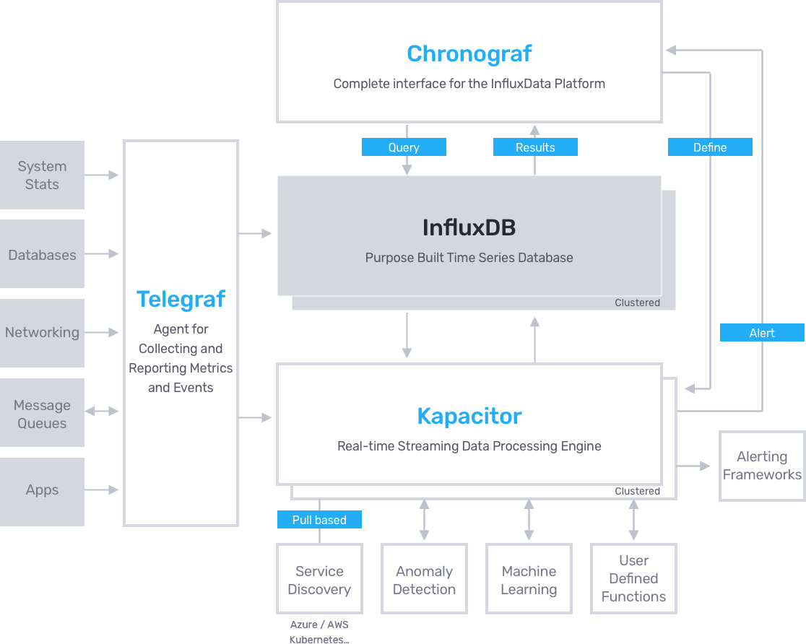

# 介绍

Kapacitor 是一个开源流处理框架，使用它，我们可以更容易地创建告警、运行 ETL 任务、探测异常。 Kapacitor 是 [`TICK stack`](https://www.influxdata.com/time-series-platform/)的最后一环。

## 关键特性

- 能够处理流数据和批数据；
- 按计划从 InfluxDB  查询数据，并通过[`line protocol`)[https://docs.influxdata.com/influxdb/v1.4/write_protocols/line_protocol_tutorial/]和 InfluxDB 支持的任何其他方法接收数据；
- 在 InfluxQL 中执行当前可能的任何转换；
- 将转换后的数据存储在 InfluxDB 中；
- 支持用户自定义函数来检测异常；
- 能够集成 HipChat, OpsGenie, Alerta, Sensu, PagerDuty, Slack