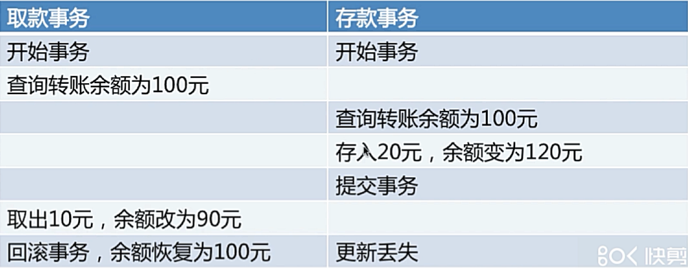
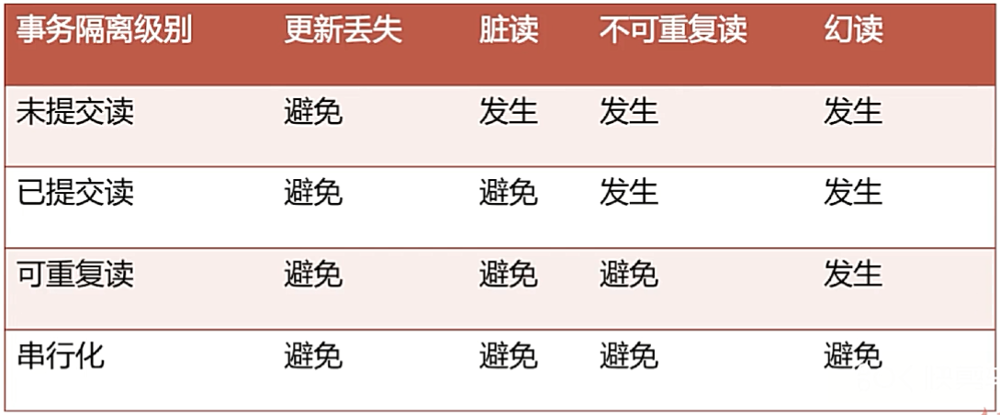
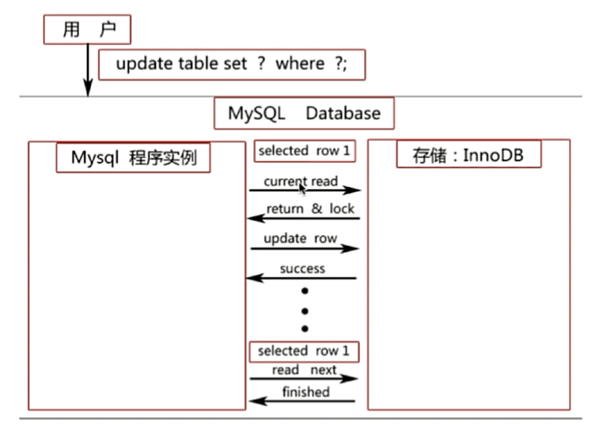
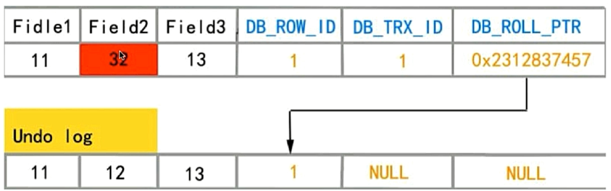
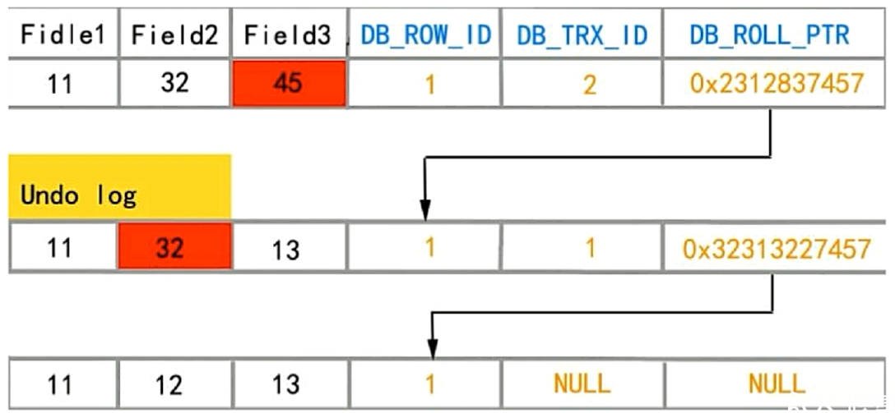

# 事务

## 四大特性（ACID）

- **A**tomicity，原子性：事务将一系列对数据库的操作看作一个整体，若在序列执行过程中发生异常，则中止整个事务，并丢弃前面部分成功的操作，即全部成功或者全部失败；
- **C**onsistency，一致性：对数据有特定的预期状态，任何数据更改必须满足这些状态约束；
- **I**solation，隔离性：并发执行的多个事务相互隔离，互不影响；
- **D**urability，持久性：保证数据一旦提交成功，即使存在硬件故障或数据库崩溃，事务所写入的任何数据都不会丢失。

## 事务并发访问时可能引起的问题以及如何避免

1. 更新丢失：一个事务处理的结果被另一个事务处理的结果覆盖：

   - MySQL所有事务隔离级别在数据库层面上均可避免。

   

2. 脏读：一个事务读到另一个事务未提交的更新数据：

   ```mysql
   # session A：将当前会话的事务隔离级别设置为未提交读
   set session transaction isolation level read uncommitted;
   start transaction; # 手动开启一个事务（只有手动执行rollback或者commit时才会结束该事务）
   select * from account where id = 1; # 1 xfy 1000
   update account set balance = balance - 100 where id = 1;
   select * from account where id = 1; # 1 xfy 900
   
   # session B：将当前会话的事务隔离级别设置为未提交读
   set session transaction isolation level read uncommitted;
   start transaction;
   select * from account where id = 1; # 1 xfy 900
   
   # 然后因为某些特殊的原因，session A中的操作需要回滚
   # session A：回滚
   rollback;
   select * from account where id = 1; # 1 xfy 1000
   
   # 但是session B中的事务并没有告知到session A中的事务回滚了
   # 所以会继续在原来900（而不是1000）的基础上进行操作
   # session B：
   select * from account where id = 1; # 1 xfy 900
   update account set balance = balance + 200 where id = 1;
   select * from account where id = 1; # 1 xfy 1100
   
   # 虽然对于session A和B都得到了想要的结果
   # 但是从全局考虑，1000 - 100 操作失败 再减去200 操作成功，结果应该是1200
   # 但是最终的结果却是1100
   ```

   - READ-COMMITTED（已提交读）事务隔离级别上可避免。

3. 不可重复读：事务A多次读取数据，而在事务A处理过程中事务B对数据进行了操作，导致事务A多次读取数据不一致。

   ```mysql
   # session A：将当前会话的事务隔离级别设置为已提交读（能够避免脏读，但是不能避免不可重复读）
   set session transaction isolation level read committed;
   start transaction; # 手动开启一个事务（只有手动执行rollback或者commit时才会结束该事务）
   select * from account where id = 1; # 1 xfy 1000
   
   # session B：将当前会话的事务隔离级别设置为已提交读（能够避免脏读，但是不能避免不可重复读）
   set session transaction isolation level read committed;
   start transaction;
   select * from account where id = 1; # 1 xfy 1000
   update account set balance = balance - 100 where id = 1;
   select * from account where id = 1; # 1 xfy 900
   
   # session A：读取数据，因为已提交读能够避免脏读问题，所以读到的balance仍是1000
   select * from account where id = 1; # 1 xfy 1000
   
   # session B：
   commit;
   select * from account where id = 1; # 1 xfy 900
   
   # session B提交事务成功更新了数据，
   # 而此时session A中的事务在执行过程中多次读取的数据不同
   # 即发生了不可重复读问题，说明获取的数据并不可靠
   # session A: 
   select * from account where id = 1; # 1 xfy 900
   ```

   - REPEATABLE-READ（可重复读）事务隔离级别以上可避免；

4. 幻读：事务A读取与搜索条件相匹配的若干行，而事务B以插入或修改的方式修改了事务A读取的数据：

   ```mysql
   # session A：将当前会话事务隔离级别设置为可重复读
   set session transaction isolation level repeatable read;
   start transaction;
   
   # session B：将当前会话事务隔离级别设置为可重复读
   set session transaction isolation level repeatable read;
   start transaction;
   
   # session A：
   select * from account lock in share mode; # 当前读
   
   # session B：
   insert into account values(2, "zs", 5000);
   
   # session A：将所有记录（只有name为"xfy"的那一条）的balance设置为5000
   # 猜想的是会更新两条数据（实际上该语句将被阻塞住，等待session B中的事务提交后才能执行，即MySQL使用可重复读隔离级别就避免了幻读问题）
   # 从理论上讲，可重复读级别并不能避免幻读问题
   update account set balance = 1000;
   ```

   - SERIALIZABLE（串行化）事务隔离界别可避免；



## 隔离级别

```mysql
# 查看当前事务隔离级别
select @@tx_isolation; # 默认为 REPEATABLE-READ

# 将当前（会话）事务隔离级别设置为未提交读
set session transaction isolation level read uncommitted;

# 将当前（会话）事务隔离级别设置为已提交读
set session transaction isolation level read committed;

# 将当前（会话）事务隔离级别设置为可重复读（InnoDB默认的事务隔离级别）
set session transaction isolation level repeatable read;

# 将当前（会话）事务隔离级别设置为串行化
set session transaction isolation level serializable;
```

### 未提交读（RU，Read Uncommitted）

允许事务读取其他事务未提交的数据，会造成脏读。

### 已提交读（RC，Read Committed）

规定事务必须读取其他事务已提交的数据，不能读取其他事务未提交的数据结果，能够有效避免脏读。

### 可重复读（RR，Repeatable Read）

事务在执行过程中多次读取同一数据的结果是相同的，

### 串行化（Serializable）

多个并行事务就好像串行执行一样。

## MySQL InnoDB可重复读事务隔离级别下是如何避免幻读的？

- 表象：快照读（非阻塞读） —— 伪MVCC；
- 内在：next-key锁（行锁 + gap锁）。

### 当前读

加了锁的增删改查：

- select ... lock in share mode, select ... for update
- insert, delete, update

会读取数据的最新版本（当前读的含义），读取后还需要保证其他并发事务不能修改当前记录。



### 快照读

不加锁的非阻塞读（若为Serializable隔离级别，select会退化为select ... lock in share mode）。

- select

快照读基于伪MVCC（MVCC是多版本并发控制，而undo日志是将undo记录串起来，并没有真正实现多版本）。


在RC隔离级别下，当前读和快照读的效果是一样的，都会读到数据的最新版本；

在RR隔离级别下，快照读有可能读到数据的历史版本，也有可能读到数据的最新版本，当前读只会读到数据的最新版本；

### InnoDB中RC、RR级别下的非阻塞读（快照读）如何实现

依赖于以下三个因素：

- InnoDB为数据行自动添加的`DB_TRX_ID`（记录最后一次修改本行记录的事务ID），`DB_ROLL_PTR`（指向undo日志中操作执行前的数据行），`DB_ROW_ID`字段；

- undo日志：当对数据做变更操作时，就会产生对应的undo记录，该记录存储了变更前的数据；

  

  `DB_TRX_ID`为1的事务将`DB_ROW_ID`为1的行的`Field2`字段更新为12，将在undo日志中写入一条记录，更新步骤如下：

  首先，用排他锁锁住要更新的行，然后将修改前的数据copy到undo日志中，然后修改当前行的数据，填写`DB_TRX_ID`，`DB_ROLL_PTR`（指向undo日志中修改前的行），`DB_ROW_ID`字段。

  

- read view：用来做可见性判断，将当执行快照读（非阻塞读，select）时，会针对查询的数据创建出一个read view，并决定当前事务能看到的是哪个版本的数据，有可能是最新数据也可能是undo log中某个版本的数据。read view遵循一个可见性算法：将要修改的数据的`DB_TRX_ID`取出，与系统其他活跃事务ID做对比，如果大于等于这些事务ID的话，就通过`DB_ROLL_PTR`到undo日志中取出小于要修改的数据的`DB_TRX_ID`的第一条数据。

因为快照（read view）生成时机的不同，所以会导致RC和RR级别下快照读的不同可见性：

- 在RC级别下，事务中每条快照读`select`语句都会创建一个快照；
- 在RR级别下，session在`start transaction;`后的第一条快照读`select`会创建一个快照，即read view，将当前系统中活跃的其他事务记录起来，此后再调用快照读时，还会使用同一个read view。

### next-key锁（行锁 + gap锁）

- 行锁（record lock）：对单行记录上的锁；
- gap锁（gap lock）：gap为索引树中可插入新纪录的空隙，gap锁可以锁住一个gap但不包含记录本身，gap锁是为了防止同一事务的两次当前读出现幻读的情况，gap锁只存于在RR级别以上，所以RC及更低级别的隔离级别无法防止幻读的发生；

#### 对主键索引或者唯一索引会用gap锁吗？

- 如果where子句全部命中（查询的记录全部存在于table中），则不会用gap锁，只会加记录锁；

