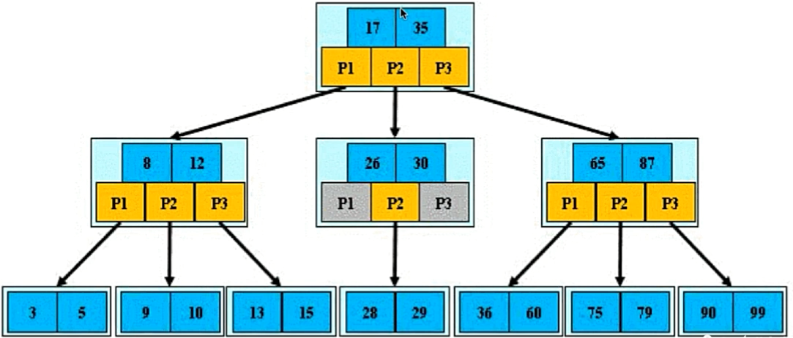
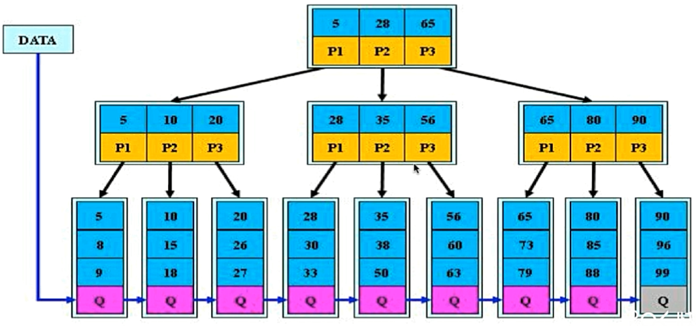
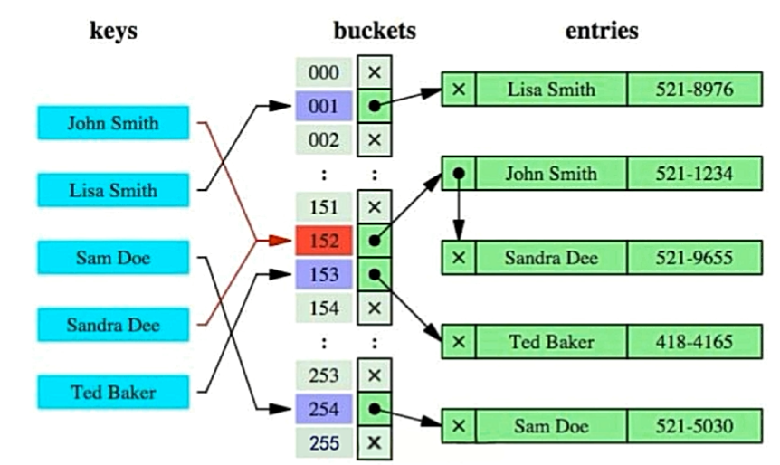
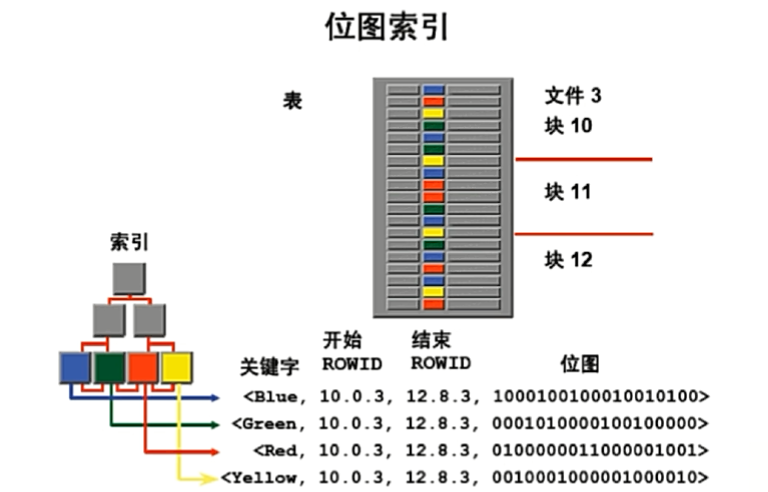
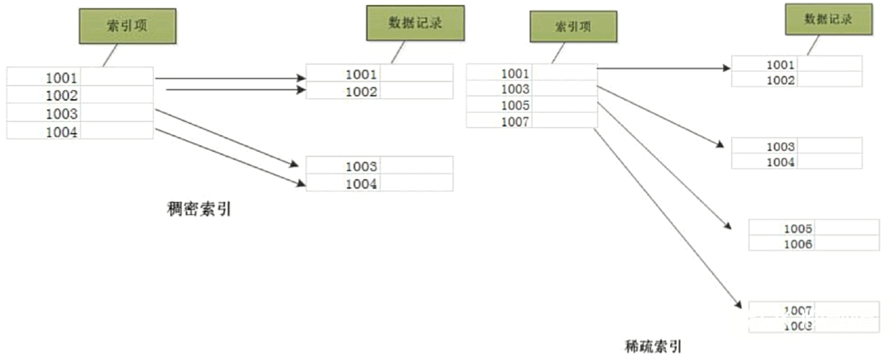
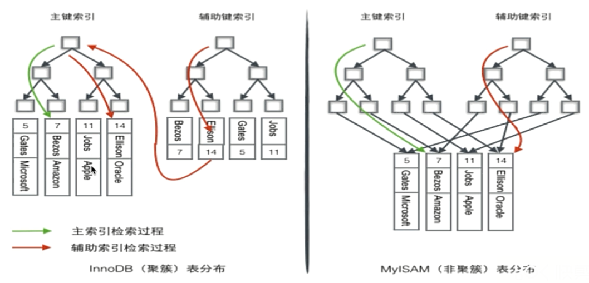

# 索引

## 为什么要使用索引？

当存储海量数据时，如果不使用索引，需要将整张表或者某个块的数据都加载到内存中，然后逐行遍历，效率低下；

索引的出现是为了**避免全表扫描，提升查询速度**。

## 什么样的信息能成为索引？

- 主键、唯一键等具有区分性的字段；

## 索引的数据结构

- 二叉查找树；
- B树；
- B+树，默认使用；
- Hash。

### 二叉查找树

因为每个节点只能存储左右子树，所以对于既定数量的数据行，生成二叉查找树的高度会非常大，这将导致IO次数（跟树的高度相等）较多，检索性能很差。

如果每个节点能够存储的子结点数多一些，那么树的高度整体来说就矮一些，即IO次数就少一些，就能够大大提高检索性能。

### B树

B树也称为多路查找树，若B树中所有节点的最大子节点数为`m`，则该树可称为`m-`阶B树。



**B树特征：**

- 根节点至少包括`2`个子节点；
- 树中每个节点至多包含`m`个子节点（`m >= 2`）；
- 除根节点和叶节点外，其它每个节点至少有`ceil(m/2)`个子节点；
- 所有叶节点都位于同一层。


### B+树



**B+树特征：**

- 根节点至少包括`2`个子节点；
- 树中每个节点至多包含`m`个子节点（`m >= 2`）；
- 除根节点和叶节点外，其它每个节点至少有`ceil(m/2)`个子节点；
- 所有叶节点都位于同一层；
- **非叶节点的子树指针与关键字个数相同（B树中非叶节点的子树指针比关键字个数多一）**；
- **非叶节点的子树指针`P[i]`，指向关键字`[K[i], K[i+1])`的子树（B树中非叶节点的子树指针`P[i]`，指向关键字`(K[i-1], K[i])`的子树）**；
- **非叶节点仅用来索引，数据都保存在叶节点中**；
- **所有叶节点均有一个链指针指向下一个叶节点（支持范围查询，无需再访问非叶节点）**。

B+树更适合来做存储索引：

1. B+树的磁盘索引读写代价更低（因为B+树的索引结点中并不会存储具体数据，所以占据空间容量更小，而存储数据的节点能够更密集地存放在一起，每次IO读取的数据就更多，效率就更高）；
2. B+树的查询效率更加稳定（因为B+树数据都存储在叶子节点中，所以查找每条数据都必须从根节点遍历到叶子节点，是稳定的）；
3. B+树更有利于对数据库的扫描（因为B+树的每个叶节点链式指向下一个叶节点，所以只需要遍历叶节点，就可以实现对所有关键字的扫描，所以B+树在**范围查询**时有更高的效率）；

### Hash



**缺点：**

- 仅仅能满足“=”，“IN”等值过滤，不能使用范围查询（存放的是Hash后的值）；
- 无法被用来避免数据的排序操作；
- 不能利用部分索引键查询；
- 不能避免表扫描；
- 遇到大量Hash值相等的情况，性能不一定比B树索引高；

### BitMap



- 适用于每个字段只有固定的几个值；
- 锁的粒度很大；

## 密集索引和稀疏索引的区别

- 密集索引会为所有记录创建索引项；
- 稀疏索引只为某些记录建立索引项；



- InnoDB使用密集索引，MyISAM使用稀疏索引；



## SQL调优

1. 根据**慢日志**定位慢查询sql：

   查询MySQL中跟慢日志相关系统变量：

   ```mysql
   show variables like '%query%'
   # 重点关注以下三个变量
   # slow_query_log 是否将慢查询记录打印到日志中，默认为off
   # slow_query_log_file 慢查询日志文件存放地址
   # long_query_time 执行时间超过该变量值的语句即为慢查询，默认为10.000000
   
   
   show status like '%slow_queries%'
   # Slow_queries 本次连接后慢查询记录数，重新连接后该变量值将重置为零
   ```

   可以作如下修改：

   ```mysql
   # slow_query_log 将慢查询记录打印到日志中
   set global slow_query_log = on;
   # long_query_time
   set global long_query_time = 1; # 设置后需要重新连接数据库
   ```

2. 使用**explain等工具**分析sql：

   ```mysql
   # explain关键字一般放在select查询语句之前，用于描述MySQL如何执行查询操作
   explain select * from t_trade_info;
   ```

3. 修改sql或者尽量让sql走索引：

## 联合索引的最左匹配原则的成因

## 索引是否建得越多越好

建立索引会增加额外的空间开销和维护成本：

- 数据量小的表不需要建立索引；