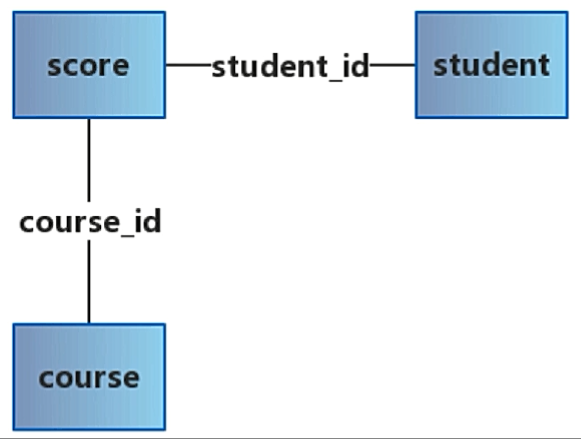
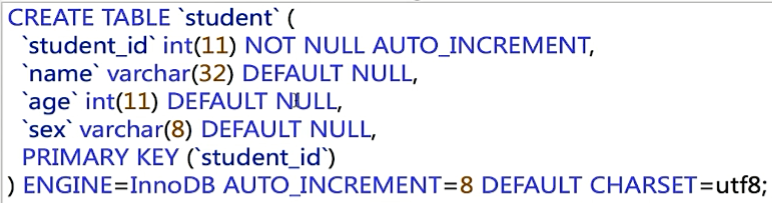
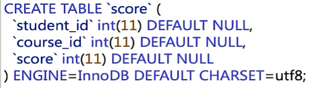
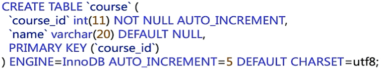

# 语法

## 关键语法

- 分组：`group by`, `having`
- 统计函数：`count`, `sum`, `max`, `min`, `avg`

### `group by`

- 根据指定字段对查询结果进行分组，最终得到一个分组集合；
- 必须满足”select子句中的列名必须为分组列或者列函数“；
- 列函数对于`group by`子句定义的每个组各返回一个结果。

### `having`

- 通常与`group by`子句一起使用，用来过滤`group by`分组后的结果；
- `where`子句过滤行，`having`子句过滤分组；
- 出现在同一sql中的顺序：`where > group by > having`。

## 示例

### 表结构









### 查询所有同学的学号、选课数、总成绩

只统计所有选课的同学：

```mysql
select student_id, count(course_id), sum(score)
from score
group by student_id;
```

统计所有同学：

```mysql
select student.student_id, count(score.course_id), sum(score.score)
from student, score
where student.student_id = score.student_id
group by student.student_id;
```

### 查询所有同学的学号、姓名、选课数、总成绩

```mysql
select student.student_id, student.name, count(score.course_id), sum(score.score)
from student, score
where student.student_id = score.student_id
group by student.student_id;
```

### 查询平均成绩大于60分的同学的学号和平均成绩

```mysql
select student.student_id, avg(score.score) as avg_score
from student, score
where student.student_id = score.student_id
group by student.student_id
having avg_score >= 60;
```

### 查询所有没有学全所有课的同学的学号、姓名

```mysql
select student.student_id, student.name
from student, score
where student.student_id = score.student_id
group by student.student_id
having count(score.course_id) < (select count(*) from course);
```

