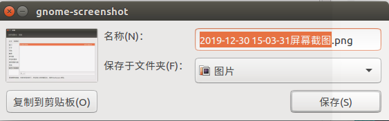

# OS Tools

## Performance

### perf

#### 安装

```shell
# Ubuntu 18.04
$ sudo apt-get update
$ sudo apt-get install linux-tools-common
$ sudo apt-get install linux-tools-5.3.0-46-generic linux-cloud-tools-5.3.0-46-generic linux-tools-generic linux-cloud-tools-generic
```

#### 使用

##### stat

```shell
$ sudo perf stat ./traverse_2d_array
arr[j][i] costs 241197325ns, arr[i][j] costs 40863930ns, 5times
 Performance counter stats for './traverse_2d_array':

            337.45 msec task-clock                #    1.169 CPUs utilized          
               492      context-switches          #    0.001 M/sec                  
               102      cpu-migrations            #    0.302 K/sec                  
               986      page-faults               #    0.003 M/sec                  
   <not supported>      cycles                                                      
   <not supported>      instructions                                                
   <not supported>      branches                                                    
   <not supported>      branch-misses                                               

       0.288666111 seconds time elapsed

       0.313371000 seconds user
       0.034342000 seconds sys
```


## Shortcut

### 系统自带截图工具

#### 自由截图

1. 系统设置 -> 键盘 -> 快捷键；
2. 自定义快捷键： 
   - 名称：screenshot partial；
   - 命令： gnome-screenshot -a（-a表示自由截图）；
3. 给该命令设置快捷键：
   - `CTRL + ALT + 0`。



可以选择复制到剪贴板或者保存到本地，但是不便于对截取的图片进行编辑。

### flameshot（推荐）

`注：flameshot 0.6.0 以上才有插入文字及贴图功能！`

#### apt 安装

```shell
# Ubuntu 18.04

# 查看当前已安装的 flameshot 版本
apt-cache show flameshot

sudo apt update
sudo apt install flameshot  # 默认安装的应该是 flameshot-0.5.1 版本的

# Uninstall
sudo apt remove flameshot
```

#### deb 安装

```shell
wget https://github.com/lupoDharkael/flameshot/releases/download/v0.6.0/flameshot_0.6.0_bionic_x86_64.deb

chmod u+x flameshot_0.6.0_bionic_x86_64.deb

sudo dpkg -i flameshot_0.6.0_bionic_x86_64.deb

# Uninstall
sudo dpkg -r flameshot
```

默认设置是没有文字及贴图功能的，需要手动开启。

```shell
flameshot config
```


点击 `Select All` 选中所有功能项。

但是如果安装的是 flameshot 0.6.0，但是没有插入文字的功能，有可能是之前安装过 0.6.0 以下的版本。

```shell
pkill flameshot  # 杀掉 flameshot 进程
```

开启 flameshot 程序（通过 Show Applications 打开），然后进行上述配置。

#### 编译安装

```shell
# Compile-time
sudo apt install g++ build-essential qt5-default qt5-qmake qttools5-dev-tools

# Run-time
sudo apt install libqt5dbus5 libqt5network5 libqt5core5a libqt5widgets5 libqt5gui5 libqt5svg5-dev

# Optional
sudo apt install git openssl ca-certificates

# Download sources
git clone git@github.com:lupoDharkael/flameshot.git  # 默认下载的是 flameshot-0.5.1 版本的
cd flameshot
mkdir build && cd build
qmake ../
make

# Uninstall
cd flameshot/build
sudo make uninstall
make clean
```

#### 设置快捷键

1. 系统设置 -> 键盘 -> 快捷键；
2. 自定义快捷键： 
   - 名称：`flameshot`；
   - 命令： `flameshot gui`；
3. 给该命令设置快捷键：
   - `ALT + S`。

### Shutter

#### 安装

```shell
# 安装
sudo apt-get install shutter
```

#### 设置快捷键

1. 系统设置 -> 键盘 -> 快捷键；
2. 自定义快捷键： 
   - 名称：`shutter`；
   - 命令： `shutter -s`；
3. 给该命令设置快捷键：
   - `ALT + S`。

截取指定区域后，双击图片后会默认将图片保存到剪贴板，并且会进入图片编辑页面。

## Network

### slurm——网卡带宽监控

#### 安装

```shell
# 安装
sudo apt-get install slurm
```

#### 使用

```shell
# 指定网卡
slurm -i <网卡名称>
```

#### 常用命令

在slurm界面中可以执行如下命令：

| 按键 | 功能           |
| ---- | -------------- |
| l    | 显示lx/tx状态  |
| c    | 切换到经典界面 |
| r    | 手动刷新界面   |
| q    | 退出工具       |
|      |                |


## Terminal

### zsh——终端

#### 安装

```shell
# 安装
sudo apt-get install -y zsh

# 启动
zsh

# 将zsh设置为系统默认终端，设置完成后重新登录系统即可
chsh -s `which zsh`
```

#### 美化

[zsh配置管理](https://github.com/ohmyzsh/ohmyzsh)

```shell
# 美化
# 安装oh-my-zsh
sh -c "$(curl -fsSL https://raw.githubusercontent.com/ohmyzsh/ohmyzsh/master/tools/install.sh)"

# 选择主题
# 在 https://github.com/ohmyzsh/ohmyzsh/wiki/Themes 中选择喜欢的主题
# 在 ~/.zshrc 中新增变量 ZSH_THEME="theme_name"
# ZSH_THEME="sunrise"
```

### 插件

#### 自动补全

**前置条件：** 已经安装了 oh-my-zsh。

```shell
# ZSH_CUSTOM=~/.oh-my-zsh/custom/
# 自动补全插件
$ git clone https://github.com/zsh-users/zsh-autosuggestions.git $ZSH_CUSTOM/plugins/zsh-autosuggestions

# 高亮插件
$ git clone https://github.com/zsh-users/zsh-syntax-highlighting.git $ZSH_CUSTOM/plugins/zsh-syntax-highlighting

# 插件配置
vim ~/.zshrc
# 1. 定位到 plugins=(git，添加 zsh-autosuggestions zsh-syntax-highlighting 插件
# 2. plugins=(git zsh-autosuggestions zsh-syntax-highlighting)
# 3. 保存配置，重新打开终端生效
```


### Tmux——终端分栏

参考：[Tmux 终端复用详解](https://www.cnblogs.com/wangqiguo/p/8905081.html)

#### 安装

```shell
# 安装
sudo apt-get install tmux

# 启动
tmux
```

#### 常用命令

每次使用`Tmux`命令前，需要先按下组合键`ctrl + b`，再按下命令。

| 命令          | 作用                                           |
| ------------- | ---------------------------------------------- |
| %             | 水平分屏，用一条垂直线将当前pane分成左右两块； |
| ”             | 垂直分屏，用一条水平线将当前pane分成上下两块   |
| :arrow_up:    | 切换到当前pane的上邻窗口                       |
| :arrow_down:  | 切换到当前pane的下邻窗口                       |
| :arrow_left:  | 切换到当前pane的左邻窗口                       |
| :arrow_right: | 切换到当前pane的右邻窗口                       |
| z             | 最大化当前pane，再按一次后恢复                 |
| x             | 关闭当前 pane，输入 y/n 决定是否真正执行       |

#### 激活鼠标功能

1. 新建 `~/.tmux.conf`，加入：

   ```shell
   set-option -g mource on
   ```

2. 在 tmux 中进入命令模式： `ctrl+b` -> `:`；

3. 输入 `source ~/.tmux.conf` 回车。


复原：删除 `~/.tmux.conf`，执行 `tmux kill-server`。

## Timer

### Crontab

定时执行脚本。

### 参考

1. [How to Use Cron in Linux](https://opensource.com/article/17/11/how-use-cron-linux)；