# Syncthing使用上手

## Syncthing概要

1. 简介：开源文件同步系统。
2. 目的：在两个或多个设备之间**同步文件**。
3. 角色：
   - 本地设备（local device）；
   - 远端设备（remote device）。
4. 使用：在每个设备（设备之间能够正常通信）上都安装`Syncthing`，然后通过前端界面进行配置。

## 安装

根据应用场景选择对应的版本：[Syncthing社区](https://docs.syncthing.net/users/contrib.html#contributions)。

### Docker

```shell
#!/usr/bin/env bash
# docker pull syncthing/syncthing
docker run -p 8384:8384 -p 22000:22000 \
    -v /wherever:/var/syncthing \
    syncthing/syncthing:latest

[start] 04:13:30 INFO: syncthing v1.4.2 "Fermium Flea" (go1.13.9 linux-amd64) docker@syncthing.net 2020-04-07 11:14:03 UTC
[QUWPJ] 04:13:30 INFO: My ID: QUWPJS7-5RJBFC3-NRHFXFL-FCBC5J7-QPGAIAW-35ETNK3-GNXBNH7-ZEOYTA3
[QUWPJ] 04:13:31 INFO: Single thread SHA256 performance is 368 MB/s using minio/sha256-simd (310 MB/s using crypto/sha256).
[QUWPJ] 04:13:31 INFO: Hashing performance is 284.65 MB/s
[QUWPJ] 04:13:31 INFO: Overall send rate is unlimited, receive rate is unlimited
[QUWPJ] 04:13:31 INFO: Using discovery server https://discovery.syncthing.net/v2/?noannounce&id=LYXKCHX-VI3NYZR-ALCJBHF-WMZYSPK-QG6QJA3-MPFYMSO-U56GTUK-NA2MIAW
[QUWPJ] 04:13:31 INFO: Using discovery server https://discovery-v4.syncthing.net/v2/?nolookup&id=LYXKCHX-VI3NYZR-ALCJBHF-WMZYSPK-QG6QJA3-MPFYMSO-U56GTUK-NA2MIAW
[QUWPJ] 04:13:31 INFO: Using discovery server https://discovery-v6.syncthing.net/v2/?nolookup&id=LYXKCHX-VI3NYZR-ALCJBHF-WMZYSPK-QG6QJA3-MPFYMSO-U56GTUK-NA2MIAW
[QUWPJ] 04:13:31 INFO: Ready to synchronize "Default Folder" (default) (sendreceive)
[QUWPJ] 04:13:31 INFO: QUIC listener ([::]:22000) starting
[QUWPJ] 04:13:31 INFO: TCP listener ([::]:22000) starting
[QUWPJ] 04:13:31 INFO: Relay listener (dynamic+https://relays.syncthing.net/endpoint) starting
[QUWPJ] 04:13:31 INFO: Completed initial scan of sendreceive folder "Default Folder" (default)
[QUWPJ] 04:13:31 INFO: GUI and API listening on [::]:8384
[QUWPJ] 04:13:31 INFO: Access the GUI via the following URL: http://127.0.0.1:8384/
[QUWPJ] 04:13:31 INFO: My name is "542c69a7bcbc"
```

## 配置/使用

 当成功启动`Syncthing`后，可以通过浏览器访问[`http://127.0.0.1:8324/`](http://127.0.0.1:8384/#device-advanced)（要求启用`Cookies`保证GUI可用性）。配置主界面如下所示：

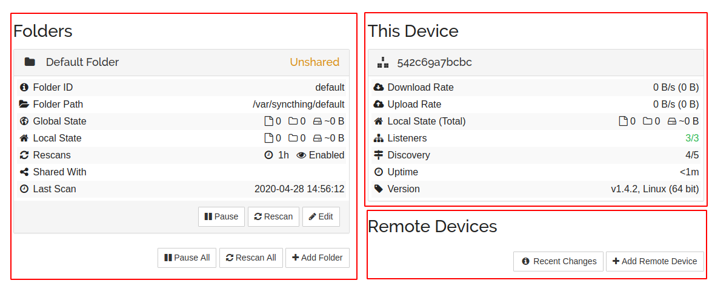

### Folders

界面左边是当前设备需要同步的文件夹列表。

当应用初始化时，会在`/var/syncthing（设置的同步根目录）`下创建一个默认文件夹`default`。因为初始时没有配置`Remote Devices`以及同步策略，所以该目录的同步状态为`Unshared`（目录没有任何同步设备）。

#### 添加同步目录/Add Folder

##### 通用配置/General

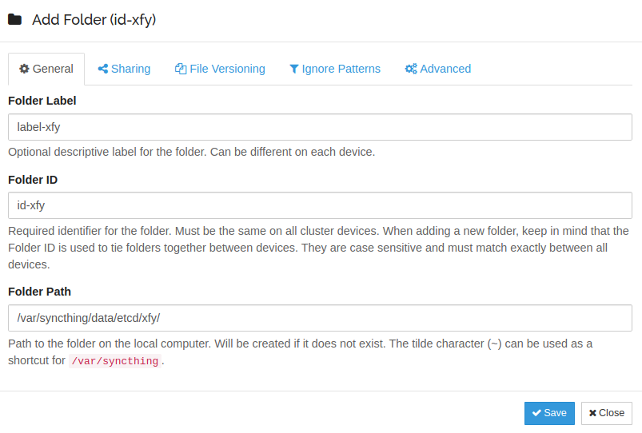

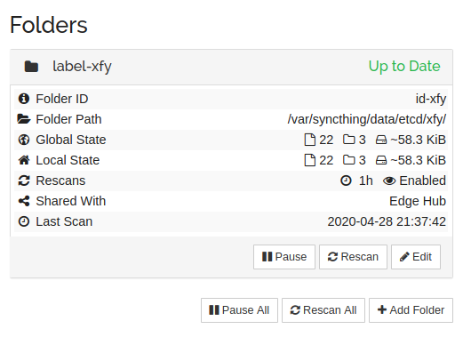

- **Folder Label**：
  - 可选；
  - 在`Folders`中看到的`Folder title`是`Folder Label`，见上图；
  - 在`Remote Devices`中`Add/Edit Device`时看到的`Share Folders With Device`选项名是`Folder Label`；
  - 在远端设备中`Add Folder`时可以根据`Folder Label`定位到该文件夹并进行同步。
- **Folder ID**：必填；**用于在设备之间定位文件夹**；大小写敏感，在集群中需保持唯一；
- **Folder Path**：本地设备上的文件夹路径；不存在系统会主动创建。

`PS：如果以Docker方式启动Syncthing时，需要手动将本地目录挂载进去，如-v /root:/var/syncthing，这时如果希望同步本地的/root/xfy目录，则需要填写/var/syncthing/xfy，其中/var/syncthing可以使用~代替。`

##### 共享设备配置/Sharing

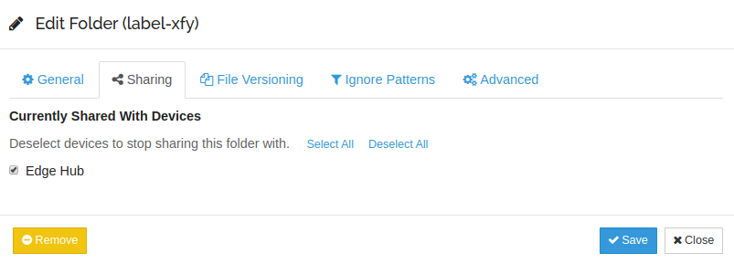

- **Currently Shared With Devices**：选择需要同步的远端设备，界面上显示的是`Device Name`，实际还是根据`Device ID`绑定设备。

##### 版本管理配置/File Versioning

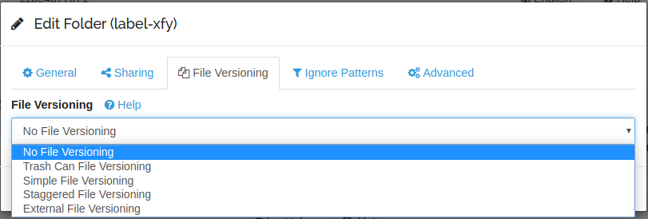

- [**File Versioning**](https://docs.syncthing.net/users/versioning.html)（版本管理）：

  - `No File Versioning`：不保存文件的旧版本（原文件），默认策略。

  - `Trash Can File Versioning`：将原文件移动至`.stversions`文件夹（模拟垃圾桶）；如果`.stversions`中存在同名文件，将替换原文件。

    - `Clean out after`：设置`.stversions`中文件的保存时长，`0 days`表示永久保存。

    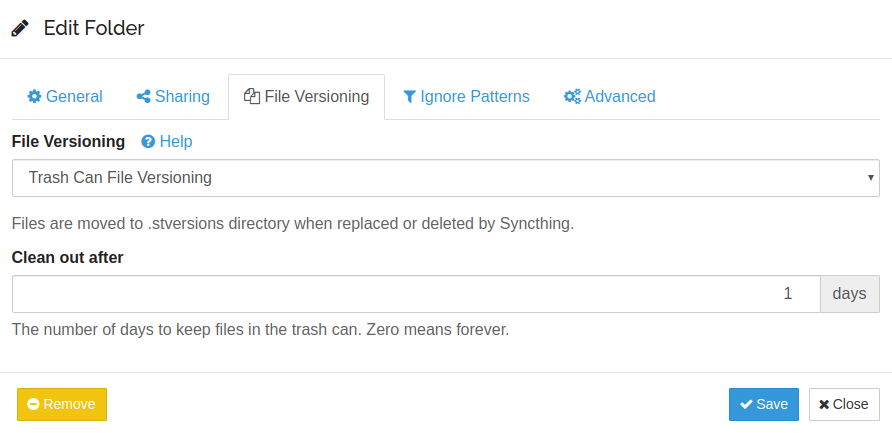

  - `Simple File Versioning`：将原文件移动至`.stversions`文件夹，最多会保存`n`份旧版本的文件。

    - `Keep Versions`：旧版本文件的数量，旧版本文件的命名形式`filename~20200429-034355.suffix`。

    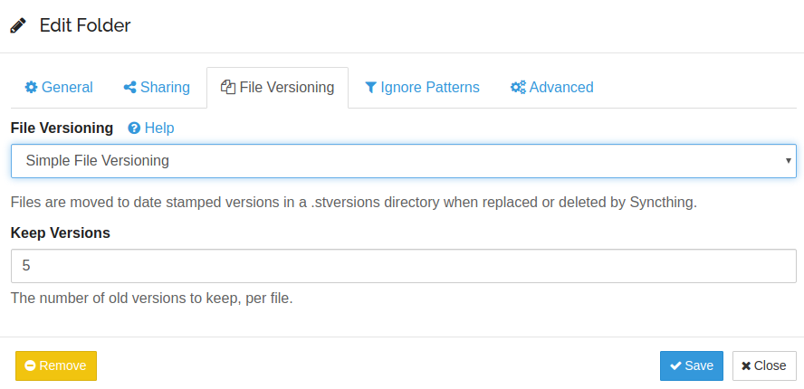

  - `Staggered File Versioning`：将原文件移动至同步目录的指定文件目录下，与`.stversions`同级并取代其作为旧版本文件的保存目录。

    - **Maximum Age**：旧版本文件的保存时间，超过这个时间会被删除，`0 days`表示永久保存；
    - **Versions Path**：设置保存旧版本文件的保存路径（支持绝对路径和相对路径，相对路径是相对于当前同步目录而言），置空表示仍用`.stversions`作为存储目录。

    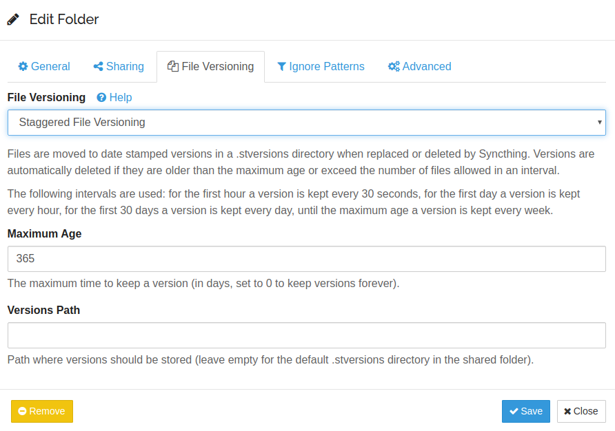

  - `External File Versioning`：

    - **Command**：只有当文件被更新时，脚本才会被触发执行；脚本位置只允许使用绝对路径标识，并且可以需要`%FOLDER_PATH%`及`%FILE_PATH%`向脚本传递当前同步的文件夹路径以及当前文件的相对路径：`/Users/jb/bin/onlylatest.sh /Users/jb/Sync docs/letter.txt `：

      ```shell
      #!/bin/sh
      set -eu
      
      # Where I want my versions stored
      versionspath=~/.trashcan
      
      # The parameters we get from Syncthing
      folderpath="$1"
      filepath="$2"
      
      # First ensure the dir where we need to store the file exists
      outpath=`dirname "$versionspath/$filepath"`
      mkdir -p "$outpath"
      # Then move the file there
      mv -f "$folderpath/$filepath" "$versionspath/$filepath"
      ```

      

    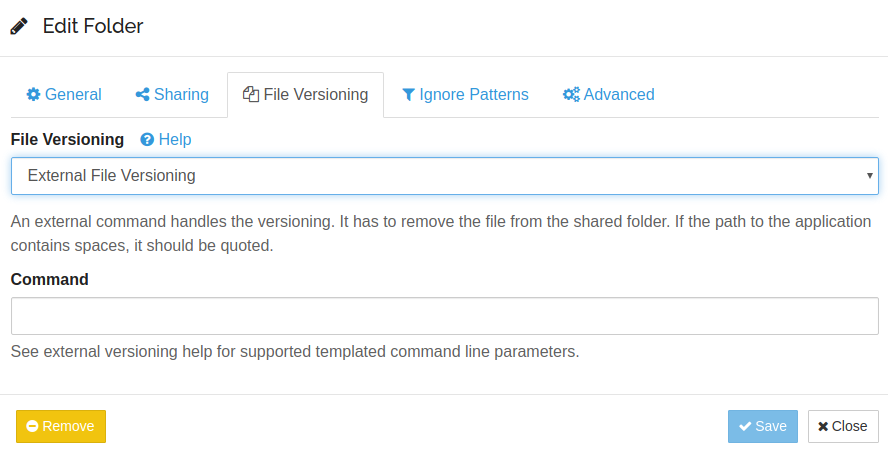

  版本管理策略应用于从远端设备接收的改变：本地对原文件的改动不会触发存档动作；**只有来自远端设备对文件的改动才会触发本地文件的存档动作**。

##### 过滤规则配置/Ignore Patterns

`Ignore Patterns`最终会被写入到当前文件夹的`.stignore`文件下，满足过滤规则的文件（夹）将不会参与到后续的同步过程。忽略规则参考：[Syncthing Ignoring Files](https://docs.syncthing.net/users/ignoring.html)。

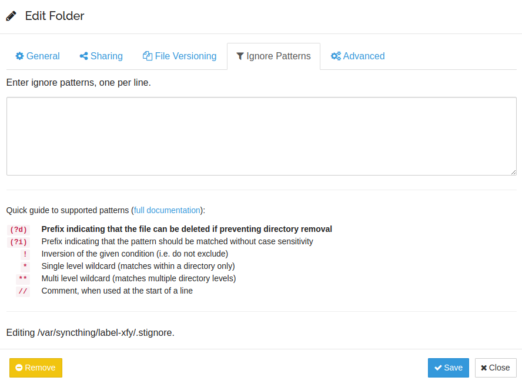

##### 高级配置/Advanced

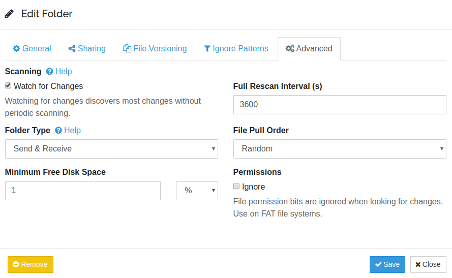

- **Scanning**：
  - `Watching for Changes`：无须周期性全局扫描就可以探测到文件变化，默认勾选；
- **Folder Type**：
  - `Send & Receive`：**双向同步**文件改动，默认；
  - `Send Only`：**只向远端设备发送**文件改动，不从远端设备接收文件改动；
  - `Recevice Only`：**只从远端设备接收**文件改动，不向远端设备发送文件改动；
- **Minimum Free Disk Space**：当剩余磁盘空间不满足该值时，停止同步；
- **Full Rescan Interval(s)**：全局扫描周期，以`s`为单位，默认为`3600s`；
- **File Pull Order**：改动文件的同步顺序。
  - `Random`：随机，默认；
  - `Alphabetic`：按字母顺序；
  - `Smallest First`：最小文件优先；
  - `Largest First`：最大文件优先；
  - `Newest First`：最新文件优先；
  - `Oldest First`：最旧文件优先。
- **Permissions**：
  - `Ignore`：忽略文件访问权限。

### This Device

界面右上方是运行当前`Syncthing`实例的设备，展示了当前设备的`Device ID`，网络上/下行速度等信息。

`Syncthing`使用`Device ID`唯一标识设备。当初始化`Syncthing`实例时，会根据设备信息自动生成`Device ID`，可以在点击主页面右上角`Actions`的`Show ID`查看当前设备加密后的`Device ID`（为什么加密？安全？）。当添加设备时，需要使用使用该类型的`Device ID`。

### Remote Devices

界面右下方是添加的远端设备列表，每个设备项包括同步上/下行速率，设备地址，同步的文件夹等信息。

#### 添加远端设备/Add Remote Device

> 绑定是双向的！
>
> 当在本地设备添加远端设备时，也务必要在远端设备添加该设备。
>
> 

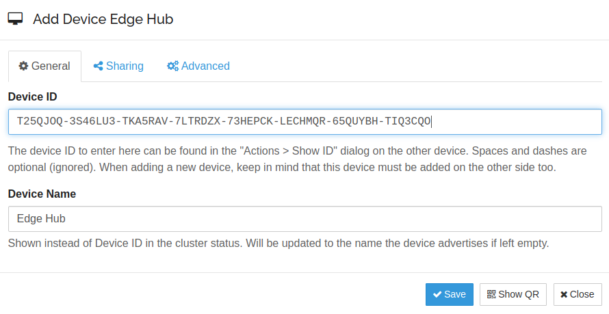

- **Device ID**：通过远端设备主页面`Actions -> Show ID`获取。

- **Device Name**：为了更好的可读性，在`Remote Devices`列表中使用`Device Name`标识设备而非`Device ID`。如果该属性被置为空，则被置为`Device ID`的前7位。

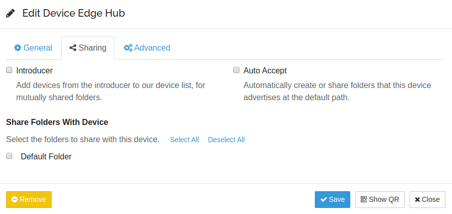

- **Introducer**：将`introducer`中的设备添加到设备列表中，以获取相互共享的文件夹。双向同步？？？

- **Auto Accept**：在该设备的默认文件夹下创建选择的目录（可以在该远端设备下标识目录是来自哪个目录吗？）。

- **Share Folders With Device**：选择将本地设备的哪些文件夹同步到该远端设备。


- **Addresses**：
  - `dynamic`：支持地址的动态发现；
  - `tcp://ip:port`或`tcp://host:port`：多个地址可以用`,`分隔。

- **Compression**：
  - `All Data`：压缩所有数据；
  - `Metadata Only`：只压缩元数据；
  - `Off`：不进行压缩。
- **Device rate limits**：
  - Incoming Rate Limit (KiB/s)：上行速率限制；
  - Outgoing Rate Limit (KiB/s)：下行速率限制。

当在本地设备添加有效的远端设备后，远端设备会探测到该行为，并在前端提示是否将该设备添加到设备列表中。

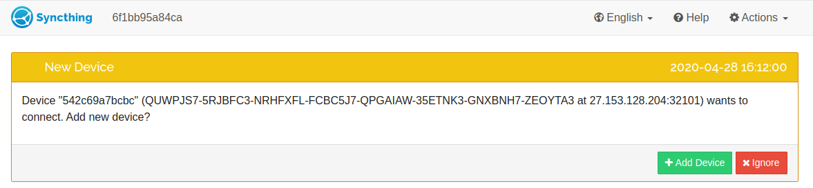

也可在远端设备手动`Add Remove Device`。

同步成功本地设备状态示意图。

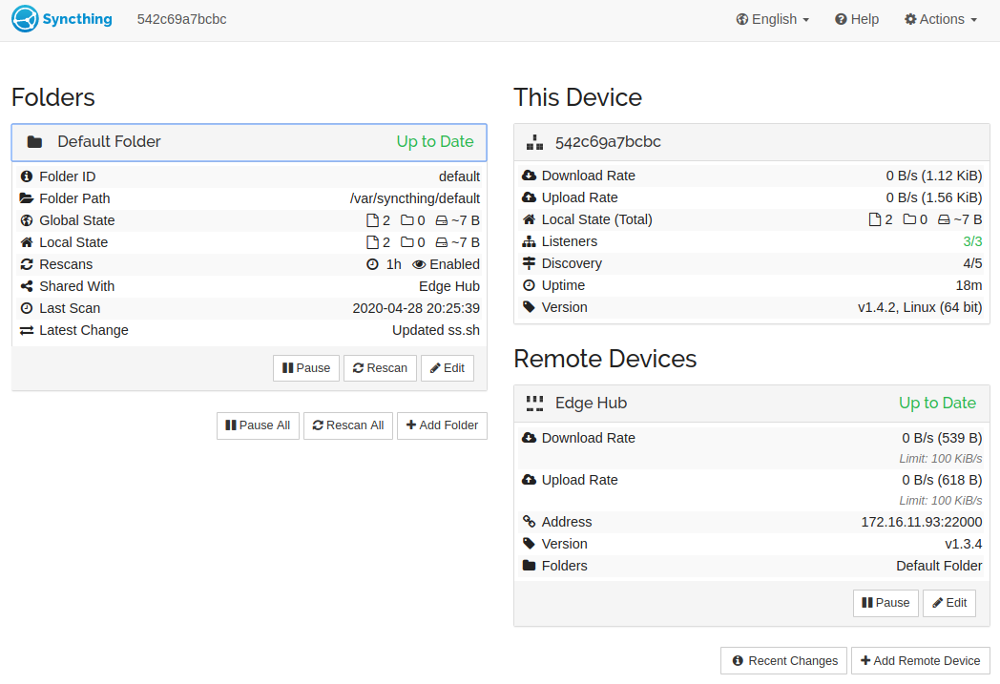

同步成功远端设备状态示意图。

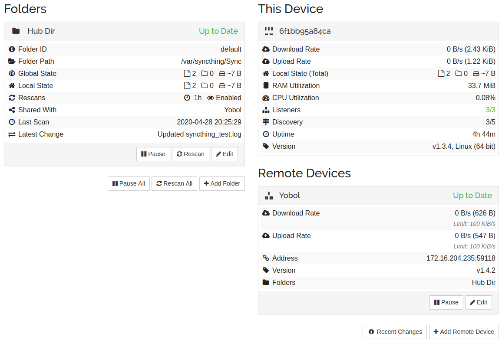

同步记录示意图。

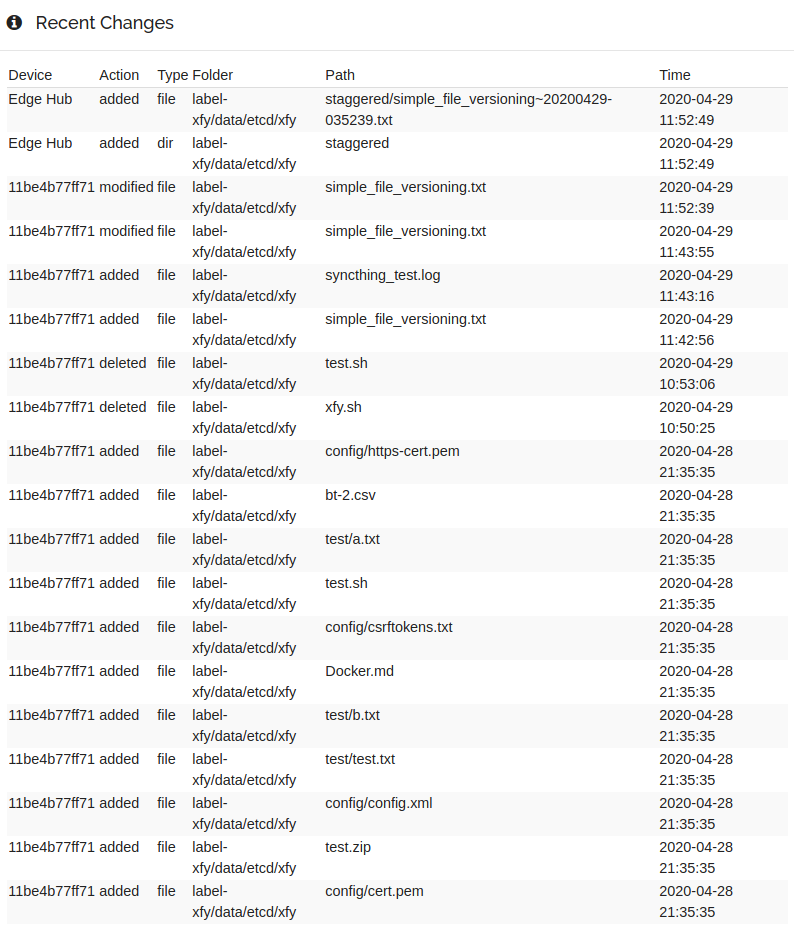

## [`Syncthing`同步机制](https://docs.syncthing.net/users/syncing.html#scanning)

### 文件块/Blocks

为了更好地传输及备份文件，可以将文件拆分成若干个大小相同的文件块（**只有最后一个文件块可能会比其他文件块小**），以块为基本单位对文件进行管理。

- 文件块大小取决于文件大小，从`128KiB`到`16MiB`；
- 每个文件被拆分成若干个文件块，并且计算每个文件块的SHA256散列；
- 需要一个数据结构保存一个文件的所有文件块信息，每个元素包括文件块的存储位置，在文件中的偏移量，大小及SHA256散列。

为了更新一个文件，`Syncthing`会比较该文件**当前版本和所需版本**的所有块信息，找出所有SHA256散列不同的块。然后尝试为每个不同的块找到一个源：如果是本地的另一个文件已经有一个具有相同SHA256散列的块，则只是简单的复制到磁盘上；如果是集群中的另一个设备，则需要通过网络进行传输。

当从另一个设备复制或接收一个块时，计算它的SHA256散列并与期望值进行比较。如果匹配，则将该块写入文件的临时副本，否则将丢弃该块，然后尝试为该块寻找另一个源。

### 扫描/Scanning

`Scanthing`支持两种扫描方式：

- 定期全局扫描（regular full scans）：适用于文件改动不频繁或同步实时性要求不高的场景，增加全局扫描间隔能够有效减少CPU资源的开销；
- Watcher机制：接收文件系统"watcher"的改动通知（notification），该方式可能会丢失文件改动信息，因此需要定期进行全局扫描。

默认情况下，开启watcher机制，同时`Syncthing`也会定期扫描同步的文件夹。为防止同时重新扫描所有文件夹导致短时间内I/O过高，实际扫描间隔是给定扫描间隔的3/4到5/4之间的随机时间。

在一次扫描（rescan： full scans & watcher）过程中，会检查文件的大小，修改时间，访问权限是否改变，如果发生改变，会重新计算文件的哈希值。通过重新比较各个文件块的SHA256散列，才能知道文件的哪个文件块进行了改动。

开启了`watcher`机制并不会进行实时同步。`Syncthing`每隔`10s`（可使用[fsWatcherDelayS](https://docs.syncthing.net/users/config.html#fswatcherdelays)调整）才会对`watcher`感知到的改动进行同步，因此改动通常会延迟几秒才会开始同步，被删除的文件有时会延迟`1min`。


### 同步/Syncing

`Syncthing`会跟踪每个文件的多个版本：在当前磁盘上的版本（本地版本），所有其他设备上的版本，这些版本中最新的版本称为**全局版本**，全局版本需要同步到所有设备上。

版本信息会保存在索引数据库中，索引数据库位于同步文件夹的`config`目录下，以`index-vx.y.z.db`（对于某个版本的`x.y`）的格式命名。

当从其他设备接收到新的索引数据时，`Syncthing`会重新计算每个文件的哪个版本是全局版本，并将其和当前的本地版本进行比较。当两者不同时，`Syncthing`需要同步文件。

## 临时文件/Temporary Files

`Syncthing`永远不会直接写入目标文件，而是将所有改动写入到临时副本中，写入完毕后将其移动到旧版本的位置。如果在复制或同步过程中发生错误（例如无法获得必要的块），为了减少不必要的网络请求，这些临时文件将保留最多一天。 

临时文件命名为`.syncthing.original-filename.ext.tmp`，或者在Windows上为`~syncthing~original-filename.ext.tmp`，其中`original-filename.ext`是目标文件名。 临时文件通常是隐藏的。 如果由于添加了前缀和额外的扩展名而导致临时文件名过长，则使用原始文件名的哈希代替实际的原始文件名。

## 边缘计算文件同步方案

- 数据需要从边缘端同步到云端（只同步插入和更新操作，不会同步删除操作），但是云端的修改不会同步回边缘端；

- 如果将边缘节点`node-id`下的`/thinger-deploy/thinger-edge-stack`目录同步到云端`/datamgr`目录下，可以进行如下设置：

  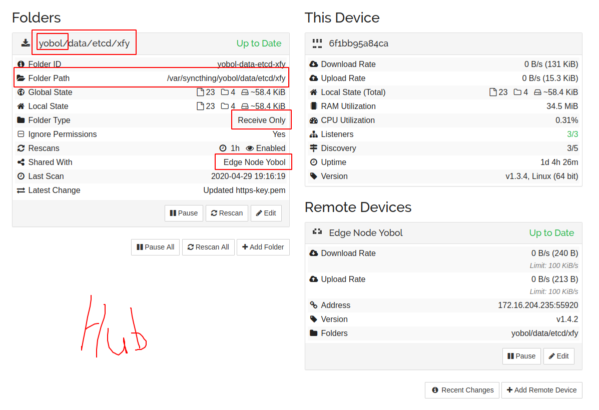

  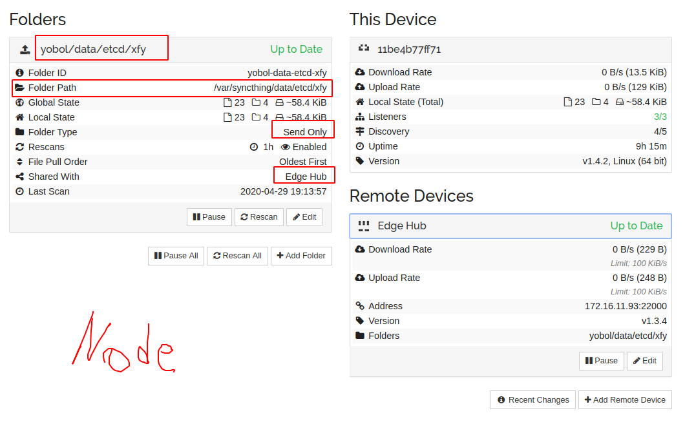

  

   

## 参考

1. [Syncthing Get-started](https://docs.syncthing.net/intro/getting-started.html)；
2. [Syncthing Document](https://docs.syncthing.net/)。

