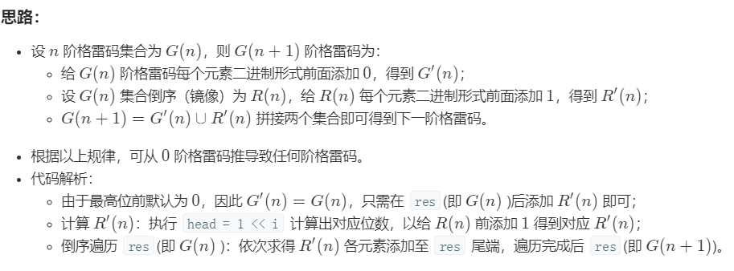

# [格雷编码](https://leetcode-cn.com/problems/gray-code/)

## 题目描述

格雷编码是一个二进制数字系统，在该系统中，两个连续的数值仅有一个位数的差异。

给定一个代表编码总位数的非负整数 n，打印其格雷编码序列。格雷编码序列必须以 0 开头。

**示例 1：**

```
输入: 2
输出: [0,1,3,2]
解释:
00 - 0
01 - 1
11 - 3
10 - 2

对于给定的 n，其格雷编码序列并不唯一。
例如，[0,2,3,1] 也是一个有效的格雷编码序列。

00 - 0
10 - 2
11 - 3
01 - 1

但是，[0,1,2,3] 必然不是一个有效的格雷编码序列。

00 - 0
01 - 1
10 - 2 与前一个数值1有两位不同
11 - 3
```

**示例 2：**

```
输入: 0
输出: [0]
解释: 我们定义格雷编码序列必须以 0 开头。
     给定编码总位数为 n 的格雷编码序列，其长度为 2^n。当 n = 0 时，长度为 2^0 = 1。
     因此，当 n = 0 时，其格雷编码序列为 [0]。
```

## 解题思路

### 个人AC

无。

### 最优解

参考：[LeetCode-cn上该题精选题解](https://leetcode-cn.com/problems/gray-code/solution/gray-code-jing-xiang-fan-she-fa-by-jyd/)



```java
class Solution {
    public List<Integer> grayCode(int n) {
        List<Integer> output = new ArrayList<Integer>() {{
            this.add(0);
        }};
        int level = 1;
        for (int i = 0; i < n; i++) {
            for (int j = output.size() - 1; j >= 0; j++) {
                output.add(level | output.get(j));
            }
            level <<= 1;
        }
        return output;
    }
}
```

更精巧的解法：

```java
class Solution {
    public List<Integer> grayCode(int n) {
        List<Integer> output = new LinkedList<>();
       	for (int i = (1 << n) - 1; i >= 0; i--) {
            output.add(0, i ^ (i >> 1));
        }
        return output;
    }
}
```


**时间复杂度：** $O(2^n)$；

**空间复杂度：** $O(1)$。