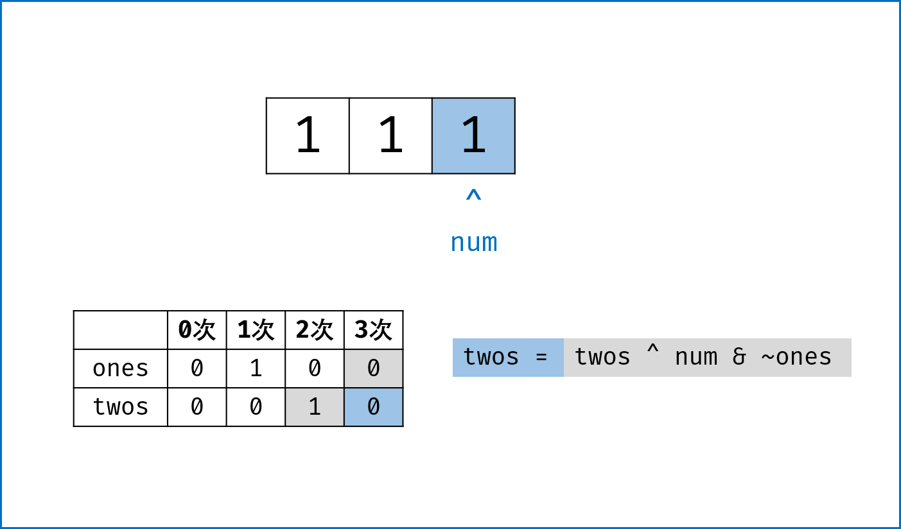

# [只出现一次的数字II](https://leetcode-cn.com/problems/single-number-ii/)

## 题目描述

给定一个非空整数数组，除了某个元素只出现一次以外，其余每个元素均出现了三次。找出那个只出现了一次的元素。

**说明：**

你的算法应该具有线性时间复杂度。 你可以不使用额外空间来实现吗？

**示例 1：**

```
输入: [2,2,3,2]
输出: 3
```

示例 2：

```
输入: [0,1,0,1,0,1,99]
输出: 99
```

### 个人AC

### [最优解](https://leetcode-cn.com/problems/single-number-ii/comments/)

```java
class Solution {
    public int singleNumber(int[] nums) {
        int a = 0, b = 0;
        for (int x : nums) {
            b = (b ^ x) & ~a;
            a = (a ^ x) & ~b;
        }
        return b;
    }
}
```

对于数x，有如下规律：

- x ^ 0 = x；
- x ^ x = 0；
- x & ~x = 0；
- x & ~0 =x。

---


```java
class Solution {
    public int singleNumber(int[] nums) {
        int ones = 0, twos = 0, threes = 0;
        for(int num : nums){
            twos |= ones & num;
            ones ^= num;
            threes = ones & twos;
            ones &= ~threes;
            twos &= ~threes;
        }
        return ones;
    }
}
```




```java
class Solution {
    public int singleNumber(int[] nums) {
        int ones = 0, twos = 0;
        for(int num : nums){
            ones = ones ^ num & ~twos;
            twos = twos ^ num & ~ones;
        }
        return ones;
    }
}
```

**时间复杂度：** $O(n)$；

**空间复杂度：** $O(1)$。