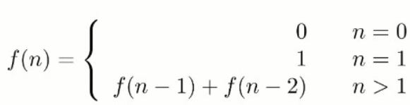
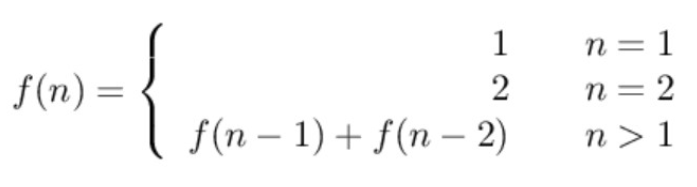
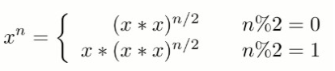

# 剑指Offer

- 要注重平时积累，而不是临时抱佛脚，抱着平时划水面试突击就能拿Offer的心态，只会原地踏步，没有长进；
- 基础的数据结构及算法一定要熟练掌握；
- 编码要规范（命名/缩进/逻辑清晰）、完整（基本功能/考虑边界条件）；
- 明确解题思路后再动手编程，否则上来就写代码，一旦写不出来，给面试官的印象就极度不好，可以采用如下方法寻找思路：
  - 画图
  - 举例
  - 分解

## 3. [二维数组中的查找](https://www.nowcoder.com/practice/abc3fe2ce8e146608e868a70efebf62e?tpId=13&tqId=11154&rp=1&ru=%2Fta%2Fcoding-interviews&qru=%2Fta%2Fcoding-interviews%2Fquestion-ranking&tPage=1)

**题目描述**

给定一个二维数组，其每一行从左到右递增排序，从上到下也是递增排序。给定一个数，判断这个数是否在该二维数
组中。 

```
Consider the following matrix:
[
	[1, 4, 7, 11, 15],
	[2, 5, 8, 12, 19],
	[3, 6, 9, 16, 22],
	[10, 13, 14, 17, 24],
	[18, 21, 23, 26, 30]
] 

Given target = 5, return true.
Given target = 20, return false.
```

要求时间复杂度 O(M + N)，空间复杂度 O(1)。其中 M 为行数，N 为 列数。 

**解题思路**

该数组中任意一个数（除部分边界值之外），一定大于等于其左方的值，小于等于其下方的值。因此，类比二分查找法，从右上角（或者左下角）开始查找，就可以根据 target 与当前元素的大小关系来缩小查找范围，当前元素的查找范围为其左下方（右上方）所有元素。

```Java
public class Solution {
    
    public boolean find(int target, int[][] matrix) {
        if (matrix == null || matrix[0] == null || matrix[0].length == null) return false;
        
        int rows = matrix.length, cols = matrix[0].length;
        // 从矩阵右上角开始
        int r = 0, c = cols - 1;
        while (r < rows && c >= 0) {
            if (target == matrix[r][c]) {
                return true;
            } else if (target < matrix[r][c]) { // target 比当前元素小，到其左方查找
                c--;
            } else {
                r++;
            }
        }
        return false;
    }
}
```

## 4. [替换空格](https://www.nowcoder.com/practice/4060ac7e3e404ad1a894ef3e17650423?tpId=13&tqId=11155&rp=1&ru=%2Fta%2Fcoding-interviews&qru=%2Fta%2Fcoding-interviews%2Fquestion-ranking&tPage=1)

**题目描述**

将一个字符串中的空格替换成 "%20"。 

```
Input:
"A B"

Output:
"A%20B"
```

**解题思路**

令 P1 指向字符串原来的末尾位置，P2 指向字符串现在的末尾位置。P1 和 P2 从后向前遍历，当 P1 遍历到一个空格
时，就需要令 P2 指向的位置依次填充 02%（注意是逆序的），否则就填充上 P1 指向字符的值。从后向前遍历是为了在改变 P2 所指向的内容时，不会影响到 P1 遍历原来字符串的内容。 

```Java
public class Solution {
    public String replaceSpace(StringBuffer str) {
        int p1 = str.length() - 1;
        for (int i = 0; i <= p1; i++) {
            if (str.charAt(i) == ' ') str.append("  ");
        }
        
        int p2 = str.length() - 1;
        while (p1 >= 0 && p2 > p1) {
            char c = str.charAt(p1--);
            if (c == ' ') {
                // space to %20, from end to front
                str.setCharAt(p2--, '0');
                str.setCharAt(p2--, '2');
                str.setCharAt(p2--, '%');
            } else {
                str.setCharAt(p2--, c);
            }
        }
        return str.toString();
    }
}
```

## 5. [从尾到头打印链表](https://www.nowcoder.com/practice/d0267f7f55b3412ba93bd35cfa8e8035?tpId=13&tqId=11156&rp=1&ru=%2Fta%2Fcoding-interviews&qru=%2Fta%2Fcoding-interviews%2Fquestion-ranking&tPage=1)

**题目描述**

从尾到头反过来打印出每个结点的值。

**解题思路**

使用递归

要逆序打印链表 1->2->3（3,2,1)，可以先逆序打印链表 2->3(3,2)，最后再打印第一个节点 1。而链表 2->3 可以看成
一个新的链表，要逆序打印该链表可以继续使用求解函数，也就是在求解函数中调用自己，这就是递归函数。 

```Java
import java.util.ArrayList;

public class Solution {
    public ArrayList<Integer> printListFromTail2Head(ListNode node) {
        ArrayList<Integer> res = new ArrayList<>();
        if (node != null) {
            res.addAll(printListFromTail2Head(node.next));
            res.add(node.val);
        }
        return res;
    }
}
```

反转链表（先反转链表，在顺序遍历逆序后的链表）

```Java
import java.util.ArrayList;

public class Solution {
    public ArrayList<Integer> printListFromTail2Head(ListNode node) {
        ArrayList<Integer> res = new ArrayList<>();
        
        ListNode prev = null, cur = node, next = null;
        while (cur != null) {
            next = cur.next;
            cur.next = prev;
            prev = cur; // prev 记录的是第一个节点
            cur = next;
        }
        
        while (prev != null) {
            res.add(prev.val);
            prev = prev.next;
        }
        return res;
    }
}
```

使用栈

栈具有后进先出的特点，在遍历链表时将值按顺序放入栈中，最后出栈的顺序即为逆序。 

```Java
import java.util.ArrayList;
import java.util.Stack;

public class Solution {
    public ArrayList<Integer> printListFromTail2Head(ListNode node) {
        Stack<Integer> stack = new Stack<>();
        while (node != null) {
            stack.push(node.val);
            node = node.next;
        }
        
        ArrayList<Integer> res = new ArrayList<>();
        while (!stack.isEmpty()) {
            res.add(stack.pop());
        }
        return res;
    }
}
```

## 6. [重建二叉树（前 + 中）](https://www.nowcoder.com/practice/8a19cbe657394eeaac2f6ea9b0f6fcf6?tpId=13&tqId=11157&rp=1&ru=%2Fta%2Fcoding-interviews&qru=%2Fta%2Fcoding-interviews%2Fquestion-ranking&tPage=1)

**题目描述**

根据二叉树的前序遍历和中序遍历的结果，重建出该二叉树。假设输入的前序遍历和中序遍历的结果中都不含重复的
数字 。例如输入前序遍历序列{1, 2, 4, 7, 3, 5, 6, 8}和中序遍历序列{4, 7, 2, 1, 5, 3, 8, 6}，则重建二叉树并返回。

**解题思路**

如果根据二叉树前序遍历和中序遍历的结果重建二叉树，则首先需要在前序遍历数组中找到根节点，然后在中序遍历数组中找到该节点作为根节点，左右数组为分别为其左右子树，然后对左右子数组**递归**执行该过程。

```Java
import java.util.HashMap;

public class Solution {
    // 缓存中序遍历数组中每个值对应的索引：值为key，索引为value
    private HashMap<Integer, Integer> mapForInOrder = new HashMap<>();
    
    public TreeNode reConstructBinaryTree(int[] pre, int[] in) {
        if (pre == null || pre.length == 0 || 
            in == null || in.length == 0 || 
            pre.length != in.length)
            return null;
        // 从中序遍历数组中根据值得到对应索引的复杂度从O(n)降为O(1)
        for (int i = 0; i < in.length; i++) {
            mapForInOrder.put(in[i], i);
        }
        return helper(pre, 0, pre.length, 0);
    }
    
    private TreeNode helper(int[] pre, int preL, int preR, int inL) {
        if (preL > preR) return null;
        
        TreeNode root = new TreeNode(pre[preL]);
        // 定位到中序遍历数组中的根节点
        int rootPosForInOrder = mapForInOrder.get(pre[preL]);
        int leftTreeSize = rootPosForInOrder - inL;
        root.left = helper(pre, preL + 1, preL + leftTreeSize, inL);
        root.right = helper(pre, preL + leftTreeSize + 1, preR, rootPosForInOrder + 1);
        return root;
    }
}
```

## 7. [用两个栈实现队列](https://www.nowcoder.com/practice/54275ddae22f475981afa2244dd448c6?tpId=13&tqId=11158&rp=1&ru=%2Fta%2Fcoding-interviews&qru=%2Fta%2Fcoding-interviews%2Fquestion-ranking&tPage=1)

**题目描述**

用两个栈来实现一个队列，完成队列的 Push 和 Pop 操作。 

**解题思路**

in 栈用来处理入栈（push）操作，out 栈用来处理出栈（pop）操作。一个元素进入 in 栈之后，出栈的顺序被反
转。当元素要出栈时，需要先进入 out 栈，此时元素出栈顺序再一次被反转，因此出栈顺序就和最开始入栈顺序是相
同的，先进入的元素先退出，这就是队列的顺序。 

```Java
import java.util.Stack;

public class Solution {
    
    Stack<Integer> inStack = new Stack<>();
    Stack<Integer> outStack = new Stack<>();
    
    public void push(int val) {
        inStack.push(val);
    }
    
    public int pop() {
        if (outStack.isEmpty()) {
            if (inStack.isEmpty()) throw new RuntimeException("Queue is empty");
            while (!inStack.isEmpty()) {
                outStack.push(inStack.pop());
            }
        }
        return outStack.pop();
    }
}
```

## 8. [旋转数组中的最小数字](https://www.nowcoder.com/practice/9f3231a991af4f55b95579b44b7a01ba?tpId=13&tqId=11159&tPage=1&rp=1&ru=/ta/coding-interviews&qru=/ta/coding-interviews/question-ranking)

**题目描述**

把一个数组最开始的若干个元素搬到数组的末尾，我们称之为数组的旋转。输入一个非递减排序的数组的一个旋转，输出旋转数组的最小元素。

例如数组 {3, 4, 5, 1, 2} 为 {1, 2, 3, 4, 5} 的一个旋转，该数组的最小值为1。

NOTE：给出的所有元素都大于0，若数组大小为0，请返回0。

**解题思路**

将旋转数组对半分可以得到一个包含最小元素的新旋转数组，以及一个非递减排序的数组。

新的旋转数组的数组元素是原数组的一半，从而将问题规模减少了一半，这种折半性质的算法的时间复杂度为 O(logN)。 

此时问题的关键在于确定对半分得到的两个数组哪一个是旋转数组，哪一个是非递减数组。我们很容易知道非递减数
组的第一个元素一定小于等于最后一个元素。通过修改二分查找算法进行求解：

- 当 nums[m] <= nums[h] 时，表示 [m, h] 区间内的数组是非递减数组，[l, m] 区间内的数组是旋转数组，此时
  令 h = m；
- 否则 [m + 1, h] 区间内的数组是旋转数组，令 l = m + 1。 

```Java
public class Solution {
    
    public int minNumberInRotateArray(int[] array) {
        if (null == array || array.length = 0) return 0;
        int l = 0, r = array.length - 1;
        while (l < r) {
            int m = (l + r) / 2;
            if (array[m] <= array[r]) {
                r = m;
            } else {
                l = m + 1;
            }
        }
        return array[l];
    }
}
```

如果数组元素允许重复，会出现一个特殊的情况：nums[l] == nums[m] == nums[h]，此时无法确定解在哪个区间，
需要切换到顺序查找。例如对于数组 {1,1,1,0,1}，l、m 和 h 指向的数都为 1，此时无法知道最小数字 0 在哪个区
间。 

```Java
public class Solution {
    public int minNumberInRotateArray(int [] array) {
        if (null == array || array.length == 0) return 0;
        
        int l = 0, r = array.length - 1;
        while (l < r) {
            int m = (l + r) / 2;
            if (array[m] < array[r]) { // 旋转数组在左边
                r = m;
            } else if (array[m] == array[r]) { // 无法确定解在哪个区间，顺序查找
                r -= 1;
            } else { // 旋转数组在右边
                l = m + 1;
            }
        }
        return array[l];
    }
}
```

## 9. 斐波那契数列

**题目描述**

求斐波那契数列的第`n`项。



**解题思路**

如果使用递归求解，会重复计算一些子问题。例如，计算 f(4) 需要计算 f(3) 和 f(2)，计算 f(3) 需要计算 f(2) 和 f(1)，可以看到 f(2) 被重复计算了。 

递归是将一个问题划分为多个子问题求解，动态规划也是如此，但是**动态规划会将子问题的解缓存起来，避免重复计算**。

```Java
public class Solution {
    
    public int Fibonacci(int n) {
        if (n <= 1) return n;
        
        int[] fib = new int[n + 1];
        fib[1] = 1; // fib[0] = 0;
        for (int i = 2; i <= n; i++) {
            fib[i] = fib[i - 1] + fib[i - 2];
        }
        return fib[n];
    }
}
```

考虑到第 i 项只与第 i-1 和第 i-2 项有关，因此只需要存储前两项的值就能求解第 i 项，从而将空间复杂度由 O(N) 降
低为 O(1)。 

```Java
public class Solution {
    
    public int Fibonacci(int n) {
        if (n <= 1) return n;
        int pre2 = 0, pre1 = 1;
        for (int i = 2; i <= n; i++) {
            int fib = pre2 + pre1;
            pre2 = pre1;
            pre1 = fib;
        }
        return fib;
    }
}
```

### 9.1 [矩形覆盖](https://www.nowcoder.com/practice/72a5a919508a4251859fb2cfb987a0e6?tpId=13&tqId=11163&tPage=1&rp=1&ru=/ta/coding-interviews&qru=/ta/coding-interviews/question-ranking)

**题目描述**

我们可以用`2*1`的小矩形横着或者竖着去覆盖更大的矩形。请问用 n 个`2*1`的小矩形无重叠地覆盖一个`2*n`的大矩
形，总共有多少种方法？ 

**解题思路**

当`n=1`时，只有一种覆盖方法；

当`n=2`时，有两种覆盖方法，横向和纵向。

要覆盖`2*n`的大矩形，可以先覆盖`2*1`的矩形，再覆盖`2*(n-1)`的矩形；或者先覆盖`2*2`的矩形，再覆盖`2*(n-2)`
的矩形。而覆盖`2*(n-1)`和`2*(n-2)`的矩形可以看成子问题。该问题的递推公式如下：



 ```Java
public class Solution {
    
    public int rectCover(int n) {
        if (n <= 2) return n;
        
        int pre2 = 1, pre1 = 2;
        int result = 0;
        for (int i = 3; i <= n; i++) {
            result = pre2 + pre1;
            pre2 = pre1;
            pre1 = result;
        }
        return result;
    }
}
 ```

### 9.2 [跳台阶](https://www.nowcoder.com/practice/8c82a5b80378478f9484d87d1c5f12a4?tpId=13&tqId=11161&tPage=1&rp=1&ru=/ta/coding-interviews&qru=/ta/coding-interviews/question-ranking)

**题目描述**

一只青蛙一次可以跳上1级台阶，也可以跳上2级。求该青蛙跳上一个n级的台阶总共有多少种跳法（先后次序不同算不同的结果）。

**解题思路**

同矩阵覆盖问题。

### 9.3 [变态跳台阶](https://www.nowcoder.com/practice/22243d016f6b47f2a6928b4313c85387?tpId=13&tqId=11162&tPage=1&rp=1&ru=/ta/coding-interviews&qru=/ta/coding-interviews/question-ranking)

**题目描述**

一只青蛙一次可以跳上 1 级台阶，也可以跳上 2 级... 它也可以跳上 n 级。求该青蛙跳上一个 n 级的台阶总共有多少
种跳法。 

**解题思路**

跳上 n-1 级台阶，可以从 n-2 级跳 1 级上去，也可以从 n-3 级跳 2 级上去...，那么`f(n-1) = f(n-2) + f(n-3) + ... + f(0) `，同样，跳上 n 级台阶，可以从 n-1 级跳 1 级上去，也可以从 n-2 级跳 2 级上去... ，那么`f(n) = f(n-1) + f(n-2) + ... + f(0)`，综上可得`f(n) - f(n-1) = f(n-1)`，即`f(n) = 2 * f(n - 1)`。所以`f(n)`是一个首项为1，公比为2的等比数列。

```Java
public class Solution {
   
    public int jumpFloorII(int n) {
    	return (int)Math.pow(2, target - 1);
    }
}
```

## 10. [二进制中1的个数](https://www.nowcoder.com/practice/8ee967e43c2c4ec193b040ea7fbb10b8?tpId=13&tqId=11164&rp=1&ru=%2Fta%2Fcoding-interviews&qru=%2Fta%2Fcoding-interviews%2Fquestion-ranking&tPage=1)

**题目描述**

输入一个整数，输出该数二进制表示中 1 的个数。

**解题思路**

`n & (n - 1)` 运算去除 n 的二进制表示中最后的1。

```
n : 10110100
n - 1 : 10110011
n & (n - 1) : 10110000
```

时间复杂度：O(M)，其中 M 表示 1 的个数。 

```Java
public class Solution {
    public int numberOf1(int n) {
        int cnt = 0;
        while (n != 0) {
            n &= (n - 1);
            cnt++;
        }
        return cnt;
    }
}
```

## 11. [数值的整数次方](https://www.nowcoder.com/practice/1a834e5e3e1a4b7ba251417554e07c00?tpId=13&tqId=11165&tPage=1&rp=1&ru=/ta/coding-interviews&qru=/ta/coding-interviews/question-ranking)

**题目描述**

给定一个 double 类型的浮点数 base 和 int 类型的整数 exponent，求 base 的 exponent 次方。 

**解题思路**

下面的讨论中 x 代表 base，n 代表 exponent。 



因为 (x*x)^n/2^ 可以通过递归求解，并且每次递归 n 都减小一半，因此整个算法的时间复杂度为 O(logN)。 

```Java
public class Solution {
    
    public int power(double base, int exponent) {
        if (base == 0) return 0;
        if (exponent == 0) return 1;
        
        boolean isNegative = false;
        if (exponent < 0) {
            exponent = -exponent;
            isNegative = true;
        }
        double pow = power(base * base, exponent / 2);
        if ((exponent & 1) == 1) pow *= base;
        return isNegative ? 1 / pow : pow;
    }
}
```

## 12. 打印从 1 到最大的 n 位数

**题目描述**

输入数字 n，按顺序打印出从 1 到最大的 n 位十进制数。比如输入 3，则打印出 1、2、3 ，一直到最大的 3 位数即 999。 

**解题思路**

由于 n 可能会非常大，因此不能用 int 表示数字，而是用 char 数组进行存储。

使用回溯法得到所有的数。

```Java
public class Solution {
    
    public void print1ToMaxOfNDigits(int n) {
        if (n <= 0) return;
        char[] number = new char[n];
        // 递归入口
        print1ToMaxOfDigits(number, 0);
    }
    
    private void print1ToMaxOfDigits(char[] number, int digit) {
        // 当递归到第n层时，开始打印number，数字1在数组中存储为['0', '0', '1']
        if (digit == number.length) {
            printNumber(number);
            return;
        }
        for (int i = 0; i < 10; i++) {
            number[digit] = (char)(i + '0');
            print1ToMaxOfDigits(number, digit + 1);
        }
    }
    
    // 打印一个数， 当 n = 3 时
    // ['0', '0', '1']
    // ...
    // ['9', '9', '9']
    private void printNumber(char[] number) {
        int index = 0;
        while (index < number.length && number[index] == '0')
            index++;
        while (index < number.length)
            System.out.print(number[index++])
        System.out.println()
    }
}
```

## 13. 删除链表结点

### 13.1 在 O(1) 时间内删除链表结点

**题目描述**

给定单项链表的头指针和一个结点指针，定义一个函数在O(1)时间删除该结点。

**解题思路**

1. 如果该结点不是尾结点，则直接将下一个结点的值赋值给该结点，然后将该结点指向下下个结点（即删除下一个结点），时间复杂度为O(1)；
2. 否则如果该结点还是头结点（链表中只有一个结点），则直接将head置为null；
3. 否则，从头开始遍历，找到要删除结点的前一个结点。

```java
public class Solution {
    
    public ListNode deleteNode(ListNode head, ListNode toBeDeleted) {
        if (head == null || toBeDeleted == null) return;
        
        if (toBeDeleted.next != null) { // toBeDeleted非尾结点
            ListNode next = toBeDeleted.next;
            toBeDeleted.val = next.val;
            toBeDeleted.next = next.next;
        } else {
            if (toBeDeteletd == head) { // 链表中只有一个结点
                head = null;
            } else {
                ListNode node = head;
                while (node.next != null) {
                    node = node.next;
                }
                node.next = null;
            }
        }
        return head;
    }
}
```

### 13.2 删除链表中重复的结点

**题目描述**

在一个排序的链表中，存在重复的结点，请删除该链表中重复的结点，重复的结点不保留，返回链表头指针。 例如，链表1->2->3->3->4->4->5 处理后为 1->2->5。

**解题思路**

[Yobol.LearningNotes - LC.0082 删除排序链表中的重复元素II]([https://github.com/Yobol/LearningNotes/blob/master/%E7%AE%97%E6%B3%95/%E9%93%BE%E8%A1%A8/LC.0082.%E5%88%A0%E9%99%A4%E6%8E%92%E5%BA%8F%E9%93%BE%E8%A1%A8%E4%B8%AD%E7%9A%84%E9%87%8D%E5%A4%8D%E5%85%83%E7%B4%A0II.md](https://github.com/Yobol/LearningNotes/blob/master/算法/链表/LC.0082.删除排序链表中的重复元素II.md))

## 14. 调整数组顺序使奇数位于偶数前面

### 14.1 无须保证相对顺序

**题目描述**

输入一个整数数组，实现一个函数来调整该数组中数字的顺序，使得所有奇数位于数组的前半部分，所有偶数位于数组的后半部分。

**解题思路**

参考快排中的partition方法：

1. 声明两个指针`l`和`r`分别初始化为`0`和`n-1`，当`l < r`时；
2. 不断左移`r`，直到找到第一个奇数；
3. 不断右移`l`，直到找到第一个偶数；
4. 交换`l`和`r`指向的元素值
5. 重复上述步骤，直到`l >= r`。

```java
public class Solution {
    public void reorderOddEven(int[] array) {
        if (array == null || array.length == 0) return;
        int l = 0, r = array.length - 1;
        while (l < r) {
            while (l < r && isEven(array[r])) r--;
            while (l < r && !isEven(array[l])) l++;
            if (l < r) {
                swap(array, l, r);
            }
        }
    }reOrderArray
    
    private boolean isEven(int n) {
        return (n & 0x1) == 0;
    }
    
    private void swap(int[] array, int i, int j) {
        int tmp = array[i];
        array[i] = array[j];
        array[j] = tmp;
    }
}
```

### 14.2 [保证奇数和奇数，偶数和偶数之间的相对顺序不变（Newcoder）](https://www.nowcoder.com/practice/beb5aa231adc45b2a5dcc5b62c93f593)

**题目描述**

输入一个整数数组，实现一个函数来调整该数组中数字的顺序，使得所有的奇数位于数组的前半部分，所有的偶数位于数组的后半部分，并保证奇数和奇数，偶数和偶数之间的相对位置不变。

**解题思路**

快排并不能保证稳定性（相同元素相对顺序不变），冒泡排序可以保证稳定性，我们可以学习冒泡思想，每次都将当前偶数上浮到待排序的末尾。

**时间复杂度：** $O(n)$；

**空间复杂度：** $O(1)$。

```java
public class Solution {
    public void reorderOddEven(int[] array) {
        if (array == null || array.length == 0) return;
        int n = array.length;
        
        for (int i = n - 1; i > 0; i--) {
            for (int j = 0; j < i; j++) {
                if (isEven(array[j]) && !isEven(array[j + 1])) {
                    swap(array, j, j + 1);
                }
            }
        }
    }
    
    private boolean isEven(int n) {
        return (n & 0x1) == 0;
    }
    
    private void swap(int[] array, int i, int j) {
        int tmp = array[i];
        array[i] = array[j];
        array[j] = tmp;
    }
}
```

## 15. 链表中倒数第k个结点

**题目描述**

输入一个链表，输出该链表中倒数第k个结点。

**解题思路**

假设链表长度为n：

1. 设置两个指针`fast`和`slow`，初始化指向头结点；
2. 先让`fast`向后移动`k - 1`个结点，则还有`n - k`个结点可以移动；
3. 然后让`fast`和`slow`同时向后移动，当`fast`移动到链表结尾时，`slow`就指向倒数第`k`个结点。

```java
/*
public class ListNode {
    int val;
    ListNode next = null;

    ListNode(int val) {
        this.val = val;
    }
}*/
public class Solution {
    public ListNode FindKthToTail(ListNode head,int k) {
        if (head == null || k <= 0) return null;
        
        ListNode fast = head;
        while (fast != null && k-- > 0) {
            fast = fast.next;
        }
        if (k > 0) {
            return null;
        }
        
        ListNode slow = head;
        while (fast != null) {
            fast = fast.next;
            slow = slow.next;
        }
        return slow;
    }
}
```

### 15.1 求链表的中间结点

**题目描述**

求链表的中间结点。

**解题思路**

[Yobol.LearningNotes - LC.0876.链表的中间结点](https://github.com/Yobol/LearningNotes/blob/master/算法/链表/双指针/LC.0876.链表的中间结点.md)

### 15.2 判断一个单向链表是否形成了环形结构

**题目描述**

判断链表中是否有环。

**解题思路**

[Yobol.LearningNotes - LC.0141.环形链表](https://github.com/Yobol/LearningNotes/blob/master/算法/链表/双指针/LC.0141.环形链表.md)

## 16. 反转链表

**题目描述**

定义一个函数，输入一个链表的头结点，反转该链表并输出反转后链表的头结点。

**解题思路**

[Yobol.LearningNotes - LC.0206.反转链表](https://github.com/Yobol/LearningNotes/blob/master/算法/链表/LC.0206.反转链表.md)

## 17.  合并两个排序的链表

**题目描述**

输入两个单调递增的链表，输出两个链表合成后的链表，当然我们需要合成后的链表满足单调不减规则。

**解题思路**

[Yobol.LearningNotes - LC.0021.合并两个有序链表](https://github.com/Yobol/LearningNotes/blob/master/算法/链表/LC.0021.合并两个有序链表.md)

## 18. 树的子结构

**题目描述**

输入两棵二叉树A和B，判断B是不是A的子结构（约定空树不是任意一个树的子结构）。

**解题思路**

1. locate（IsSubTree）：找到B在A中的位置B'；
2. contains：判断以B'为根节点的子树中是否包含B。

```java
/**
public class TreeNode {
    int val = 0;
    TreeNode left = null;
    TreeNode right = null;

    public TreeNode(int val) {
        this.val = val;
    }

}
*/
public class Solution {
    public boolean HasSubtree(TreeNode root1,TreeNode root2) {
        if (root1 == null || root2 == null) return false;
        
        return IsSubtree(root1, root2) || HasSubtree(root1.left, root2) || HasSubtree(root1.right, root2);
    }
    
    private boolean IsSubtree(TreeNode root1, TreeNode root2) {
        if (root2 == null) return true;
        if (root1 == null) return false;
        
        if (root1.val == root2.val) {
            return IsSubtree(root1.left, root2.left) && IsSubtree(root1.right, root2.right);
        } else {
            return false;
        }
    }
}
```

## 19. 二叉树的镜像

**题目描述**

操作给定的二叉树，将其变换为源二叉树的镜像。

**解题思路**

1. 前序遍历二叉树的每个结点；
2. 交换它的左右子结点。

```java
/**
public class TreeNode {
    int val = 0;
    TreeNode left = null;
    TreeNode right = null;

    public TreeNode(int val) {
        this.val = val;

    }

}
*/
public class Solution {
    public void Mirror(TreeNode root) {
        if (root == null) return;
        
        TreeNode tmp = root.left;
        root.left = root.right;
        root.right = tmp;
        
        Mirror(root.left);
        Mirror(root.right);
    }
}
```

类似：有返回值[LearningNotes - LC.0226.翻转二叉树](https://github.com/Yobol/LearningNotes/blob/master/算法/树/LC.0226.翻转二叉树.md)

## 20. 顺时针打印矩阵

**题目描述**

输入一个矩阵，按照从里到外以顺时针的顺序依次打印出每一个数字。

**解题思路**

[Yobol.LearningNotes - 螺旋矩阵](https://github.com/Yobol/LearningNotes/blob/master/算法/数组或字符串/LC.0054.螺旋矩阵.md)

## 21. 包含min函数的栈

**题目描述**

定义栈的数据结构，请在该类型中实现一个能够得到栈中所含最小元素的min函数（时间复杂度应为O（1））。

**解题思路**

```java
import java.util.Stack;

public class Solution {
    
    Stack<Integer> dataStack = new Stack<>();
    Stack<Integer> minStack = new Stack<>();

    
    public void push(int node) {
        if (this.minStack.isEmpty()) {
            this.minStack.push(node);
        } else if (node <= this.minStack.peek()) {
            this.minStack.push(node);
        }
        this.dataStack.push(node);
    }
    
    public void pop() {
        if (this.dataStack.isEmpty()) {
            throw new RuntimeException("Stack is empty!");
        }
        if (this.dataStack.pop() == this.minStack.peek()) {
            this.minStack.pop();
        }
    }
    
    public int top() {
        if (this.dataStack.isEmpty()) {
            throw new RuntimeException("Stack is empty!");
        }
        return this.dataStack.peek();
    }
    
    public int min() {
        if (this.minStack.isEmpty()) {
            throw new RuntimeException("Stack is empty!");
        }
        return this.minStack.peek();
    }
}
```

## 22. 栈的压入、弹出序列

**题目描述**

输入两个整数序列，第一个序列表示栈的压入顺序，请判断第二个序列是否可能为该栈的弹出顺序。

假设压入栈的所有数字均不相等。例如序列1,2,3,4,5是某栈的压入顺序，序列4,5,3,2,1是该压栈序列对应的一个弹出序列，但4,3,5,1,2就不可能是该压栈序列的弹出序列。

注：这两个序列的长度是相等的。

**解题思路**

要让出栈序列中的元素完全匹配上入栈序列的元素，声明两个指针`push`和`pop`分别指向入栈和出栈序列的起始位置：

1. 如果当前入栈元素等于出栈元素，则表示匹配，不用模拟入栈操作，直接跳过；
2. 否则：
   1. 如果栈为空，则将入栈元素直接压入栈中，并后移`push`指针；
   2. 否则如果栈顶元素等于出栈元素，表示匹配，将栈顶元素弹出，并后移`pop`指针；
   3. 否则如果`push`指针小于n，将入栈元素直接压入栈中，并后移`push`指针；
   4. 否则不能匹配，返回false。

```java
import java.util.Stack;

public class Solution {
    
    private Stack<Integer> stack = new Stack<>();
    
    public boolean IsPopOrder(int [] pushA,int [] popA) {
        int push = 0;
        int pop = 0;
        int n = pushA.length;
        while (pop < n) {
            if (push < n && pushA[push] == popA[pop]) {
                push++;
                pop++;
            } else {
                if (stack.isEmpty()) {
                    stack.push(pushA[push++]);
                } else if (stack.peek() == popA[pop]) {
                    pop++;
                    stack.pop();
                } else if (push < n){
                    stack.push(pushA[push++]);
                } else {
                    return false;
                }
            }
        }
        return true;
    }
}
```

## 23. 从上往下打印二叉树

**题目描述**

从上往下打印出二叉树的每个结点，同一层的节点按照从左到右的顺序打印。

**解题思路**

不分层。

```java
import java.util.ArrayList;
import java.util.LinkedList;
import java.util.Queue;
/**
public class TreeNode {
    int val = 0;
    TreeNode left = null;
    TreeNode right = null;

    public TreeNode(int val) {
        this.val = val;

    }

}
*/
public class Solution {
    public ArrayList<Integer> PrintFromTopToBottom(TreeNode root) {
        ArrayList<Integer> array = new ArrayList<>();
        if (root == null) return array;
        
        Queue<TreeNode> queue = new LinkedList<>();
        queue.add(root);
        
        while (!queue.isEmpty()) {
            int cnt = queue.size();
            while (cnt > 0) {
                TreeNode tmp = queue.poll();
                array.add(tmp.val);
                if (tmp.left != null) queue.add(tmp.left);
                if (tmp.right != null) queue.add(tmp.right);
                cnt--;
            }
        }
        return array;
    }
}
```

[Yobol.LearningNotes - LC.0102.二叉树的层次遍历](https://github.com/Yobol/LearningNotes/blob/master/算法/树/遍历/广度优先遍历/LC.0102.二叉树的层次遍历.md)

## 24. 二叉搜索树的后序遍历序列

**题目描述**

输入一个整数数组，判断该数组是不是某二叉搜索树后序遍历的结果，如果是则返回true，否则返回false。

假设输入的数组任意两个数字都互不相同。

**解题思路**

在后序遍历得到的序列中，最后一个数字是树的根节点的值。数组中前面的数字可以分为两部分：第一部分是左子树中的结点值，它们都比根节点小，第二部分是右子树中的结点值，它们都比根节点的值大。

```java
public class Solution {
    public boolean VerifySquenceOfBST(int [] sequence) {
        if (sequence == null || sequence.length == 0) return false;
        return verify(sequence, 0, sequence.length - 1);
    }
    
    private boolean verify(int[] sequence, int l, int r) {
        if (l >= r) return true;

        int i = r;
        while (i > l && sequence[i - 1] > sequence[r]) i--;
        for (int j = i - 1; j >= l; j--) {
            if (sequence[j] > sequence[r]) {
                return false;
            }
        }
        return verify(sequence, l, i - 1) && verify(sequence, i + 1, r);
    }
}
```

## 25. 二叉树中和为某一值的路径

**题目描述**

输入一棵二叉树的根节点和一个整数，打印出二叉树中结点值的和为输入整数的所有路径。路径定义为从树的根节点开始往下一直到叶节点所经过的结点形成一条路径。

**解题思路**

```java
import java.util.ArrayList;
/**
public class TreeNode {
    int val = 0;
    TreeNode left = null;
    TreeNode right = null;

    public TreeNode(int val) {
        this.val = val;

    }
}
*/
public class Solution {
    public ArrayList<ArrayList<Integer>> FindPath(TreeNode root,int target) {
        ArrayList<ArrayList<Integer>> output = new ArrayList<>();
        FindPath(output, root, new ArrayList<>(), target);
        return output;
    }
    
    private void FindPath(ArrayList<ArrayList<Integer>> output, TreeNode root, 
                          ArrayList<Integer> path, int target) {
        if (root == null) return ;
        target -= root.val;
        path.add(root.val);
        if (root.left == null && root.right == null) { // leaf node
            if (target == 0) {
                output.add(path);
            }
        } else {
            FindPath(output, root.left, new ArrayList<>(path), target);
            FindPath(output, root.right, new ArrayList<>(path), target);
        }
    }
}
```


## *. 链表中环的入口结点

**题目描述**

给一个链表，若其中包含环，请找出该链表的环的入口结点，否则，输出null。

**解题思路**

使用双指针，一个指针`fast`每次移动两个节点，一个指针`slow`每次移动一个节点。因为存在环，所以两个指针必定相遇在环中的某个节点上。

假设相遇点在下图的`z1`位置，此时`fast`移动的节点数为`x+2y+z`，`slow`为`x+y`，由于`fast`速度比`slow`快一倍，因此`x+2y+z=2(x+y)`，得到`x=z`。
在相遇点，`slow`要到环的入口点还需要移动`z`个节点，如果让`fast`重新从头开始移动，并且速度变为每次移动一个节点，那么它到环入口点还需要移动`x`个节点。在上面已经推导出`x=z`，因此`fast`和`slow`将在环入口点相遇。

```java
/*
 public class ListNode {
    int val;
    ListNode next = null;

    ListNode(int val) {
        this.val = val;
    }
}
*/
public class Solution {

    public ListNode EntryNodeOfLoop(ListNode pHead) {
        if (pHead == null || pHead.next == null) return null;
        
        ListNode fast = pHead, slow = pHead;
        while (fast != null && fast.next != null) {
            fast = fast.next.next;
            slow = slow.next;
            if (fast == slow) {
                break; // 有环
            }
        }
        fast = pHead;
        while (slow != fast) {
            slow = slow.next;
            fast = fast.next;
        }
        return slow;
    }
}
```

## *. 字符流中第一个不重复的数字

**题目描述**

请实现一个函数用来找出字符流中第一个只出现一次的字符。例如，当从字符流中只读出前两个字符"go"时，第一个只出现一次的字符是"g"。当从该字符流中读出前六个字符“google"时，第一个只出现一次的字符是"l"。

`注：如果当前字符流没有存在出现一次的字符，返回#字符。`

**解题思路**

```java
import java.util.*;

public class Solution {
    private int[] cnts = new int[256];
    private Queue<Character> queue = new LinkedList<>();
    
    //Insert one char from stringstream
    public void Insert(char ch) {
        cnts[ch]++;
        queue.add(ch);
        while (!queue.isEmpty() && cnts[queue.peek()] > 1) {
            queue.poll();
        }
    }
  //return the first appearence once char in current stringstream
    public char FirstAppearingOnce() {
        return queue.isEmpty() ? '#' : queue.peek();
    }
}
```


## *. 数组中重复的数字

**题目描述**

在一个长度为 n 的数组里的所有数字都在 0 到 n-1 的范围内。数组中某些数字是重复的，但不知道有几个数字是重
复的，也不知道每个数字重复几次。请找出数组中任意一个重复的数字。 

返回第一个重复的数字即可。要求时间复杂度 O(N)，空间复杂度 O(1)。 

```
Input:
{2, 3, 1, 0, 2, 5}

Output:
2
```

**解题思路**

要求时间复杂度为 O(N)，空间复杂度为 O(1)。因此不可能使用排序的方法，也不能使用额外的数组。

对于这种长为 n，且数组元素在 [0, n - 1] 范围内的问题，可以将值为 i 的元素调整到第 i 个位置上进行求解。

从数组第 0 个位置开始遍历，当第 i 个位置上的元素不等于 i 时，将第 i 个位置上的元素与该数值对应下标的元素进行交换`swap(nums, i, nums[i])`，直到我们当前遍历到的元素在对应位置上已经有相同元素时返回结果。

```Java
public class Solution {
    // duplication是一个长度为1的数组，保存第一个重复的数字。
    public boolean duplicate(int[] nums, int length, int[] duplication) {
        if (nums == null || length <= 1) return false;
        
        for (int i = 0; i < length; i++) {
            while (nums[i] != i) {
                // 以当前元素为下标的位置上已经存在该元素时返回结果
                if (nums[i] == nums[nums[i]]) {
                    duplication[0] = nums[i];
                    return true;
                }
                // 将第 i 个位置上的元素与该数值对应下标的元素进行交换
                swap(nums, i, nums[i]);
            }
        }
        return false;
    }
    
    private void swap(int[] nums, int i, int j) {
        int tmp = nums[i];
        nums[i] = nums[j];
        nums[j] = tmp;
    }
}
```


## *. [二叉树的下一个结点](https://www.nowcoder.com/practice/9023a0c988684a53960365b889ceaf5e?tpId=13&tqId=11210&rp=1&ru=%2Fta%2Fcoding-interviews&qru=%2Fta%2Fcoding-interviews%2Fquestion-ranking&tPage=3)

**题目描述**

给定一个二叉树和其中的一个结点，请找出中序遍历顺序的下一个结点并且返回。注意，树中的结点不仅包含左右子
结点，同时包含指向父结点的指针。 

```Java
public class TreeLinkNode {
	int val;
	TreeLinkNode left = null;
	TreeLinkNode right = null;
    // 指向父结点
	TreeLinkNode parent = null;
    
	TreeLinkNode(int val) {
		this.val = val;
	}
}
```

**解题思路**

找规律：

1. 如果给定结点的右子树不为空，则该结点中序遍历的下一个结点为`右子树的最左结点`；
2. 否则，向上找第一个左子树中包含该结点的结点。

```Java
public class Solution {
    
    public TreeLinkNode getNext(TreeLinkNode pNode) {
        if (pNode == null) return null;
        // 如果结点的右子树不为空，则该结点中序遍历的下一个结点为右子树的最左结点
        if (pNode.right != null) {
            // 取得结点右子树的根结点
            TreeLinkNode node = pNode.right;
            // 找到最左结点
            while (node.left != null) node = node.left;
            return node;
        } else {
            // 否则，通过node.parent向上找第一个左子树中包含该结点的结点
            while (pNode.next != null) {
                TreeLinkNode parent = pNode.parent;
                if (parent.left == pNode) return parent;
                pNode = parent;
            }
        }
        return null;
    }
}
```


## *. [矩阵中的路径]()

**题目描述**

请设计一个函数，用来判断在一个矩阵中是否存在一条包含某字符串所有字符的路径。**路径可以从矩阵中的任意一个格子开始**，每一步可以在矩阵中向左，向右，向上，向下移动一个格子。如果一条路径经过了矩阵中的某一个格子，则该路径不能再进入该格子。 例如 a b c e | s f c s | a d e e 矩阵中包含一条字符串"bcced"的路径，但是矩阵中不包含"abcb"路径，因为字符串的第一个字符b占据了矩阵中的第一行第二个格子之后，路径不能再次进入该格子。

**解题思路**

使用回溯法（backtracking）/ DFS进行求解，它是一种暴力搜索方法，通过搜索所有可能的结果来求解问题。回溯法在一
次搜索结束时需要进行回溯（回退），将这一次搜索过程中设置的状态进行清除，从而开始一次新的搜索过程。例如
下图示例中，从 f 开始，下一步有 4 种搜索可能，如果先搜索 b，需要将 b 标记为已经使用，防止重复使用。在这一
次搜索结束之后，需要将 b 的已经使用状态清除，并搜索 c。 

```Java
public class Solution {
    public boolean hasPath(char[] matrix, int rows, int cols, char[] str) {
        if (matrix == null || matrix.length == 0 || str == null || str.length) return false;
        if (rows <= 0 || cols <= 0 || matrix.length != rows * cols) return false;
        boolean[] visited = new boolean[rows * cols];
        // 路径可以从矩阵中的任意一个格子开始
        for (int r = 0; r < rows.length; r++) {
            for (int c = 0; c < cols.length; c++) {
                if (hasPath(matrix, r, rows, c, cols, str, 0, visited)) {
                    return true;
                }
            }
        }
        return false;
    }
    
    private boolean hasPath(char[] matrix, int r, int rows, int c, int cols, char[] str, int i, boolean[] visited) {
        // 结束条件：
        // 1: 下标越界
        if (r < 0 || r >= rows || c < 0 || c >= cols) return false;
        int index = r * cols + c;
        // 2: 格子已经访问过
        if (visited[index]) return false;
        // 3: 当前矩阵遍历到的字符和字符串相应位置的字符不匹配
        if (matrix[index] != str[i]) return false;
        
        // 否则标记访问过
        visited[index] = true;
        // 一旦当前矩阵遍历到的字符和字符串最后一个字符匹配上，表示存在路径
        if (i == str.length - 1) return true;
        
        if (hasPath(matrix, r - 1, rows, c, cols, str, i + 1, visited) || 
           hasPath(matrix, r + 1, rows, c, cols, str, i + 1, visited) || 
           hasPath(matrix, r, rows, c - 1, cols, str, i + 1, visited) || 
           hasPath(matrix, r, rows, c + 1, cols, str, i + 1, visited)) {
            return true;
        }
        // 回溯：否则表示此路不通，需要返回上一步
        visited[index] = false;
        return false;
    }
}
```

## *. 数组中只出现一次的数字

**题目描述**

一个整型数组里除了两个数字之外，其他的数字都出现了两次。请写程序找出这两个只出现一次的数字。

**解题思路**

[Yobol.LearningNotes - LC.0260.只出现一次的数字III](https://github.com/Yobol/LearningNotes/blob/master/算法/位或数位操作/LC.0260.只出现一次的数字III.md)

## *. [机器人的运动范围](https://www.nowcoder.com/practice/6e5207314b5241fb83f2329e89fdecc8?tpId=13&tqId=11219&tPage=1&rp=1&ru=/ta/coding-interviews&qru=/ta/coding-interviews/question-ranking)

**题目描述**

地上有一个 m 行和 n 列的方格。一个机器人从坐标 (0, 0) 的格子开始移动，每一次只能向左右上下四个方向移动一
格，但是不能进入行坐标和列坐标的数位之和大于 k 的格子。

例如，当 k 为 18 时，机器人能够进入方格 (35,37)，因为 3+5+3+7=18。但是，它不能进入方格 (35,38)，因为
3+5+3+8=19。请问该机器人能够达到多少个格子？

**解题思路**

使用深度优先搜索（Depth First Search，DFS）方法进行求解。回溯是深度优先搜索的一种特例，它在一次搜索过
程中需要设置一些本次搜索过程的局部状态，并在本次搜索结束之后清除状态。而普通的深度优先搜索并不需要使用
这些局部状态，虽然还是有可能设置一些全局状态。

```Java
public class Solution {
    public int movingCount(int threshold, int rows, int cols) {
        if (rows <= 0 || cols <= 0 || threshold < 0) return 0;
        boolean[] visited = new boolean[rows * cols];
        return helper(threshold, 0, rows, 0, cols, visited);
    }
    
    private int helper(int threshold, int r, int rows, int c, int cols, boolean[] visited) {
        // 下标越界
        if (r < 0 || r >= rows || c < 0 || c >= cols) return 0;
        int index = r * cols + c;
        // 已经访问过
        if (visited[index]) return 0;
        // 大于k
        if (digitSum(r) + digitSum(c) > threshold) return 0;
        
        // 否则，访问并标识已经访问过
        visited[index] = true;
        // 递归遍历上下左右的元素
        return helper(threshold, r - 1, rows, c, cols, visited) + 
            helper(threshold, r + 1, rows, c, cols, visited) + 
            helper(threshold, r, rows, c - 1, cols, visited) + 
            helper(threshold, r, rows, c + 1, cols, visited) + 1;
        
    }
    
    private int digitSum(int num) {
        int sum = 0;
        while (num != 0) {
            sum += num % 10;
            num /= 10;
        }
        return sum;
    }
}
```

## *. [剪绳子——整数拆分](https://leetcode.com/problems/integer-break/description/)

**题目描述**

把一根绳子剪成多段，并且使得每段的长度乘积最大。 

```
n = 2
return 1 (2 = 1 + 1)

n = 10
return 36 (10 = 3 + 3 + 4)
```

**解题思路**

贪心（数学方法）

尽可能多剪长度为 3 的绳子，并且不允许有长度为 1 的绳子出现。如果出现了，就从已经切好长度为 3 的绳子中拿
出一段与长度为 1 的绳子重新组合，把它们切成两段长度为 2 的绳子。 

证明：求函数y=(n/x)^x^(x>0)的最大值，可得x=e时y最大，但只能分解成整数，故x取2或3，又因为 3(n - 3) - 2(n - 2) = n - 5 >= 0，所以剪成一段长度为 3 比长度为 2 得到的乘
积更大。 

```Java
public class Solution {
    
    public int integerBreak(int n) {
        if (n < 2) return 0;
        if (n == 2) return 1;
        if (n == 3) return 2;
        int timesOf3 = n / 3;
        if (n - 3 * timesOf3 == 1) timesOf3--;
        int timesOf2 = (n - 3 * timesOf3) / 2;
        return (int)(Math.pow(3, timesOf3) * Math.pow(2, timesOf2));
    }
}
```

动态规划

令`dp[i]`表示整数`i`对应的最大乘积，那么`dp[i]`的值应是`dp[j]*(i-j)`，`j`属于`[1, i-1]`的最大值，同时注意`dp[j]`对应的值是经过拆分了的，所以还应判断两个数拆分的情况，即`j*(i-j)`的值，取最大即可。

```Java
public int integerBreak(int n) {
	int[] dp = new int[n + 1];
	dp[2] = 1; // 初始化当 n = 2 时，构成和为2的最大积为1， 2 = 1 + 1 >> 1 = 1 * 1
	for (int i = 3; i <= n; i++) {
        // 初始化当前dp[i]由i个1相加而得，乘积为1
        dp[i] = 1;
        // 遍历[1, i-1]
		for (int j = 1; j >= 1; j++) {
            // i = 3
            // j = 1, dp[1] = 0, dp[3] = Math.max(1, Math.max(1 * (3 - 1), dp[1] * (3 - 1))) = 2
            // j = 2, dp[2] = 1, dp[3] = Math.max(1, Math.max(2 * (3 - 2), dp[2] * (3 - 2))) = 2
            // dp[3] = 2
            dp[i] = Math.max(dp[i], Math.max(j * (i - j), dp[j] * (i - j)));
        }
    }
	return dp[n];
}
```

