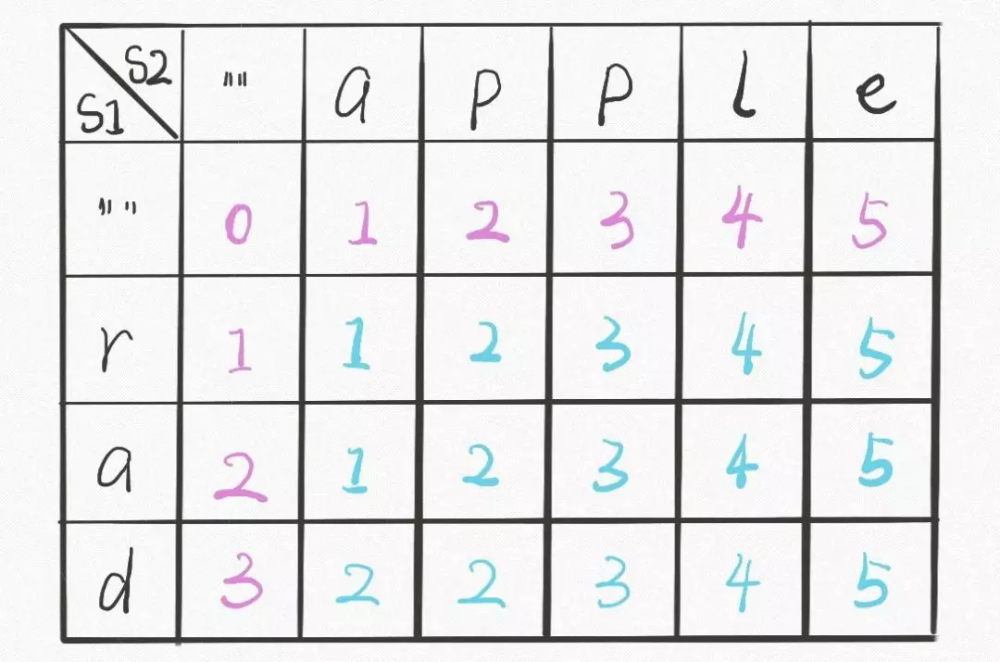

# [编辑距离](https://leetcode-cn.com/problems/edit-distance/)

## 题目描述

给定两个单词 word1 和 word2，计算出将 word1 转换成 word2 所使用的最少操作数 。

你可以对一个单词进行如下三种操作：

1. 插入一个字符
2. 删除一个字符
3. 替换一个字符

**示例 1：**

```
输入: word1 = "horse", word2 = "ros"
输出: 3
解释: 
horse -> rorse (将 'h' 替换为 'r')
rorse -> rose (删除 'r')
rose -> ros (删除 'e')
```

**示例 2：**

```
输入: word1 = "intention", word2 = "execution"
输出: 5
解释: 
intention -> inention (删除 't')
inention -> enention (将 'i' 替换为 'e')
enention -> exention (将 'n' 替换为 'x')
exention -> exection (将 'n' 替换为 'c')
exection -> execution (插入 'u')
```

## 解题思路

### 个人AC

解决两个字符串匹配、编辑问题时，可以尝试从字符串尾部向前遍历。


`注：可以自己画图尝试一下。`

#### DFS

首先从字符串尾部开始：

- 当`s1[i] == s2[j]`时，直接跳过字母可使编辑距离最小，`i--`，`j--`；
- 当`s1[i] != s2[j]`时，编辑距离 + 1，且：
  - 如果`i == j`，执行替换操作，`i--`，`j--`；
  - 如果`i < j`，执行插入（或删除）操作，`j--`；
  - 如果`i > j`，执行删除（或插入）操作，`i--`；
- 特别地：
  - 当`i == -1`时，编辑距离加上s2的剩余长度，即`j + 1`；
  - 当`j == -1`时，编辑距离加上s1的剩余长度，即`i + 1`。

```java
class Solution {
    public int minDistance(String word1, String word2) {
        return dfs(word1, word1.length() - 1, word2, word2.length() - 1);
    }

    private int dfs(String word1, int i, String word2, int j) {
        if (i == -1) return j + 1;
        if (j == -1) return i + 1;

        if (word1.charAt(i) == word2.charAt(j)) {
            return dfs(word1, i - 1, word2, j - 1);
        } else {
            return min(
                dfs(word1, i - 1, word2, j),
                dfs(word1, i, word2, j - 1),
                dfs(word1, i - 1, word2, j - 1)
            ) + 1;
        }
    }

    private int min(int x, int y, int z) {
        return Math.min(x, Math.min(y, z));
    }
}
```

此解法会遍历所有情况，且存在重叠子问题。

#### DFS+备忘录

在DFS中，解决重叠子问题的方法是使用备忘录来避免重复计算。

```java
class Solution {
    public int minDistance(String word1, String word2) {
        return dfs(word1, word1.length() - 1, word2, word2.length() - 1, new Integer[word1.length()][word2.length()]);
    }

    private int dfs(String word1, int i, String word2, int j, Integer[][] memo) {
        if (i == -1) return j + 1;
        if (j == -1) return i + 1;
        
        if (memo[i][j] != null) return memo[i][j];

        if (word1.charAt(i) == word2.charAt(j)) {
            return memo[i][j] = dfs(word1, i - 1, word2, j - 1, memo);
        } else {
            return memo[i][j] = min(
                dfs(word1, i - 1, word2, j, memo),
                dfs(word1, i, word2, j - 1, memo),
                dfs(word1, i - 1, word2, j - 1, memo)
            ) + 1;
        }
    }

    private int min(int x, int y, int z) {
        return Math.min(x, Math.min(y, z));
    }
}
```

**时间复杂度：** $O(m*n)$；

**空间复杂度：** $O(m*n)$。

### 最优解

#### 动态规划




动态规划解决问题的步骤：

1. 确定状态：`dp[i][j]`为字符串`s1[0...i]`和`s2[0...j]`的最小编辑距离；
2. 状态方程：
   - 如果`s1[i] == s2[j]`，`dp[i][j] = dp[i-1][j-1]`；
   - 否则，`dp[i][j] = min(dp[i-1][j], dp[i][j-1], dp[i-1][j-1])`

```java
class Solution {
    public int minDistance(String word1, String word2) {
        int len1 = word1.length(), len2 = word2.length();
        int[][] dp = new int[len1 + 1][len2 + 1];
        for (int i = 1; i <= len1; i++) dp[i][0] = i;
        for (int j = 1; j <= len2; j++) dp[0][j] = j;
        
        for (int i = 1; i <= len1; i++) {
            for (int j = 1; j <= len2; j++) {
                if (word1.charAt(i - 1) == word2.charAt(j - 1)) {
                    dp[i][j] = dp[i - 1][j - 1];
                } else {
                    dp[i][j] = min(
                        dp[i - 1][j],
                        dp[i][j - 1],
                        dp[i - 1][j - 1]
                    ) + 1;
                }
            }
        }
        return dp[len1][len2];
    }

    private int min(int x, int y, int z) {
        return Math.min(x, Math.min(y, z));
    }
}
```

**时间复杂度：** $O(m*n)$；

**空间复杂度：** $O(m*n)$。

## 参考

1.  [labuladong](https://mp.weixin.qq.com/s?__biz=MzAxODQxMDM0Mw==&mid=2247484731&idx=3&sn=aa642cbf670feee73e20428775dff0b5&chksm=9bd7fb33aca0722568ab71ead8d23e3a9422515800f0587ff7c6ef93ad45b91b9e9920d8728e&mpshare=1&scene=1&srcid=&sharer_sharetime=1575093889110&sharer_shareid=04018bea7e0dee23276c3a18bf359e53#rd)