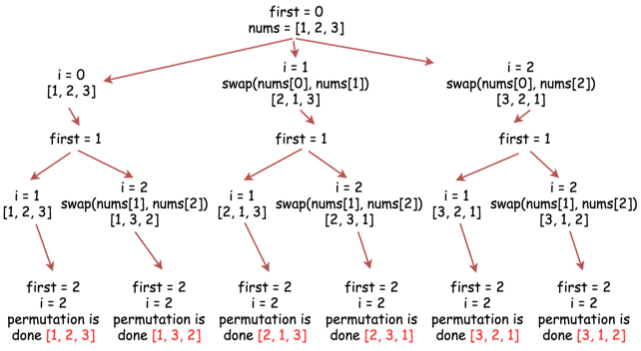

# [全排列](https://leetcode-cn.com/problems/permutations/)

## 题目描述

给定一个**没有重复**数字的序列，返回其所有可能的全排列。

**示例：**

```
输入: [1,2,3]
输出:
[
  [1,2,3],
  [1,3,2],
  [2,1,3],
  [2,3,1],
  [3,1,2],
  [3,2,1]
]
```

## 解题思路

### 个人AC

没有思路QAQ。

### 最优解

回溯算法是一种尝试探索所有可能的候选解来找出所有解的算法。如果候选解被确认“不是一个解（或至少不是最后一个解）”，就回溯到上一个“回溯点”进行一些变化后再次尝试。



```java
class Solution {
    public List<List<Integer>> permute(int[] nums) {
        // construct output list
        List<List<Integer>> outer = new LinkedList<>();
        
        // convert nums into list since output is a list of lists
        ArrayList<Integer> inner = new ArrayList<>();
        for (int num : nums) {
            inner.add(num);
        }
        int n = nums.length;
        backtrack(n, outer, inner, 0);
        return outer;
    }
    
    private void backtrack(int n, List<List<Integer>> outer, ArrayList<Integer> inner, int first) {
        // if all integers are used up
        if (first == n - 1) {
            outer.add(new ArrayList<>(inner));
            return;
        }
        for (int i = first; i < n; i++) {
            // place i-th integer first in the current permutation
            Collections.swap(inner, first, i);
            backtrack(n, outer, inner, first + 1);
            // backtrack
            Collections.swap(inner, first, i);
        }
    }
}
```

