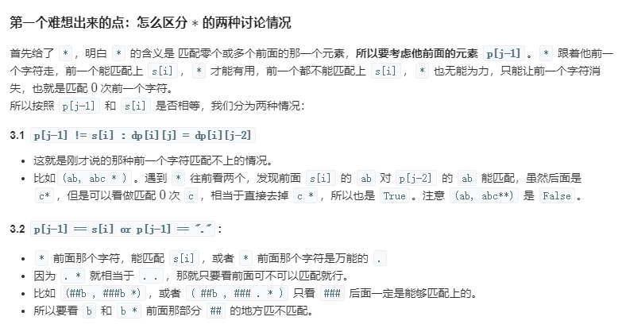
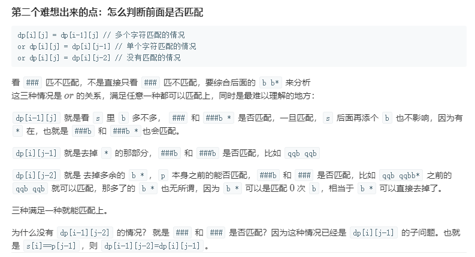
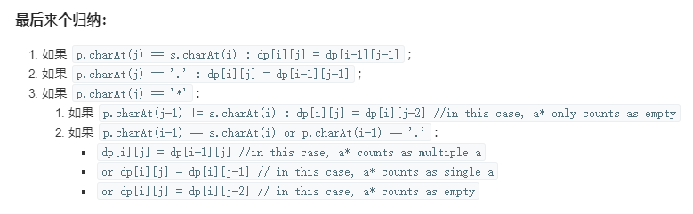

# [正则表达式匹配](https://leetcode-cn.com/problems/regular-expression-matching/)

## 题目描述

给你一个字符串 `s` 和一个字符规律 `p`，请你来实现一个支持 `'.'` 和 `'*'` 的正则表达式匹配。

```
'.' 匹配任意单个字符
'*' 匹配零个或多个前面的那一个元素
```

所谓匹配，是要涵盖 **整个** 字符串 `s`的，而不是部分字符串。

**说明：**

- `s` 可能为空，且只包含从 `a-z` 的小写字母。
- `p` 可能为空，且只包含从 `a-z` 的小写字母，以及字符 `.` 和 `*`。

**示例 1：**

```
输入:
s = "aa"
p = "a"
输出: false
解释: "a" 无法匹配 "aa" 整个字符串。
```

**示例 2：**

```
输入:
s = "aa"
p = "a*"
输出: true
解释: 因为 '*' 代表可以匹配零个或多个前面的那一个元素, 在这里前面的元素就是 'a'。因此，字符串 "aa" 可被视为 'a' 重复了一次。
```

**示例 3：**

```
输入:
s = "ab"
p = ".*"
输出: true
解释: ".*" 表示可匹配零个或多个（'*'）任意字符（'.'）。
```

**示例 4：**

```
输入:
s = "aab"
p = "c*a*b"
输出: true
解释: 因为 '*' 表示零个或多个，这里 'c' 为 0 个, 'a' 被重复一次。因此可以匹配字符串 "aab"。
```

**示例 5：**

```
输入:
s = "mississippi"
p = "mis*is*p*."
输出: false
```

## 解题思路

### 个人AC

无。

### [最优解 ——动态规划](https://leetcode-cn.com/problems/regular-expression-matching/solution/dong-tai-gui-hua-zen-yao-cong-0kai-shi-si-kao-da-b/)

如果不了解动态规划思想，可以先阅读一下这篇博文：https://blog.csdn.net/qq_25800311/article/details/90635979。

**状态**

用`dp[i][j]`表示匹配子串`s[0:i+1]`是否能与模式子串`p[0:j+1]`匹配。

**状态转移方程**

怎么想转移方程？首先想的时候从已经求出了 `dp[i-1][j-1]` 入手，再加上已知 `s[i]`、`p[j]`，要想的问题就是怎么去求 `dp[i][j]`。

已知`dp[i-1][j-1]`意思就是前面子串都匹配上了，不知道新的一位的情况。
那就分情况考虑，所以对于新的一位`p[j]`和`s[i]`的值不同，要分情况讨论：

1. 考虑最简单的`p[j] == s[i]: dp[i][j] = dp[i-1][j-1]`；

   然后从`p[j]`可能的情况来考虑，让`p[j]=各种能等于的东西`。

2. `p[j] == "." : dp[i][j] = dp[i-1][j-1]`；

3. `p[j] ==" * "`：








```java
class Solution {
    public boolean isMatch(String s, String p) {
        int sLen = s.length(), pLen = p.length();
        // 使用动态规划，dp[i][j]表示s中前i个字符与p中前j个字符的匹配结果。
        // 动态规划适合解决当前状态依赖于前面状态的问题，即满足最优子结构的特征。
        // dp下标与s，p对应元素的下标相差1，即dp[i][j]表示当前应该匹配s[i-1]和p[j-1]
        boolean[][] dp = new boolean[sLen + 1][pLen + 1];
        dp[0][0] = true; // 当s和p都为空时，匹配成功
        // 遍历匹配串s和模式串p
        // 这里i=0开始，是因为s可能为空串，而匹配串中的*会匹配零个或多个前面的那一个元素
        for(int i = 0; i <= sLen; i++) {
            // 这里从j=1开始，是因为当j=0时，模式串p为空，匹配都是失败
            for(int j = 1; j <= pLen; j++) {
                // 当前状态由当前模式字符p[j-1]决定
                if(p.charAt(j - 1) != '*') {
                    // 如果当前模式字符不为*
                    // 当s[i-1] == p[j-1]或p[j-1] == '.'时
                    // dp[i][j] 都将由 dp[i-1][j-1] 决定
                    dp[i][j] = i > 0 && 
                        (s.charAt(i - 1) == p.charAt(j - 1) || p.charAt(j - 1) == '.') && 
                        dp[i - 1][j - 1];
                } else {
                    // 如果当前模式字符为*
                    // 因为*表示匹配零个或多个前面的那一个元素，所以要考虑它的前一个元素p[j-2]
                    // 当它的前一个元素能够匹配上s[i-1]时，表示*匹配非零个前面的那一个元素，
                    // 如果匹配不上的话，表示*匹配零个前面的那一个元素
                    
                    // 当p[j-2] != s[i-1]时，dp[i][j] 将由 dp[i][j-2]（*匹配零个元素，即略过s[i-1]）决定
                    // 当p[j-2] == s[i-1] 或者 p[j-2] == '.'，即前一个模式字符能够和当前匹配上时，
                    // dp[i][j] 将由 dp[i - 1][j] 决定
                    dp[i][j] = dp[i][j - 2] ||
                        (i > 0 && (s.charAt(i - 1) == p.charAt(j - 2) || p.charAt(j - 2) == '.') && 
                        dp[i - 1][j]);
                }
            }
        }
        return dp[sLen][pLen];
    }
}
```

**时间复杂度：** $O(m * n)$，m为匹配串s的长度，n为模式串p的长度；

**空间复杂度：** $O(m * n)$。